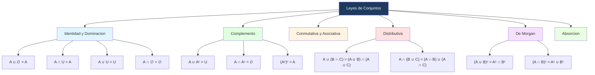

# ⚖️ Leyes de Conjuntos

## 🎯 Introducción

> [!info]- 💡 ¿Qué son las leyes de conjuntos?
>
> Las **leyes de conjuntos** son identidades que permiten simplificar y transformar expresiones con conjuntos, de manera similar a como el álgebra transforma expresiones numéricas. Todas se obtienen de las correspondientes leyes para proposiciones lógicas.
>
> ```mermaid
> graph TD
>     A[Leyes de Conjuntos] --> B[Leyes de identidad<br/>y dominación]
>     A --> C[Leyes de complemento]
>     A --> D[Leyes conmutativas<br/>y asociativas]
>     A --> E[Leyes distributivas]
>     A --> F[Leyes de De Morgan]
>
>     style B fill:#e1f5ff
>     style C fill:#e1ffe1
>     style D fill:#fff4e1
>     style E fill:#ffe1e1
>     style F fill:#f5e1ff
> ```

---

## 📋 Tabla de Leyes

> [!note]- 📋 Leyes fundamentales — Referencia completa
>
> Sea U el conjunto universal y A, B, C subconjuntos de U.
>
> ### Leyes de identidad
>
> $$A \cup \emptyset = A \qquad A \cap U = A$$
>
> ### Leyes de dominación
>
> $$A \cup U = U \qquad A \cap \emptyset = \emptyset$$
>
> ### Leyes de idempotencia
>
> $$A \cup A = A \qquad A \cap A = A$$
>
> ### Leyes de complemento
>
> $$A \cup A^c = U \qquad A \cap A^c = \emptyset$$
>
> $$(A^c)^c = A \qquad U^c = \emptyset \qquad \emptyset^c = U$$
>
> ### Leyes conmutativas
>
> $$A \cup B = B \cup A \qquad A \cap B = B \cap A$$
>
> ### Leyes asociativas
>
> $$(A \cup B) \cup C = A \cup (B \cup C)$$
>
> $$(A \cap B) \cap C = A \cap (B \cap C)$$
>
> ### Leyes distributivas
>
> $$A \cup (B \cap C) = (A \cup B) \cap (A \cup C)$$
>
> $$A \cap (B \cup C) = (A \cap B) \cup (A \cap C)$$
>
> ### Leyes de absorción
>
> $$A \cup (A \cap B) = A \qquad A \cap (A \cup B) = A$$
>
> ### Leyes de De Morgan
>
> $$(A \cup B)^c = A^c \cap B^c$$
>
> $$(A \cap B)^c = A^c \cup B^c$$
>
> ### Ley de diferencia
>
> $$A - B = A \cap B^c$$

---

## 🔍 Leyes de De Morgan — Detalle

> [!note]- 🔍 Leyes de De Morgan
>
> Las leyes de De Morgan son especialmente importantes porque permiten transformar complementos de uniones e intersecciones:
>
> **Primera ley:**
>
> $$(A \cup B)^c = A^c \cap B^c$$
>
> El complemento de la unión es la intersección de los complementos.
>
> **Segunda ley:**
>
> $$(A \cap B)^c = A^c \cup B^c$$
>
> El complemento de la intersección es la unión de los complementos.
>
> > [!tip]- 💡 Analogía con lógica proposicional
> >
> > Estas leyes son exactamente las leyes de De Morgan de la lógica, con la correspondencia:
> >
> > | Lógica | Conjuntos |
> > |---|---|
> > | $\lor$ (disyunción) | $\cup$ (unión) |
> > | $\land$ (conjunción) | $\cap$ (intersección) |
> > | $\neg$ (negación) | $^c$ (complemento) |

---

## 🧮 Demostraciones

> [!example]- 📝 Ejemplo 1 — Demostración de la distributividad
>
> **Teorema:** A ∩ (B ∪ C) = (A ∩ B) ∪ (A ∩ C)
>
> **Demostración:**
>
> Fijemos x ∈ U arbitrario. Demostraremos que x ∈ A ∩ (B ∪ C) ⟺ x ∈ (A ∩ B) ∪ (A ∩ C).
>
> $$x \in A \cap (B \cup C)$$
> $$\iff x \in A \land x \in (B \cup C) \quad \text{(def. intersección)}$$
> $$\iff x \in A \land (x \in B \lor x \in C) \quad \text{(def. unión)}$$
> $$\iff (x \in A \land x \in B) \lor (x \in A \land x \in C) \quad \text{(ley dist. lógica)}$$
> $$\iff x \in (A \cap B) \lor x \in (A \cap C) \quad \text{(def. intersección)}$$
> $$\iff x \in (A \cap B) \cup (A \cap C) \quad \text{(def. unión)}$$
>
> Como x era arbitrario, la igualdad se cumple para todo elemento. $\blacksquare$

> [!example]- 📝 Ejemplo 2 — Demostración de igualdad por doble contención
>
> **Método alternativo:** Para demostrar que A = B se puede demostrar que A ⊆ B y B ⊆ A simultáneamente.
>
> **Ejemplo:** Demostrar que A ∩ (A ∪ C) = A ∩ C no es verdad en general, pero sí que:
>
> $$A \cap (A \cap C) = A \cap C$$
>
> **Demostración:**
>
> (⊆) Sea x ∈ A ∩ (A ∩ C). Entonces x ∈ A y x ∈ (A ∩ C), lo que implica x ∈ A y x ∈ C. Por tanto x ∈ A ∩ C.
>
> (⊇) Sea x ∈ A ∩ C. Entonces x ∈ A y x ∈ C. Como x ∈ A y x ∈ A ∩ C, tenemos x ∈ A ∩ (A ∩ C).
>
> Por doble contención: A ∩ (A ∩ C) = A ∩ C. $\blacksquare$

---

## 🔁 Inclusión-Exclusión

> [!note]- 🔁 Principio de Inclusión-Exclusión
>
> El **principio de inclusión-exclusión** permite calcular el cardinal de la unión de conjuntos evitando contar elementos repetidos.
>
> **Para 2 conjuntos:**
>
> $$|A \cup B| = |A| + |B| - |A \cap B|$$
>
> **Para 3 conjuntos:**
>
> $$|A \cup B \cup C| = |A| + |B| + |C| - |A \cap B| - |A \cap C| - |B \cap C| + |A \cap B \cap C|$$
>
> > [!tip]- 💡 ¿Por qué se resta y luego se suma?
> >
> > Al sumar |A| + |B| + |C|, los elementos en exactamente dos conjuntos se cuentan dos veces — por eso se restan las intersecciones dobles. Pero al restarlas, los elementos en los tres conjuntos quedan sin contar — por eso se suma |A ∩ B ∩ C| al final.

> [!example]- 📝 Ejemplo — Aplicación del principio de inclusión-exclusión
>
> En un grupo de 191 estudiantes:
> - |F| = estudiantes de francés
> - |N| = estudiantes de negocios
> - |M| = estudiantes de música
> - |F ∩ N ∩ M| = 10
>
> Dado que |F ∪ N ∪ M| = 140, los estudiantes que no toman ninguna de las tres materias son:
>
> $$|U| - |F \cup N \cup M| = 191 - 140 = 51 \text{ estudiantes}$$
>
> Además, si |F ∩ N| = 36 y |F ∩ N ∩ M| = 10:
>
> $$|F \cap N \cap \overline{M}| = |F \cap N| - |F \cap N \cap M| = 36 - 10 = 26$$
>
> Es decir, 26 estudiantes toman francés y negocios pero no música.

---

## 📝 Ejercicios Propuestos

> [!question]- 📋 Ejercicios
>
> **1.** Usando las leyes de conjuntos, simplifica la expresión:
>
> $$(A \cup B) \cap (A \cup B^c)$$
>
> **2.** Demuestra que A - B = A ∩ Bᶜ usando la definición de diferencia y complemento.
>
> **3.** Demuestra la primera ley de De Morgan: (A ∪ B)ᶜ = Aᶜ ∩ Bᶜ.
>
> **4.** En una clase de 40 estudiantes, 25 saben Python, 20 saben Java y 10 saben ambos. ¿Cuántos no saben ninguno de los dos?
>
> **5.** Simplifica usando leyes de conjuntos:
>
> $$A \cup (A^c \cap B)$$

> [!success]- ✅ Respuestas
>
> **1.**
>
> $$(A \cup B) \cap (A \cup B^c) = A \cup (B \cap B^c) \quad \text{(distributiva)}$$
> $$= A \cup \emptyset \quad \text{(complemento)}$$
> $$= A \quad \text{(identidad)}$$
>
> **2.**
>
> Por definición, x ∈ A - B ⟺ x ∈ A y x ∉ B ⟺ x ∈ A y x ∈ Bᶜ ⟺ x ∈ A ∩ Bᶜ. $\blacksquare$
>
> **3.**
>
> Sea x ∈ U arbitrario:
>
> x ∈ (A ∪ B)ᶜ ⟺ x ∉ A ∪ B ⟺ ¬(x ∈ A ∨ x ∈ B) ⟺ x ∉ A ∧ x ∉ B ⟺ x ∈ Aᶜ ∧ x ∈ Bᶜ ⟺ x ∈ Aᶜ ∩ Bᶜ. $\blacksquare$
>
> **4.**
>
> |P ∪ J| = 25 + 20 - 10 = 35. No saben ninguno: 40 - 35 = **5 estudiantes**.
>
> **5.**
>
> $$A \cup (A^c \cap B) = (A \cup A^c) \cap (A \cup B) \quad \text{(distributiva)}$$
> $$= U \cap (A \cup B) \quad \text{(complemento)}$$
> $$= A \cup B \quad \text{(identidad)}$$

---

## 📊 Resumen Visual



---

## 🧩 Ejercicios Resueltos

> [!example]- 📝 Ejercicio Resuelto 1 — Simplificación con leyes
>
> **Problema:** Simplifica la expresión (A ∩ Bᶜ) ∪ (A ∩ B).
>
> **Solución:**
>
> $$(A \cap B^c) \cup (A \cap B)$$
> $$= A \cap (B^c \cup B) \quad \text{(ley distributiva)}$$
> $$= A \cap U \quad \text{(ley de complemento)}$$
> $$= A \quad \text{(ley de identidad)} \quad \blacksquare$$

> [!example]- 📝 Ejercicio Resuelto 2 — Demostración por doble contención
>
> **Problema:** Demuestra que A ∩ (B ∪ C) = (A ∩ B) ∪ (A ∩ C).
>
> **Solución:**
>
> Sea x ∈ U arbitrario.
>
> (⊆) Supón x ∈ A ∩ (B ∪ C). Entonces x ∈ A y x ∈ B ∪ C, lo que significa x ∈ A y (x ∈ B o x ∈ C).
> - Si x ∈ B: entonces x ∈ A ∩ B, por lo que x ∈ (A ∩ B) ∪ (A ∩ C). ✅
> - Si x ∈ C: entonces x ∈ A ∩ C, por lo que x ∈ (A ∩ B) ∪ (A ∩ C). ✅
>
> (⊇) Supón x ∈ (A ∩ B) ∪ (A ∩ C). Entonces x ∈ A ∩ B o x ∈ A ∩ C.
> - Si x ∈ A ∩ B: entonces x ∈ A y x ∈ B, por lo que x ∈ B ∪ C y así x ∈ A ∩ (B ∪ C). ✅
> - Si x ∈ A ∩ C: entonces x ∈ A y x ∈ C, por lo que x ∈ B ∪ C y así x ∈ A ∩ (B ∪ C). ✅
>
> Por doble contención: A ∩ (B ∪ C) = (A ∩ B) ∪ (A ∩ C). $\blacksquare$

> [!example]- 📝 Ejercicio Resuelto 3 — De Morgan aplicado
>
> **Problema:** Sea U = {1, 2, 3, 4, 5, 6}, A = {1, 2, 3} y B = {2, 3, 4}. Verifica la primera ley de De Morgan numéricamente.
>
> **Solución:**
>
> Verificamos que (A ∪ B)ᶜ = Aᶜ ∩ Bᶜ.
>
> **Lado izquierdo:**
> - A ∪ B = {1, 2, 3, 4}
> - (A ∪ B)ᶜ = U - {1,2,3,4} = **{5, 6}**
>
> **Lado derecho:**
> - Aᶜ = U - A = {4, 5, 6}
> - Bᶜ = U - B = {1, 5, 6}
> - Aᶜ ∩ Bᶜ = {4,5,6} ∩ {1,5,6} = **{5, 6}**
>
> Ambos lados son iguales: {5, 6} = {5, 6}. ✅ $\blacksquare$

---

**Tags:** #matematicas-discretas #conjuntos #leyes-de-conjuntos #de-morgan #inclusion-exclusion #demostraciones #MATG1051
