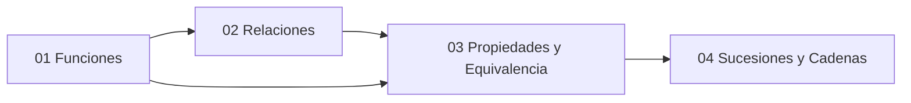

# 🗺️ Unidad 2 — Funciones y Relaciones — Índice

> [!info] ℹ️ Índice manual
> Se actualiza a mano para que funcione igual en Obsidian y en Digital Garden.

## 📑 Notas de la Unidad

- [[01 - Funciones]]
- [[02 - Relaciones]]
- [[03 - Propiedades y Equivalencia]]
- [[04 - Sucesiones y Cadenas]]
- [[Guía de Problemas 2 - Ejercicios Resueltos]]

## 📊 Mapa de conexiones

> [!quote] 🔗 Conexiones
> - Previo: [[04 - Cardinalidad y Leyes de Cardinalidad]] (Unidad 1)
> - Siguiente: [[01 - Divisibilidad y Números Primos]] (Unidad 3)
> - MOC general: [[Matemáticas Discretas]]

---
**Tags:** #MATG1051 #unidad2 #indice #discretas
