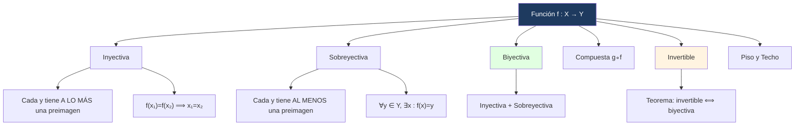

# 🔢 Funciones

> [!info]- 💡 Nota sobre el orden
> Formalmente, una función es un caso especial de relación 
> (ver 02 - Relaciones). Se estudia primero por convención 
> del curso, pero la fundamentación teórica completa está 
> en el archivo de Relaciones.

---
## 🎯 Introducción

> [!info]- 💡 ¿Qué es una función?
> 
> Una **función** es un caso especial de relación entre dos conjuntos: una regla que asigna a cada elemento del dominio **exactamente un** elemento del codominio. Formalmente, es cualquier subconjunto del producto cartesiano con una restricción de unicidad.
> 
> ```mermaid
> graph LR
>     A["Dominio X"] -->|"f(x)"| B["Codominio Y"]
>     style A fill:#e1f5ff
>     style B fill:#ffe1e1
> ```

---

## 📋 Definición Formal

> [!note]- 📋 Función
> 
> Sean X e Y dos conjuntos. Una **función** f de X en Y es cualquier subconjunto f de X × Y satisfaciendo que: para cada x ∈ X existe un **único** y ∈ Y tal que (x, y) ∈ f.
> 
> En este caso escribiremos f : X → Y y si (x, y) ∈ f, escribiremos y = f(x). Diremos que y es la **imagen** de x y que x es una **preimagen** de y mediante f.
> 
> - Al conjunto X lo llamaremos **dominio** de f.
> - Al conjunto {y : y = f(x), x ∈ X} lo llamaremos **rango** de f.
> 
> > [!tip]- 💡 Condiciones para ser función
> > 
> > Un subconjunto f ⊆ X × Y es función si y solo si:
> > 
> > 1. **Totalidad:** todo x ∈ X tiene al menos una imagen.
> > 2. **Unicidad:** todo x ∈ X tiene a lo sumo una imagen.

> [!note]- 📋 Definición 1 — Igualdad de funciones
> 
> Sean f, g : X → Y dos funciones. Diremos que **f es igual a g** si se cumple que:
> 
> $$f(x) = g(x), \quad \forall x \in X$$

---

## 🔍 Tipos de Funciones

> [!note]- 🔍 Definición 2 — Función Inyectiva
> 
> Sean X e Y dos conjuntos y f : X → Y una función. Diremos que f es **inyectiva** si cada elemento de Y posee **a lo más una** preimagen en X mediante f.
> 
> Dicho de otra forma:
> 
> $$f(x_1) = f(x_2) \Rightarrow x_1 = x_2$$
> 
> o equivalentemente:
> 
> $$x_1 \neq x_2 \Rightarrow f(x_1) \neq f(x_2)$$
> 
> Es decir, **elementos distintos tienen imágenes distintas**.

> [!note]- 🔍 Definición 3 — Función Sobreyectiva
> 
> Sean X e Y dos conjuntos y f : X → Y una función. Diremos que f es **sobreyectiva** si cada elemento de Y posee **al menos una** preimagen en X mediante f.
> 
> Esto es:
> 
> $$\forall y \in Y,\ \exists x \in X : f(x) = y$$

> [!note]- 🔍 Definición 4 — Función Biyectiva
> 
> Sean X e Y dos conjuntos y f : X → Y una función. Diremos que f es **biyectiva** si es **inyectiva y sobreyectiva** a la vez.

---

## 🔗 Composición de Funciones

> [!note]- 🔗 Definición 5 — Función Compuesta
> 
> Sean X, Y, Z conjuntos y f : X → Y, g : Y → Z funciones. Llamaremos **compuesta de g con f**, denotada g ∘ f, a la función:
> 
> $$g \circ f : X \to Z$$
> 
> dada por:
> 
> $$g \circ f(x) = g(f(x)), \quad \forall x \in X$$
> 
> > [!warning]- ⚠️ La composición NO es conmutativa
> > 
> > En general, g ∘ f ≠ f ∘ g.

---

## 🔄 Función Invertible e Inversa

> [!note]- 🔄 Definición 6 — Función Invertible e Inversa
> 
> Sean X, Y dos conjuntos y f : X → Y una función. Diremos que f es **invertible** si existe una función g : Y → X tal que:
> 
> $$g \circ f(x) = x, \quad \forall x \in X \qquad \text{y} \qquad f \circ g(y) = y, \quad \forall y \in Y$$
> 
> Si f es invertible, entonces g es **única**. La llamaremos la **inversa** de f, denotada f⁻¹.

> [!abstract]- 📐 Teorema 1 — Invertible ⟺ Biyectiva
> 
> Sea f : X → Y una función. Entonces:
> 
> $$f \text{ es invertible} \iff f \text{ es biyectiva}$$

---

## 📐 Funciones Piso y Techo

> [!note]- 📐 Definición 7 — Piso y Techo
> 
> Sea x ∈ ℝ:
> 
> - El **piso** de x, denotado ⌊x⌋, es el mayor entero menor o igual a x.
> - El **techo** de x, denotado ⌈x⌉, es el menor entero mayor o igual a x.

---

## 🧮 Ejemplos

> [!example]- 📝 Ejemplo 14 — Función vs. no función
> 
> Sean X = {1, 2, 4, 5} e Y = {a, b, c}.
> 
> **✅ B = {(1,b),(2,a),(4,a),(5,b)} es función:**
> 
> Cada elemento de X tiene exactamente una imagen. Si la denotamos g: g(1)=b, g(2)=a, g(4)=a, g(5)=b. El dominio es X y el rango es {a, b}.
> 
> **❌ A = {(1,c),(2,b),(2,a),(4,a),(5,a)} no es función:**
> 
> El elemento 2 tiene dos imágenes: (2,a) y (2,b) — viola la unicidad.
> 
> **❌ C = {(2,c),(4,b),(5,a)} no es función:**
> 
> El elemento 1 ∈ X no tiene ninguna imagen — viola la totalidad.

> [!example]- 📝 Ejemplo 15 — Funciones como conjuntos de pares
> 
> Los conjuntos A = {(x, x²) : x ∈ ℝ}, B = {(x, x) : x ∈ ℝ}, C = {(n, n+1) : n ∈ ℕ} son funciones.
> 
> Los denotamos f : ℝ → ℝ dada por f(x) = x², g : ℝ → ℝ por g(x) = x y h : ℕ → ℕ por h(n) = n+1.
> 
> Si f : X → Y es una función, diremos que f está dada por la **regla** f(x), ∀x ∈ X, y que su **gráfico** es el conjunto {(x, f(x)) : x ∈ X}.

> [!example]- 📝 Ejemplo 16 — Gráfico de una función
> 
> Hallar el gráfico de f(x) = x² y g(x) = x para X = {−2, −1, 0, 1, 2, 3}.
> 
> | x | f(x) = x² | g(x) = x |
> |---|---|---|
> | −2 | 4 | −2 |
> | −1 | 1 | −1 |
> | 0 | 0 | 0 |
> | 1 | 1 | 1 |
> | 2 | 4 | 2 |
> | 3 | 9 | 3 |
> 
> Gráfico de f = {(−2,4),(−1,1),(0,0),(1,1),(2,4),(3,9)}
> 
> Gráfico de g = {(−2,−2),(−1,−1),(0,0),(1,1),(2,2),(3,3)}

> [!example]- 📝 Ejemplo 1 — Inyectividad (discreta)
> 
> Sean X = {−2, 0, 2, 3} y Y = {−1, 0, 1, 2, 3, 4, 5, 9}.
> 
> **f : X → Y dada por f(x) = x² NO es inyectiva:**
> f(−2) = 4 = f(2), con −2 ≠ 2, es decir, dos elementos distintos tienen la misma imagen.
> 
> **g(x) = x + 1 SÍ es inyectiva:**
> Elementos distintos producen imágenes distintas.

> [!example]- 📝 Ejemplo 2 — Inyectividad (demostración)
> 
> Sea h : ℝ → ℝ dada por h(x) = −2x + 3, ∀x ∈ ℝ. Entonces h es inyectiva.
> 
> **Demostración:**
> 
> $$h(x_1) = h(x_2) \Rightarrow -2x_1 + 3 = -2x_2 + 3 \Rightarrow -2x_1 = -2x_2 \Rightarrow x_1 = x_2 \quad \checkmark$$

> [!example]- 📝 Ejemplo 3 — Sobreyectividad
> 
> Con X, Y, f, g del Ejemplo 1:
> 
> - **f no es sobreyectiva:** el elemento 5 ∈ Y no tiene preimagen en X.
> - **g no es sobreyectiva:** el elemento 0 ∈ Y no tiene preimagen en X.
> 
> Con h del Ejemplo 2, **h sí es sobreyectiva:**
> 
> Fijemos y ∈ ℝ y busquemos x ∈ ℝ tal que h(x) = y:
> 
> $$h(x) = y \iff -2x+3 = y \iff -2x = y-3 \iff x = \frac{y-3}{-2} = -\frac{1}{2}y + \frac{3}{2}$$
> 
> Si escogemos x = −½y + 3/2, entonces x ∈ ℝ y h(x) = y. Por tanto h es sobreyectiva. ✓

> [!example]- 📝 Ejemplo 4 — Biyectividad
> 
> La función h(x) = −2x + 3 es **biyectiva** (inyectiva y sobreyectiva por los Ejemplos 2 y 3).

> [!example]- 📝 Ejemplo 5 — Composición (no conmutativa)
> 
> Sean f, g : ℝ → ℝ dadas por f(x) = x² + 1 y g(x) = 3x + 5. Entonces:
> 
> $$g \circ f(x) = g(f(x)) = g(x^2+1) = 3(x^2+1)+5 = 3x^2+8$$
> 
> $$f \circ g(x) = f(g(x)) = f(3x+5) = (3x+5)^2+1 = 9x^2+30x+26$$
> 
> Como 3x² + 8 ≠ 9x² + 30x + 26, vemos que la composición **no es conmutativa**.

> [!example]- 📝 Ejemplo 6 — Composición (funciones inversas)
> 
> Sean f, g : ℝ → ℝ dadas por f(x) = ⅓x − 5/3 y g(x) = 3x + 5. Hallar f ∘ g y g ∘ f:
> 
> $$f \circ g(x) = f(3x+5) = \frac{1}{3}(3x+5) - \frac{5}{3} = x + \frac{5}{3} - \frac{5}{3} = x$$
> 
> $$g \circ f(x) = g\!\left(\frac{1}{3}x - \frac{5}{3}\right) = 3\!\left(\frac{1}{3}x - \frac{5}{3}\right)+5 = x - 5 + 5 = x$$
> 
> Ambas composiciones dan la identidad.

> [!example]- 📝 Ejemplo 7 — Función invertible
> 
> La función f(x) = ⅓x − 5/3 del ejemplo anterior es invertible y su inversa es g(x) = 3x + 5, esto es f⁻¹ = g y también g⁻¹ = f.

> [!example]- 📝 Ejemplo 8 — Biyectividad de función racional
> 
> Pruebe que f : ℝ − {−1} → ℝ − {1} dada por f(x) = x/(x+1) es biyectiva.
> 
> **Inyectiva:**
> 
> $$f(x_1) = f(x_2) \Rightarrow \frac{x_1}{x_1+1} = \frac{x_2}{x_2+1} \Rightarrow x_1(x_2+1) = x_2(x_1+1) \Rightarrow x_1 = x_2 \quad \checkmark$$
> 
> **Sobreyectiva:**
> 
> Sea y ∈ ℝ − {1}. Buscamos x tal que f(x) = y:
> 
> $$\frac{x}{x+1} = y \Rightarrow x = y(x+1) \Rightarrow x - yx = y \Rightarrow x(1-y) = y \Rightarrow x = \frac{y}{1-y}$$
> 
> Como y ≠ 1, el denominador 1 − y ≠ 0, y se puede verificar que x ≠ −1. Por tanto x ∈ ℝ − {−1} y f(x) = y. ✓

> [!example]- 📝 Ejemplo 9 — Piso y Techo
> 
> | Piso | Resultado | Techo | Resultado |
> |------|-----------|-------|-----------|
> | ⌊8.3⌋ | 8 | ⌈9.1⌉ | 10 |
> | ⌊−8.7⌋ | −9 | ⌈−11.3⌉ | −11 |
> | ⌊6⌋ | 6 | ⌈−8⌉ | −8 |

---

## 🔢 Demostraciones con Piso y Techo

> [!note]- 📋 Técnica — Prueba por casos con piso y techo
> 
> Las demostraciones que involucran $\lfloor x \rfloor$ y $\lceil x \rceil$ casi siempre se resuelven con **prueba por casos**, porque el comportamiento de estas funciones depende de si el argumento es entero o no.
> 
> El esquema estándar para un argumento $\frac{n}{2}$ con $n \in \mathbb{N}$ es:
> 
> | Caso | Condición | Consecuencia |
> |---|---|---|
> | $n$ par | $n = 2m$ para algún $m \in \mathbb{N}$ | $\frac{n}{2} = m$ es entero |
> | $n$ impar | $n = 2m+1$ para algún $m \in \mathbb{N}$ | $\frac{n}{2} = m + \frac{1}{2}$ no es entero |
> 
> En cada caso se aplican directamente las definiciones de piso y techo para verificar la igualdad.

> [!note]- 📋 Propiedades útiles
> 
> Sea $n \in \mathbb{Z}$ y $x \in \mathbb{R}$:
> 
> $$\lfloor x \rfloor = n \iff n \leq x < n+1$$
> 
> $$\lceil x \rceil = n \iff n-1 < x \leq n$$
> 
> $$\lceil x \rceil = \lfloor x \rfloor + 1 \quad \text{si } x \notin \mathbb{Z}$$
> 
> $$\lceil x \rceil = \lfloor x \rfloor \quad \text{si } x \in \mathbb{Z}$$

> [!example]- 📝 Ejemplo — $\left\lfloor \dfrac{n+1}{2} \right\rfloor = \left\lceil \dfrac{n}{2} \right\rceil$ para todo $n \in \mathbb{N}$
> 
> **Caso 1 — $n$ par:** existe $m \in \mathbb{N}$ tal que $n = 2m$.
> 
> $$\left\lfloor \frac{n+1}{2} \right\rfloor = \left\lfloor \frac{2m+1}{2} \right\rfloor = \left\lfloor m + \frac{1}{2} \right\rfloor = m$$
> 
> $$\left\lceil \frac{n}{2} \right\rceil = \left\lceil \frac{2m}{2} \right\rceil = \lceil m \rceil = m$$
> 
> Ambos lados son iguales a $m$. ✓
> 
> **Caso 2 — $n$ impar:** existe $m \in \mathbb{N}$ tal que $n = 2m+1$.
> 
> $$\left\lfloor \frac{n+1}{2} \right\rfloor = \left\lfloor \frac{2m+2}{2} \right\rfloor = \lfloor m+1 \rfloor = m+1$$
> 
> $$\left\lceil \frac{n}{2} \right\rceil = \left\lceil \frac{2m+1}{2} \right\rceil = \left\lceil m + \frac{1}{2} \right\rceil = m+1$$
> 
> Ambos lados son iguales a $m+1$. ✓
> 
> Como los dos casos cubren todos los naturales, la igualdad vale para todo $n \in \mathbb{N}$. $\blacksquare$
> 
> > [!tip]- 💡 Por qué funciona
> > 
> > La clave es que sustituir $n = 2m$ o $n = 2m+1$ convierte $\frac{n}{2}$ en una expresión donde piso y techo se pueden evaluar directamente por definición — sin ambigüedad. Intentar manipular $\frac{n}{2}$ sin casos no funciona porque piso y techo no son lineales.
---

## 🏆 Ejercicio Resuelto — Biyectividad

> [!example]- 📝 Ejercicio Resuelto — f(x) = (−2x+1)/(x−3)
> 
> **Demostrar que f : ℝ − {3} → ℝ − {−2} dada por f(x) = (−2x+1)/(x−3) es biyectiva.**
> 
> ---
> 
> ### Primera prueba (inyectividad + sobreyectividad separadas)
> 
> **Inyectiva:**
> 
> $$f(x_1) = f(x_2) \Rightarrow \frac{-2x_1+1}{x_1-3} = \frac{-2x_2+1}{x_2-3}$$
> 
> $$\Rightarrow (-2x_1+1)(x_2-3) = (-2x_2+1)(x_1-3)$$
> 
> $$\Rightarrow -2x_1x_2 + 6x_1 + x_2 - 3 = -2x_2x_1 + 6x_2 + x_1 - 3$$
> 
> $$\Rightarrow 6x_1 - x_1 = 6x_2 - x_2 \Rightarrow 5x_1 = 5x_2 \Rightarrow x_1 = x_2 \quad \checkmark$$
> 
> **Sobreyectiva:**
> 
> Fijemos y ∈ ℝ − {−2}, entonces y ≠ −2. Buscamos x ∈ ℝ − {3}:
> 
> $$y = \frac{-2x+1}{x-3} \iff yx - 3y = -2x+1 \iff yx+2x = 1+3y \iff x(y+2) = 1+3y$$
> 
> $$\iff x = \frac{1+3y}{y+2} \quad \text{(posible ya que } y \neq -2\text{)}$$
> 
> Verificamos que x ≠ 3: si x = 3 entonces 1+3y = 3(y+2) = 3y+6, lo que implica 1 = 6, contradicción. Luego x ∈ ℝ − {3} y f(x) = y. ✓
> 
> Por tanto f es biyectiva. ✓
> 
> ---
> 
> ### Segunda prueba (encontrando la inversa)
> 
> Del cálculo anterior, la inversa es g : ℝ − {−2} → ℝ − {3} dada por:
> 
> $$g(y) = \frac{1+3y}{y+2}$$
> 
> Verificamos g ∘ f(x) = x para x ∈ ℝ − {3}:
> 
> $$g(f(x)) = \frac{1 + 3\cdot\frac{-2x+1}{x-3}}{\frac{-2x+1}{x-3}+2} = \frac{\frac{x-3-6x+3}{x-3}}{\frac{-2x+1+2x-6}{x-3}} = \frac{-5x}{-5} = x \quad \checkmark$$
> 
> De manera análoga se verifica f ∘ g(y) = y, ∀y ∈ ℝ − {−2}.
> 
> Como f es invertible, por el **Teorema 1** f es biyectiva. ✓

---

## 📊 Resumen Visual



---

**Tags:** #matematicas-discretas #funciones #inyectiva #sobreyectiva #biyectiva #composicion #inversa #piso-techo #MATG1051
