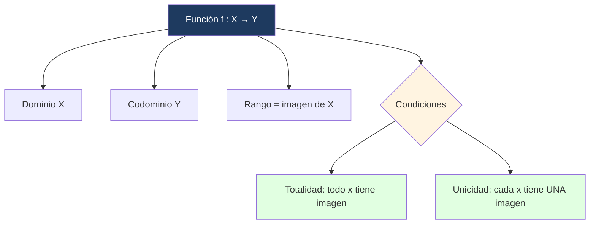

# 🔢 Funciones

## 🎯 Introducción

> [!info]- 💡 ¿Qué es una función?
> 
> Una **función** es un caso especial de relación entre dos conjuntos: una regla que asigna a cada elemento del dominio **exactamente un** elemento del codominio. Formalmente, se define como un subconjunto del producto cartesiano con una restricción de unicidad.
> 
> ```mermaid
> graph LR
>     A["Dominio X"] -->|"f(x)"| B["Codominio Y"]
>     style A fill:#e1f5ff
>     style B fill:#ffe1e1
> ```

---

## 📋 Definición Formal

> [!note]- 📋 Definición 4 — Función
> 
> Sean $X$ e $Y$ dos conjuntos. Una **función** $f$ de $X$ en $Y$ es un subconjunto del producto cartesiano $X \times Y$, con la propiedad que para cada $x \in X$ existe un **único** $y \in Y$ tal que $(x, y) \in f$.
> 
> En este caso escribiremos $y = f(x)$ y diremos que $y$ es la **imagen** de $x$ mediante $f$.
> 
> Si $f$ es una función de $X$ en $Y$, lo denotaremos:
> 
> $$f : X \to Y$$
> 
> - Al conjunto $X$ lo llamaremos **dominio** de $f$.
>     
> - Al conjunto ${y : y = f(x),\ x \in X}$ lo llamaremos **rango** de $f$.
>     
> 
> > [!tip]- 💡 Condiciones para ser función
> > 
> > Un subconjunto $f \subseteq X \times Y$ es función si y solo si:
> > 
> > 1. **Totalidad:** todo $x \in X$ tiene al menos una imagen.
> > 2. **Unicidad:** todo $x \in X$ tiene a lo sumo una imagen (no puede tener dos imágenes distintas).

---

## 🔍 Gráfico de una función

> [!note]- 📈 Gráfico
> 
> Si $f : X \to Y$ es una función, diremos que $f$ está dada por la **regla** $f(x)$, $\forall x \in X$, y que su **gráfico** es el conjunto:
> 
> $${(x,\ f(x)) : x \in X}$$

---

## 🧮 Ejemplos

> [!example]- 📝 Ejemplo 14 — Función vs. no función
> 
> Sean $X = {1, 2, 4, 5}$ e $Y = {a, b, c}$.
> 
> **✅ $B = {(1,b),(2,a),(4,a),(5,b)}$ es función:**
> 
> Cada elemento de $X$ tiene exactamente una imagen. Si la denotamos $g$: $$g(1)=b,\quad g(2)=a,\quad g(4)=a,\quad g(5)=b$$ El dominio es $X$ y el rango es ${a, b}$.
> 
> **❌ $A = {(1,c),(2,b),(2,a),(4,a),(5,a)}$ no es función:**
> 
> El elemento $2$ tiene dos imágenes distintas: $(2,a)$ y $(2,b)$ — viola la unicidad.
> 
> **❌ $C = {(2,c),(4,b),(5,a)}$ no es función:**
> 
> El elemento $1 \in X$ no tiene ninguna imagen — viola la totalidad.

> [!example]- 📝 Ejemplo 15 — Funciones como conjuntos de pares
> 
> Los siguientes conjuntos son funciones:
> 
> $$A = {(x, x^2) : x \in \mathbb{R}} \quad \Rightarrow \quad f : \mathbb{R} \to \mathbb{R},\quad f(x) = x^2$$
> 
> $$B = {(x, x) : x \in \mathbb{R}} \quad \Rightarrow \quad g : \mathbb{R} \to \mathbb{R},\quad g(x) = x$$
> 
> $$C = {(n, n+1) : n \in \mathbb{N}} \quad \Rightarrow \quad h : \mathbb{N} \to \mathbb{N},\quad h(n) = n+1$$

> [!example]- 📝 Ejemplo 16 — Gráfico de una función
> 
> Hallar el gráfico de $f(x) = x^2$ y $g(x) = x$ para $X = {-2, -1, 0, 1, 2, 3}$.
> 
> |$x$|$f(x) = x^2$|$g(x) = x$|
> |---|---|---|
> |$-2$|$4$|$-2$|
> |$-1$|$1$|$-1$|
> |$0$|$0$|$0$|
> |$1$|$1$|$1$|
> |$2$|$4$|$2$|
> |$3$|$9$|$3$|
> 
> $$\text{Gráfico de } f = {(-2,4),(-1,1),(0,0),(1,1),(2,4),(3,9)}$$ $$\text{Gráfico de } g = {(-2,-2),(-1,-1),(0,0),(1,1),(2,2),(3,3)}$$

---

## 📊 Resumen Visual



---

## 📝 Ejercicios Propuestos

> [!question]- 📋 Ejercicios
> 
> **1.** Sea $X = {1, 2, 3}$ e $Y = {a, b}$. Determina cuáles de los siguientes subconjuntos de $X \times Y$ son funciones. Justifica.
> 
> - $R_1 = {(1,a),(2,b),(3,a)}$
> - $R_2 = {(1,a),(1,b),(2,a),(3,b)}$
> - $R_3 = {(1,b),(3,a)}$
> 
> **2.** Dada $f : \mathbb{Z} \to \mathbb{Z}$ con $f(n) = n^2 - 1$, calcula $f(-3)$, $f(0)$ y $f(2)$, y determina el rango de $f$ restringida a ${-2,-1,0,1,2}$.
> 
> **3.** ¿Es $f = {(x, y) \in \mathbb{R}^2 : x^2 + y^2 = 1}$ una función de $\mathbb{R}$ en $\mathbb{R}$? ¿Por qué?

> [!success]- ✅ Respuestas
> 
> **1.**
> 
> - $R_1$: ✅ Función. Cada elemento de $X$ tiene exactamente una imagen.
> - $R_2$: ❌ No es función. $1$ tiene dos imágenes: $a$ y $b$.
> - $R_3$: ❌ No es función. $2 \in X$ no tiene imagen.
> 
> **2.** $f(-3) = 9 - 1 = 8$; $f(0) = -1$; $f(2) = 3$. Rango en ${-2,-1,0,1,2}$: ${f(-2),f(-1),f(0),f(1),f(2)} = {3, 0, -1, 0, 3} = {-1, 0, 3}$.
> 
> **3.** No es función. Por ejemplo, para $x = 0$ existen dos valores $y = 1$ e $y = -1$ que satisfacen la ecuación, violando la unicidad.

---

**Tags:** #matematicas-discretas #conjuntos #funciones #dominio #rango #MATG1051