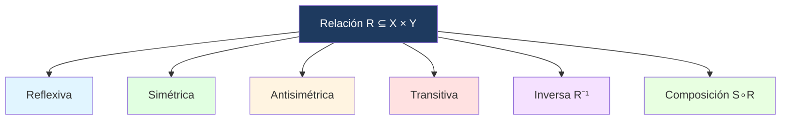

# 🔗 Relaciones

## 🎯 Introducción

> [!info]- 💡 ¿Qué es una relación?
> 
> Una **relación** es una generalización de las funciones: también es un subconjunto del producto cartesiano $X \times Y$, pero **sin** la restricción de unicidad. Permite asociar un elemento de $X$ con cero, uno o varios elementos de $Y$.
> 
> ```mermaid
> graph LR
>     A["Par ordenado (a,b)"] --> B["Producto cartesiano X × Y"]
>     B --> C["Relación R ⊆ X × Y"]
>     style A fill:#e1f5ff
>     style B fill:#fff4e1
>     style C fill:#ffe1e1
> ```

---

## 📋 Pares Ordenados y Producto Cartesiano

> [!note]- 📋 Definición 2 — Par Ordenado
> 
> Sean $a, b$ dos elementos. Aunque ${a,b} = {b,a}$ como conjuntos, el **par ordenado** $(a, b)$ indica que $a$ es el **primer elemento** y $b$ el **segundo**.
> 
> Por ello, $(a, b) \neq (b, a)$ salvo que $a = b$.
> 
> **Igualdad de pares ordenados:**
> 
> $$(a, b) = (c, d) \iff a = c \text{ y } b = d$$

> [!note]- 📋 Producto Cartesiano
> 
> Sean $X, Y$ dos conjuntos. El **producto cartesiano** de $X$ e $Y$, denotado $X \times Y$, es el conjunto de todos los pares ordenados $(x, y)$ con $x \in X$ e $y \in Y$:
> 
> $$X \times Y = {(x,y) : x \in X \text{ y } y \in Y}$$
> 
> > [!tip]- 💡 Cardinalidad del producto cartesiano
> > 
> > Si $|X| = m$ e $|Y| = n$, entonces $|X \times Y| = mn$. En general, $X \times Y \neq Y \times X$.

> [!example]- 📝 Ejemplo 11
> 
> Sean $X = {1, 2, 3}$ e $Y = {a, b}$:
> 
> $$X \times Y = {(1,a),(2,a),(3,a),(1,b),(2,b),(3,b)}$$
> 
> Nota que $|X \times Y| = 3 \cdot 2 = 6$.

---

## 📋 Definición de Relación

> [!note]- 📋 Relación entre conjuntos
> 
> Sean $X$ e $Y$ dos conjuntos. Una **relación** $R$ de $X$ en $Y$ es cualquier subconjunto de $X \times Y$:
> 
> $$R \subseteq X \times Y$$
> 
> Si $(x, y) \in R$, se dice que "$x$ está relacionado con $y$" y se escribe $x \mathrel{R} y$.
> 
> Una **relación en** $X$ (o relación binaria en $X$) es una relación de $X$ en sí mismo: $R \subseteq X \times X$.

---

## 🔍 Propiedades de Relaciones en X

> [!note]- 🔍 Propiedades
> 
> Sea $R$ una relación en $X$ (es decir, $R \subseteq X \times X$).
> 
> |Propiedad|Definición|
> |---|---|
> |**Reflexiva**|$\forall x \in X : (x, x) \in R$|
> |**Simétrica**|$\forall x, y \in X : (x,y) \in R \Rightarrow (y,x) \in R$|
> |**Antisimétrica**|$\forall x, y \in X : (x,y) \in R \land (y,x) \in R \Rightarrow x = y$|
> |**Transitiva**|$\forall x,y,z \in X : (x,y) \in R \land (y,z) \in R \Rightarrow (x,z) \in R$|

> [!example]- 📝 Ejemplos de propiedades
> 
> Sea $X = {1, 2, 3}$.
> 
> **Relación $R_1 = {(1,1),(2,2),(3,3),(1,2),(2,1)}$:**
> 
> - ✅ Reflexiva (todos los pares $(x,x)$ están)
> - ✅ Simétrica ($(1,2)$ y $(2,1)$ ambos están)
> - ❌ Antisimétrica ($(1,2)$ y $(2,1)$ están pero $1 \neq 2$)
> - ✅ Transitiva
> 
> **Relación $R_2 = {(1,2),(2,3),(1,3)}$ ("menor que"):**
> 
> - ❌ Reflexiva
> - ❌ Simétrica
> - ✅ Antisimétrica
> - ✅ Transitiva

---

## 🔁 Relación Inversa y Composición

> [!note]- 🔁 Relación Inversa
> 
> Si $R \subseteq X \times Y$ es una relación, la **relación inversa** $R^{-1} \subseteq Y \times X$ se define como:
> 
> $$R^{-1} = {(y, x) : (x, y) \in R}$$

> [!note]- 🔁 Composición de Relaciones
> 
> Si $R \subseteq X \times Y$ y $S \subseteq Y \times Z$, la **composición** $S \circ R \subseteq X \times Z$ es:
> 
> $$S \circ R = {(x, z) : \exists, y \in Y \text{ tal que } (x,y) \in R \text{ y } (y,z) \in S}$$

---

## 📊 Resumen Visual



---

## 📝 Ejercicios Propuestos

> [!question]- 📋 Ejercicios
> 
> **1.** Sea $X = {1, 2, 3, 4}$ y $R = {(1,1),(2,2),(3,3),(4,4),(1,2),(2,1),(3,4),(4,3)}$. Determina qué propiedades cumple $R$.
> 
> **2.** Sea $R$ la relación en $\mathbb{Z}$ definida por $x \mathrel{R} y \iff x \leq y$. ¿Es reflexiva? ¿Simétrica? ¿Antisimétrica? ¿Transitiva?
> 
> **3.** Sea $R = {(1,2),(2,3)}$ en $X = {1,2,3}$. Calcula $R^{-1}$ y $R \circ R$.

> [!success]- ✅ Respuestas
> 
> **1.** ✅ Reflexiva, ✅ Simétrica, ❌ Antisimétrica ($(1,2)$ y $(2,1)$ con $1 \neq 2$), ✅ Transitiva.
> 
> **2.** ✅ Reflexiva ($x \leq x$), ❌ Simétrica ($1 \leq 2$ pero $2 \not\leq 1$), ✅ Antisimétrica ($x \leq y$ y $y \leq x \Rightarrow x = y$), ✅ Transitiva.
> 
> **3.** $R^{-1} = {(2,1),(3,2)}$. $R \circ R = {(1,3)}$ (porque $(1,2) \in R$ y $(2,3) \in R$).

---

**Tags:** #matematicas-discretas #conjuntos #relaciones #producto-cartesiano #par-ordenado #MATG1051