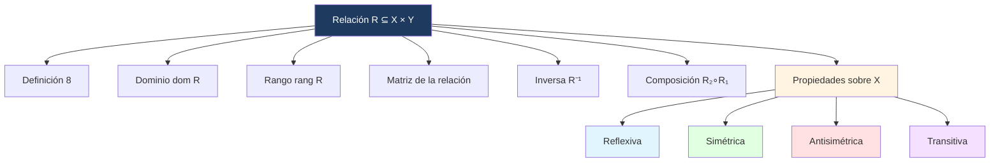

## 🎯 Introducción

> [!info]- 💡 ¿Qué es una relación?
> 
> Una **relación** es una generalización de las funciones: también es un subconjunto del producto cartesiano X × Y, pero **sin** la restricción de unicidad. Permite asociar un elemento de X con cero, uno o varios elementos de Y. Toda función es una relación, pero no toda relación es una función.
> 
> ```mermaid
> graph LR
>     A["Relación R ⊆ X × Y"] --> B["Función f : X → Y"]
>     B --> C["Restricción: unicidad"]
>     style A fill:#ffe1e1
>     style B fill:#e1ffe1
>     style C fill:#fff4e1
> ```

---

## 📋 Pares Ordenados y Producto Cartesiano

> [!note]- 📋 Definición 2 — Par Ordenado y Producto Cartesiano
> 
> Sean a, b dos elementos. El **par ordenado** (a, b) indica que a es el primer elemento y b el segundo. Por ello, (a, b) ≠ (b, a) salvo que a = b.
> 
> $$(a, b) = (c, d) \iff a = c \text{ y } b = d$$
> 
> Sean X, Y dos conjuntos. El **producto cartesiano** de X e Y, denotado X × Y, es:
> 
> $$X \times Y = {(x,y) : x \in X \text{ y } y \in Y}$$
> 
> En general, X × Y ≠ Y × X.

> [!example]- 📝 Ejemplo 11 — Producto cartesiano
> 
> Sean X = {1, 2, 3} e Y = {a, b}:
> 
> $$X \times Y = {(1,a),(2,a),(3,a),(1,b),(2,b),(3,b)}$$

---

## 📋 Definición Formal de Relación

> [!note]- 📋 Definición 8 — Relación
> 
> Sean X, Y dos conjuntos. Una **relación** R de X en Y es cualquier subconjunto R de X × Y.
> 
> En particular, **toda función de X en Y es una relación** de X en Y. El recíproco no es cierto.
> 
> Si R es una relación de X en Y, escribiremos **xRy** si (x, y) ∈ R, y diremos que x está **relacionado con y** mediante R.
> 
> Si X = Y, diremos que R es una **relación sobre X**.

> [!example]- 📝 Ejemplo 10 — Relación vs. función
> 
> Sean X = {1, 3, 4}, Y = {0, 2, 5}. Entonces:
> 
> - R₁ = {(1,2),(3,2),(4,0),(3,5)} es relación. **No es función** porque 3R₁2 y 3R₁5 (el 3 tiene dos imágenes).
> - R₂ = {(1,5),(3,0),(4,5)} es relación. **Sí es función** porque cada elemento de X tiene exactamente una imagen.

---

## 🔍 Dominio, Rango y Matriz

> [!note]- 🔍 Definición 9 — Dominio y Rango de una Relación
> 
> Si R es una relación de X en Y:
> 
> $$\text{dom}(R) = {x \in X : xRy \text{ para algún } y \in Y}$$
> 
> $$\text{rang}(R) = {y \in Y : xRy \text{ para algún } x \in X}$$

> [!example]- 📝 Ejemplo 11 — Dominio, rango y matriz
> 
> Sean X = {2,3,4,8}, Y = {3,4,5,6,7} y la relación R dada por **xRy si x divide a y**:
> 
> $$R = {(2,4),(2,6),(3,3),(3,6),(4,4)}$$
> 
> $$\text{dom}(R) = {2,3,4}, \quad \text{rang}(R) = {3,4,6}$$
> 
> La **matriz de la relación** (filas = X en orden, columnas = Y en orden) tiene un 1 en la posición (i,j) si xᵢRyⱼ:
> 
> $$M_R = \begin{pmatrix} 0&1&0&1&0 \ 1&0&0&1&0 \ 0&1&0&0&0 \ 0&0&0&0&0 \end{pmatrix}$$
> 
> > [!warning]- ⚠️ Observación 1
> > 
> > Antes de calcular la matriz se debe fijar un orden en los elementos de X e Y. Si cambia el orden, cambia la matriz.

---

## 🔁 Relación Inversa y Composición

> [!note]- 🔁 Definición 10 — Relación Inversa
> 
> Sea R una relación de X en Y. La **inversa** de R, denotada R⁻¹, es la relación de Y en X:
> 
> $$R^{-1} = {(y,x) : (x,y) \in R}$$
> 
> Equivalentemente: xR⁻¹y ⟺ yRx.

> [!example]- 📝 Ejemplo 12 — Relación inversa
> 
> Del Ejemplo 11, con R = {(2,4),(2,6),(3,3),(3,6),(4,4)}:
> 
> $$R^{-1} = {(4,2),(6,2),(3,3),(6,3),(4,4)}$$

> [!note]- 🔁 Definición 11 — Composición de Relaciones
> 
> Sean R₁ de X en Y y R₂ de Y en Z. La **compuesta** de R₂ y R₁, denotada R₂ ∘ R₁, es:
> 
> $$R_2 \circ R_1 = {(x,z) : xR_1y \land yR_2z \text{ para algún } y \in Y}$$

> [!example]- 📝 Ejemplo 13 — Composición de relaciones
> 
> Sean R₁ = {(1,3),(2,3),(2,4)} y R₂ = {(2,0),(3,0),(3,−1),(4,2)}.
> 
> Para cada par (x,z) buscamos un y intermedio tal que xR₁y y yR₂z:
> 
> - (1,3) ∈ R₁ y (3,0),(3,−1) ∈ R₂ → (1,0) y (1,−1)
> - (2,3) ∈ R₁ y (3,0),(3,−1) ∈ R₂ → (2,0) y (2,−1)
> - (2,4) ∈ R₁ y (4,2) ∈ R₂ → (2,2)
> 
> $$R_2 \circ R_1 = {(1,0),(1,-1),(2,0),(2,-1),(2,2)}$$

---

## 🗺️ Representaciones de una Relación

> [!note]- 🗺️ Diagrama Sagital
> 
> El **diagrama sagital** de una relación R de X en Y es una representación gráfica con dos columnas de puntos — una para X y otra para Y — donde se traza una **flecha de x hacia y** si xRy.
> 
> > [!tip]- 💡 Convenciones
> > 
> > - Si R es una relación **sobre X** (es decir, X = Y), ambas columnas representan el mismo conjunto.
> > - Un elemento puede tener **varias flechas salientes** (si está relacionado con varios elementos).
> > - Un elemento puede no tener **ninguna flecha** (si no está relacionado con nadie).

> [!example]- 📝 Ejemplo — Diagrama Sagital
> 
> Sean X = {2, 3, 4, 8}, Y = {3, 4, 5, 6, 7} y R dado por **xRy si x divide a y**:
> 
> $$R = \{(2,4),(2,6),(3,3),(3,6),(4,4)\}$$
> 
> ```mermaid
> graph LR
>     subgraph X
>         2
>         3
>         4
>         8
>     end
>     subgraph Y
>         y3["3"]
>         y4["4"]
>         y5["5"]
>         y6["6"]
>         y7["7"]
>     end
>     2 --> y4
>     2 --> y6
>     3 --> y3
>     3 --> y6
>     4 --> y4
>     style X fill:#e1f5ff
>     style Y fill:#ffe1e1
> ```
> 
> El 8 no tiene ninguna flecha saliente porque ningún elemento de Y es múltiplo de 8. El 5 y el 7 no reciben flechas porque ningún elemento de X los divide.

---

> [!note]- 🔷 Digrafo de una Relación
> 
> Cuando R es una relación **sobre X** (R ⊆ X × X), se puede representar con un **digrafo** (grafo dirigido): un solo conjunto de vértices (uno por cada elemento de X) donde se traza una **flecha de x hacia y** si xRy.
> 
> La diferencia con el diagrama sagital es que aquí X e Y son el mismo conjunto, así que se usa **un solo grupo de vértices** en vez de dos columnas.
> 
> > [!tip]- 💡 Casos especiales en el digrafo
> > 
> > - Si xRx, se dibuja un **lazo** (flecha que sale y regresa al mismo vértice) — esto indica reflexividad.
> > - Si xRy e yRx con x ≠ y, hay **dos flechas** entre esos vértices (una en cada sentido) — esto indica simetría en ese par.
> > - Si xRy pero no yRx, hay **una sola flecha** — esto puede indicar antisimetría.

> [!example]- 📝 Ejemplo — Digrafo
> 
> Sea X = {1, 3, 4} y R₁ = {(1,1),(1,3),(3,1),(3,3),(4,4)}:
> 
> ```mermaid
> graph LR
>     1 -->|"R"| 1
>     1 -->|"R"| 3
>     3 -->|"R"| 1
>     3 -->|"R"| 3
>     4 -->|"R"| 4
> ```
> 
> - Los lazos en 1, 3 y 4 indican **reflexividad**.
> - Las flechas (1→3) y (3→1) en ambos sentidos indican **simetría** en ese par.
> - No hay flechas que salgan de 4 hacia 1 o 3, ni viceversa.
> 
> > [!tip]- 💡 Conexión con propiedades
> > 
> > Puedes leer las propiedades directamente desde el digrafo:
> > 
> > | Propiedad | Lo que ves en el digrafo |
> > |---|---|
> > | Reflexiva | Todos los vértices tienen lazo |
> > | Simétrica | Toda flecha entre distintos tiene su opuesta |
> > | Antisimétrica | No hay flechas de ida y vuelta entre distintos |
> > | Transitiva | Si hay camino x→y→z, existe flecha x→z |

---
## 🏷️ Propiedades de Relaciones sobre X

> [!note]- 🏷️ Definición 12 — Propiedades (resumen)
> 
> Sea R una relación **sobre X** (es decir, R ⊆ X × X). Diremos que:
> 
> |Propiedad|Definición formal|
> |---|---|
> |**Reflexiva**|xRx, ∀x ∈ X|
> |**Simétrica**|xRy ⟹ yRx|
> |**Antisimétrica**|xRy ∧ yRx ⟹ x = y|
> |**Transitiva**|xRy ∧ yRz ⟹ xRz|

> [!note]- 🔵 Propiedad Reflexiva
> 
> **Definición:** xRx, ∀x ∈ X — todo elemento está relacionado consigo mismo.
> 
> **Intuitivamente:** cada elemento "se ve a sí mismo" en la relación. En el diagrama sagital, cada vértice tiene un lazo.
> 
> **Para verificarla:** comprobar que (x, x) ∈ R para **todo** x ∈ X. Basta encontrar **un solo** x sin lazo para refutarla.
> 
> **Ejemplo ✅:** R = {(1,1),(2,2),(3,3),(1,2)} sobre X = {1,2,3}. Tiene (1,1), (2,2) y (3,3) → reflexiva.
> 
> **Contraejemplo ❌:** R = {(1,1),(1,2),(2,1)} sobre X = {1,2,3}. Falta (2,2) y (3,3) → **no reflexiva**.
> 
> **En ℝ:** la relación "≤" es reflexiva (x ≤ x siempre). La relación "<" **no** es reflexiva (x < x es falso).

> [!note]- 🟢 Propiedad Simétrica
> 
> **Definición:** xRy ⟹ yRx — si x está relacionado con y, entonces y está relacionado con x.
> 
> **Intuitivamente:** la relación "funciona en ambos sentidos". En el diagrama sagital, las flechas entre vértices distintos siempre van en pareja (ida y vuelta).
> 
> **Para verificarla:** por cada par (x, y) ∈ R con x ≠ y, comprobar que (y, x) ∈ R también.
> 
> **Ejemplo ✅:** R = {(1,2),(2,1),(3,3)} sobre X = {1,2,3}. Como (1,2) está, (2,1) también → simétrica.
> 
> **Contraejemplo ❌:** R = {(1,2),(2,3),(1,3)} sobre X = {1,2,3}. Está (1,2) pero no (2,1) → **no simétrica**.
> 
> **En ℝ:** "tener la misma edad" es simétrica. "ser padre de" **no** es simétrica (si A es padre de B, B no es padre de A).

> [!note]- 🔴 Propiedad Antisimétrica
> 
> **Definición:** xRy ∧ yRx ⟹ x = y — los únicos pares que pueden "ir y volver" son los lazos (x, x).
> 
> **Intuitivamente:** si dos elementos distintos están relacionados, la relación solo va en **una dirección**. No hay flechas de ida y vuelta entre vértices distintos.
> 
> **Ojo:** antisimétrica ≠ "no simétrica". Una relación puede ser ambas (solo lazos) o ninguna de las dos.
> 
> **Para verificarla:** buscar si existe algún par (x,y) con x ≠ y tal que (x,y) ∈ R **y** (y,x) ∈ R. Si existe, no es antisimétrica.
> 
> **Ejemplo ✅:** R = {(1,1),(1,2),(1,3),(2,3)} sobre X = {1,2,3}. Ningún par distinto tiene ida y vuelta → antisimétrica.
> 
> **Contraejemplo ❌:** R = {(1,2),(2,1)} sobre X = {1,2,3}. Están (1,2) y (2,1) con 1 ≠ 2 → **no antisimétrica**.
> 
> **En ℝ:** la relación "≤" es antisimétrica (x ≤ y y y ≤ x implica x = y). La relación "ser hermano de" **no** es antisimétrica.

> [!note]- 🟣 Propiedad Transitiva
> 
> **Definición:** xRy ∧ yRz ⟹ xRz — si x llega a y, y y llega a z, entonces x llega directo a z.
> 
> **Intuitivamente:** no hay "atajos vacíos". Si puedes ir de x a z pasando por y, debe existir también una flecha directa de x a z.
> 
> **Para verificarla:** por cada par de flechas consecutivas (x→y) y (y→z), comprobar que (x→z) también existe.
> 
> **Ejemplo ✅:** R = {(1,2),(2,3),(1,3)} sobre X = {1,2,3}. Hay (1,2) y (2,3), y también existe (1,3) → transitiva.
> 
> **Contraejemplo ❌:** R = {(1,2),(2,3)} sobre X = {1,2,3}. Hay (1,2) y (2,3) pero falta (1,3) → **no transitiva**.
> 
> **En ℝ:** "≤" es transitiva (x ≤ y y y ≤ z implica x ≤ z). "ser amigo de" en la vida real **no** es necesariamente transitiva.

> [!tip]- 💡 Observación 2 — Lectura desde el diagrama sagital
> 
> El diagrama sagital de una relación sobre X corresponde a una relación:
> 
> 1. **Reflexiva** si y solo si cada vértice tiene un **lazo** (flecha a sí mismo).
> 2. **Simétrica** si y solo si para cada flecha entre dos vértices distintos existe otra de **sentido contrario**.
> 3. **Antisimétrica** si y solo si ningún par de vértices distintos tiene **camino de ida y vuelta**.
> 4. **Transitiva** si y solo si para cada par de flechas consecutivas existe una **tercera flecha** del vértice inicial de la primera al vértice final de la segunda.

> [!example]- 📝 Ejemplo 14 — Análisis completo de tres relaciones
> 
> Sea X = {1,3,4} y:
> 
> - R₁ = {(1,1),(1,3),(3,1),(3,3),(4,4)}
> - R₂ = {(1,1),(1,3),(1,4),(3,4)}
> - R₃ = {(1,1),(3,3),(4,4)}
> 
> ||Reflexiva|Simétrica|Antisimétrica|Transitiva|
> |---|---|---|---|---|
> |**R₁**|✅|✅|❌|✅|
> |**R₂**|❌|❌|✅|✅|
> |**R₃**|✅|✅|✅|✅|
> 
> **R₁:** tiene (1,1),(3,3),(4,4) → reflexiva ✅. Tiene (1,3) y (3,1) → simétrica ✅. Pero (1,3) y (3,1) con 1≠3 → **no antisimétrica** ❌. Tiene (1,3),(3,1) y existe (1,1); tiene (3,1),(1,3) y existe (3,3) → transitiva ✅.
> 
> **R₂:** falta (3,3) y (4,4) → **no reflexiva** ❌. Tiene (1,3) pero no (3,1) → **no simétrica** ❌. Ningún par distinto tiene ida y vuelta → antisimétrica ✅. Tiene (1,3),(3,4) y existe (1,4) → transitiva ✅.
> 
> **R₃:** tiene (1,1),(3,3),(4,4) → reflexiva ✅. Solo lazos, no hay pares distintos → simétrica ✅ y antisimétrica ✅. No hay pares consecutivos distintos → transitiva ✅. Es la **relación de igualdad** en X.

---

## 📊 Resumen Visual



---

**Tags:** #matematicas-discretas #relaciones #producto-cartesiano #par-ordenado #dominio #rango #matriz-relacion #inversa #composicion #MATG1051 