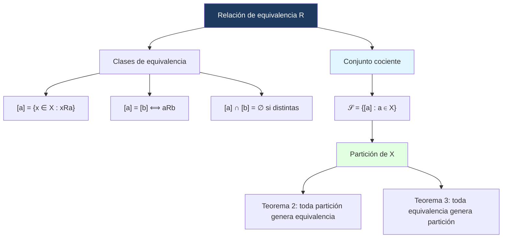

# ⚖️ Propiedades y Equivalencia

## 🎯 Introducción

> [!info]- 💡 ¿Qué son las relaciones de equivalencia y de orden?
> 
> Dos tipos especiales de relaciones sobre X surgen de combinar las cuatro propiedades básicas de maneras distintas. La **relación de equivalencia** generaliza la idea de igualdad; la **relación de orden** generaliza la idea de "menor o igual que".
> 
> ```mermaid
> graph TD
>     A[Propiedades de R sobre X] --> B[Reflexiva]
>     A --> C[Simétrica]
>     A --> D[Antisimétrica]
>     A --> E[Transitiva]
>     B & C & E --> F[Relación de Equivalencia]
>     B & D & E --> G[Relación de Orden Parcial]
>     style F fill:#e1f5ff
>     style G fill:#ffe1e1
>     style A fill:#1e3a5f,color:#fff
> ```

---

## 📋 Relaciones de Orden y de Equivalencia

> [!note]- 📋 Definición 13 — Relación de Orden y de Equivalencia
> 
> Sea R una relación sobre X. Diremos que:
> 
> - R es una **relación de orden (parcial)** sobre X si R es **reflexiva, antisimétrica y transitiva**.
> - R es una **relación de equivalencia** sobre X si R es **reflexiva, simétrica y transitiva**.
> 
> > [!tip]- 💡 Comparación rápida
> > 
> > | Propiedad | Equivalencia | Orden Parcial |
> > |---|---|---|
> > | Reflexiva | ✅ | ✅ |
> > | Simétrica | ✅ | ❌ |
> > | Antisimétrica | ❌ | ✅ |
> > | Transitiva | ✅ | ✅ |

> [!example]- 📝 Ejemplo 15 — Clasificación de relaciones
> 
> Retomando las relaciones del Ejemplo 14 (X = {1,3,4}):
> 
> - **R₁ = {(1,1),(1,3),(3,1),(3,3),(4,4)}:** es de **equivalencia** (reflexiva, simétrica, transitiva). No es de orden (no es antisimétrica).
> - **R₂ = {(1,1),(1,3),(1,4),(3,4)}:** **no es de orden ni de equivalencia** (ni reflexiva ni simétrica).
> - **R₃ = {(1,1),(3,3),(4,4)}:** es **de equivalencia y de orden** a la vez (cumple las cinco propiedades — es la relación de igualdad en X).

---

## 📐 Demostrando Orden Parcial

> [!note]- 📐 Técnica — Cómo demostrar que R es orden parcial
> 
> Para demostrar que R es un **orden parcial** sobre X hay que verificar las tres propiedades **una por una**, en este orden:
> 
> 1. **Reflexiva:** tomar un $x \in X$ arbitrario y demostrar que $xRx$.
> 2. **Antisimétrica:** asumir $xRy$ y $yRx$ simultáneamente, y demostrar que $x = y$.
> 3. **Transitiva:** asumir $xRy$ y $yRz$ simultáneamente, y demostrar que $xRz$.
> 
> Si alguna falla, R **no** es orden parcial — basta un contraejemplo.

> [!example]- 📝 Ejemplo — $a \mid b$ es orden parcial en $\mathbb{N}$
> 
> Sea $X = \mathbb{N}$ y la relación $R$ definida por:
> 
> $$aRb \iff a \mid b \quad \text{(a divide a b)}$$
> 
> **Reflexiva:** Sea $a \in \mathbb{N}$. Como $a = a \cdot 1$, se tiene que $a \mid a$, luego $aRa$. ✓
> 
> **Antisimétrica:** Supongamos $aRb$ y $bRa$, es decir $a \mid b$ y $b \mid a$. Entonces existen $k, m \in \mathbb{N}$ tales que $b = ka$ y $a = mb$. Sustituyendo:
> 
> $$a = mb = m(ka) = (mk)a \implies mk = 1$$
> 
> Como $m, k \in \mathbb{N}$, la única solución es $m = k = 1$, luego $a = b$. ✓
> 
> **Transitiva:** Supongamos $aRb$ y $bRc$, es decir $a \mid b$ y $b \mid c$. Entonces existen $k, m \in \mathbb{N}$ tales que $b = ka$ y $c = mb$. Sustituyendo:
> 
> $$c = mb = m(ka) = (mk)a \implies a \mid c$$
> 
> luego $aRc$. ✓
> 
> Por tanto $R$ es un orden parcial sobre $\mathbb{N}$. $\blacksquare$

> [!example]- 📝 Ejemplo — $A \cap B = A$ es orden parcial en subconjuntos
> 
> Sea $U$ un conjunto finito y $X$ el conjunto de todos los subconjuntos no vacíos de $U$. Se define:
> 
> $$ARB \iff A \cap B = A$$
> 
> Notemos que $A \cap B = A \iff A \subseteq B$ (por el Ejercicio 23 de la Guía 1), así que esta relación es equivalente a la contención $\subseteq$.
> 
> **Reflexiva:** Sea $A \in X$. Como $A \cap A = A$, se tiene $ARA$. ✓
> 
> **Antisimétrica:** Supongamos $ARB$ y $BRA$, es decir $A \subseteq B$ y $B \subseteq A$. Por doble contención, $A = B$. ✓
> 
> **Transitiva:** Supongamos $ARB$ y $BRC$, es decir $A \subseteq B$ y $B \subseteq C$. Sea $x \in A$, entonces $x \in B$, luego $x \in C$. Por tanto $A \subseteq C$, es decir $ARC$. ✓
> 
> Por tanto $R$ es un orden parcial sobre $X$. $\blacksquare$

> [!tip]- 💡 Orden parcial vs. orden total
> 
> Un orden parcial permite que existan elementos **incomparables** — es decir, pares $a, b \in X$ donde ni $aRb$ ni $bRa$. Por ejemplo, en la divisibilidad sobre $\mathbb{N}$, los números 2 y 3 son incomparables (2 no divide a 3 y 3 no divide a 2).
> 
> Si **todo** par de elementos es comparable, el orden se llama **total**. Por ejemplo, $\leq$ en $\mathbb{R}$ es un orden total.
> 
> | | Todo par comparable | Pares incomparables posibles |
> |---|---|---|
> | **Orden total** | ✅ | ❌ |
> | **Orden parcial** | no necesariamente | ✅ |

---
## 🧩 Particiones

> [!note]- 🧩 Definición 14 — Partición
> 
> Sea X un conjunto no vacío. Una **partición** de X es cualquier familia 𝒮 de subconjuntos de X, **no vacíos**, **disjuntos dos a dos** y cuya **unión es X**.

> [!example]- 📝 Ejemplo 16 — Particiones de un conjunto
> 
> Si X = {1, 2, 3}, entonces las familias:
> 
> - 𝒮₁ = {{1,2},{3}}
> - 𝒮₂ = {{1},{2},{3}}
> 
> son particiones de X.
> 
> Sin embargo, {{1,2},{2,3}} **no** es partición porque los conjuntos no son disjuntos (el 2 aparece en ambos).

> [!abstract]- 📐 Teorema 2 — Partición ⟹ Equivalencia
> 
> Sea 𝒮 una partición de X. Definamos una relación R sobre X por:
> 
> $$xRy \iff \exists\, S \in \mathcal{S} \text{ tal que } x, y \in S$$
> 
> Entonces R es una **relación de equivalencia** sobre X.

---

## 🔍 Clases de Equivalencia y Conjunto Cociente

> [!note]- 🔍 Definición 15 — Clase de Equivalencia
> 
> Sea R una relación de equivalencia sobre X. Dado a ∈ X, llamaremos **clase de equivalencia** de a, denotada [a], al conjunto:
> 
> $$[a] = \{x \in X : xRa\}$$
> 
> **Propiedades de las clases:**
> 
> - a ∈ [a] para todo a ∈ X (por reflexividad).
> - [x] = [b] ⟺ aRb.
> - Si [a] ≠ [b], entonces [a] ∩ [b] = ∅ (son disjuntas).
> - ⋃ₐ [a] = X (cubren todo X).

> [!abstract]- 📐 Teorema 3 — Equivalencia ⟹ Partición (Conjunto Cociente)
> 
> Si R es una relación de equivalencia sobre X, entonces la familia:
> 
> $$\mathcal{S} = \{[a] : a \in X\}$$
> 
> es una **partición** de X. La llamaremos el **conjunto cociente** de R.

> [!example]- 📝 Ejemplo 17 — Clases de equivalencia y conjunto cociente
> 
> Sea X = {1,3,4} y R₁ = {(1,1),(1,3),(3,1),(3,3),(4,4)}, que sabemos es relación de equivalencia.
> 
> Las clases de equivalencia son:
> 
> - [1] = {x ∈ X : xR₁1} = {1, 3}  (porque 1R₁1 y 3R₁1)
> - [3] = {x ∈ X : xR₁3} = {1, 3} = [1]  (misma clase)
> - [4] = {x ∈ X : xR₁4} = {4}
> 
> Por el Teorema 3, el **conjunto cociente** es:
> 
> $$\mathcal{S} = \{\{1,3\},\{4\}\}$$
> 
> que es una partición de X = {1, 3, 4}. ✓

---

## 📊 Resumen Visual



---

## 📝 Ejercicios Propuestos

> [!question]- 📋 Ejercicios
> 
> **1.** Sea R la relación en ℤ definida por x R y ⟺ 2 ∣ (x − y). Demuestra que es relación de equivalencia y describe sus clases de equivalencia.
> 
> **2.** Sea X = {1,2,3,4,5,6} con la relación R = {(a,b) : a ≡ b (mod 3)}. Calcula las clases de equivalencia de cada elemento.
> 
> **3.** En el conjunto de cadenas sobre {a,b}, define xRy si |x| = |y| (misma longitud). ¿Es relación de equivalencia? ¿Cuáles son sus clases?

> [!success]- ✅ Respuestas
> 
> **1.**
> - Reflexiva: 2 ∣ (x−x) = 0 ✅
> - Simétrica: 2 ∣ (x−y) ⟹ 2 ∣ (y−x) ✅
> - Transitiva: 2 ∣ (x−y) y 2 ∣ (y−z) ⟹ 2 ∣ (x−z) ✅
> 
> Clases: [0] = {...,−2,0,2,4,...} (pares), [1] = {...,−1,1,3,5,...} (impares).
> 
> **2.** [1]=[4]={1,4}, [2]=[5]={2,5}, [3]=[6]={3,6}.
> 
> **3.** Sí es relación de equivalencia. Las clases son todas las cadenas de longitud 0, todas las de longitud 1, todas las de longitud 2, etc.

---

**Tags:** #matematicas-discretas #relaciones #equivalencia #orden-parcial #particion #clases-equivalencia #conjunto-cociente #MATG1051
