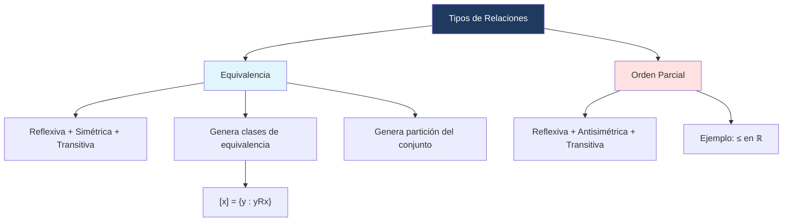

# ⚖️ Propiedades y Equivalencia

## 🎯 Introducción

> [!info]- 💡 ¿Qué es una relación de equivalencia?
> 
> Una **relación de equivalencia** es una relación que generaliza la idea de "igualdad" entre elementos: dos elementos son equivalentes si tienen alguna propiedad en común. Requiere tres propiedades simultáneamente: reflexividad, simetría y transitividad.
> 
> ```mermaid
> graph TD
>     A[Relación de Equivalencia] --> B[Reflexiva]
>     A --> C[Simétrica]
>     A --> D[Transitiva]
>     B --> E["xRx para todo x"]
>     C --> F["xRy ⟹ yRx"]
>     D --> G["xRy ∧ yRz ⟹ xRz"]
>     style A fill:#1e3a5f,color:#fff
>     style B fill:#e1f5ff
>     style C fill:#e1ffe1
>     style D fill:#fff4e1
> ```

---

## 📋 Definición

> [!note]- 📋 Relación de Equivalencia
> 
> Una relación $R$ en un conjunto $X$ es una **relación de equivalencia** si cumple las tres propiedades:
> 
> 1. **Reflexiva:** $\forall x \in X : x \mathrel{R} x$
>     
> 2. **Simétrica:** $\forall x, y \in X : x \mathrel{R} y \Rightarrow y \mathrel{R} x$
>     
> 3. **Transitiva:** $\forall x, y, z \in X : x \mathrel{R} y \land y \mathrel{R} z \Rightarrow x \mathrel{R} z$
>     
> 
> > [!tip]- 💡 Observación del PDF
> > 
> > La **igualdad de conjuntos** es un ejemplo canónico de relación de equivalencia (es reflexiva, simétrica y transitiva).

---

## 🔍 Clases de Equivalencia

> [!note]- 🔍 Clase de equivalencia
> 
> Sea $R$ una relación de equivalencia en $X$ y sea $x \in X$. La **clase de equivalencia** de $x$, denotada $[x]$ o $\overline{x}$, es el conjunto de todos los elementos de $X$ relacionados con $x$:
> 
> $$[x] = {y \in X : y \mathrel{R} x}$$
> 
> **Propiedades de las clases de equivalencia:**
> 
> - $x \in [x]$ para todo $x \in X$ (por reflexividad).
> - $[x] = [y] \iff x \mathrel{R} y$.
> - Si $[x] \neq [y]$, entonces $[x] \cap [y] = \emptyset$ (son disjuntas).
> - $\bigcup_{x \in X} [x] = X$ (cubren todo el conjunto).

---

## 🧩 Particiones

> [!note]- 🧩 Partición de un conjunto
> 
> Una **partición** de $X$ es una colección de subconjuntos no vacíos ${A_i}$ de $X$ tal que:
> 
> 1. $A_i \cap A_j = \emptyset$ para $i \neq j$ (son disjuntos entre sí).
>     
> 2. $\bigcup_i A_i = X$ (cubren todo $X$).
>     
> 
> > [!tip]- 💡 Conexión fundamental
> > 
> > Toda relación de equivalencia en $X$ determina una **partición** de $X$ (formada por sus clases de equivalencia). Y recíprocamente, toda partición de $X$ determina una relación de equivalencia. Hay una correspondencia uno a uno entre ambas nociones.

---

## 🧮 Ejemplos

> [!example]- 📝 Ejemplo 1 — Congruencia módulo n
> 
> En $\mathbb{Z}$, la relación "$a \equiv b \pmod{n}$" (a es congruente con b módulo n) se define por:
> 
> $$a \mathrel{R} b \iff n \mid (a - b)$$
> 
> **Verificación para $n = 3$:**
> 
> - **Reflexiva:** $3 \mid (a - a) = 0$ ✅
> - **Simétrica:** Si $3 \mid (a-b)$, entonces $3 \mid (b-a)$ ✅
> - **Transitiva:** Si $3 \mid (a-b)$ y $3 \mid (b-c)$, entonces $3 \mid (a-c)$ ✅
> 
> Las clases de equivalencia son: $$[0] = {\ldots, -3, 0, 3, 6, \ldots}, \quad [1] = {\ldots, -2, 1, 4, 7, \ldots}, \quad [2] = {\ldots, -1, 2, 5, 8, \ldots}$$
> 
> Estas tres clases forman una partición de $\mathbb{Z}$.

> [!example]- 📝 Ejemplo 2 — Igualdad de conjuntos
> 
> La relación de **igualdad** en cualquier conjunto $X$ (es decir, $R = {(x,x) : x \in X}$) es una relación de equivalencia.
> 
> - **Reflexiva:** $x = x$ ✅
> - **Simétrica:** $x = y \Rightarrow y = x$ ✅
> - **Transitiva:** $x = y \land y = z \Rightarrow x = z$ ✅
> 
> Cada clase de equivalencia $[x] = {x}$ contiene un solo elemento.

> [!example]- 📝 Ejemplo 3 — Relación que NO es de equivalencia
> 
> Sea $R = {(x,y) \in \mathbb{R}^2 : x \leq y}$.
> 
> - ✅ Reflexiva: $x \leq x$
> - ❌ No simétrica: $1 \leq 2$ pero $2 \not\leq 1$
> 
> Por tanto, **no es** relación de equivalencia.

---

## 🔗 Relaciones de Orden

> [!note]- 🔗 Orden parcial
> 
> Una relación $R$ en $X$ es un **orden parcial** si es:
> 
> 1. **Reflexiva:** $x \mathrel{R} x$
> 2. **Antisimétrica:** $x \mathrel{R} y \land y \mathrel{R} x \Rightarrow x = y$
> 3. **Transitiva:** $x \mathrel{R} y \land y \mathrel{R} z \Rightarrow x \mathrel{R} z$
> 
> Un conjunto con un orden parcial se llama **conjunto parcialmente ordenado** (poset).
> 
> > [!tip]- 💡 Comparación: Equivalencia vs. Orden
> > 
> > |Propiedad|Equivalencia|Orden Parcial|
> > |---|---|---|
> > |Reflexiva|✅|✅|
> > |Simétrica|✅|❌|
> > |Antisimétrica|❌|✅|
> > |Transitiva|✅|✅|

---

## 📊 Resumen Visual



---

## 📝 Ejercicios Propuestos

> [!question]- 📋 Ejercicios
> 
> **1.** Sea $R$ la relación en $\mathbb{Z}$ definida por $x \mathrel{R} y \iff 2 \mid (x - y)$. Demuestra que es relación de equivalencia y describe sus clases de equivalencia.
> 
> **2.** Sea $X = {1, 2, 3, 4, 5, 6}$ con la relación $R = {(a,b) : a \equiv b \pmod 3}$. Calcula las clases de equivalencia de cada elemento.
> 
> **3.** ¿Es la relación "ser amigo de" una relación de equivalencia en el conjunto de personas? Justifica cada propiedad.

> [!success]- ✅ Respuestas
> 
> **1.** Sea $n = 2$:
> 
> - Reflexiva: $2 \mid (x - x) = 0$ ✅
> - Simétrica: $2 \mid (x-y) \Rightarrow 2 \mid (y-x)$ ✅
> - Transitiva: $2 \mid (x-y)$ y $2 \mid (y-z) \Rightarrow 2 \mid (x-z)$ ✅
> 
> Clases: $[0] = {\ldots, -2, 0, 2, 4, \ldots}$ (pares), $[1] = {\ldots, -1, 1, 3, 5, \ldots}$ (impares).
> 
> **2.** En $X = {1,2,3,4,5,6}$ con $\pmod 3$: $[1] = [4] = {1, 4}$, $\quad [2] = [5] = {2, 5}$, $\quad [3] = [6] = {3, 6}$.
> 
> **3.** No es relación de equivalencia en general:
> 
> - Reflexiva: depende (no siempre una persona "es amiga de sí misma" en sentido formal) ⚠️
> - Simétrica: no siempre (A puede considerar amigo a B pero B no a A) ❌
> - Transitiva: no siempre (A es amigo de B, B es amigo de C, pero A puede no conocer a C) ❌

---

**Tags:** #matematicas-discretas #conjuntos #relaciones #equivalencia #particion #orden-parcial #MATG1051