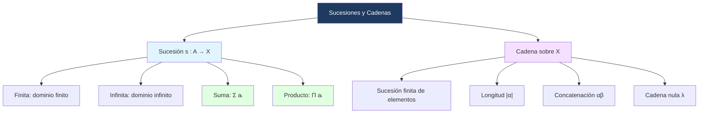

# 🔢 Sucesiones y Cadenas

## 🎯 Introducción

> [!info]- 💡 ¿Qué son las sucesiones y cadenas?
> 
> Las **sucesiones** son un caso especial de función: asignan a cada entero en un rango dado un elemento de algún conjunto. Las **cadenas** son sucesiones finitas de elementos, con la diferencia de que el orden importa y las repeticiones se permiten.
> 
> ```mermaid
> graph TD
>     A[Función f : X → Y] --> B[Sucesión s : A → X]
>     B --> C[A es conjunto de enteros consecutivos]
>     B --> D[Finita si A es finito]
>     B --> E[Infinita si A es infinito]
>     D --> F[Cadena sobre X]
>     style A fill:#e1f5ff
>     style B fill:#1e3a5f,color:#fff
>     style F fill:#f5e1ff
> ```

---

## 📋 Sucesiones

> [!note]- 📋 Definición 5 — Sucesión
> 
> Sea $X$ un conjunto. Una **sucesión en** $X$ es cualquier función $s : A \to X$, donde $A$ es un conjunto de **enteros consecutivos**.
> 
> - Al elemento $s(n)$ lo denotaremos $s_n$ y lo llamaremos el **$n$-ésimo término** de la sucesión.
> - A $n$ se le llama **índice** de la sucesión.
> - Si $s : A \to X$ es una sucesión, la denotaremos por ${s_n}$ o ${s_n}_{n \in A}$.

> [!note]- 📋 Definición 6 — Sucesión finita e infinita
> 
> - Una sucesión es **finita** si su dominio es finito.
> - Una sucesión es **infinita** si su dominio es infinito.
> 
> Si $s$ es una sucesión infinita con índice inicial $k$:
> 
> $${s_n}_{n=k}^{\infty}$$
> 
> Una sucesión finita $x$ indexada desde $i$ hasta $j$:
> 
> $${x_n}_{n=i}^{j}$$
> 
> > [!tip]- 💡 Ejemplo de notación
> > 
> > Una sucesión $t$ cuyo dominio es ${-1, 0, 1, 2, 3}$ se denota ${t_n}_{n=-1}^{3}$.

---

## 🧮 Ejemplos de Sucesiones

> [!example]- 📝 Ejemplo 17 — Sucesiones básicas
> 
> **Sucesión $s$:** $2, 4, 6, \ldots$ con primer índice $1$:
> 
> $$s_1 = 2,\quad s_2 = 4,\quad \ldots,\quad s_n = 2n$$
> 
> **Sucesión $t$:** $a, a, b, a, a$ con primer índice $1$:
> 
> $$t_1 = a,\quad t_2 = a,\quad t_3 = b,\quad t_4 = a,\quad t_5 = a$$

> [!example]- 📝 Ejemplo 18 — Sucesión finita
> 
> Sea $x$ la sucesión dada por $x_n = \dfrac{1}{2^n}$, para $-1 \leq n \leq 4$.
> 
> Los elementos de $x$ son:
> 
> $$x_{-1} = 2,\quad x_0 = 1,\quad x_1 = \tfrac{1}{2},\quad x_2 = \tfrac{1}{4},\quad x_3 = \tfrac{1}{8},\quad x_4 = \tfrac{1}{16}$$

---

## ∑ Suma y Producto de Sucesiones

> [!note]- ∑ Definición 9 — Notación de suma y producto
> 
> Sea ${a_i}_{i=m}^{n}$ una sucesión. Se definen:
> 
> **Suma:**
> 
> $$\sum_{i=m}^{n} a_i = a_m + a_{m+1} + \cdots + a_n$$
> 
> **Producto:**
> 
> $$\prod_{i=m}^{n} a_i = a_m \cdot a_{m+1} \cdots a_n$$
> 
> A $m$ se le llama **límite inferior** y a $n$ **límite superior**.
> 
> En general, si $S$ es un conjunto finito de enteros y $a$ es una sucesión:
> 
> $$\sum_{i \in S} a_i \quad \text{denota la suma de } {a_i : i \in S}$$
> 
> $$\prod_{i \in S} a_i \quad \text{denota el producto de } {a_i : i \in S}$$

> [!example]- 📝 Ejemplo 21
> 
> Sea $a$ la sucesión definida por $a_n = 2n$, $n \geq 1$:
> 
> $$\sum_{i=1}^{3} a_i = a_1 + a_2 + a_3 = 2 + 4 + 6 = 12$$
> 
> $$\prod_{i=1}^{3} a_i = a_1 \cdot a_2 \cdot a_3 = 2 \cdot 4 \cdot 6 = 48$$

---

## 🧮 Inducción sobre Productos

> [!note]- 🧮 Técnica — Inducción con notación $\prod$
> 
> Las demostraciones por inducción sobre **productos** siguen exactamente el mismo esquema que las de sumas, con una diferencia en el paso inductivo:
> 
> $$P_{k+1} = P_k \cdot a_{k+1}$$
> 
> En vez de sumar el término nuevo, se **multiplica**. El resto del esquema es idéntico:
> 
> 1. **Base:** verificar que la fórmula vale para $n = 1$ (o el índice inicial).
> 2. **HI:** asumir que $\displaystyle\prod_{k=i}^{n} a_k = f(n)$.
> 3. **Paso inductivo:** demostrar que $\displaystyle\prod_{k=i}^{n+1} a_k = f(n+1)$, usando que el producto hasta $n+1$ es el producto hasta $n$ multiplicado por $a_{n+1}$.
> 
> > [!tip]- 💡 Diferencia con sumas
> > 
> > Con sumas verificas que el término nuevo **cubre la brecha** entre dos umbrales (en desigualdades) o **completa la fórmula** algebraicamente (en igualdades). Con productos, el término nuevo **escala** el resultado anterior — el razonamiento es análogo pero la manipulación algebraica involucra factorizaciones en vez de sumas.

> [!example]- 📝 Ejemplo — $\displaystyle\prod_{k=1}^{n}(1+2k) = \dfrac{(2n+1)!}{2^n n!}$
> 
> **Demostrar** que para toda $n \in \mathbb{N}$:
> 
> $$\prod_{k=1}^{n}(1+2k) = \frac{(2n+1)!}{2^n n!}$$
> 
> **Base ($n = 1$):**
> 
> $$\prod_{k=1}^{1}(1+2k) = 1+2(1) = 3$$
> 
> $$\frac{(2\cdot1+1)!}{2^1 \cdot 1!} = \frac{3!}{2} = \frac{6}{2} = 3 \quad \checkmark$$
> 
> **HI:** Supongamos que para algún $n = m$:
> 
> $$\prod_{k=1}^{m}(1+2k) = \frac{(2m+1)!}{2^m m!}$$
> 
> **Paso inductivo:** Queremos demostrar que vale para $n = m+1$:
> 
> $$\prod_{k=1}^{m+1}(1+2k) = \frac{(2(m+1)+1)!}{2^{m+1}(m+1)!} = \frac{(2m+3)!}{2^{m+1}(m+1)!}$$
> 
> Separamos el último factor del producto:
> 
> $$\prod_{k=1}^{m+1}(1+2k) = \left(\prod_{k=1}^{m}(1+2k)\right) \cdot (1+2(m+1))$$
> 
> Aplicamos la HI:
> 
> $$= \frac{(2m+1)!}{2^m m!} \cdot (2m+3)$$
> 
> Ahora multiplicamos y dividimos por $2(m+1)$ para construir el denominador que necesitamos:
> 
> $$= \frac{(2m+1)!}{2^m m!} \cdot (2m+3) \cdot \frac{2(m+1)}{2(m+1)}$$
> 
> $$= \frac{(2m+1)! \cdot (2m+2) \cdot (2m+3)}{2^{m+1}(m+1)!}$$
> 
> Como $(2m+1)! \cdot (2m+2) \cdot (2m+3) = (2m+3)!$:
> 
> $$= \frac{(2m+3)!}{2^{m+1}(m+1)!} \quad \checkmark \quad \blacksquare$$ 
> 
> > [!tip]- 💡 El truco clave
> > 
> > Cuando el denominador de la meta tiene $2^{m+1}(m+1)!$ pero solo tienes $2^m m!$, **multiplica y divide por el factor faltante** — en este caso $2(m+1)$. Eso construye el denominador correcto sin cambiar el valor, y permite que el numerador absorba los factores nuevos en el factorial.

> [!example]- 📝 Ejemplo 22 — Suma geométrica
> 
> La suma geométrica $a + ar + ar^2 + \cdots + ar^n$ se escribe:
> 
> $$\sum_{i=0}^{n} ar^i$$

---

## 🔄 Recurrencias

> [!note]- 🔄 Definición — Relación de Recurrencia
> 
> Una **relación de recurrencia** para una sucesión $\{s_n\}$ es una ecuación que expresa $s_n$ en términos de uno o más términos anteriores de la misma sucesión.
> 
> Para que la sucesión quede completamente definida se necesitan:
> 
> 1. La **relación de recurrencia** (la ecuación).
> 2. Las **condiciones iniciales** (los primeros términos que no dependen de anteriores).
> 
> > [!tip]- 💡 Orden de una recurrencia
> > 
> > El **orden** de una recurrencia es la diferencia entre el índice mayor y el menor que aparecen. Por ejemplo:
> > - $s_n = 3s_{n-1}$ es de **orden 1** — solo depende del término inmediatamente anterior.
> > - $s_n = 5s_{n-1} - 6s_{n-2}$ es de **orden 2** — depende de los dos términos anteriores.

---

> [!note]- 📋 Técnica — Cómo trabajar con recurrencias
> 
> Dado $s_n$ definido por una fórmula explícita, hay tres operaciones frecuentes:
> 
> | Operación | Qué hacer |
> |---|---|
> | Encontrar $s_i$ | Sustituir $n$ por $i$ en la fórmula |
> | Encontrar $s_{n-1}$ | Sustituir $n$ por $n-1$ en la fórmula |
> | Encontrar $s_{n-2}$ | Sustituir $n$ por $n-2$ en la fórmula |
> 
> Para **verificar** que $\{s_n\}$ satisface una recurrencia, se sustituyen $s_n$, $s_{n-1}$ y $s_{n-2}$ (o los que correspondan) con sus fórmulas explícitas y se simplifica hasta que ambos lados sean iguales.

> [!example]- 📝 Ejemplo — Sucesión con recurrencia de orden 2
> 
> Sea la sucesión definida por $s_n = 2^n + 4 \cdot 3^n$, $n \geq 0$.
> 
> **Primeros términos:**
> 
> $$s_0 = 2^0 + 4 \cdot 3^0 = 1 + 4 = 5$$
> 
> $$s_1 = 2^1 + 4 \cdot 3^1 = 2 + 12 = 14$$
> 
> **Fórmulas desplazadas:**
> 
> $$s_{n-1} = 2^{n-1} + 4 \cdot 3^{n-1}$$
> 
> $$s_{n-2} = 2^{n-2} + 4 \cdot 3^{n-2}$$
> 
> **Verificación de $s_n = 5s_{n-1} - 6s_{n-2}$ para $n \geq 2$:**
> 
> Calculamos el lado derecho sustituyendo las fórmulas:
> 
> $$5s_{n-1} - 6s_{n-2} = 5(2^{n-1} + 4 \cdot 3^{n-1}) - 6(2^{n-2} + 4 \cdot 3^{n-2})$$
> 
> Separamos por base:
> 
> $$= \underbrace{5 \cdot 2^{n-1} - 6 \cdot 2^{n-2}}_{\text{términos con } 2} + \underbrace{20 \cdot 3^{n-1} - 24 \cdot 3^{n-2}}_{\text{términos con } 3}$$
> 
> Para los términos con 2, factorizamos $2^{n-2}$:
> 
> $$5 \cdot 2^{n-1} - 6 \cdot 2^{n-2} = 2^{n-2}(5 \cdot 2 - 6) = 2^{n-2} \cdot 4 = 2^n$$
> 
> Para los términos con 3, factorizamos $3^{n-2}$:
> 
> $$20 \cdot 3^{n-1} - 24 \cdot 3^{n-2} = 3^{n-2}(20 \cdot 3 - 24) = 3^{n-2} \cdot 36 = 4 \cdot 3^n$$
> 
> Juntando:
> 
> $$5s_{n-1} - 6s_{n-2} = 2^n + 4 \cdot 3^n = s_n \quad \checkmark \quad \blacksquare$$
> 
> > [!tip]- 💡 El truco clave
> > 
> > Al verificar recurrencias con potencias, **factoriza la potencia de menor exponente** en cada grupo. Esto convierte $2^{n-1}$ y $2^{n-2}$ en $2^n$ multiplicado por una constante, lo que permite simplificar limpiamente.

---

## 🔤 Cadenas

> [!note]- 📋 Definición 10 — Cadena
> 
> Sea $X$ un conjunto. Una **cadena sobre** $X$ es una **sucesión finita** de elementos en $X$.
> 
> **Notación y convenciones:**
> 
> - Si $s_1 = b,\ s_2 = a,\ s_3 = a,\ s_4 = c$, la cadena se denota $baac$.
> - El **orden importa**: la cadena $baac$ es diferente a $abac$.
> - Las **repeticiones** se expresan con superíndices: $bbaaac = b^2a^3c$.
> - La **cadena nula** (sin elementos) se denota $\lambda$.
> - $X^*$ denota el conjunto de **todas** las cadenas sobre $X$.
> - $X^+$ denota el conjunto de las cadenas **no nulas** sobre $X$.

> [!note]- 📋 Longitud y Concatenación
> 
> Sea $\alpha$ una cadena sobre $X$:
> 
> - La **longitud** de $\alpha$, denotada $|\alpha|$, es el número de elementos en $\alpha$.
>     
> - Si $\alpha$ y $\beta$ son cadenas, la cadena $\alpha\beta$ (primero $\alpha$, luego $\beta$) se llama **concatenación** de $\alpha$ y $\beta$.
>     
> - Una cadena $\beta$ es **subcadena** de $\alpha$ si existen cadenas $\gamma$ y $\delta$ tal que $\alpha = \gamma\beta\delta$.
>     
> 
> > [!tip]- 💡 Propiedades de la longitud
> > 
> > - $|\lambda| = 0$
> > - $|\alpha\beta| = |\alpha| + |\beta|$

---

## 🧮 Ejemplos de Cadenas

> [!example]- 📝 Ejemplo 23 — Cadena sobre un conjunto
> 
> Sea $X = {a, b, c}$. Si hacemos $s_1 = b,\ s_2 = a,\ s_3 = a,\ s_4 = c$, obtenemos la cadena $baac$.
> 
> **Ejemplos adicionales:**
> 
> - $baac \neq abac$ (el orden importa)
> - $bbaaac = b^2a^3c$ (notación con superíndices)
> - $|baac| = 4$
> - $|b^2a^3c| = 6$
> - Concatenación: si $\alpha = ab$ y $\beta = ca$, entonces $\alpha\beta = abca$ con $|\alpha\beta| = 4$
> - $ca$ es subcadena de $bca$ (con $\gamma = b$ y $\delta = \lambda$)

---

## 📊 Resumen Visual



---

## 📝 Ejercicios Propuestos

> [!question]- 📋 Ejercicios
> 
> **1.** Sea $a_n = 3n - 1$, $1 \leq n \leq 5$. Calcula $\displaystyle\sum_{i=1}^{5} a_i$ y $\displaystyle\prod_{i=1}^{4} a_i$.
> 
> **2.** Sea $X = {0, 1}$ (alfabeto binario). Escribe todas las cadenas de longitud 2 en $X$. ¿Cuántas hay de longitud $n$?
> 
> **3.** Sea $\alpha = a^2b$ y $\beta = ba^3$. Calcula $\alpha\beta$, $\beta\alpha$, $|\alpha\beta|$ y verifica que $\alpha\beta \neq \beta\alpha$.
> 
> **4.** Indica si $ab$ es subcadena de $cab$, $aab$, $ba$.

> [!success]- ✅ Respuestas
> 
> **1.** $a_1=2,\ a_2=5,\ a_3=8,\ a_4=11,\ a_5=14$. $\sum = 2+5+8+11+14 = 40$. $\prod = 2 \cdot 5 \cdot 8 \cdot 11 = 880$.
> 
> **2.** Cadenas de longitud 2: ${00, 01, 10, 11}$ — hay $4 = 2^2$ cadenas. En general, hay $2^n$ cadenas de longitud $n$.
> 
> **3.** $\alpha\beta = a^2b \cdot ba^3 = a^2b^2a^3$, longitud $|\alpha\beta| = 2+2+3 = 7$. $\beta\alpha = ba^3 \cdot a^2b = ba^5b$, longitud $7$. $a^2b^2a^3 \neq ba^5b$, por lo tanto $\alpha\beta \neq \beta\alpha$. ✅
> 
> **4.**
> 
> - $cab$: ✅ $ab$ es subcadena ($\gamma = c$, $\delta = \lambda$).
> - $aab$: ✅ $ab$ es subcadena ($\gamma = a$, $\delta = \lambda$).
> - $ba$: ❌ $ab$ no es subcadena de $ba$.

---

**Tags:** #matematicas-discretas #conjuntos #sucesiones #cadenas #notacion-suma #MATG1051