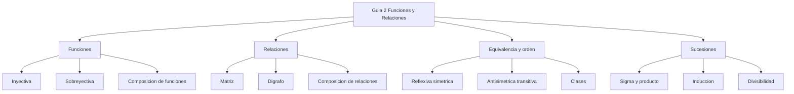

# 📝 Guía de Problemas 2 — Ejercicios Resueltos

> [!info] 📌 Sobre esta guía
> 
> Ejercicios resueltos de la **Guía de Problemas 2** — Matemáticas Discretas (MATG1051). Autores de la guía: Cristhian Hernández, Ebner Pineda, Liliana Pérez, Jennifer Avilés.
> 
> |Sección|Tema|Ejercicios|
> |---|---|---|
> |2.1|Funciones inyectiva, sobreyectiva, composición e inversa|1–8|
> |2.2|Relaciones, representación, matriz y digrafo|9–14|
> |2.3|Propiedades, equivalencia y orden parcial|15–21|
> |2.4|Sucesiones, notación sigma y producto|22–28|

---

![[Guía de problemas 2 MD.pdf]]

## 🔢 2.1 — Funciones Inyectiva, Sobreyectiva, Composición e Inversa

> [!example]- 📝 Ejercicio 1 — [[01 - Funciones|Función]] estrictamente creciente implica inyectividad
> 
> **Enunciado:** Sea $f : X \subseteq \mathbb{R} \to \mathbb{R}$. Demuestre que si $f$ es estrictamente creciente, entonces $f$ es inyectiva.
> 
> **Demostración (contrarrecíproco):**
> 
> Sea $f$ estrictamente creciente, es decir: $\forall x_1, x_2 \in X : x_1 < x_2 \Rightarrow f(x_1) < f(x_2)$.
> 
> Supongamos que $x_1 \neq x_2$. Entonces se cumple una de dos posibilidades:
> 
> - **Caso 1:** $x_1 < x_2$. Por hipótesis, $f(x_1) < f(x_2)$, por tanto $f(x_1) \neq f(x_2)$.
> - **Caso 2:** $x_1 > x_2$. Por hipótesis, $f(x_1) > f(x_2)$, por tanto $f(x_1) \neq f(x_2)$.
> 
> En ambos casos, $x_1 \neq x_2 \Rightarrow f(x_1) \neq f(x_2)$, que es el contrarrecíproco de la inyectividad. Por tanto $f$ es inyectiva. $\blacksquare$

> [!example]- 📝 Ejercicio 2 — Análisis de $f(x) = x^2 + 2x + 2$ con codominio $[0, \infty)$
> 
> **Enunciado:** Sea $f : \mathbb{R} \to [0, \infty)$ con $f(x) = x^2 + 2x + 2$.
> 
> **(a) ¿Es $f$ inyectiva?**
> 
> **No**, $f$ no es inyectiva.
> 
> Completando el cuadrado: $f(x) = (x+1)^2 + 1$.
> 
> Contraejemplo: tomamos $x_1 = 0$ y $x_2 = -2$:
> 
> $$f(0) = 0 + 0 + 2 = 2, \qquad f(-2) = 4 - 4 + 2 = 2$$
> 
> $f(0) = f(-2) = 2$ pero $0 \neq -2$, por tanto $f$ **no es inyectiva**. $\blacksquare$
> 
> **(b) ¿Es $f$ sobreyectiva?**
> 
> Sea $y \in [0, \infty)$ arbitrario. Debemos hallar $x \in \mathbb{R}$ tal que $f(x) = y$:
> 
> $$(x+1)^2 + 1 = y \implies (x+1)^2 = y - 1 \implies x = -1 + \sqrt{y-1}$$
> 
> Para que $x \in \mathbb{R}$ se necesita $y - 1 \geq 0$, es decir $y \geq 1$. Sin embargo, el mínimo de $f$ es $f(-1) = 1$, y el codominio es $[0, \infty)$.
> 
> > [!warning] Observación
> > Con codominio $[0,\infty)$, los valores $y \in [0, 1)$ no tienen preimagen, ya que el rango real de $f$ es $[1, \infty)$. Por tanto $f$ **no es sobreyectiva** sobre $[0, \infty)$.
> > 
> > Si el codominio fuera $[1, \infty)$, entonces $f$ sí sería sobreyectiva (y biyectiva considerando $x \geq -1$).
> 
> **Conclusión:** $f$ no es inyectiva, no es sobreyectiva, y por tanto **no es biyectiva**. $\blacksquare$

> [!example]- 📝 Ejercicio 3 — $f(x) = \dfrac{2x-3}{x+2}$ es biyectiva
> 
> **Enunciado:** Sea $f : \mathbb{R} - \{-2\} \to \mathbb{R} - \{2\}$ con $f(x) = \dfrac{2x-3}{x+2}$. Demuestre que $f$ es biyectiva.
> 
> **Inyectividad:**
> 
> Supongamos $f(x_1) = f(x_2)$:
> 
> $$\frac{2x_1 - 3}{x_1 + 2} = \frac{2x_2 - 3}{x_2 + 2}$$
> 
> Multiplicamos en cruz:
> 
> $$(2x_1 - 3)(x_2 + 2) = (2x_2 - 3)(x_1 + 2)$$
> 
> $$2x_1 x_2 + 4x_1 - 3x_2 - 6 = 2x_1 x_2 + 4x_2 - 3x_1 - 6$$
> 
> $$4x_1 - 3x_2 = 4x_2 - 3x_1$$
> 
> $$7x_1 = 7x_2 \implies x_1 = x_2$$
> 
> Por tanto $f$ es **inyectiva**. ✓
> 
> **Sobreyectividad:**
> 
> Sea $y \in \mathbb{R} - \{2\}$ arbitrario. Buscamos $x$ tal que $f(x) = y$:
> 
> $$\frac{2x - 3}{x + 2} = y \implies 2x - 3 = y(x + 2) \implies 2x - yx = 2y + 3 \implies x(2 - y) = 2y + 3$$
> 
> $$x = \frac{2y + 3}{2 - y}$$
> 
> Como $y \neq 2$, el denominador $2 - y \neq 0$, por tanto $x$ existe y es real. Además $x \neq -2$ (se puede verificar sustituyendo). Luego $f$ es **sobreyectiva**. ✓
> 
> **Conclusión:** $f$ es inyectiva y sobreyectiva, por tanto es **biyectiva**. $\blacksquare$

> [!example]- 📝 Ejercicio 4 — Demostración: $\left\lfloor \dfrac{n+1}{2} \right\rfloor = \left\lceil \dfrac{n}{2} \right\rceil$
> 
> **Enunciado:** Demuestre que para toda $n \in \mathbb{N}$, $\left\lfloor \dfrac{n+1}{2} \right\rfloor = \left\lceil \dfrac{n}{2} \right\rceil$.
> 
> **Demostración por casos (paridad de $n$):**
> 
> **Caso 1: $n$ par.** Sea $n = 2k$ con $k \in \mathbb{N}$.
> 
> $$\left\lfloor \frac{2k+1}{2} \right\rfloor = \left\lfloor k + \frac{1}{2} \right\rfloor = k$$
> 
> $$\left\lceil \frac{2k}{2} \right\rceil = \lceil k \rceil = k$$
> 
> Ambos lados son iguales a $k$. ✓
> 
> **Caso 2: $n$ impar.** Sea $n = 2k-1$ con $k \in \mathbb{N}$, $k \geq 1$.
> 
> $$\left\lfloor \frac{2k}{2} \right\rfloor = \lfloor k \rfloor = k$$
> 
> $$\left\lceil \frac{2k-1}{2} \right\rceil = \left\lceil k - \frac{1}{2} \right\rceil = k$$
> 
> Ambos lados son iguales a $k$. ✓
> 
> En ambos casos la igualdad se cumple. $\blacksquare$

> [!example]- 📝 Ejercicio 5 — $f(n) = \left\lceil \dfrac{n^2}{n-1} \right\rceil$ es biyectiva
> 
> **Enunciado:** Sean $A = \{n \in \mathbb{N} : n \geq 2\}$, $B = \{n \in \mathbb{N} : n \geq 4\}$ y $f : A \to B$ con $f(n) = \left\lceil \dfrac{n^2}{n-1} \right\rceil$.
> 
> **Simplificación de la expresión:** Dividimos $n^2$ entre $n-1$:
> 
> $$\frac{n^2}{n-1} = n + 1 + \frac{1}{n-1}$$
> 
> Por tanto: $f(n) = \left\lceil n + 1 + \dfrac{1}{n-1} \right\rceil = n + 1 + \left\lceil \dfrac{1}{n-1} \right\rceil$
> 
> - Si $n = 2$: $\dfrac{1}{n-1} = 1$, entero, entonces $\left\lceil 1 \right\rceil = 1$, así $f(2) = 4$.
> - Si $n \geq 3$: $0 < \dfrac{1}{n-1} \leq \dfrac{1}{2} < 1$, entonces $\left\lceil \dfrac{1}{n-1} \right\rceil = 1$, así $f(n) = n + 2$.
> 
> **Inyectividad:**
> 
> - $f(2) = 4$, $f(3) = 5$, $f(4) = 6$, $f(5) = 7$, ...
> 
> Si $f(n_1) = f(n_2)$, como $f(n) = n+2$ para $n \geq 2$ (y $f(2) = 4 = 2+2$), entonces $n_1 + 2 = n_2 + 2 \Rightarrow n_1 = n_2$. **Inyectiva**. ✓
> 
> **Sobreyectividad:**
> 
> Sea $m \in B$, es decir $m \geq 4$. Tomamos $n = m - 2 \geq 2$, entonces $n \in A$ y $f(n) = n + 2 = m$. **Sobreyectiva**. ✓
> 
> **Conclusión:** $f$ es **biyectiva**. $\blacksquare$

> [!example]- 📝 Ejercicio 6 — Análisis de $g(x) = \dfrac{x^2 - 5}{x - 2}$
> 
> **Enunciado:** Sea $g : \mathbb{R} - \{2\} \to \mathbb{R}$ con $g(x) = \dfrac{x^2 - 5}{x - 2}$. Determine si $g$ es inyectiva, sobreyectiva o biyectiva.
> 
> **Inyectividad:**
> 
> **No** es inyectiva. Buscamos un contraejemplo fijando $g(x) = 4$ y resolviendo:
> 
> $$x^2 - 5 = 4(x-2) \implies x^2 - 4x + 3 = 0 \implies (x-1)(x-3)=0$$
> 
> Contraejemplo: $x_1 = 1$ y $x_2 = 3$ (ambos $\neq 2$, luego en el dominio):
> 
> $$g(1) = \frac{1-5}{1-2} = \frac{-4}{-1} = 4, \qquad g(3) = \frac{9-5}{3-2} = \frac{4}{1} = 4$$
> 
> $g(1) = g(3) = 4$ pero $1 \neq 3$, por tanto $g$ **no es inyectiva**. ✓
> 
> **Sobreyectividad:**
> 
> Sea $y \in \mathbb{R}$. Buscamos $x \neq 2$ tal que $g(x) = y$:
> 
> $$x^2 - 5 = y(x-2) \implies x^2 - yx + (2y - 5) = 0$$
> 
> Discriminante: $\Delta = y^2 - 4(2y - 5) = y^2 - 8y + 20 = (y-4)^2 + 4 > 0$ para todo $y \in \mathbb{R}$.
> 
> El discriminante siempre es positivo, por tanto siempre existen soluciones reales. Se verifica que al menos una de ellas es $\neq 2$. Luego $g$ **es sobreyectiva**. ✓
> 
> **Conclusión:** $g$ es sobreyectiva pero **no** inyectiva, por tanto **no es biyectiva**. $\blacksquare$

> [!example]- 📝 Ejercicio 7 — Composición de inyectivas es inyectiva
> 
> **Enunciado:** Sean $f : A \mapsto B$ y $g : C \mapsto A$ inyectivas. Demuestre que $h(x) = f(g(x))$ es inyectiva.
> 
> **Demostración:**
> 
> Sean $x_1, x_2 \in C$ tales que $h(x_1) = h(x_2)$, es decir $f(g(x_1)) = f(g(x_2))$.
> 
> Como $f$ es inyectiva: $f(g(x_1)) = f(g(x_2)) \Rightarrow g(x_1) = g(x_2)$.
> 
> Como $g$ es inyectiva: $g(x_1) = g(x_2) \Rightarrow x_1 = x_2$.
> 
> Por tanto $h(x_1) = h(x_2) \Rightarrow x_1 = x_2$, es decir $h$ es **inyectiva**. $\blacksquare$

> [!example]- 📝 Ejercicio 8 — $f(A) \cap f(B) = f(A \cap B)$ para $f$ inyectiva
> 
> **Enunciado:** Sea $f : X \mapsto Y$ inyectiva y $f(\mathcal{S}) = \{y \in Y \mid y = f(x),\ \text{para algún}\ x \in \mathcal{S}\}$. Demuestre que $f(A) \cap f(B) = f(A \cap B)$.
> 
> **Demostración (doble contención):**
> 
> **(⊇) $f(A \cap B) \subseteq f(A) \cap f(B)$:**
> 
> Sea $y \in f(A \cap B)$. Entonces existe $x \in A \cap B$ tal que $y = f(x)$.
> Como $x \in A$, se tiene $y \in f(A)$. Como $x \in B$, se tiene $y \in f(B)$.
> Por tanto $y \in f(A) \cap f(B)$. ✓
> 
> **(⊆) $f(A) \cap f(B) \subseteq f(A \cap B)$:**
> 
> Sea $y \in f(A) \cap f(B)$. Entonces existe $x_1 \in A$ con $y = f(x_1)$ y existe $x_2 \in B$ con $y = f(x_2)$.
> 
> Entonces $f(x_1) = f(x_2) = y$. Como $f$ es **inyectiva**, se concluye $x_1 = x_2$.
> 
> Sea $x = x_1 = x_2$. Entonces $x \in A$ y $x \in B$, es decir $x \in A \cap B$.
> Como $y = f(x)$ con $x \in A \cap B$, se tiene $y \in f(A \cap B)$. ✓
> 
> Por doble contención: $f(A) \cap f(B) = f(A \cap B)$. $\blacksquare$

---

## 🔗 2.2 — Relaciones, Representación, Matriz y Digrafo

> [!example]- 📝 Ejercicio 9 — [[02 - Relaciones|Relación]] "múltiplo" sobre $\{2,3,5,6,9,15\}$
> 
> **Enunciado:** $A = \{2,3,5,6,9,15\}$, $R = \{(x,y) \in A \times A \mid y \text{ es múltiplo de } x\}$.
> 
> Primero determinamos los pares de $R$:
> 
> | $x$ | Múltiplos de $x$ en $A$ | Pares |
> |---|---|---|
> | 2 | 2, 6 | (2,2), (2,6) |
> | 3 | 3, 6, 9, 15 | (3,3), (3,6), (3,9), (3,15) |
> | 5 | 5, 15 | (5,5), (5,15) |
> | 6 | 6 | (6,6) |
> | 9 | 9 | (9,9) |
> | 15 | 15 | (15,15) |
> 
> $$R = \{(2,2),(2,6),(3,3),(3,6),(3,9),(3,15),(5,5),(5,15),(6,6),(9,9),(15,15)\}$$
> 
> **(a) Diagrama sagital de $R$:**
> 
> El diagrama sagital tiene dos copias del [[04 - Cardinalidad y Leyes de Cardinalidad|Cardinalidad]] $A$ (dominio a la izquierda, codominio a la derecha), con flechas de $x$ a $y$ para cada $(x,y) \in R$:
> 
> ```mermaid
> graph LR
>   subgraph Dominio
>     a2[2]
>     a3[3]
>     a5[5]
>     a6[6]
>     a9[9]
>     a15[15]
>   end
>   subgraph Codominio
>     b2[2]
>     b3[3]
>     b5[5]
>     b6[6]
>     b9[9]
>     b15[15]
>   end
>   a2 --> b2
>   a2 --> b6
>   a3 --> b3
>   a3 --> b6
>   a3 --> b9
>   a3 --> b15
>   a5 --> b5
>   a5 --> b15
>   a6 --> b6
>   a9 --> b9
>   a15 --> b15
> ```
> 
> **(b) Digrafo:** Nodos: 2, 3, 5, 6, 9, 15. Aristas reflexivas en todos; aristas adicionales: $2\to6$, $3\to6$, $3\to9$, $3\to15$, $5\to15$.
> 
> ```mermaid
> graph TD
>   n2[2] --> n2
>   n3[3] --> n3
>   n5[5] --> n5
>   n6[6] --> n6
>   n9[9] --> n9
>   n15[15] --> n15
>   n2 --> n6
>   n3 --> n6
>   n3 --> n9
>   n3 --> n15
>   n5 --> n15
> ```
> 
> **(c) Matriz relativa al orden $2,3,5,6,9,15$:**
> 
> $$M_R = \begin{pmatrix} 1&0&0&1&0&0 \\ 0&1&0&1&1&1 \\ 0&0&1&0&0&1 \\ 0&0&0&1&0&0 \\ 0&0&0&0&1&0 \\ 0&0&0&0&0&1 \end{pmatrix}$$
> 
> **(d) Propiedades:**
> 
> - **Reflexiva:** ✓ (todo elemento es múltiplo de sí mismo)
> - **No simétrica:** $(2,6) \in R$ pero $(6,2) \notin R$
> - **Antisimétrica:** ✓ Si $y$ es múltiplo de $x$ y $x$ es múltiplo de $y$, entonces $x = y$
> - **Transitiva:** ✓ Si $z$ es múltiplo de $y$ y $y$ es múltiplo de $x$, entonces $z$ es múltiplo de $x$
> 
> $R$ es un **orden parcial** sobre $A$. $\blacksquare$

> [!example]- 📝 Ejercicio 10 — Relación $a \leq b$ y $b - a \leq 3$ sobre $\{1,2,3,4,5,6\}$
> 
> **Enunciado:** $A = \{1,2,3,4,5,6\}$, $aRb \iff a \leq b$ y $b - a \leq 3$.
> 
> **(a) Todos los pares $(a,b)$:**
> 
> | $a$ | Valores de $b$ válidos | Pares |
> |---|---|---|
> | 1 | 1,2,3,4 | (1,1),(1,2),(1,3),(1,4) |
> | 2 | 2,3,4,5 | (2,2),(2,3),(2,4),(2,5) |
> | 3 | 3,4,5,6 | (3,3),(3,4),(3,5),(3,6) |
> | 4 | 4,5,6 | (4,4),(4,5),(4,6) |
> | 5 | 5,6 | (5,5),(5,6) |
> | 6 | 6 | (6,6) |
> 
> **(b) Matriz (orden $1,2,3,4,5,6$):**
> 
> $$M_R = \begin{pmatrix} 1&1&1&1&0&0 \\ 0&1&1&1&1&0 \\ 0&0&1&1&1&1 \\ 0&0&0&1&1&1 \\ 0&0&0&0&1&1 \\ 0&0&0&0&0&1 \end{pmatrix}$$
> 
> **(c) Digrafo:** Nodos del 1 al 6 con aristas reflexivas y aristas hacia adelante para diferencias $\leq 3$.

> [!example]- 📝 Ejercicio 11 — Relación $xRy \iff (3y \bmod x) > 1$ sobre $\{4,5,7,8\}$
> 
> **Enunciado:** $X = \{4,5,7,8\}$, $xRy \iff (3y \bmod x) > 1$.
> 
> **(a) Cálculo de todos los pares:** Evaluamos $3y \bmod x$ para cada [[05 - Permutaciones y Combinaciones|combinación]]:
> 
> | $(x,y)$ | $3y$ | $3y \bmod x$ | $> 1$? |
> |---|---|---|---|
> | (4,4) | 12 | $12 \bmod 4 = 0$ | No |
> | (4,5) | 15 | $15 \bmod 4 = 3$ | **Sí** |
> | (4,7) | 21 | $21 \bmod 4 = 1$ | No |
> | (4,8) | 24 | $24 \bmod 4 = 0$ | No |
> | (5,4) | 12 | $12 \bmod 5 = 2$ | **Sí** |
> | (5,5) | 15 | $15 \bmod 5 = 0$ | No |
> | (5,7) | 21 | $21 \bmod 5 = 1$ | No |
> | (5,8) | 24 | $24 \bmod 5 = 4$ | **Sí** |
> | (7,4) | 12 | $12 \bmod 7 = 5$ | **Sí** |
> | (7,5) | 15 | $15 \bmod 7 = 1$ | No |
> | (7,7) | 21 | $21 \bmod 7 = 0$ | No |
> | (7,8) | 24 | $24 \bmod 7 = 3$ | **Sí** |
> | (8,4) | 12 | $12 \bmod 8 = 4$ | **Sí** |
> | (8,5) | 15 | $15 \bmod 8 = 7$ | **Sí** |
> | (8,7) | 21 | $21 \bmod 8 = 5$ | **Sí** |
> | (8,8) | 24 | $24 \bmod 8 = 0$ | No |
> 
> $$R = \{(4,5),(5,4),(5,8),(7,4),(7,8),(8,4),(8,5),(8,7)\}$$
> 
> **(b) Matriz (orden $4,5,7,8$):**
> 
> $$M_R = \begin{pmatrix} 0&1&0&0 \\ 1&0&0&1 \\ 1&0&0&1 \\ 1&1&1&0 \end{pmatrix}$$
> 
> **(c) Propiedades:**
> 
> - **No reflexiva:** $(4,4) \notin R$, $(5,5) \notin R$, $(7,7) \notin R$, $(8,8) \notin R$
> - **No simétrica:** $(7,4) \in R$ pero $(4,7) \notin R$
> - **No antisimétrica:** $(4,5) \in R$ y $(5,4) \in R$ con $4 \neq 5$
> - **No transitiva:** $(7,4) \in R$ y $(4,5) \in R$ pero $(7,5) \notin R$

> [!example]- 📝 Ejercicio 12 — Relación $a < b$ y $a+b$ impar sobre $\{1,2,3,4,5,6,7\}$
> 
> **Enunciado:** $C = \{1,2,3,4,5,6,7\}$, $aRb \iff a < b$ y $a+b$ es impar.
> 
> $a+b$ es impar $\iff$ uno de $a,b$ es par y el otro impar. Combinado con $a < b$:
> 
> $$R = \{(1,2),(1,4),(1,6),(2,3),(2,5),(2,7),(3,4),(3,6),(4,5),(4,7),(5,6),(6,7)\}$$
> 
> **(a) Matriz (orden $1,2,3,4,5,6,7$):**
> 
> $$M_R = \begin{pmatrix} 0&1&0&1&0&1&0 \\ 0&0&1&0&1&0&1 \\ 0&0&0&1&0&1&0 \\ 0&0&0&0&1&0&1 \\ 0&0&0&0&0&1&0 \\ 0&0&0&0&0&0&1 \\ 0&0&0&0&0&0&0 \end{pmatrix}$$
> 
> **(b) Digrafo:** Nodos: 1, 2, 3, 4, 5, 6, 7. No hay lazos reflexivos (pues $a < a$ es imposible). Las aristas van siempre de un nodo impar a uno par mayor, o de uno par a uno impar mayor: $1\to2$, $1\to4$, $1\to6$, $2\to3$, $2\to5$, $2\to7$, $3\to4$, $3\to6$, $4\to5$, $4\to7$, $5\to6$, $6\to7$.
> 
> **(c) Propiedades:**
> 
> - **No reflexiva:** $a < a$ es falso, nunca $(a,a) \in R$
> - **No simétrica:** $(1,2) \in R$ pero $(2,1) \notin R$ (pues $2 < 1$ es falso)
> - **Antisimétrica:** ✓ Si $aRb$ entonces $a < b$, luego no puede ser $b < a$, así que $bRa$ es imposible
> - **Transitiva:** ✗ $(1,2) \in R$ y $(2,3) \in R$, pero $1+3=4$ es par, entonces $(1,3) \notin R$

> [!example]- 📝 Ejercicio 13 — Relación "$-y$ divide a $8-3x$" sobre $\{-2,3,4,5\}$
> 
> **Enunciado:** $X = \{-2,3,4,5\}$, $xRy \iff -y \mid (8 - 3x)$.
> 
> Calculamos $8 - 3x$ para cada $x$:
> 
> | $x$ | $8-3x$ |
> |---|---|
> | -2 | 14 |
> | 3 | -1 |
> | 4 | -4 |
> | 5 | -7 |
> 
> Para cada par, comprobamos si $-y$ divide a $8-3x$ (los divisores de cada valor):
> 
> - $8-3(-2) = 14$: divisores $\pm\{1,2,7,14\}$. Los $-y$ disponibles: $-(-2)=2$✓, $-(3)=-3$✗, $-(4)=-4$✗, $-(5)=-5$✗. Pares: $(-2,-2)$.
> - $8-3(3) = -1$: divisores $\pm 1$. Los $-y$: $2,−3,−4,−5$. Solo $-(-1)=1$ pero $y=1 \notin X$. Ninguno válido... revisando con $y \in X$: $-(-2)=2\nmid -1$, $-(3)=-3\nmid -1$, $-(4)=-4\nmid -1$, $-(5)=-5\nmid -1$. Ningún par.
> - $8-3(4) = -4$: $-(-2)=2\mid -4$✓, $-(3)=-3\nmid -4$, $-(4)=-4\mid -4$✓, $-(5)=-5\nmid -4$. Pares: $(4,-2),(4,4)$.
> - $8-3(5) = -7$: $-(-2)=2\nmid -7$, $-(3)=-3\nmid -7$, $-(4)=-4\nmid -7$, $-(5)=-5\nmid -7$. Ningún par.
> 
> $$R = \{(-2,-2),(4,-2),(4,4)\}$$
> 
> **Diagrama sagital:** Flechas: $-2 \to -2$, $4 \to -2$, $4 \to 4$.
> 
> **Matriz (orden $-2, 3, 4, 5$):**
> 
> $$M_R = \begin{pmatrix} 1&0&0&0 \\ 0&0&0&0 \\ 1&0&1&0 \\ 0&0&0&0 \end{pmatrix}$$
> 
> (filas = $x$, columnas = $y$, orden: $-2, 3, 4, 5$)
> 
> **(b) Propiedades:**
> 
> - **No reflexiva:** $(3,3) \notin R$, $(5,5) \notin R$
> - **No simétrica:** $(4,-2) \in R$ pero $(-2,4) \notin R$
> - **Antisimétrica:** ✓ No hay pares $(a,b)$ y $(b,a)$ con $a\neq b$ ambos en $R$
> - **Transitiva:** ✓ Las únicas cadenas posibles son: $(-2,-2)(-2,?)$ — habría que tener $(-2,y)\in R$ para algún $y$, pero el único par con $x=-2$ es $(-2,-2)$, y $(-2,-2) \in R$ ✓. Para $4$: $(4,-2)$ y $(-2,-2) \in R$ exige $(4,-2) \in R$ ✓. $(4,4)$ y $(4,-2),(4,4) \in R$ exigen $(4,-2),(4,4) \in R$ ✓. No hay cadena que incumpla la transitividad.

> [!example]- 📝 Ejercicio 14 — Composición de relaciones $R_1 \circ R_2$ y $R_2 \circ R_1$
> 
> **Enunciado:** $R_1 = \{(1,1),(1,2),(3,4),(4,2)\}$, $R_2 = \{(1,1),(2,1),(3,1),(4,4),(2,2)\}$.
> 
> **1. $R_1 \circ R_2$** (primero aplica $R_2$, luego $R_1$): $(a,c) \in R_1 \circ R_2 \iff \exists b: (a,b)\in R_2 \land (b,c)\in R_1$.
> 
> | $a$ | $b$ (de $R_2$) | $c$ (de $R_1$) | Par resultante |
> |---|---|---|---|
> | 1 | 1 ($1R_2 1$) | 1,2 ($1R_1 1$ y $1R_1 2$) | (1,1),(1,2) |
> | 2 | 1 ($2R_2 1$) | 1,2 ($1R_1 1$ y $1R_1 2$) | (2,1),(2,2) |
> | 2 | 2 ($2R_2 2$) | — ($2$ no tiene imagen en $R_1$) | — |
> | 3 | 1 ($3R_2 1$) | 1,2 | (3,1),(3,2) |
> | 4 | 4 ($4R_2 4$) | 2 ($4R_1 2$) | (4,2) |
> 
> $$R_1 \circ R_2 = \{(1,1),(1,2),(2,1),(2,2),(3,1),(3,2),(4,2)\}$$
> 
> **2. $R_2 \circ R_1$** (primero aplica $R_1$, luego $R_2$): $(a,c) \in R_2 \circ R_1 \iff \exists b: (a,b)\in R_1 \land (b,c)\in R_2$.
> 
> | $a$ | $b$ (de $R_1$) | $c$ (de $R_2$) | Par resultante |
> |---|---|---|---|
> | 1 | 1 | 1 ($1R_2 1$) | (1,1) |
> | 1 | 2 | 1,2 ($2R_2 1$ y $2R_2 2$) | (1,1),(1,2) |
> | 3 | 4 | 4 ($4R_2 4$) | (3,4) |
> | 4 | 2 | 1,2 ($2R_2 1$ y $2R_2 2$) | (4,1),(4,2) |
> 
> $$R_2 \circ R_1 = \{(1,1),(1,2),(3,4),(4,1),(4,2)\}$$
> 
> **Ejemplos de relaciones en $\{1,2,3,4\}$ con propiedades específicas:**
> 
> **(a) Reflexiva, simétrica, no transitiva:**
> $$R = \{(1,1),(2,2),(3,3),(4,4),(1,2),(2,1),(2,3),(3,2)\}$$
> Falla transitividad: $(1,2),(2,3) \in R$ pero $(1,3) \notin R$.
> 
> **(b) Reflexiva, no simétrica, no transitiva:**
> $$R = \{(1,1),(2,2),(3,3),(4,4),(1,2),(2,3)\}$$
> No simétrica: $(1,2) \in R$ pero $(2,1) \notin R$. No transitiva: $(1,2),(2,3) \in R$ pero $(1,3) \notin R$.
> 
> **(c) Reflexiva, antisimétrica, no transitiva:**
> $$R = \{(1,1),(2,2),(3,3),(4,4),(1,2),(2,3)\}$$
> Antisimétrica: nunca $(a,b)$ y $(b,a)$ con $a\neq b$. No transitiva: $(1,2),(2,3) \in R$ pero $(1,3) \notin R$.
> 
> **(d) No reflexiva, no simétrica, transitiva:**
> $$R = \{(1,2),(1,3),(2,3)\}$$
> No reflexiva: $(1,1) \notin R$. No simétrica: $(1,2) \in R$ pero $(2,1) \notin R$. Transitiva: $(1,2),(2,3) \in R$ y $(1,3) \in R$. ✓

---

## ⚖️ 2.3 — Propiedades, Relaciones de Equivalencia y Orden Parcial

> [!example]- 📝 Ejercicio 15 — $ARB \iff A \cap B = A$ es orden parcial
> 
> **Enunciado:** $X$ = todos los subconjuntos no vacíos de $U$. $ARB \iff A \cap B = A$. Demuestre que $R$ es orden parcial.
> 
> > [!note] Observación
> > $A \cap B = A \iff A \subseteq B$. Así la relación es equivalente a la inclusión $\subseteq$.
> 
> **Reflexividad:** $A \cap A = A$ ✓, por tanto $ARA$.
> 
> **Antisimetría:** Si $ARB$ y $BRA$, entonces $A \cap B = A$ (es decir $A \subseteq B$) y $B \cap A = B$ (es decir $B \subseteq A$). Por doble contención, $A = B$. ✓
> 
> **Transitividad:** Si $ARB$ y $BRC$, entonces $A \subseteq B$ y $B \subseteq C$. Por transitividad de $\subseteq$, $A \subseteq C$, es decir $ARC$. ✓
> 
> $R$ es **orden parcial** sobre $X$. $\blacksquare$

> [!example]- 📝 Ejercicio 16 — [[01 - Divisibilidad y Números Primos|Divisibilidad]] es orden parcial sobre $\mathbb{N}$
> 
> **Enunciado:** $X = \mathbb{N}$, $aRb \iff a \mid b$. Demuestre que $R$ es orden parcial.
> 
> **Reflexividad:** $a \mid a$ (pues $a = a \cdot 1$). ✓
> 
> **Antisimetría:** Si $a \mid b$ y $b \mid a$, entonces $b = ka$ y $a = lb$ para $k,l \in \mathbb{N}$. Luego $a = l(ka) = kla$, así $kl = 1$. Como $k,l \in \mathbb{N}$, se tiene $k = l = 1$, por tanto $a = b$. ✓
> 
> **Transitividad:** Si $a \mid b$ y $b \mid c$, entonces $b = ka$ y $c = lb$ para $k,l \in \mathbb{N}$. Luego $c = l(ka) = (kl)a$, así $a \mid c$. ✓
> 
> $R$ es **orden parcial** sobre $\mathbb{N}$. $\blacksquare$

> [!example]- 📝 Ejercicio 17 — $ARB \iff A \cup Y = B \cup Y$ es [[03 - Propiedades y Equivalencia|relación de equivalencia]]
> 
> **Enunciado:** $X = \{1,2,3,4,5\}$, $Y = \{3,4\}$, relación $R$ sobre $\mathcal{P}(X)$: $ARB \iff A \cup Y = B \cup Y$.
> 
> **(a) Relación de equivalencia:**
> 
> **Reflexividad:** $A \cup Y = A \cup Y$ ✓.
> 
> **Simetría:** Si $ARB$, entonces $A \cup Y = B \cup Y$, luego $B \cup Y = A \cup Y$, es decir $BRA$. ✓
> 
> **Transitividad:** Si $ARB$ y $BRC$, entonces $A \cup Y = B \cup Y$ y $B \cup Y = C \cup Y$. Por transitividad de la igualdad: $A \cup Y = C \cup Y$, es decir $ARC$. ✓
> 
> $R$ es **relación de equivalencia**. $\blacksquare$
> 
> **(b) Clase de equivalencia de $C = \{1,3\}$:**
> 
> $[C] = \{A \in \mathcal{P}(X) \mid A \cup Y = C \cup Y\}$
> 
> $C \cup Y = \{1,3\} \cup \{3,4\} = \{1,3,4\}$
> 
> Buscamos todos los $A \subseteq X$ con $A \cup \{3,4\} = \{1,3,4\}$: necesariamente $3 \in A$ o $3 \in Y$ (✓ siempre), $4 \in A$ o $4 \in Y$ (✓ siempre), $1 \in A$ (obligatorio), y $2,5 \notin A$ (pues de lo contrario $A \cup Y$ contendría 2 o 5).
> 
> $$[C] = \{\{1\},\ \{1,3\},\ \{1,4\},\ \{1,3,4\}\}$$

> [!example]- 📝 Ejercicio 18 — Cadenas de longitud 3 con dígitos 2 y 3
> 
> **Enunciado:** $X$ = cadenas de longitud 3 con dígitos 2 y 3. $\alpha R \beta \iff$ producto de dígitos de $\alpha$ = producto de dígitos de $\beta$.
> 
> El conjunto $X$ tiene $2^3 = 8$ cadenas: 222, 223, 232, 322, 233, 323, 332, 333.
> 
> Productos: $222 \to 8$, $223=232=322 \to 12$, $233=323=332 \to 18$, $333 \to 27$.
> 
> **(a) Clases por producto:**
> 
> | Producto | Cadenas |
> |---|---|
> | 8 | {222} |
> | 12 | {223, 232, 322} |
> | 18 | {233, 323, 332} |
> | 27 | {333} |
> 
> **(b) ¿Es $R$ una función de $X$ en $X$?**
> 
> No, porque una función requiere que cada elemento del dominio tenga exactamente una imagen, pero $\alpha R \beta$ para múltiples $\beta$ (ej. $223R223$, $223R232$, $223R322$).
> 
> **(c) Propiedades:**
> 
> - **Reflexiva:** ✓ El producto de $\alpha$ es igual al producto de $\alpha$.
> - **Simétrica:** ✓ Si el producto de $\alpha$ = producto de $\beta$, entonces producto de $\beta$ = producto de $\alpha$.
> - **No antisimétrica:** $223R232$ y $232R223$ pero $223 \neq 232$.
> - **Transitiva:** ✓ Si producto($\alpha$) = producto($\beta$) y producto($\beta$) = producto($\gamma$), entonces producto($\alpha$) = producto($\gamma$).
> 
> **(d) ¿Relación de orden?** No, pues no es antisimétrica.
> 
> **(e) ¿Relación de equivalencia?** Sí, es reflexiva, simétrica y transitiva. ✓
> 
> Clase de equivalencia de $323$: $[323] = \{233, 323, 332\}$ (producto = 18).

> [!example]- 📝 Ejercicio 19 — Relación por longitud de nombre de país
> 
> **Enunciado:** $X = \{\text{Brasil, Argentina, Uruguay, Canadá, Estados Unidos, Costa Rica, México, Ecuador}\}$. $\alpha R \beta \iff |\alpha| \geq |\beta|$.
> 
> Longitudes: Brasil=6, Argentina=9, Uruguay=7, Canadá=6, EstadosUnidos=13, CostaRica=9, México=6, Ecuador=7.
> 
> **(a) Diagrama sagital de $R$:**
> 
> $\alpha R \beta$ cuando $|\alpha| \geq |\beta|$. Agrupando por longitud:
> 
> | Longitud | Países |
> |---|---|
> | 13 | Estados Unidos |
> | 9 | Argentina, Costa Rica |
> | 7 | Uruguay, Ecuador |
> | 6 | Brasil, Canadá, México |
> 
> Cada país apunta a todos los países cuya longitud es $\leq$ a la suya. En el diagrama sagital, el dominio y el codominio son ambos $X$, con flecha de $\alpha$ a $\beta$ si $|\alpha| \geq |\beta|$:
> 
> - **Estados Unidos (13):** apunta a todos los 8 países.
> - **Argentina, Costa Rica (9):** apuntan a todos excepto Estados Unidos.
> - **Uruguay, Ecuador (7):** apuntan a Uruguay, Ecuador, Brasil, Canadá, México (y a sí mismos).
> - **Brasil, Canadá, México (6):** apuntan solo a Brasil, Canadá y México (longitud 6).
> 
> (Todos los países también se apuntan a sí mismos por reflexividad.)
> 
> **(b) Propiedades:**
> 
> - **Reflexiva:** $|\alpha| \geq |\alpha|$ ✓
> - **No simétrica:** $|\text{Argentina}| \geq |\text{Brasil}|$ pero $|\text{Brasil}| \not\geq |\text{Argentina}|$
> - **No antisimétrica:** $|\text{Brasil}| \geq |\text{Canadá}|$ y $|\text{Canadá}| \geq |\text{Brasil}|$ pero Brasil $\neq$ Canadá
> - **Transitiva:** Si $|\alpha| \geq |\beta|$ y $|\beta| \geq |\gamma|$, entonces $|\alpha| \geq |\gamma|$ ✓
> 
> **(c) ¿Relación de orden?** No, pues no es antisimétrica.
> 
> **(d) ¿Relación de equivalencia?** No, pues no es simétrica.

> [!example]- 📝 Ejercicio 20 — Misma ciudad → equivalencia
> 
> **Enunciado:** $X = \{\text{San Francisco, Pittsburg, Chicago, San Diego, Filadelfia, Los Ángeles}\}$. $xRy \iff x$ e $y$ están en el mismo estado.
> 
> Estados: California = {San Francisco, San Diego, Los Ángeles}; Pensilvania = {Pittsburg, Filadelfia}; Illinois = {Chicago}.
> 
> **(a) Relación de equivalencia:**
> 
> **Reflexividad:** $x$ está en el mismo estado que $x$. ✓
> 
> **Simetría:** Si $x$ e $y$ están en el mismo estado, entonces $y$ y $x$ están en el mismo estado. ✓
> 
> **Transitividad:** Si $x,y$ mismo estado y $y,z$ mismo estado, entonces $x,z$ mismo estado. ✓
> 
> $R$ es **relación de equivalencia**. $\blacksquare$
> 
> **(b) Clases de equivalencia:**
> 
> $$[\text{San Francisco}] = \{\text{San Francisco, San Diego, Los Ángeles}\}$$
> $$[\text{Pittsburg}] = \{\text{Pittsburg, Filadelfia}\}$$
> $$[\text{Chicago}] = \{\text{Chicago}\}$$

> [!example]- 📝 Ejercicio 21 — $(a,b)R(c,d) \iff ad = bc$ es equivalencia
> 
> **Enunciado:** $X = \{1,...,10\}$, $(a,b)R(c,d) \iff ad = bc$. Demuestre que $R$ es relación de equivalencia.
> 
> > [!note] Interpretación
> > La condición $ad = bc$ equivale a $\dfrac{a}{b} = \dfrac{c}{d}$ (cuando $b,d \neq 0$). Dos pares están relacionados si representan la misma fracción.
> 
> **Reflexividad:** $(a,b)R(a,b)$: $a \cdot b = b \cdot a$ ✓ (conmutatividad).
> 
> **Simetría:** Si $(a,b)R(c,d)$, entonces $ad = bc$. Luego $cb = da$, es decir $(c,d)R(a,b)$. ✓
> 
> **Transitividad:** Si $(a,b)R(c,d)$ y $(c,d)R(e,f)$, entonces $ad = bc$ y $cf = de$.
> 
> Multiplicando: $(ad)(cf) = (bc)(de)$, luego $acdf = bcde$. Como $X = \{1,\ldots,10\} \subset \mathbb{N}^+$, se tiene $c \neq 0$ y $d \neq 0$, por lo que podemos dividir por $cd$: $af = be$, es decir $(a,b)R(e,f)$. ✓
> 
> $R$ es **relación de equivalencia**. $\blacksquare$

---

## ∑ 2.4 — Sucesiones, Notación Sigma y Producto

> [!example]- 📝 Ejercicio 22 — [[04 - Sucesiones y Cadenas|Sucesión]] $s_n = 2^n + 4 \cdot 3^n$
> 
> **Enunciado:** $s_n = 2^n + 4 \cdot 3^n$, $n \geq 0$.
> 
> **(a)** $s_0 = 2^0 + 4 \cdot 3^0 = 1 + 4 = \mathbf{5}$
> 
> **(b)** $s_1 = 2^1 + 4 \cdot 3^1 = 2 + 12 = \mathbf{14}$
> 
> **(c)** $s_i = 2^i + 4 \cdot 3^i$
> 
> **(d)** $s_{n-1} = 2^{n-1} + 4 \cdot 3^{n-1}$
> 
> **(e)** $s_{n-2} = 2^{n-2} + 4 \cdot 3^{n-2}$
> 
> **(f) Demostración de $s_n = 5s_{n-1} - 6s_{n-2}$, $\forall n \geq 2$:**
> 
> $$5s_{n-1} - 6s_{n-2} = 5(2^{n-1} + 4 \cdot 3^{n-1}) - 6(2^{n-2} + 4 \cdot 3^{n-2})$$
> 
> $$= 5 \cdot 2^{n-1} + 20 \cdot 3^{n-1} - 6 \cdot 2^{n-2} - 24 \cdot 3^{n-2}$$
> 
> Factorizando $2^{n-2}$ y $3^{n-2}$:
> 
> $$= 2^{n-2}(5 \cdot 2 - 6) + 3^{n-2}(20 \cdot 3 - 24)$$
> 
> $$= 2^{n-2}(10 - 6) + 3^{n-2}(60 - 24)$$
> 
> $$= 2^{n-2} \cdot 4 + 3^{n-2} \cdot 36$$
> 
> $$= 2^{n-2} \cdot 2^2 + 3^{n-2} \cdot 4 \cdot 3^2$$
> 
> $$= 2^n + 4 \cdot 3^n = s_n \quad \blacksquare$$

> [!example]- 📝 Ejercicio 23 — Demostración: $\prod_{k=1}^{n}(1+2k) = \dfrac{(2n+1)!}{2^n n!}$
> 
> **Demostración por inducción:**
> 
> **Base:** $n=1$: $\prod_{k=1}^{1}(1+2k) = 3$. Lado derecho: $\dfrac{3!}{2^1 \cdot 1!} = \dfrac{6}{2} = 3$. ✓
> 
> **HI:** $\displaystyle\prod_{k=1}^{m}(1+2k) = \frac{(2m+1)!}{2^m m!}$
> 
> **Paso inductivo:** Demostrar para $m+1$:
> 
> $$\prod_{k=1}^{m+1}(1+2k) = \left(\prod_{k=1}^{m}(1+2k)\right) \cdot (1+2(m+1))$$
> 
> $$= \frac{(2m+1)!}{2^m m!} \cdot (2m+3)$$
> 
> $$= \frac{(2m+3)!/(2m+2)}{2^m m!} \cdot 1$$
> 
> Observamos que $(2m+3)! = (2m+3)(2m+2)(2m+1)!$, por tanto:
> 
> $$= \frac{(2m+1)! \cdot (2m+3)}{2^m m!} = \frac{(2m+3)!}{2^m m! \cdot (2m+2)}$$
> 
> Como $2m+2 = 2(m+1)$:
> 
> $$= \frac{(2m+3)!}{2^m m! \cdot 2(m+1)} = \frac{(2(m+1)+1)!}{2^{m+1}(m+1)!} \quad \blacksquare$$

> [!example]- 📝 Ejercicio 24 — Demostración: $\prod_{k=2}^{n}\left(1 - \dfrac{1}{k^2}\right) = \dfrac{n+1}{2n}$
> 
> **Demostración por inducción** ($n \geq 2$):
> 
> **Base:** $n=2$: $\left(1 - \dfrac{1}{4}\right) = \dfrac{3}{4}$. Lado derecho: $\dfrac{3}{4}$. ✓
> 
> **HI:** $\displaystyle\prod_{k=2}^{m}\left(1-\frac{1}{k^2}\right) = \frac{m+1}{2m}$
> 
> **Paso inductivo:**
> 
> $$\prod_{k=2}^{m+1}\left(1-\frac{1}{k^2}\right) = \frac{m+1}{2m} \cdot \left(1 - \frac{1}{(m+1)^2}\right)$$
> 
> $$= \frac{m+1}{2m} \cdot \frac{(m+1)^2 - 1}{(m+1)^2} = \frac{m+1}{2m} \cdot \frac{m^2+2m}{(m+1)^2}$$
> 
> $$= \frac{m+1}{2m} \cdot \frac{m(m+2)}{(m+1)^2} = \frac{m(m+2)}{2m(m+1)} = \frac{m+2}{2(m+1)} \quad \blacksquare$$

> [!example]- 📝 Ejercicio 25 — Demostración: $\sum_{k=1}^{n} \dfrac{k}{(k+1)!} = 1 - \dfrac{1}{(n+1)!}$
> 
> **Demostración por inducción:**
> 
> **Base:** $n=1$: $\dfrac{1}{2!} = \dfrac{1}{2}$. Lado derecho: $1 - \dfrac{1}{2!} = \dfrac{1}{2}$. ✓
> 
> **HI:** $\displaystyle\sum_{k=1}^{m} \frac{k}{(k+1)!} = 1 - \frac{1}{(m+1)!}$
> 
> **Paso inductivo:**
> 
> $$\sum_{k=1}^{m+1} \frac{k}{(k+1)!} = 1 - \frac{1}{(m+1)!} + \frac{m+1}{(m+2)!}$$
> 
> $$= 1 - \frac{1}{(m+1)!} + \frac{m+1}{(m+2)!}$$
> 
> Observamos que $\dfrac{1}{(m+1)!} = \dfrac{m+2}{(m+2)!}$:
> 
> $$= 1 - \frac{m+2}{(m+2)!} + \frac{m+1}{(m+2)!} = 1 - \frac{1}{(m+2)!} \quad \blacksquare$$

> [!example]- 📝 Ejercicio 26 — Demostración: $\sum_{k=1}^{n} k \cdot k! = (n+1)! - 1$
> 
> **Demostración por inducción:**
> 
> **Base:** $n=1$: $1 \cdot 1! = 1$. Lado derecho: $2! - 1 = 1$. ✓
> 
> **HI:** $\displaystyle\sum_{k=1}^{m} k(k!) = (m+1)! - 1$
> 
> **Paso inductivo:**
> 
> $$\sum_{k=1}^{m+1} k(k!) = (m+1)! - 1 + (m+1)(m+1)!$$
> 
> $$= (m+1)!(1 + m+1) - 1 = (m+1)!(m+2) - 1 = (m+2)! - 1 \quad \blacksquare$$

> [!example]- 📝 Ejercicio 27 — Demostración: $\sum_{i=1}^{n}\sum_{j=1}^{n}(i-j)^2 = \dfrac{n^2(n^2-1)}{6}$
> 
> **Desarrollo de la doble suma:**
> 
> $$\sum_{i=1}^{n}\sum_{j=1}^{n}(i-j)^2 = \sum_{i=1}^{n}\sum_{j=1}^{n}(i^2 - 2ij + j^2)$$
> 
> Separamos la suma:
> 
> $$= \sum_{i=1}^{n}\left(n \cdot i^2 - 2i\sum_{j=1}^{n}j + \sum_{j=1}^{n}j^2\right)$$
> 
> $$= n\sum_{i=1}^{n}i^2 - 2\left(\sum_{i=1}^{n}i\right)\left(\sum_{j=1}^{n}j\right) + n\sum_{j=1}^{n}j^2$$
> 
> $$= 2n\sum_{i=1}^{n}i^2 - 2\left(\sum_{i=1}^{n}i\right)^2$$
> 
> Usando las fórmulas $\displaystyle\sum_{i=1}^{n}i = \frac{n(n+1)}{2}$ y $\displaystyle\sum_{i=1}^{n}i^2 = \frac{n(n+1)(2n+1)}{6}$:
> 
> $$= 2n \cdot \frac{n(n+1)(2n+1)}{6} - 2\left(\frac{n(n+1)}{2}\right)^2$$
> 
> $$= \frac{n^2(n+1)(2n+1)}{3} - \frac{n^2(n+1)^2}{2}$$
> 
> $$= \frac{n^2(n+1)}{6}\left[2(2n+1) - 3(n+1)\right]$$
> 
> $$= \frac{n^2(n+1)}{6}(4n+2-3n-3) = \frac{n^2(n+1)(n-1)}{6} = \frac{n^2(n^2-1)}{6} \quad \blacksquare$$

> [!example]- 📝 Ejercicio 28 — Criterio de divisibilidad por 9
> 
> **Enunciado:** $(a_i)_{i\in\mathbb{N}}$ sucesión de enteros.
> 
> **(a) Demostrar:** $\displaystyle\sum_{i=1}^{n}(10^{n-i}-1)a_i$ es múltiplo de 9, $\forall n \in \mathbb{N}$.
> 
> **Demostración por inducción:**
> 
> **Lema previo:** $10^k - 1$ es múltiplo de 9 para todo $k \geq 0$ (pues $10 \equiv 1 \pmod{9}$, así $10^k \equiv 1 \pmod 9$).
> 
> **Base:** $n=1$: $\sum_{i=1}^{1}(10^{1-i}-1)a_i = (10^0 - 1)a_1 = 0 \cdot a_1 = 0$. Y $9 \mid 0$. ✓
> 
> **HI:** $9 \mid \displaystyle\sum_{i=1}^{m}(10^{m-i}-1)a_i$, es decir $\displaystyle\sum_{i=1}^{m}(10^{m-i}-1)a_i = 9q$ para algún $q \in \mathbb{Z}$.
> 
> **Paso inductivo:** Debemos mostrar $9 \mid \displaystyle\sum_{i=1}^{m+1}(10^{m+1-i}-1)a_i$.
> 
> $$\sum_{i=1}^{m+1}(10^{m+1-i}-1)a_i = \sum_{i=1}^{m}(10^{m+1-i}-1)a_i + (10^0-1)a_{m+1}$$
> 
> El último término es $0 \cdot a_{m+1} = 0$. Para la suma anterior:
> 
> $$\sum_{i=1}^{m}(10^{m+1-i}-1)a_i = \sum_{i=1}^{m}(10 \cdot 10^{m-i}-1)a_i$$
> 
> $$= \sum_{i=1}^{m}(10(10^{m-i}-1) + 10 - 1)a_i = 10\sum_{i=1}^{m}(10^{m-i}-1)a_i + 9\sum_{i=1}^{m}a_i$$
> 
> $$= 10 \cdot 9q + 9\sum_{i=1}^{m}a_i = 9\left(10q + \sum_{i=1}^{m}a_i\right)$$
> 
> Esto es múltiplo de 9. $\blacksquare$
> 
> **(b) Criterio de divisibilidad por 9:**
> 
> **Enunciado:** Si $(a_i)_{i\in\mathbb{N}}$ es sucesión de dígitos y $\displaystyle\sum_{i=1}^{n}a_i$ es múltiplo de 9, entonces $A = a_1a_2\cdots a_n$ es múltiplo de 9.
> 
> **Demostración:**
> 
> El número $A$ formado por los dígitos $a_1, a_2, \ldots, a_n$ (de izquierda a derecha) se puede escribir como:
> 
> $$A = \sum_{i=1}^{n} a_i \cdot 10^{n-i}$$
> 
> Reescribimos:
> 
> $$A = \sum_{i=1}^{n} a_i \cdot 10^{n-i} = \sum_{i=1}^{n}(10^{n-i}-1)a_i + \sum_{i=1}^{n}a_i$$
> 
> Por el literal (a), $\displaystyle\sum_{i=1}^{n}(10^{n-i}-1)a_i$ es múltiplo de 9. Por hipótesis, $\displaystyle\sum_{i=1}^{n}a_i$ es múltiplo de 9. Luego $A$ es suma de dos múltiplos de 9, por tanto $9 \mid A$. $\blacksquare$

---

> [!summary] 📋 Resumen
> - Inyectividad con contraejemplos o implicación $f(x_1) = f(x_2) \Rightarrow x_1 = x_2$, y sobreyectividad despejando preimágenes o analizando el rango real (Ej. 1–6).
> - Composición de funciones y de relaciones calculada por tabla de intermedios $b$, con verificación de inyectividad heredada (Ej. 7–8, 14).
> - Representación de relaciones con diagrama sagital, matriz y digrafo para leer pares y detectar propiedades a simple vista (Ej. 9–13).
> - Propiedades reflexiva, simétrica, antisimétrica y transitiva para clasificar relaciones en equivalencia u orden parcial y hallar clases (Ej. 15–21).
> - Notación sigma y producto con inducción, doble suma y aritmética modular para sucesiones y criterios de divisibilidad (Ej. 22–28).

## ✅ Metas de Aprendizaje

> [!note] 🎯 Nivel Básico
> - [ ] Decido si una función es inyectiva con un contraejemplo o con álgebra directa.
> - [ ] Construyo la matriz y el digrafo de una relación finita dada por regla.
> - [ ] Calculo términos de sucesiones y desarrollo sumas sigma y productos simples.

> [!note] 🎯 Nivel Intermedio
> - [ ] Demuestro sobreyectividad hallando la preimagen y verificando su existencia en el dominio.
> - [ ] Verifico las cuatro propiedades de una relación y la clasifico como equivalencia u orden.
> - [ ] Calculo composiciones $R_1 \circ R_2$ y $R_2 \circ R_1$ con tabla de elementos intermedios.

> [!note] 🎯 Nivel Avanzado
> - [ ] Estructuro demostraciones por inducción para identidades con sigma, producto y divisibilidad.
> - [ ] Hallo clases de equivalencia describiendo el conjunto exacto que cumple la condición.
> - [ ] Combino funciones, relaciones y sucesiones para modelar problemas nuevos sin guía.

## 📊 Resumen Visual



> [!quote] 📖 Fuentes
> - Guía original: [[Guía de problemas 2 MD.pdf]] en Unidad 0 - Guias y Ejercicios.
> - K. H. Rosen, _Discrete Mathematics and Its Applications_, 8th ed., McGraw-Hill, 2019.
> - R. Johnsonbaugh, _Discrete Mathematics_, 8th ed., Pearson, 2017.

> [!quote] 🔗 Conexiones
> - Funciones: [[01 - Funciones]] — base de los Ej. 1–8.
> - Relaciones: [[02 - Relaciones]] — base de los Ej. 9–14.
> - Equivalencia y orden: [[03 - Propiedades y Equivalencia]] — base de los Ej. 15–21.
> - Sucesiones: [[04 - Sucesiones y Cadenas]] — base de los Ej. 22–28.
> - Conteo: [[05 - Permutaciones y Combinaciones]] — técnica afín al conteo de pares en Ej. 11.
> - Divisibilidad: [[01 - Divisibilidad y Números Primos]] — base del criterio del Ej. 28.
> - Anterior: [[Guía de Problemas 1 - Ejercicios Resueltos]] — lógica, conjuntos e inducción.

**Tags:** #matematicas-discretas #guia-problemas #funciones #relaciones #sucesiones #induccion #demostraciones #MATG1051
