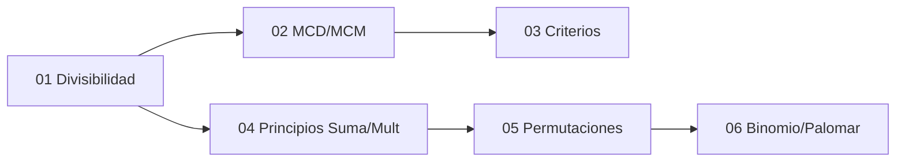

# 🗺️ Unidad 3 — Números y Conteo — Índice

> [!info] ℹ️ Índice manual
> Se actualiza a mano para que funcione igual en Obsidian y en Digital Garden.

## 📑 Notas de la Unidad

- [[01 - Divisibilidad y Números Primos]]
- [[02 - MCD, MCM y Algoritmo de Euclides]]
- [[03 - Criterios de Divisibilidad y Sistemas de Numeración]]
- [[04 - Principios de Multiplicación y Suma]]
- [[05 - Permutaciones y Combinaciones]]
- [[06 - Teorema del Binomio y Principio del Palomar]]
- [[Guía de Problemas 3 - Ejercicios Resueltos]]

## 📊 Mapa de conexiones

> [!quote] 🔗 Conexiones
> - Previo: [[04 - Sucesiones y Cadenas]] (Unidad 2)
> - Siguiente: [[01 - Relaciones de Recurrencia]] (Unidad 4)
> - MOC general: [[Matemáticas Discretas]]

---
**Tags:** #MATG1051 #unidad3 #indice #discretas
