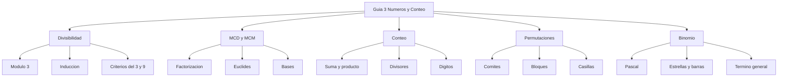

# 📘 Guía de Problemas 3 - Ejercicios Resueltos

> [!info] 📖 Sobre esta guía
>
> Ejercicios resueltos de la **Guía de Problemas 3** — Matemáticas Discretas (MATG1051). Autores de la guía: Cristhian Hernández, Ebner Pineda, Liliana Pérez, Jennifer Avilés.
>
> |Sección|Tema|Ejercicios|
> |---|---|---|
> |3.1|Divisibilidad y números primos|1–6|
> |3.2|MCD, MCM y sistemas de numeración|7–13|
> |3.3|Principios de conteo|14–18|
> |3.4|Permutaciones y combinaciones|19–25|
> |3.5|Teorema del binomio y principio del palomar|26–32|

---

![[Guía de problemas 3.pdf]]

## 📚 3.1 - Divisibilidad y Números Primos

> [!example]- ✏️ Ejercicio 1 - Forma cuadrática módulo 3
>
> **Enunciado:** Sea $f(x, y) = x^2 + xy + y^2$. Demostrar que $3 \mid f(x,y)$ si y solo si $3 \mid (x - y)^2$.
>
> **Paso 1 — Relacionar $f$ con $(x-y)^2$:**
>
> $$(x - y)^2 = x^2 - 2xy + y^2$$
>
> Restamos:
>
> $$f(x,y) - (x-y)^2 = (x^2 + xy + y^2) - (x^2 - 2xy + y^2) = 3xy$$
>
> **Paso 2 — Congruencia módulo 3:**
>
> Como $3xy$ es múltiplo de 3:
>
> $$f(x,y) \equiv (x-y)^2 \pmod{3}$$
>
> **Paso 3 — Doble implicación:**
>
> - $(\Rightarrow)$ Si $3 \mid f(x,y)$, entonces $f(x,y) \equiv 0 \pmod{3}$, luego $(x-y)^2 \equiv 0 \pmod{3}$, es decir $3 \mid (x-y)^2$. ✓
> - $(\Leftarrow)$ Si $3 \mid (x-y)^2$, entonces $(x-y)^2 \equiv 0 \pmod{3}$, luego $f(x,y) \equiv 0 \pmod{3}$, es decir $3 \mid f(x,y)$. ✓
>
> $$\boxed{3 \mid x^2+xy+y^2 \iff 3 \mid (x-y)^2}$$

> [!example]- ✏️ Ejercicio 2 - Potencias de 4 menos 1
>
> **Enunciado:** Demostrar que $\forall n \geq 0$: $3 \mid (2^{2n} - 1)$.
>
> Ver [[01 - Divisibilidad y Números Primos]] para las reglas de divisibilidad usadas aquí.
>
> **Paso 1 — Reescribir:**
>
> $$2^{2n} - 1 = (2^2)^n - 1 = 4^n - 1$$
>
> **Paso 2 — Base:** $n = 0$: $4^0 - 1 = 1 - 1 = 0 = 3 \cdot 0$. ✓
>
> **Paso 3 — Hipótesis inductiva (HI):** Suponer $3 \mid (4^k - 1)$, es decir $4^k - 1 = 3m$ para algún $m \in \mathbb{Z}$.
>
> **Paso 4 — Paso inductivo:**
>
> $$4^{k+1} - 1 = 4 \cdot 4^k - 1 = 4(4^k - 1) + 4 - 1 = 4(4^k - 1) + 3$$
>
> $$= 4 \cdot 3m + 3 = 3(4m + 1)$$
>
> Luego $3 \mid (4^{k+1} - 1)$. $\blacksquare$
>
> $$\boxed{3 \mid (2^{2n}-1) \ \forall n \geq 0}$$

> [!example]- ✏️ Ejercicio 3 - Potencias de 16 menos 1
>
> **Enunciado:** Demostrar que $\forall n \geq 0$: $5 \mid (2^{4n} - 1)$.
>
> **Paso 1 — Reescribir:**
>
> $$2^{4n} - 1 = (2^4)^n - 1 = 16^n - 1$$
>
> **Paso 2 — Base:** $n = 0$: $16^0 - 1 = 0 = 5 \cdot 0$. ✓
>
> **Paso 3 — HI:** Suponer $5 \mid (16^k - 1)$, es decir $16^k - 1 = 5m$.
>
> **Paso 4 — Paso inductivo:**
>
> $$16^{k+1} - 1 = 16 \cdot 16^k - 1 = 16(16^k - 1) + 16 - 1 = 16(16^k - 1) + 15$$
>
> $$= 16 \cdot 5m + 15 = 5(16m + 3)$$
>
> Luego $5 \mid (16^{k+1} - 1)$. $\blacksquare$
>
> $$\boxed{5 \mid (2^{4n}-1) \ \forall n \geq 0}$$

> [!example]- ✏️ Ejercicio 4 - Número 4a97b divisible por 3
>
> **Enunciado:** Sea $N = \overline{4a97b}$ (cifras $a, b$). Hallar todos los pares $(a, b)$ tales que $3 \mid N$ pero $9 \nmid N$.
>
> **Supuesto:** $a, b$ son dígitos $0$–$9$ ($a$ puede ser $0$ por ser cifra intermedia).
>
> **Paso 1 — Criterio del 3 y del 9** (ver [[03 - Criterios de Divisibilidad y Sistemas de Numeración]]):
>
> $$S = 4 + a + 9 + 7 + b = 20 + a + b$$
>
> $3 \mid N \iff 3 \mid S$ y $9 \mid N \iff 9 \mid S$.
>
> **Paso 2 — Rango de $S$:**
>
> Como $0 \leq a + b \leq 18$: $20 \leq S \leq 38$.
>
> Múltiplos de 3 en ese rango: $21, 24, 27, 30, 33, 36$.
>
> Excluimos los múltiplos de 9 ($27$ y $36$):
>
> $$S \in \{21, 24, 30, 33\} \iff a + b \in \{1, 4, 10, 13\}$$
>
> **Paso 3 — Enumerar pares:**
>
> |Suma|Pares $(a, b)$|Cantidad|
> |---|---|---|
> |$a+b=1$|$(0,1), (1,0)$|2|
> |$a+b=4$|$(0,4), (1,3), (2,2), (3,1), (4,0)$|5|
> |$a+b=10$|$(1,9), (2,8), (3,7), (4,6), (5,5), (6,4), (7,3), (8,2), (9,1)$|9|
> |$a+b=13$|$(4,9), (5,8), (6,7), (7,6), (8,5), (9,4)$|6|
>
> Total: $2 + 5 + 9 + 6 = 22$ pares.
>
> $$\boxed{a+b \in \{1,4,10,13\}, \text{ 22 pares en total}}$$

> [!example]- ✏️ Ejercicio 5 - De 2 divide a 4 divide
>
> **Enunciado:** Sea $n$ entero. Demostrar que si $2 \mid (n^2 - 1)$ entonces $4 \mid (n^2 - 1)$.
>
> **Paso 1 — $n$ debe ser impar:**
>
> Si $2 \mid (n^2 - 1)$, entonces $n^2 - 1$ es par, luego $n^2$ es impar, luego $n$ es impar.
>
> **Paso 2 — Escribir $n = 2k+1$:**
>
> $$n^2 - 1 = (2k+1)^2 - 1 = 4k^2 + 4k + 1 - 1 = 4k^2 + 4k = 4k(k+1)$$
>
> Como $k(k+1) \in \mathbb{Z}$, se tiene $4 \mid (n^2 - 1)$. $\blacksquare$
>
> $$\boxed{2 \mid (n^2-1) \Rightarrow 4 \mid (n^2-1)}$$

> [!example]- ✏️ Ejercicio 6 - Divisor común de n y 2n+1
>
> **Enunciado:** Si $d \mid n$ y $d \mid (2n+1)$, demostrar que $d = 1$.
>
> **Supuesto:** $d$ es entero positivo (divisor en $\mathbb{N}$). Si se admiten negativos, la conclusión es $d = \pm 1$.
>
> **Paso 1 — Combinación lineal:**
>
> Si $d \mid n$ entonces $d \mid 2n$. Como además $d \mid (2n+1)$:
>
> $$d \mid \big[(2n+1) - 2n\big] = 1$$
>
> **Paso 2 — Concluir:**
>
> Los únicos divisores positivos de 1 son $d = 1$. $\blacksquare$
>
> $$\boxed{d = 1}$$

---

## 📚 3.2 - MCD, MCM y Sistemas de Numeración

> [!example]- ✏️ Ejercicio 7 - Factorizar M y N, mcd y mcm
>
> **Enunciado:** Sean $M = 3^n + 3^{n+1}$ y $N = 2^n + 2^{n+1}$. Factorizar y hallar el mcm y el mcd para $n = 2$.
>
> Ver [[02 - MCD, MCM y Algoritmo de Euclides]] para las definiciones de mcd y mcm.
>
> **Paso 1 — Factorizar:**
>
> $$M = 3^n(1 + 3) = 4 \cdot 3^n = 2^2 \cdot 3^n$$
>
> $$N = 2^n(1 + 2) = 3 \cdot 2^n$$
>
> **Paso 2 — Evaluar en $n = 2$:**
>
> $$M = 4 \cdot 9 = 36 = 2^2 \cdot 3^2, \qquad N = 3 \cdot 4 = 12 = 2^2 \cdot 3$$
>
> **Paso 3 — mcd y mcm:**
>
> $$\text{mcd}(36,12) = 2^2 \cdot 3 = 12, \qquad \text{mcm}(36,12) = 2^2 \cdot 3^2 = 36$$
>
> $$\boxed{\text{mcd} = 12, \ \text{mcm} = 36}$$

> [!example]- ✏️ Ejercicio 8 - MCM de potencias grandes
>
> **Enunciado:** Sean $M = 3^{2024} + 3^{2025}$ y $N = 2^{2024} + 2^{2025}$. Hallar el mcm.
>
> **Paso 1 — Factorizar:**
>
> $$M = 3^{2024}(1+3) = 4 \cdot 3^{2024} = 2^2 \cdot 3^{2024}$$
>
> $$N = 2^{2024}(1+2) = 3 \cdot 2^{2024}$$
>
> **Paso 2 — mcm (exponentes máximos):**
>
> $$\text{mcm}(M,N) = 2^{\max(2,\,2024)} \cdot 3^{\max(2024,\,1)} = 2^{2024} \cdot 3^{2024} = 6^{2024}$$
>
> (De paso: $\text{mcd}(M,N) = 2^2 \cdot 3 = 12$.)
>
> $$\boxed{\text{mcm}(M,N) = 6^{2024}}$$

> [!example]- ✏️ Ejercicio 9 - Cambio de base 10 a 16
>
> **Enunciado:** Sean $1 \leq a, b \leq 9$ tales que $(ab)_{10} = (ba)_{16}$. Hallar $a$ y $b$.
>
> **Paso 1 — Expandir en cada base:**
>
> $$(ab)_{10} = 10a + b, \qquad (ba)_{16} = 16b + a$$
>
> **Paso 2 — Igualar:**
>
> $$10a + b = 16b + a \iff 9a = 15b \iff 3a = 5b$$
>
> **Paso 3 — Resolver en dígitos:**
>
> Como $\text{mcd}(3,5) = 1$, se tiene $5 \mid a$ y $3 \mid b$. Con $1 \leq a, b \leq 9$:
>
> $$a = 5,\quad b = 3$$
>
> **Verificación:** $(53)_{10} = 53$ y $(35)_{16} = 3 \cdot 16 + 5 = 53$. ✓
>
> $$\boxed{a = 5,\ b = 3}$$

> [!example]- ✏️ Ejercicio 10 - Siempre A veces Nunca
>
> **Enunciado:** Clasificar cada afirmación como Siempre (S), A veces (A) o Nunca (N).
>
> **Supuesto:** S/A/N significa Siempre / A veces / Nunca (verdadero siempre, a veces, o nunca).
>
> **(a) $\text{mcd}(na, nb) = n \cdot \text{mcd}(a, b)$** — ✅ **Siempre.** Es la propiedad de homogeneidad del mcd (para $n \geq 1$ natural): al multiplicar ambos argumentos por $n$, el mcd queda multiplicado por $n$.
>
> **(b) Si $a \mid c$ y $b \mid c$ entonces $ab \mid c$** — ⚠️ **A veces.** Contraejemplo: $a = b = 2$, $c = 2$: $2 \mid 2$ pero $4 \nmid 2$. Es verdadero cuando $\text{mcd}(a,b) = 1$ (coprimos), falso en general.
>
> **(c) $(10abc1)_2 < (10bca1)_2$** — ⚠️ **A veces.** Ambos tienen 6 bits con igual prefijo $10$ y sufijo $1$; la primera diferencia está en el tercer bit ($a$ vs $b$). La desigualdad equivale a $a < b$, lo cual depende de los dígitos.
>
> **(d) $(10abc110)_2 > (10abc)_5$** — ❌ **Nunca.** El lado izquierdo tiene 8 bits luego es $< 256$ (máximo $(10111110)_2 = 190$). El lado derecho tiene 5 cifras en base 5, luego es $\geq 5^4 = 625$. Siempre $\text{izq} < \text{der}$.
>
> $$\boxed{(a)\ S,\ (b)\ A,\ (c)\ A,\ (d)\ N}$$

> [!example]- ✏️ Ejercicio 11 - Suma con mcd 2
>
> **Enunciado:** Si $\text{mcd}(a,4) = \text{mcd}(b,4) = 2$, ¿es $\text{mcd}(a+b, 4) = 4$? Demostrar o refutar.
>
> **Paso 1 — Caracterizar $a$ y $b$:**
>
> $\text{mcd}(a,4) = 2$ significa que $a$ es par pero $4 \nmid a$, es decir:
>
> $$a \equiv 2 \pmod{4}, \qquad b \equiv 2 \pmod{4}$$
>
> **Paso 2 — Sumar:**
>
> $$a + b \equiv 2 + 2 = 4 \equiv 0 \pmod{4}$$
>
> Luego $4 \mid (a+b)$, y por tanto $\text{mcd}(a+b, 4) = 4$. La afirmación es **verdadera**. $\blacksquare$
>
> $$\boxed{\text{Verdadero: } \text{mcd}(a+b,4) = 4}$$

> [!example]- ✏️ Ejercicio 12 - Euclides con 4368 y 3553
>
> **Enunciado:** Aplicar el algoritmo de Euclides para hallar $\text{mcd}(4368, 3553)$ y el mcm.
>
> **Paso 1 — Divisiones sucesivas:**
>
> |Dividendo|Divisor|Cociente|Resto|
> |---|---|---|---|
> |4368|3553|1|815|
> |3553|815|4|293|
> |815|293|2|229|
> |293|229|1|64|
> |229|64|3|37|
> |64|37|1|27|
> |37|27|1|10|
> |27|10|2|7|
> |10|7|1|3|
> |7|3|2|1|
> |3|1|3|0|
>
> El último resto no nulo es 1:
>
> $$\text{mcd}(4368, 3553) = 1$$
>
> **Paso 2 — mcm:**
>
> $$\text{mcm} = \frac{4368 \cdot 3553}{\text{mcd}} = 4368 \cdot 3553 = 15519504$$
>
> Detalle: $4368 \cdot 3553 = 4368 \cdot 3500 + 4368 \cdot 53 = 15288000 + 231504 = 15519504$.
>
> $$\boxed{\text{mcd} = 1, \ \text{mcm} = 15519504}$$

> [!example]- ✏️ Ejercicio 13 - Euclides con 5n+7 y 2n+3
>
> **Enunciado:** Demostrar con el algoritmo de Euclides que $\text{mcd}(5n+7, 2n+3) = 1$ para todo $n$.
>
> **Supuesto:** $n$ es entero no negativo.
>
> **Paso 1 — Primera división:**
>
> $$5n + 7 = 2 \cdot (2n+3) + (n+1)$$
>
> Cociente 2, resto $n+1$.
>
> **Paso 2 — Segunda división:**
>
> $$2n + 3 = 2 \cdot (n+1) + 1$$
>
> Cociente 2, resto 1.
>
> **Paso 3 — Tercera división:**
>
> $$n + 1 = (n+1) \cdot 1 + 0$$
>
> El último resto no nulo es 1, luego el mcd es 1 para todo $n$. $\blacksquare$
>
> $$\boxed{\text{mcd}(5n+7,\,2n+3) = 1 \ \forall n}$$

---

## 📚 3.3 - Principios de Conteo

> [!example]- ✏️ Ejercicio 14 - Número de divisores
>
> **Enunciado:** Si $a = \prod p_i^{\alpha_i}$ es la factorización prima de $a$, demostrar por conteo que el número de divisores positivos es $\prod (\alpha_i + 1)$.
>
> Ver [[01 - Divisibilidad y Números Primos]] (factorización única) y [[04 - Principios de Multiplicación y Suma]] (principio del producto).
>
> **Paso 1 — Forma de un divisor:**
>
> Todo divisor positivo $d$ de $a$ se escribe de forma única como:
>
> $$d = \prod p_i^{\beta_i}, \qquad 0 \leq \beta_i \leq \alpha_i$$
>
> **Paso 2 — Opciones por primo (principio de la suma):**
>
> Para cada $i$, el exponente $\beta_i$ puede elegirse entre $0, 1, \dots, \alpha_i$: hay $\alpha_i + 1$ opciones.
>
> **Paso 3 — Combinar (principio del producto):**
>
> Las elecciones para distintos primos son independientes, luego el total de divisores es el producto:
>
> $$\boxed{\tau(a) = \prod_{i} (\alpha_i + 1)}$$

> [!example]- ✏️ Ejercicio 15 - Impermeables paraguas y sombreros
>
> **Enunciado:** Hay 3 impermeables, 4 paraguas y 2 sombreros. Se debe llevar un impermeable y un paraguas; el sombrero es opcional. ¿Cuántas combinaciones?
>
> **Paso 1 — Aplicar el principio del producto:**
>
> - Impermeable: 3 opciones.
> - Paraguas: 4 opciones.
> - Sombrero: 2 sombreros + no llevar ninguno = 3 opciones.
>
> ```mermaid
> graph TD
>   A[Inicio] --> B[Impermeable 3 opciones]
>   B --> C[Paraguas 4 opciones]
>   C --> D[Sombrero 2 opciones o ninguno]
>   D --> E[Total 3 x 4 x 3]
> ```
>
> $$3 \cdot 4 \cdot 3 = 36$$
>
> $$\boxed{36 \text{ combinaciones}}$$

> [!example]- ✏️ Ejercicio 16 - Cargos entre 6 estudiantes
>
> **Enunciado:** 6 estudiantes se postulan a 3 cargos distintos (presentador, líder y un tercer cargo). Contar asignaciones si: (a) Beatriz o Carlos es presentador; (b) Diana es líder; (c) Esteban ocupa algún cargo.
>
> **Supuesto:** Son 6 estudiantes distintos (Beatriz, Carlos, Diana, Esteban y 2 más) y 3 cargos distintos. Total sin restricciones: $P(6,3) = 6 \cdot 5 \cdot 4 = 120$.
>
> **(a) Beatriz o Carlos presentador:**
>
> Presentador: 2 opciones. Restantes 2 cargos entre los otros 5: $P(5,2) = 20$.
>
> $$2 \cdot 20 = 40$$
>
> **(b) Diana líder:**
>
> Líder fijo (1 opción). Restantes 2 cargos entre los otros 5: $P(5,2) = 20$.
>
> $$1 \cdot 20 = 20$$
>
> **(c) Esteban en algún cargo:**
>
> Por complemento: total menos asignaciones sin Esteban:
>
> $$P(6,3) - P(5,3) = 120 - 60 = 60$$
>
> $$\boxed{(a)\ 40,\ (b)\ 20,\ (c)\ 60}$$

> [!example]- ✏️ Ejercicio 17 - Cargos entre 7 personas
>
> **Enunciado:** 7 personas se postulan a 4 cargos distintos (presidente, tesorero, secretario y un cuarto cargo). Contar si: (a) Carla o Kevin es secretario; (b) Luisa es presidente y Carlos es tesorero; (c) Jaime ocupa algún puesto.
>
> **Supuesto:** 7 personas distintas (las 5 nombradas + 2 más) y 4 cargos distintos. Total: $P(7,4) = 7 \cdot 6 \cdot 5 \cdot 4 = 840$.
>
> **(a) Carla o Kevin secretario:**
>
> $$2 \cdot P(6,3) = 2 \cdot 120 = 240$$
>
> **(b) Luisa presidente y Carlos tesorero:**
>
> Dos cargos fijos; restan 2 cargos entre las otras 5 personas:
>
> $$1 \cdot 1 \cdot P(5,2) = 20$$
>
> **(c) Jaime en algún puesto:**
>
> $$P(7,4) - P(6,4) = 840 - 360 = 480$$
>
> $$\boxed{(a)\ 240,\ (b)\ 20,\ (c)\ 480}$$

> [!example]- ✏️ Ejercicio 18 - Múltiplos de 5 con dígitos distintos
>
> **Enunciado:** Contar los múltiplos de 5 con $99 < n < 1000$ y dígitos distintos.
>
> **Paso 1 — Estructura:** $n$ tiene 3 cifras y termina en $0$ o en $5$.
>
> **Caso A — Termina en 0:** primera cifra $1$–$9$ (9 opciones); cifra central distinta de la primera y de $0$ ($10 - 2 = 8$ opciones):
>
> $$9 \cdot 8 = 72$$
>
> **Caso B — Termina en 5:** primera cifra $1$–$9$ excepto $5$ (8 opciones); cifra central distinta de la primera y de $5$ (8 opciones):
>
> $$8 \cdot 8 = 64$$
>
> **Paso 2 — Sumar (principio de la suma):**
>
> $$72 + 64 = 136$$
>
> $$\boxed{136 \text{ números}}$$

---

## 📚 3.4 - Permutaciones y Combinaciones

> [!example]- ✏️ Ejercicio 19 - Comité de 3 de 6 personas
>
> **Enunciado:** De 3 mujeres y 3 hombres, formar un comité de 3: (a) exactamente 2 mujeres; (b) al menos 1 hombre.
>
> Ver [[05 - Permutaciones y Combinaciones]] para combinaciones $C(n,k)$.
>
> **(a) Exactamente 2 mujeres:**
>
> $$C(3,2) \cdot C(3,1) = 3 \cdot 3 = 9$$
>
> **(b) Al menos 1 hombre (complemento: ningún hombre):**
>
> $$C(6,3) - C(3,3) = 20 - 1 = 19$$
>
> $$\boxed{(a)\ 9,\ (b)\ 19}$$

> [!example]- ✏️ Ejercicio 20 - Equipo de 5 de 14 personas
>
> **Enunciado:** De 8 mujeres y 6 hombres, formar un equipo de 5: (a) exactamente 3 mujeres; (b) al menos 2 hombres.
>
> **(a) Exactamente 3 mujeres (y 2 hombres):**
>
> $$C(8,3) \cdot C(6,2) = 56 \cdot 15 = 840$$
>
> **(b) Al menos 2 hombres (complemento: 0 o 1 hombre):**
>
> $$C(14,5) - C(8,5) - C(8,4) \cdot C(6,1) = 2002 - 56 - 70 \cdot 6$$
>
> $$= 2002 - 56 - 420 = 1526$$
>
> $$\boxed{(a)\ 840,\ (b)\ 1526}$$

> [!example]- ✏️ Ejercicio 21 - Ordenar 20 libros de idiomas
>
> **Enunciado:** 5 libros de alemán, 7 de español y 8 de francés, todos distintos. Hallar: (a) arreglos totales; (b) elegir 2 libros de distinto idioma; (c) agrupados por idioma; (d) francés juntos; (e) ningún francés junto a otro.
>
> **(a) Todos los arreglos:**
>
> $$\boxed{20!}$$
>
> **(b) 2 libros de distinto idioma (selección no ordenada):**
>
> |Par de idiomas|Formas|
> |---|---|
> |Alemán–Español|$5 \cdot 7 = 35$|
> |Alemán–Francés|$5 \cdot 8 = 40$|
> |Español–Francés|$7 \cdot 8 = 56$|
>
> $$35 + 40 + 56 = 131$$
>
> (Si el orden importa: $2 \cdot 131 = 262$.)
>
> **(c) Agrupados por idioma (bloques + orden interno):**
>
> $$3! \cdot 5! \cdot 7! \cdot 8!$$
>
> **(d) Los 8 de francés juntos (bloque francés + 12 sueltos = 13 objetos):**
>
> $$13! \cdot 8!$$
>
> **(e) Ningún francés junto a otro (método de las casillas):**
>
> Ordenar los 12 no franceses ($12!$), elegir 8 de las 13 casillas intermedias ($C(13,8)$) y ordenar los franceses ($8!$):
>
> $$12! \cdot C(13,8) \cdot 8!$$
>
> $$\boxed{(a)\ 20!,\ (b)\ 131,\ (c)\ 3!5!7!8!,\ (d)\ 13!8!,\ (e)\ 12!\binom{13}{8}8!}$$

> [!example]- ✏️ Ejercicio 22 - Ordenar 18 oradores
>
> **Enunciado:** 11 mujeres y 7 hombres oradores. Hallar: (a) ordenar a todos; (b) agrupados solo por género; (c) elegir 7 con exactamente 4 mujeres; (d) ordenar por cantidad de género; (e) sin 2 hombres consecutivos.
>
> **(a) Todos los órdenes:**
>
> $$18!$$
>
> **(b) Bloques por género:**
>
> $$2! \cdot 11! \cdot 7!$$
>
> **(c) Grupo de 7 con exactamente 4 mujeres (y 3 hombres):**
>
> $$C(11,4) \cdot C(7,3) = 330 \cdot 35 = 11550$$
>
> **(d) Por cantidad de género (supuesto: bloques con el grupo mayoritario primero, mujeres–hombres):**
>
> $$11! \cdot 7!$$
>
> **(e) Sin 2 hombres consecutivos (casillas):**
>
> Ordenar las 11 mujeres ($11!$), elegir 7 de las 12 casillas ($C(12,7)$) y ordenar los hombres ($7!$):
>
> $$11! \cdot C(12,7) \cdot 7!$$
>
> $$\boxed{(a)\ 18!,\ (b)\ 2!11!7!,\ (c)\ 11550,\ (d)\ 11!7!,\ (e)\ 11!\binom{12}{7}7!}$$

> [!example]- ✏️ Ejercicio 23 - Comité de 4 de 18 estudiantes
>
> **Enunciado:** De 7 de logística, 6 de estadística y 5 de computación, formar un comité de 4: (a) solo est/comp; (b) al menos 1 de cada carrera; (c) a lo más 3 de logística; (d) probar que hay al menos 2 de la misma carrera.
>
> **(a) Solo estadística o computación ($6 + 5 = 11$):**
>
> $$C(11,4) = 330$$
>
> **(b) Al menos 1 de cada (distribuciones $2$-$1$-$1$):**
>
> |Distribución (L–E–C)|Formas|
> |---|---|
> |$(2,1,1)$|$C(7,2)\cdot 6 \cdot 5 = 630$|
> |$(1,2,1)$|$7 \cdot C(6,2)\cdot 5 = 525$|
> |$(1,1,2)$|$7 \cdot 6 \cdot C(5,2) = 420$|
>
> $$630 + 525 + 420 = 1575$$
>
> **(c) A lo más 3 de logística (complemento: los 4 de logística):**
>
> $$C(18,4) - C(7,4) = 3060 - 35 = 3025$$
>
> **(d) Principio del palomar** (ver [[06 - Teorema del Binomio y Principio del Palomar]]):
>
> Con 4 personas y 3 carreras, alguna carrera contiene al menos $\lceil 4/3 \rceil = 2$ miembros. $\blacksquare$
>
> $$\boxed{(a)\ 330,\ (b)\ 1575,\ (c)\ 3025,\ (d)\ \lceil 4/3 \rceil = 2}$$

> [!example]- ✏️ Ejercicio 24 - Tres consecutivos en círculo
>
> **Enunciado:** 12 jugadores en círculo. Probar que hay 3 consecutivos cuya suma es al menos 20.
>
> **Supuesto:** Los jugadores llevan dorsales $1$–$12$ (uno cada uno) y se suma el dorsal.
>
> ```mermaid
> graph TD
>   A[Suponer toda terna consecutiva suma 19 o menos] --> B[Sumar las 12 ternas]
>   B --> C[Cada jugador aparece en 3 ternas]
>   C --> D[Total 3 x 78 igual 234]
>   D --> E[Pero 12 x 19 igual 228]
>   E --> F[Contradiccion 234 mayor que 228]
> ```
>
> **Paso 1 — Supuesto de contradicción:** cada terna de consecutivos suma $\leq 19$.
>
> **Paso 2 — Doble conteo:** hay 12 ternas (una por jugador inicial). Cada jugador pertenece a exactamente 3 ternas. Sumando las 12 ternas:
>
> $$\text{Suma total} = 3 \cdot (1 + 2 + \cdots + 12) = 3 \cdot 78 = 234$$
>
> **Paso 3 — Contradicción:** por el supuesto, la suma total sería $\leq 12 \cdot 19 = 228$. Pero $234 > 228$. Contradicción.
>
> Luego alguna terna suma $\geq 20$ (de hecho $\geq \lceil 234/12 \rceil = 20$). $\blacksquare$
>
> $$\boxed{\text{Existe una terna consecutiva con suma } \geq 20}$$

> [!example]- ✏️ Ejercicio 25 - Diferencia múltiplo de 10
>
> **Enunciado:** Dados 11 enteros, probar que hay 2 cuya diferencia es múltiplo de 10.
>
> **Paso 1 — Casillas:** los restos módulo 10 son $0, 1, \dots, 9$: hay 10 casillas.
>
> **Paso 2 — Palomar:** con 11 enteros y 10 restos, dos enteros $a, b$ comparten resto: $a \equiv b \pmod{10}$.
>
> **Paso 3 — Diferencia:** $a - b \equiv 0 \pmod{10}$, es decir $10 \mid (a - b)$. $\blacksquare$
>
> $$\boxed{\text{Existen } a \neq b \text{ con } 10 \mid (a-b)}$$

---

## 📚 3.5 - Teorema del Binomio y Principio del Palomar

> [!example]- ✏️ Ejercicio 26 - Identidad de Pascal
>
> **Enunciado:** Demostrar que $C(n,k) = C(n-1,k) + C(n-1,k-1)$.
>
> Ver [[06 - Teorema del Binomio y Principio del Palomar]] para el teorema del binomio.
>
> **Paso 1 — Expandir el lado derecho:**
>
> $$C(n-1,k) + C(n-1,k-1) = \frac{(n-1)!}{k!(n-1-k)!} + \frac{(n-1)!}{(k-1)!(n-k)!}$$
>
> **Paso 2 — Común denominador $k!(n-k)!$:**
>
> Multiplicamos la primera fracción por $\frac{n-k}{\,n-k\,}$ y la segunda por $\frac{k}{k}$:
>
> $$= \frac{(n-1)!(n-k) + (n-1)!k}{k!(n-k)!} = \frac{(n-1)!\big[(n-k) + k\big]}{k!(n-k)!}$$
>
> $$= \frac{(n-1)! \cdot n}{k!(n-k)!} = \frac{n!}{k!(n-k)!} = C(n,k) \quad \blacksquare$$
>
> $$\boxed{\binom{n}{k} = \binom{n-1}{k} + \binom{n-1}{k-1}}$$

> [!example]- ✏️ Ejercicio 27 - Suma con cuadrados de binomiales
>
> **Enunciado:** (Según el PDF) $\sum_r C(n,r)^2 \cdot 2^{2n-2r} = 5^n$.
>
> **Paso 1 — Verificar con $n = 2$ (contraejemplo):**
>
> $$\sum_{r=0}^{2} C(2,r)^2 \cdot 2^{4-2r} = 1 \cdot 16 + 4 \cdot 4 + 1 \cdot 1 = 16 + 16 + 1 = 33 \neq 25 = 5^2$$
>
> La identidad **tal como está escrita es falsa** ($33 \neq 25$).
>
> **Paso 2 — Versión corregida (sin cuadrados):**
>
> Lo que sí es igual a $5^n$ por el teorema del binomio es:
>
> $$\sum_{r=0}^{n} C(n,r) \cdot (2^2)^r \cdot 1^{n-r} = (4 + 1)^n = 5^n$$
>
> Es decir, quitando los cuadrados y ajustando el exponente, la identidad se sigue directamente de $(x+y)^n = \sum C(n,r)\,x^r y^{n-r}$ con $x = 4$, $y = 1$. $\blacksquare$
>
> $$\boxed{\text{La fórmula con cuadrados es falsa } (n=2 \text{ da } 33 \neq 25); \ \sum_{r}\binom{n}{r}4^r = 5^n}$$

> [!example]- ✏️ Ejercicio 28 - Jugos con repetición
>
> **Enunciado:** Hay 4 sabores y se preparan 3 jugos, permitiendo repetir sabores. ¿Cuántas selecciones?
>
> **Paso 1 — Combinación con repetición:**
>
> $$CR(4,3) = C(4 + 3 - 1,\, 3) = C(6,3) = \frac{6 \cdot 5 \cdot 4}{6} = 20$$
>
> $$\boxed{20 \text{ selecciones}}$$

> [!example]- ✏️ Ejercicio 29 - Elegir 12 pilas con condiciones
>
> **Enunciado:** Hay al menos 12 pilas de cada tipo (roja, azul, verde, morada). Elegir 12 con exactamente 2 azules y al menos 1 morada. ¿De cuántas formas?
>
> **Paso 1 — Fijar las azules:** 2 azules exactas. Restan $12 - 2 = 10$ puestos entre roja, verde y morada, con morada $\geq 1$.
>
> **Paso 2 — Complemento (morada $= 0$):**
>
> Total sin restricción en morada menos casos sin morada (estrellas y barras):
>
> $$C(10+3-1,\,2) - C(10+2-1,\,1) = C(12,2) - C(11,1) = 66 - 11 = 55$$
>
> $$\boxed{55 \text{ formas}}$$

> [!example]- ✏️ Ejercicio 30 - Ecuación x1+x2+x3=n
>
> **Enunciado:** Demostrar que $x_1 + x_2 + x_3 = n$, con $x_i \geq 1$ enteros y $n \geq 3$, tiene $\frac{(n-1)(n-2)}{2}$ soluciones.
>
> **Paso 1 — Sustitución:** sea $y_i = x_i - 1 \geq 0$. Entonces:
>
> $$y_1 + y_2 + y_3 = n - 3$$
>
> **Paso 2 — Estrellas y barras:**
>
> El número de soluciones no negativas es:
>
> $$C\big((n-3) + 3 - 1,\, 3 - 1\big) = C(n-1,\, 2) = \frac{(n-1)(n-2)}{2} \quad \blacksquare$$
>
> $$\boxed{\frac{(n-1)(n-2)}{2} \text{ soluciones}}$$

> [!example]- ✏️ Ejercicio 31 - Suma de dígitos 20 hasta un millón
>
> **Enunciado:** Contar los enteros entre 1 y 1000000 cuya suma de dígitos es 20.
>
> **Paso 1 — Reducir a 6 dígitos:** el 1000000 suma 1 (excluido) y el 0 suma 0 (excluido). Contamos $d_1 + \cdots + d_6 = 20$ con $0 \leq d_i \leq 9$.
>
> **Paso 2 — Sin cota superior (estrellas y barras):**
>
> $$C(20 + 6 - 1,\, 5) = C(25,5) = 53130$$
>
> **Paso 3 — Inclusión–exclusión (restar $d_i \geq 10$):**
>
> - Un dígito $\geq 10$: $6 \cdot C(15,5) = 6 \cdot 3003 = 18018$.
> - Dos dígitos $\geq 10$: $C(6,2) \cdot C(5,5) = 15 \cdot 1 = 15$.
> - Tres o más: imposible ($30 > 20$).
>
> $$53130 - 18018 + 15 = 35127$$
>
> $$\boxed{35127 \text{ números}}$$

> [!example]- ✏️ Ejercicio 32 - Término independiente del binomio
>
> **Enunciado:** Hallar el término independiente de $\left(\frac{x}{2} + \frac{1}{x}\right)^9$.
>
> **Paso 1 — Término general:**
>
> $$T_k = C(9,k)\left(\frac{x}{2}\right)^k \left(\frac{1}{x}\right)^{9-k} = C(9,k)\, 2^{-k}\, x^{2k-9}$$
>
> **Paso 2 — Anular el exponente:**
>
> $$2k - 9 = 0 \iff k = 4.5 \notin \mathbb{Z}$$
>
> Como $k$ debe ser entero entre $0$ y $9$, ningún término es independiente de $x$.
>
> $$\boxed{0 \text{ (no existe término independiente)}}$$

---

> [!summary] 📋 Resumen
>
> Técnicas clave de la guía:
>
> - **Divisibilidad:** congruencias módulo $m$, inducción en $a^n - 1$, criterios del 3 y del 9 con suma de dígitos.
> - **MCD y MCM:** factorización prima, algoritmo de Euclides (tablas de cocientes y restos), $\text{mcm} = ab/\text{mcd}$, cambios de base $10 \leftrightarrow 16$.
> - **Conteo:** principios de suma y producto, fórmula de divisores $\prod(\alpha_i+1)$, permutaciones $P(n,k)$, combinaciones $C(n,k)$ y con repetición $CR(n,k)$.
> - **Bloques y casillas:** agrupar objetos juntos como un bloque, método de las casillas para objetos separados, complemento para "al menos".
> - **Binomio y palomar:** identidad de Pascal, término general del binomio, estrellas y barras, inclusión–exclusión, principio del palomar con doble conteo.

## ✅ Metas de Aprendizaje

> [!note] 🎯 Nivel Básico
>
> - [ ] Aplicar criterios de divisibilidad (3, 9) y congruencias simples (Ej. 1–6).
> - [ ] Factorizar $a^n \pm b^n$ y calcular mcd/mcm pequeños (Ej. 7–9).
> - [ ] Usar principios de suma y producto en conteos directos (Ej. 14–16).

> [!note] 🎯 Nivel Intermedio
>
> - [ ] Ejecutar el algoritmo de Euclides completo y obtener el mcm (Ej. 12–13).
> - [ ] Contar comités y equipos con restricciones "exactamente / al menos" (Ej. 19–20, 23).
> - [ ] Aplicar bloques y casillas en ordenamientos con restricciones (Ej. 21–22).

> [!note] 🎯 Nivel Avanzado
>
> - [ ] Combinar estrellas y barras con inclusión–exclusión (Ej. 29, 31).
> - [ ] Detectar y refutar identidades falsas con contraejemplos (Ej. 27).
> - [ ] Redactar pruebas por palomar con doble conteo (Ej. 24–25).

## 📊 Resumen Visual



> [!quote] 🔗 Conexiones
>
> - [[01 - Divisibilidad y Números Primos]] — base de 3.1 (Ej. 1–6) y 3.2.
> - [[02 - MCD, MCM y Algoritmo de Euclides]] — base de 3.2 (Ej. 7–8, 11–13).
> - [[03 - Criterios de Divisibilidad y Sistemas de Numeración]] — Ej. 4, 9–10.
> - [[04 - Principios de Multiplicación y Suma]] — base de 3.3 (Ej. 14–18).
> - [[05 - Permutaciones y Combinaciones]] — base de 3.4 (Ej. 19–23).
> - [[06 - Teorema del Binomio y Principio del Palomar]] — base de 3.5 (Ej. 24–27, 30–32).
> - [[Universidad/3er Semestre/Matemáticas Discretas/Unidad 3 - Números y Conteo/00 - Índice Unidad 3]] — volver al índice de la unidad.

**Tags:** #discretas #unidad3 #guia-problemas
