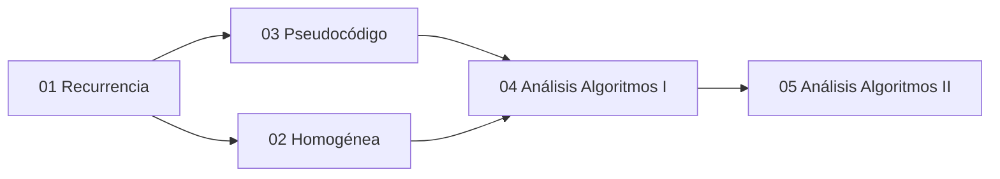

# 🗺️ Unidad 4 — Recurrencia y Algoritmos — Índice

> [!info] ℹ️ Índice manual
> Se actualiza a mano para que funcione igual en Obsidian y en Digital Garden.

## 📑 Notas de la Unidad

- [[01 - Relaciones de Recurrencia]]
- [[02 - Recurrencia Homogénea]]
- [[03 - Pseudocódigo y Algoritmos]]
- [[04 - Análisis de Algoritmos I - Fundamentos y Funciones Matemáticas]]
- [[05 - Análisis de Algoritmos II - Pseudocódigo y Tiempo Real]]
- [[Guía de Problemas 4 - Ejercicios Resueltos]]

## 📊 Mapa de conexiones

> [!quote] 🔗 Conexiones
> - Previo: [[06 - Teorema del Binomio y Principio del Palomar]] (Unidad 3)
> - Siguiente: [[01 - Grafos I - Conceptos Básicos y Recorridos]] (Unidad 5)
> - MOC general: [[Matemáticas Discretas]]

---
**Tags:** #MATG1051 #unidad4 #indice #discretas
