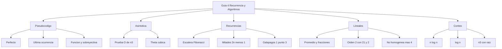

# 📘 Guía de Problemas 4 - Ejercicios Resueltos

> [!info] 📖 Sobre esta guía
>
> Ejercicios resueltos de la **Guía de Problemas 4** — Matemáticas Discretas (MATG1051). Autores de la guía: Cristhian Hernández, Ebner Pineda, Liliana Pérez, Jennifer Avilés.
>
> |Sección|Tema|Ejercicios|
> |---|---|---|
> |4.1|Pseudocódigo y algoritmos básicos|1–3|
> |4.2|Notación asintótica: $O$ y $\Theta$|4–6|
> |4.3|Modelado con recurrencias y método iterativo|7–9|
> |4.4|Recurrencias lineales homogéneas y no homogéneas|10–14|
> |4.5|Conteo de operaciones y $\Theta$ en pseudocódigo|15–17|

---

![[GUÍA DE PROBLEMAS 4.pdf]]

## 📚 4.1 — Pseudocódigo y Algoritmos Básicos

> [!example]- ✏️ Ejercicio 1 - Número perfecto
>
> **Enunciado:** Escriba un pseudocódigo que, dado un entero $n > 1$, determine si $n$ es perfecto (igual a la suma de sus divisores propios) y devuelva Verdadero o Falso.
>
> **Paso 1 — Idea:** Un divisor propio de $n$ es un $d$ con $1 \le d < n$ y $n \bmod d = 0$. Se acumula la suma y al final se compara con $n$.
>
> **Paso 2 — Pseudocódigo:**
>
> ```text
> Algoritmo EsPerfecto(n):
> Entrada: entero n mayor que 1
> suma = 0
> para i desde 1 hasta n - 1 hacer
>   si n mod i = 0 entonces
>     suma = suma + i
>   fin si
> fin para
> si suma = n entonces
>   devolver Verdadero
> si no
>   devolver Falso
> fin si
> Fin Algoritmo
> ```
>
> **Paso 3 — Verificación con tabla:**
>
> |$n$|Divisores propios|Suma|¿Perfecto?|
> |---|---|---|---|
> |$6$|$1, 2, 3$|$6$|Verdadero|
> |$12$|$1, 2, 3, 4, 6$|$16$|Falso|
> |$28$|$1, 2, 4, 7, 14$|$28$|Verdadero|
>
> $$\boxed{\text{Devolver } (suma = n) \text{ tras acumular los divisores propios}}$$

> [!example]- ✏️ Ejercicio 2 - Última ocurrencia de una clave
>
> **Enunciado:** Escriba un pseudocódigo que, dada una secuencia $s_1, s_2, \dots, s_n$ y una clave, devuelva el índice de la última ocurrencia de la clave, o $0$ si no aparece.
>
> **Paso 1 — Idea:** Recorrer toda la secuencia guardando la posición cada vez que hay coincidencia. Al final queda la última. Alternativa equivalente: recorrer desde atrás y detenerse en la primera coincidencia.
>
> **Paso 2 — Pseudocódigo (recorrido directo):**
>
> ```text
> Algoritmo UltimaOcurrencia(s, n, clave):
> Entrada: secuencia s de longitud n, valor clave
> ultimo = 0
> para i desde 1 hasta n hacer
>   si s_i = clave entonces
>     ultimo = i
>   fin si
> fin para
> devolver ultimo
> Fin Algoritmo
> ```
>
> **Paso 3 — Variante con salida temprana:**
>
> ```text
> Algoritmo UltimaOcurrenciaAtras(s, n, clave):
> Entrada: secuencia s de longitud n, valor clave
> para i desde n hasta 1 hacer
>   si s_i = clave entonces
>     devolver i
>   fin si
> fin para
> devolver 0
> Fin Algoritmo
> ```
>
> **Paso 4 — Traza:**
>
> |$i$|$s_i$|clave = $b$|ultimo|
> |---|---|---|---|
> |$1$|$a$|$a \ne b$|$0$|
> |$2$|$b$|$b = b$|$2$|
> |$3$|$a$|$a \ne b$|$2$|
> |$4$|$b$|$b = b$|$4$|
>
> $$\boxed{\text{Devolver } ultimo\text{, que es } 0 \text{ si la clave está ausente}}$$

> [!example]- ✏️ Ejercicio 3 - Matriz de relación: función y sobreyectividad
>
> **Enunciado:** Sea $X = \{x_1, \dots, x_n\}$ y sea $A$ la matriz $n \times n$ de una relación $R$ en $X$, con $A[i][j] = 1$ si $(x_i, x_j) \in R$ y $0$ en otro caso. Escriba un pseudocódigo que decida si $R$ es función y si es sobreyectiva. Determine el $\Theta$ del número de comparaciones en el peor caso.
>
> **Paso 1 — Criterios:** $R$ es función si cada fila tiene exactamente un $1$: cada $x_i$ tiene exactamente una imagen. $R$ es sobreyectiva si cada columna tiene al menos un $1$: cada $y$ es imagen de algún $x$.
>
> **Paso 2 — Pseudocódigo:**
>
> ```text
> Algoritmo FuncionYSobreyectiva(A, n):
> Entrada: matriz A de n por n con valores 0 o 1
> esFuncion = Verdadero
> para i desde 1 hasta n hacer
>   conteo = 0
>   para j desde 1 hasta n hacer
>     si A[i][j] = 1 entonces
>       conteo = conteo + 1
>     fin si
>   fin para
>   si conteo diferente de 1 entonces
>     esFuncion = Falso
>   fin si
> fin para
> esSobreyectiva = Verdadero
> para j desde 1 hasta n hacer
>   encontrada = Falso
>   para i desde 1 hasta n hacer
>     si A[i][j] = 1 entonces
>       encontrada = Verdadero
>     fin si
>   fin para
>   si encontrada = Falso entonces
>     esSobreyectiva = Falso
>   fin si
> fin para
> devolver esFuncion, esSobreyectiva
> Fin Algoritmo
> ```
>
> **Paso 3 — Análisis de comparaciones:** Cada fase recorre la matriz completa una vez: $n^2$ comparaciones $A[i][j] = 1$ en la fase de función y $n^2$ en la fase de sobreyectividad. Total $2n^2$ comparaciones en el peor caso.
>
> |Fase|Comparaciones|Orden|
> |---|---|---|
> |Filas: exactamente un 1|$n^2$|$\Theta(n^2)$|
> |Columnas: al menos un 1|$n^2$|$\Theta(n^2)$|
> |Total peor caso|$2n^2$|$\Theta(n^2)$|
>
> $$\boxed{\Theta(n^2) \text{ comparaciones en el peor caso}}$$

---

## 📚 4.2 — Notación Asintótica

> [!example]- ✏️ Ejercicio 4 - Prueba de $O(n^3)$
>
> **Enunciado:** Demostrar que $f(n) = 3n^3 + 5n \log(n) + 20$ es $O(n^3)$.
>
> **Paso 1 — Definición:** $f(n) = O(g(n))$ si existen $C > 0$ y $k_0 \ge 1$ tales que $f(n) \le C\, g(n)$ para todo $n \ge k_0$.
>
> **Paso 2 — Acotar cada término por un múltiplo de $n^3$ para $n \ge 1$:** Suponiendo $\log$ en base $2$ y $n \ge 1$, se tiene $\log(n) \le n$, luego $5n\log(n) \le 5n^2 \le 5n^3$. Además $20 \le 20n^3$.
>
> $$f(n) = 3n^3 + 5n\log(n) + 20 \le 3n^3 + 5n^3 + 20n^3 = 28n^3$$
>
> **Paso 3 — Constantes testigo:**
>
> |Testigo|Valor|
> |---|---|
> |$C$|$28$|
> |$k_0$|$1$|
>
> $$\boxed{f(n) \le 28n^3 \ \forall n \ge 1 \implies f(n) = O(n^3)}$$

> [!example]- ✏️ Ejercicio 5 - Theta de $2n^3 - n^2 - 4n$
>
> **Enunciado:** Determinar el $\Theta$ de $f(n) = 2n^3 - n^2 - 4n$.
>
> **Paso 1 — Cota superior:** Para $n \ge 1$, los términos restados son no negativos, luego:
>
> $$f(n) = 2n^3 - n^2 - 4n \le 2n^3$$
>
> Así $c_2 = 2$.
>
> **Paso 2 — Cota inferior:** Se busca $c_1 > 0$ con $f(n) \ge c_1 n^3$. Con $c_1 = 1$:
>
> $$2n^3 - n^2 - 4n \ge n^3 \iff n^3 \ge n^2 + 4n \iff n^2 \ge n + 4$$
>
> lo cual es cierto para $n \ge 3$ (pues $9 \ge 7$ y el lado izquierdo crece más rápido).
>
> **Paso 3 — Testigos:**
>
> |Cota|Constante|$k_0$|
> |---|---|---|
> |Superior $f(n) \le 2n^3$|$c_2 = 2$|$1$|
> |Inferior $f(n) \ge 1 \cdot n^3$|$c_1 = 1$|$3$|
>
> $$\boxed{f(n) = \Theta(n^3)}$$

> [!example]- ✏️ Ejercicio 6 - Theta de $(5/7)n^3 - 9n^2 - 24n - 83/4$
>
> **Enunciado:** Determinar el $\Theta$ de $f(n) = \frac{5}{7}n^3 - 9n^2 - 24n - \frac{83}{4}$.
>
> **Paso 1 — Cota superior:** Para $n \ge 1$:
>
> $$f(n) \le \frac{5}{7}n^3$$
>
> así $c_2 = 5/7$.
>
> **Paso 2 — Cota inferior:** Se propone $c_1 = 1/2$. Entonces:
>
> $$f(n) \ge \frac{1}{2}n^3 \iff \left(\frac{5}{7} - \frac{1}{2}\right)n^3 \ge 9n^2 + 24n + \frac{83}{4} \iff \frac{3}{14}n^3 - 9n^2 - 24n - \frac{83}{4} \ge 0$$
>
> Para $n = 50$: $\frac{3}{14}(125000) - 9(2500) - 1200 - 20{,}75 = 26785{,}7 - 23720{,}75 > 0$, y la diferencia crece para $n$ mayor (el término cúbico domina), luego vale para todo $n \ge 50$.
>
> **Paso 3 — Testigos:**
>
> |Cota|Constante|$k_0$|
> |---|---|---|
> |Superior|$c_2 = 5/7$|$1$|
> |Inferior|$c_1 = 1/2$|$50$|
>
> $$\boxed{f(n) = \Theta(n^3)}$$

---

## 📚 4.3 — Modelado con Recurrencias

> [!example]- ✏️ Ejercicio 7 - Escalera con pasos de 1 o 2
>
> **Enunciado:** Una escalera tiene $n$ escalones. En cada paso se puede subir $1$ o $2$ escalones. ¿De cuántas formas se puede subir?
>
> **Paso 1 — Recurrencia:** Sea $a_n$ el número de formas. El primer paso deja $n-1$ o $n-2$ escalones restantes, luego:
>
> $$a_n = a_{n-1} + a_{n-2}, \qquad a_1 = 1,\ a_2 = 2$$
>
> |$n$|$1$|$2$|$3$|$4$|$5$|$6$|
> |---|---|---|---|---|---|---|
> |$a_n$|$1$|$2$|$3$|$5$|$8$|$13$|
>
> **Paso 2 — Conexión con Fibonacci:** Con $F_1 = 1$, $F_2 = 1$, $F_{k} = F_{k-1} + F_{k-2}$, se tiene $a_n = F_{n+1}$.
>
> ```mermaid
> graph TD
>   A[Formas de subir n] --> B[Primer paso 1]
>   A --> C[Primer paso 2]
>   B --> D[Restan n menos 1]
>   C --> E[Restan n menos 2]
> ```
>
> **Paso 3 — Fórmula explícita (Binet):** La ecuación característica $t^2 - t - 1 = 0$ tiene raíces $\phi = \frac{1+\sqrt{5}}{2}$ y $\psi = \frac{1-\sqrt{5}}{2}$. Con $a_1 = 1$, $a_2 = 2$:
>
> $$a_n = \frac{1}{\sqrt{5}}\left(\phi^{n+1} - \psi^{n+1}\right)$$
>
> $$\boxed{a_n = a_{n-1} + a_{n-2},\ a_1 = 1,\ a_2 = 2,\ \text{ es decir } a_n = F_{n+1}}$$

> [!example]- ✏️ Ejercicio 8 - Recurrencia de mitades
>
> **Enunciado:** Sea $x_n = x_{\lfloor n/2 \rfloor} + x_{\lfloor (n+1)/2 \rfloor} + 1$ con $x_1 = 1$. Hallar una fórmula explícita y probarla.
>
> **Paso 1 — Calcular términos para conjeturar:**
>
> |$n$|$1$|$2$|$3$|$4$|$5$|
> |---|---|---|---|---|---|
> |$x_n$|$1$|$3$|$5$|$7$|$9$|
>
> Conjetura: $x_n = 2n - 1$.
>
> **Paso 2 — Lema útil:** $\lfloor n/2 \rfloor + \lfloor (n+1)/2 \rfloor = n$ para todo $n \ge 1$. En efecto, si $n = 2m$ ambos pisos suman $m + m = 2m$; si $n = 2m+1$ suman $m + (m+1) = 2m+1$.
>
> **Paso 3 — Prueba por inducción fuerte:** Base $n = 1$: $2(1) - 1 = 1 = x_1$. Hipótesis: $x_k = 2k - 1$ para todo $k < n$. Entonces:
>
> $$x_n = \left(2\left\lfloor \frac{n}{2} \right\rfloor - 1\right) + \left(2\left\lfloor \frac{n+1}{2} \right\rfloor - 1\right) + 1 = 2\left(\left\lfloor \frac{n}{2} \right\rfloor + \left\lfloor \frac{n+1}{2} \right\rfloor\right) - 1 = 2n - 1$$
>
> $$\boxed{x_n = 2n - 1 \ \forall n \ge 1}$$

> [!example]- ✏️ Ejercicio 9 - Chivos en Galápagos
>
> **Enunciado:** Hay $40$ chivos en el tiempo $n = 0$. En el tiempo $n \ge 1$ se agregan $80n$ chivos nuevos y además la población previa crece un $30\%$ anual. Plantear la recurrencia y resolverla usando la fórmula dada para la suma.
>
> **Paso 1 — Recurrencia:** Sea $a_n$ la población en el año $n$:
>
> $$a_n = 1{,}3\, a_{n-1} + 80n, \qquad a_0 = 40$$
>
> con $r = 1{,}3 = 13/10$.
>
> **Paso 2 — Desenrollado iterativo:** Iterando se obtiene:
>
> $$a_n = r^n a_0 + 80\sum_{k=1}^{n} k\, r^{n-k}$$
>
> La suma pedida en la guía es del tipo $\sum k r^{n-k}$, que se evalúa con la fórmula geométrica derivada dada.
>
> **Paso 3 — Solución particular lineal:** Se busca $p_n = \alpha n + \beta$. Sustituyendo $\alpha n + \beta = r(\alpha(n-1) + \beta) + 80n$ e igualando coeficientes de $n$ y constantes:
>
> $$\alpha = r\alpha + 80 \implies \alpha = \frac{80}{1-r} = -\frac{800}{3}, \qquad \beta = -r\alpha + r\beta \implies \beta = \frac{-r\alpha}{1-r} = -\frac{10400}{9}$$
>
> Luego $a_n = C r^n - \frac{800}{3}n - \frac{10400}{9}$. Con $a_0 = 40$:
>
> $$C = 40 + \frac{10400}{9} = \frac{10760}{9}$$
>
> **Paso 4 — Verificación:** Para $n = 1$: $\frac{10760}{9}(1{,}3) - \frac{800}{3} - \frac{10400}{9} = 132 = 1{,}3(40) + 80$. ✓
>
> $$\boxed{a_n = \frac{10760}{9}(1{,}3)^n - \frac{800}{3}n - \frac{10400}{9},\ a_0 = 40}$$

---

## 📚 4.4 — Recurrencias Lineales

> [!example]- ✏️ Ejercicio 10 - Promedio de los dos anteriores
>
> **Enunciado:** Resolver $S_1 = 0$, $S_2 = 1$, $S_n = \frac{S_{n-1} + S_{n-2}}{2}$ para $n \ge 3$.
>
> **Paso 1 — Ecuación característica:** Multiplicando por $2$: $2S_n - S_{n-1} - S_{n-2} = 0$. Proponiendo $S_n = t^n$:
>
> $$2t^2 - t - 1 = 0 \implies (2t+1)(t-1) = 0 \implies t = 1,\ t = -\frac{1}{2}$$
>
> Solución general: $S_n = A + B\left(-\frac{1}{2}\right)^n$.
>
> **Paso 2 — Condiciones iniciales:**
>
> $$S_1 = A - \frac{B}{2} = 0, \qquad S_2 = A + \frac{B}{4} = 1$$
>
> Restando: $\frac{3B}{4} = 1 \implies B = \frac{4}{3}$, $A = \frac{2}{3}$.
>
> **Paso 3 — Verificación:** $S_3 = \frac{1+0}{2} = \frac{1}{2}$ y la fórmula da $\frac{2}{3} + \frac{4}{3}\left(-\frac{1}{8}\right) = \frac{2}{3} - \frac{1}{6} = \frac{1}{2}$. ✓ El límite es $2/3$.
>
> $$\boxed{S_n = \frac{2}{3} + \frac{4}{3}\left(-\frac{1}{2}\right)^n}$$

> [!example]- ✏️ Ejercicio 11 - Recurrencia con fracciones
>
> **Enunciado:** Resolver $a_n = \frac{1}{6}a_{n-1} + \frac{5}{2}a_{n-2}$ con $a_0 = -1$, $a_1 = 1$.
>
> **Paso 1 — Ecuación característica:** Multiplicando por $6$: $6a_n - a_{n-1} - 15a_{n-2} = 0$:
>
> $$6t^2 - t - 15 = 0, \qquad \Delta = 1 + 360 = 361 = 19^2$$
>
> $$t = \frac{1 \pm 19}{12} \implies r_1 = \frac{5}{3},\ r_2 = -\frac{3}{2}$$
>
> Solución general: $a_n = A\left(\frac{5}{3}\right)^n + B\left(-\frac{3}{2}\right)^n$.
>
> **Paso 2 — Sistema inicial:**
>
> $$a_0 = A + B = -1, \qquad a_1 = \frac{5}{3}A - \frac{3}{2}B = 1$$
>
> Con $B = -1 - A$: $\frac{5}{3}A + \frac{3}{2} + \frac{3}{2}A = 1 \implies \frac{19}{6}A = -\frac{1}{2} \implies A = -\frac{3}{19}$, $B = -\frac{16}{19}$.
>
> $$\boxed{a_n = -\frac{3}{19}\left(\frac{5}{3}\right)^n - \frac{16}{19}\left(-\frac{3}{2}\right)^n}$$

> [!example]- ✏️ Ejercicio 12 - Coeficiente 21
>
> **Enunciado:** Resolver $21a_n = -5a_{n-1} + 4a_{n-2}$ con $a_1 = 2$, $a_2 = -3$.
>
> **Paso 1 — Ecuación característica:** $21a_n + 5a_{n-1} - 4a_{n-2} = 0$:
>
> $$21t^2 + 5t - 4 = 0, \qquad \Delta = 25 + 336 = 361 = 19^2$$
>
> $$t = \frac{-5 \pm 19}{42} \implies r_1 = \frac{1}{3},\ r_2 = -\frac{4}{7}$$
>
> Solución general: $a_n = A\left(\frac{1}{3}\right)^n + B\left(-\frac{4}{7}\right)^n$.
>
> **Paso 2 — Sistema con $a_1, a_2$:**
>
> $$\frac{A}{3} - \frac{4B}{7} = 2, \qquad \frac{A}{9} + \frac{16B}{49} = -3$$
>
> Dividiendo la primera entre $3$ y restando de la segunda: $B\left(\frac{16}{49} + \frac{4}{21}\right) = -3 - \frac{2}{3}$, es decir $B \cdot \frac{76}{147} = -\frac{11}{3}$, de donde $B = -\frac{539}{76}$ y $A = -\frac{117}{19}$.
>
> **Paso 3 — Verificación:** $a_1 = -\frac{39}{19} + \frac{77}{19} = 2$. ✓
>
> $$\boxed{a_n = -\frac{117}{19}\left(\frac{1}{3}\right)^n - \frac{539}{76}\left(-\frac{4}{7}\right)^n}$$

> [!example]- ✏️ Ejercicio 13 - Coeficiente 2
>
> **Enunciado:** Resolver $2b_n = -b_{n-1} + 21b_{n-2}$ con $b_0 = 3$, $b_1 = 4$.
>
> **Paso 1 — Ecuación característica:** $2b_n + b_{n-1} - 21b_{n-2} = 0$:
>
> $$2t^2 + t - 21 = 0, \qquad \Delta = 1 + 168 = 169 = 13^2$$
>
> $$t = \frac{-1 \pm 13}{4} \implies r_1 = 3,\ r_2 = -\frac{7}{2}$$
>
> Solución general: $b_n = A \cdot 3^n + B\left(-\frac{7}{2}\right)^n$.
>
> **Paso 2 — Condiciones iniciales:**
>
> $$b_0 = A + B = 3, \qquad b_1 = 3A - \frac{7}{2}B = 4$$
>
> Sustituyendo $B = 3 - A$: $3A - \frac{21}{2} + \frac{7}{2}A = 4 \implies \frac{13}{2}A = \frac{29}{2} \implies A = \frac{29}{13}$, $B = \frac{10}{13}$.
>
> $$\boxed{b_n = \frac{29 \cdot 3^n + 10\left(-\frac{7}{2}\right)^n}{13}}$$

> [!example]- ✏️ Ejercicio 14 - No homogénea con constante
>
> **Enunciado:** Resolver $c_n = 3c_{n-1} - 2c_{n-2} + 4$ con $c_0 = 0$, $c_1 = 2$.
>
> **Paso 1 — Parte homogénea:** $t^2 - 3t + 2 = 0 \implies (t-1)(t-2) = 0$. Solución homogénea: $A + B \cdot 2^n$.
>
> **Paso 2 — Solución particular:** Como $1$ es raíz, el término constante $4$ exige probar $p_n = \alpha n$. Sustituyendo:
>
> $$\alpha n = 3\alpha(n-1) - 2\alpha(n-2) + 4 = \alpha n + \alpha + 4 \implies \alpha = -4$$
>
> Luego $c_n = A + B \cdot 2^n - 4n$.
>
> **Paso 3 — Condiciones iniciales:**
>
> $$c_0 = A + B = 0, \qquad c_1 = A + 2B - 4 = 2 \implies -B + 2B = 6 \implies B = 6,\ A = -6$$
>
> Verificación: $c_2 = -6 + 24 - 8 = 10 = 3(2) - 2(0) + 4$. ✓
>
> $$\boxed{c_n = 6 \cdot 2^n - 4n - 6 = 3 \cdot 2^{n+1} - 4n - 6}$$

---

## 📚 4.5 — Conteo de Operaciones

> [!example]- ✏️ Ejercicio 15 - Lazo con raíz e interior lineal
>
> **Enunciado:** Determinar el $\Theta$ del número de veces que se ejecuta $x = x+1$ en: $i = \lfloor \sqrt{n} \rfloor$; mientras $i \ge 1$ hacer: para $j = 1$ hasta $2n$: $x = x+1$; $i = \lfloor i/2 \rfloor$.
>
> **Paso 1 — Estructura:** El lazo exterior divide $i$ entre $2$ cada vuelta partiendo de $\lfloor \sqrt{n} \rfloor$. Número de vueltas: $k(n) = \lfloor \log_2 \lfloor \sqrt{n} \rfloor \rfloor + 1$ (para $n \ge 2$). Cada vuelta ejecuta exactamente $2n$ incrementos.
>
> **Paso 2 — Total:** $T(n) = 2n \cdot k(n)$. Como $k(n) = \Theta(\log n)$ (pues $\log_2 \sqrt{n} = \frac{1}{2}\log_2 n$), se tiene:
>
> |Cantidad|Valor|Orden|
> |---|---|---|
> |Vueltas externas|$k(n) = \Theta(\log n)$|$\Theta(\log n)$|
> |Incrementos por vuelta|$2n$|$\Theta(n)$|
> |Total|$2n \cdot k(n)$|$\Theta(n \log n)$|
>
> $$\boxed{T(n) = \Theta(n \log n)}$$

> [!example]- ✏️ Ejercicio 16 - Halving simple
>
> **Enunciado:** Determinar el $\Theta$ del número de veces que se ejecuta $x = x+1$ en: $i = 5n+7$; mientras $i \ge 1$ hacer: $x = x+1$; $i = \lfloor i/2 \rfloor$.
>
> **Paso 1 — Conteo exacto:** Hay un incremento por vuelta. Partiendo de $5n+7$, el número de vueltas es:
>
> $$T(n) = \lfloor \log_2(5n+7) \rfloor + 1$$
>
> Por ejemplo $n = 1$: $i = 12$, valores $12, 6, 3, 1$ → $4$ vueltas.
>
> **Paso 2 — Encuadre:** Para $n \ge 1$: $\log_2 n \le \log_2(5n+7) \le \log_2(12n) = \log_2 n + \log_2 12$. Luego $T(n)$ está entre $\log_2 n$ y $\log_2 n + C$.
>
> $$\boxed{T(n) = \Theta(\log n)}$$

> [!example]- ✏️ Ejercicio 17 - Doble lazo con raíz
>
> **Enunciado:** Determinar el $\Theta$ del total de ejecuciones de $x = x+1$ en: para $i = 1$ hasta $n^2$ hacer: para $j = 1$ hasta $\lfloor \sqrt{i} \rfloor$ hacer: $x = x+1$.
>
> **Paso 1 — Suma exacta:** $T(n) = \sum_{i=1}^{n^2} \lfloor \sqrt{i} \rfloor$. Como $\sqrt{i} - 1 < \lfloor \sqrt{i} \rfloor \le \sqrt{i}$:
>
> $$\sum_{i=1}^{N}\sqrt{i} - N < T \le \sum_{i=1}^{N}\sqrt{i}, \qquad N = n^2$$
>
> **Paso 2 — Orden de $\sum \sqrt{i}$:** Por integrales, $\int_1^N \sqrt{x}\,dx \le \sum_{i=1}^{N}\sqrt{i} \le N\sqrt{N}$, es decir:
>
> $$\frac{2}{3}(N^{3/2} - 1) \le \sum_{i=1}^{N}\sqrt{i} \le N^{3/2}$$
>
> Con $N = n^2$: $\frac{2}{3}(n^3-1) \le \sum \sqrt{i} \le n^3$. Restando $N = n^2$ abajo: $T(n) \ge \frac{2}{3}(n^3-1) - n^2 \ge \frac{1}{3}n^3$ para $n \ge 4$, y $T(n) \le n^3$.
>
> |Cota|Testigo|
> |---|---|
> |$T(n) \le 1 \cdot n^3$|$c_2 = 1$|
> |$T(n) \ge \frac{1}{3}n^3\ (n \ge 4)$|$c_1 = 1/3$|
>
> $$\boxed{T(n) = \Theta(n^3)}$$

---

> [!summary]
>
> Ideas que debes llevarte: el pseudocódigo se analiza contando comparaciones u operaciones dominantes; $O$ acota por arriba y $\Theta$ encierra entre dos múltiplos; toda recurrencia necesita condiciones iniciales; la ecuación característica convierte recurrencias de orden 2 en una cuadrática; los términos no homogéneos agregan una solución particular; los lazos con división entre 2 producen $\log n$ y los lazos con raíz producen potencias fraccionarias que al sumarse dan $\Theta(n^3)$.
>
> |Técnica|Cuándo usarla|
> |---|---|
> |Conteo directo de vueltas|Pseudocódigo con for y while|
> |Definición de $O$ / $\Theta$ con $C$ y $k_0$|Pruebas de complejidad polinómica|
> |Iteración y detección de patrón|Recurrencias de primer orden y modelado|
> |Ecuación característica $t^2 - c_1 t - c_2 = 0$|Recurrencias lineales homogéneas de orden 2|
> |Ensayo $An + B$ o $An$ para el término extra|Recurrencias no homogéneas con constante o lineal|

## ✅ Metas de Aprendizaje

> [!note] 🎯 Nivel Básico
> - [ ] Escribo pseudocódigo que cuenta divisores, busca la última ocurrencia y verifica función y sobreyectividad con una matriz.
> - [ ] Aplico la definición de $O$ y $\Theta$ con constantes $C$ y $k_0$ explícitas.
> - [ ] Planteo la recurrencia de la escalera y de poblaciones con crecimiento porcentual.

> [!note] 🎯 Nivel Intermedio
> - [ ] Resuelvo recurrencias lineales de orden 2 con la ecuación característica y aplico condiciones iniciales.
> - [ ] Resuelvo la recurrencia no homogénea $c_n = 3c_{n-1} - 2c_{n-2} + 4$ con solución particular.
> - [ ] Cuento operaciones en lazos con $\lfloor \sqrt{n} \rfloor$, halvings y dobles lazos con raíz.

> [!note] 🎯 Nivel Avanzado
> - [ ] Demuestro fórmulas explícitas por inducción fuerte, como $x_n = 2n - 1$.
> - [ ] Acoto sumas con integrales para probar $\Theta(n^3)$ en el doble lazo con $\lfloor \sqrt{i} \rfloor$.
> - [ ] Combino recurrencia homogénea y particular para modelos con término $80n$ y factor $1{,}3$.

## 📊 Resumen Visual



> [!quote] 🔗 Conexiones
> - Previo: [[01 - Relaciones de Recurrencia]] — definición y método iterativo
> - Método: [[02 - Recurrencia Homogénea]] — ecuación característica
> - Base: [[03 - Pseudocódigo y Algoritmos]] — escritura de pseudocódigo
> - Análisis: [[04 - Análisis de Algoritmos I - Fundamentos y Funciones Matemáticas]] — notación $O$ y $\Theta$
> - Aplicación: [[05 - Análisis de Algoritmos II - Pseudocódigo y Tiempo Real]] — conteo en código real
> - Índice: [[Universidad/3er Semestre/Matemáticas Discretas/Unidad 4 - Recurrencia y Algoritmos/00 - Índice Unidad 4]] — volver al índice de la unidad

**Tags:** #discretas #unidad4 #guia-problemas
