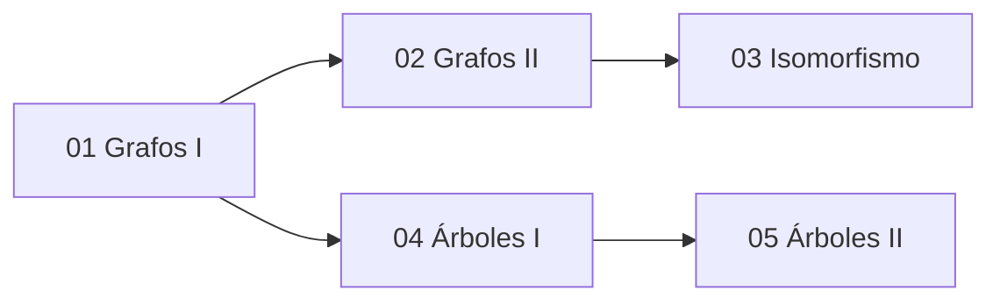

# 🗺️ Unidad 5 — Grafos y Árboles — Índice

> [!info] ℹ️ Índice manual
> Se actualiza a mano para que funcione igual en Obsidian y en Digital Garden.

## 📑 Notas de la Unidad

- [[01 - Grafos I - Conceptos Básicos y Recorridos]]
- [[02 - Grafos II - Subgrafos, Matrices y Algoritmos]]
- [[03 - Grafos III - Isomorfismo]]
- [[04 - Árboles I - Conceptos Básicos y Árboles de Expansión]]
- [[05 - Árboles II - Árboles Binarios, Recorridos y Códigos Huffman]]
- [[Guía de Problemas 5 - Ejercicios Resueltos]]

## 📊 Mapa de conexiones

> [!quote] 🔗 Conexiones
> - Previo: [[05 - Análisis de Algoritmos II - Pseudocódigo y Tiempo Real]] (Unidad 4)
> - Siguiente: [[01 - Máquinas de Estado Finito - Definición y Estructura]] (Unidad 6)
> - MOC general: [[Matemáticas Discretas]]

---
**Tags:** #MATG1051 #unidad5 #indice #discretas
