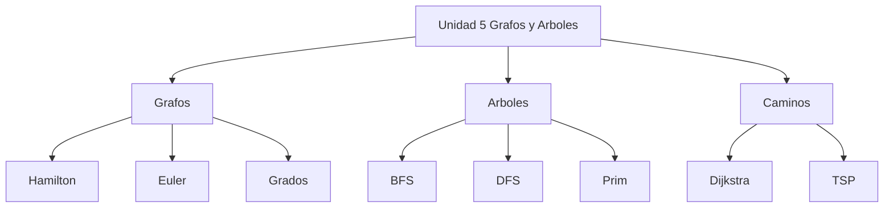

# 📘 Guía de Problemas 5 - Ejercicios Resueltos

> [!info] 📖 Sobre esta guía
>
> Ejercicios resueltos de la **Guía de Problemas 5** — Matemáticas Discretas (MATG1051). Autores de la guía: Cristhian Hernández, Ebner Pineda, Liliana Pérez, Jennifer Avilés.
>
> |Sección|Tema|Ejercicios|
> |---|---|---|
> |5.1|Grafos: grados, ciclos de Hamilton y Euler, handshake|1–4|
> |5.2|Árboles de expansión: DFS, BFS, TSP y Prim|5–7|
> |5.3|Caminos mínimos: algoritmo de Dijkstra|8–11|

---

![[GUÍA_DE_PROBLEMAS 5.pdf]]

## 📚 5.1 - Grafos: Grados, Hamilton, Euler y Handshake

> [!example]- ✏️ Ejercicio 1 - Ciclo de Hamilton en $K_{m,m}$
>
> **Enunciado:** Sea $K_{m,n}$ con $m, n > 1$. Demostrar que si $m = n$ entonces el grafo tiene un ciclo de Hamilton.
>
> **Paso 1 — Estructura de $K_{m,m}$:**
>
> $K_{m,m}$ tiene $N = 2m$ vértices partidos en $X = \{x_1, \dots, x_m\}$ e $Y = \{y_1, \dots, y_m\}$, con arista entre todo $x_i$ y todo $y_j$. Cada vértice tiene grado:
>
> $$\delta = \Delta = m = \frac{N}{2}$$
>
> **Paso 2 — Aplicar el teorema de Dirac:**
>
> El teorema de Dirac dice que si $N \geq 3$ y todo vértice tiene grado $\geq N/2$, existe ciclo de Hamilton. Aquí $N = 2m \geq 4$ (pues $m > 1$) y $\delta = m = N/2$. ✅ (Equivalentemente, el teorema de Ore: dos vértices no adyacentes están en la misma parte, y suman $m + m = 2m = N \geq N$. ✅)
>
> **Paso 3 — Construcción explícita del ciclo:**
>
> Basta alternar las dos partes:
>
> $$x_1 - y_1 - x_2 - y_2 - \cdots - x_m - y_m - x_1$$
>
> Cada paso une $X$ con $Y$ (arista que existe por ser bipartito completo), pasa por los $2m$ vértices exactamente una vez y regresa al inicio. Es un ciclo de Hamilton.
>
> > ```mermaid
> > graph TD
> >   X1 --- Y1
> >   X1 --- Y2
> >   X1 --- Y3
> >   X2 --- Y1
> >   X2 --- Y2
> >   X2 --- Y3
> >   X3 --- Y1
> >   X3 --- Y2
> >   X3 --- Y3
> > ```
>
> El diagrama muestra $K_{3,3}$ como ejemplo ($m = 3$); un ciclo de Hamilton es $X1-Y1-X2-Y2-X3-Y3-X1$.
>
> $$\boxed{\text{Si } m = n > 1,\ K_{m,m} \text{ tiene el ciclo } x_1y_1x_2y_2\ldots x_my_mx_1}$$

> [!example]- ✏️ Ejercicio 2 - Refutar: grado par no implica ciclo de Euler
>
> **Enunciado:** Refutar la afirmación: "Si todos los vértices de un grafo tienen grado par, entonces el grafo tiene un ciclo de Euler".
>
> **Paso 1 — Recordar el teorema de Euler:**
>
> Un grafo tiene ciclo de Euler si y solo si es **conexo** (en sus aristas) **y** todos sus vértices tienen grado par. La paridad sola no basta: falta la conexión.
>
> **Paso 2 — Contraejemplo: dos triángulos disjuntos:**
>
> Sea $G = C_3 \cup C_3$: seis vértices $\{a,b,c\} \cup \{d,e,f\}$ con aristas $ab, bc, ca$ y $de, ef, fd$.
>
> |Vértice|$a$|$b$|$c$|$d$|$e$|$f$|
> |---|---|---|---|---|---|---|
> |Grado|2|2|2|2|2|2|
>
> Todos los grados son pares, pero $G$ es **disconexo** (dos componentes). Ningún recorrido cerrado puede saltar de $\{a,b,c\}$ a $\{d,e,f\}$.
>
> > ```mermaid
> > graph TD
> >   A --- B
> >   B --- C
> >   C --- A
> >   D --- E
> >   E --- F
> >   F --- D
> > ```
>
> **Paso 3 — Conclusión:**
>
> $G$ cumple la hipótesis (grados pares) pero no tiene ciclo de Euler (ni siquiera camino de Euler que use todas las aristas, por ser disconexo).
>
> $$\boxed{\text{Falso: } C_3 \cup C_3 \text{ tiene grados pares y no tiene ciclo de Euler}}$$

> [!example]- ✏️ Ejercicio 3 - Análisis completo de un grafo de 10 vértices
>
> **Enunciado:** Dado el grafo con $V = \{v_1, \dots, v_{10}\}$ y adyacencias: $v_1$: $v_2,v_{10}$; $v_2$: $v_1,v_3,v_5,v_9$; $v_3$: $v_2,v_4$; $v_4$: $v_3,v_5,v_7$; $v_5$: $v_2,v_4,v_6$; $v_6$: $v_5,v_8,v_9$; $v_7$: $v_4,v_8$; $v_8$: $v_6,v_7,v_9,v_{10}$; $v_9$: $v_2,v_6,v_8,v_{10}$; $v_{10}$: $v_1,v_8,v_9$. Determinar: (a) grados, conexidad, bipartición, completitud; (b) ciclo/camino de Hamilton; (c) ciclo/camino de Euler.
>
> ![[g5-ej03-grafo.png]]
> **Figura generada con Python — grafo del Ej. 3 (rojo = grado impar, azul = grado par).**
>
> **(a) Grados y propiedades básicas:**
>
> |Vértice|$v_1$|$v_2$|$v_3$|$v_4$|$v_5$|$v_6$|$v_7$|$v_8$|$v_9$|$v_{10}$|
> |---|---|---|---|---|---|---|---|---|---|---|
> |Grado|2|4|2|3|3|3|2|4|4|3|
>
> Suma $= 30$, luego $|E| = 15$. ✅
>
> - **Conexo: sí.** Todo vértice alcanza a todo otro; por ejemplo $v_3-v_2-v_1-v_{10}-v_8-v_7-v_4-v_5-v_6-v_9$ conecta los extremos.
> - **Bipartito: no.** Contiene el triángulo $v_8-v_9-v_{10}-v_8$ (ciclo impar), y un bipartito no admite ciclos impares.
> - **Completo: no.** $K_{10}$ exigiría grado $9$ en cada vértice; el máximo aquí es $4$.
>
> **(b) Hamilton:**
>
> - **Ciclo de Hamilton: no existe.** Nótese que $v_1$ solo es adyacente a $v_2, v_{10}$, así que todo ciclo hamiltoniano usaría $v_2-v_1-v_{10}$; análogamente usaría $v_2-v_3-v_4$ (pues $v_3$ solo ve a $v_2, v_4$) y $v_4-v_7-v_8$. Entonces $v_2$ ya ocuparía sus dos incidencias del ciclo ($v_1, v_3$) y $v_4$ las suyas ($v_3$ más $v_5$ o $v_7$). En el caso $v_4 \in \{v_3, v_7\}$, a $v_5$ (vecinos $v_2, v_4, v_6$) solo le quedaría $v_6$ libre: imposible. En el caso $v_4 \in \{v_3, v_5\}$, a $v_7$ (vecinos $v_4, v_8$) solo le quedaría $v_8$: imposible. Contradicción en ambos casos.
> - **Camino de Hamilton: sí existe:**
>
> > ```mermaid
> > graph LR
> >   v3 --- v4 --- v7 --- v8 --- v10 --- v1 --- v2 --- v5 --- v6 --- v9
> > ```
>
> Se verifica arista por arista: $v_3v_4, v_4v_7, v_7v_8, v_8v_{10}, v_{10}v_1, v_1v_2, v_2v_5, v_5v_6, v_6v_9$ todas existen. ✅
>
> $$\boxed{\text{No hay ciclo de Hamilton; sí hay camino: } v_3v_4v_7v_8v_{10}v_1v_2v_5v_6v_9}$$
>
> **(c) Euler:**
>
> Los vértices de grado impar son $v_4, v_5, v_6, v_{10}$: exactamente $4$ impares. Un ciclo de Euler exige $0$ impares y un camino de Euler exige $0$ o $2$. Por tanto no hay ni uno ni otro.
>
> $$\boxed{\text{4 vértices impares } \Rightarrow \text{ no hay ciclo ni camino de Euler}}$$

> [!example]- ✏️ Ejercicio 4 - Los 8 estudiantes (handshake y palomar)
>
> **Enunciado:** En un grupo de $8$ estudiantes, uno ($U$) conoce a todos los demás, $M$ y $N$ conocen cada uno a $4$ personas, y los otros cinco tienen todos distinto número de conocidos. Demostrar que $M$ y $N$ se conocen entre sí.
>
> **Supuesto de trabajo:** los cinco restantes tienen grados distintos entre sí y distintos de $4$ (el de $M, N$) y de $7$ (el de $U$); como todos conocen a $U$, sus grados están en $\{1,2,3,5,6\}$, es decir son exactamente $\{1,2,3,5,6\}$.
>
> > ```mermaid
> > graph TD
> >   U --- M
> >   U --- N
> >   U --- A
> >   U --- B
> >   U --- C
> >   U --- D
> >   U --- E
> >   B --- M
> >   B --- N
> >   B --- C
> >   B --- D
> >   B --- E
> > ```
>
> El esquema muestra el esqueleto forzado: $U$ unido a todos y $B$ (grado $6$) unido a todos salvo $A$ (grado $1$).
>
> **Paso 1 — Identificar los extremos:**
>
> Sea $S = \{A, B, C, D, E\}$ con grados $1, 6, 5, 3, 2$ respectivamente. $A$ (grado $1$) solo conoce a $U$, luego $A \nsim M$ y $A \nsim N$. $B$ (grado $6$) conoce a todos salvo $A$, luego $B \sim M$ y $B \sim N$.
>
> **Paso 2 — Suponer $M \nsim N$ y contar:**
>
> Entonces $M = \{U, B\}$ más $2$ de $\{C, D, E\}$, y $N = \{U, B\}$ más $2$ de $\{C, D, E\}$. Sea $E$ el de grado $2$ ($E = U$ más un amigo $F$). Casos según $F$:
>
> |Amigo $F$ de $E$|Contradicción|
> |---|---|
> |$B$|$M, N$ necesitan $4$ incidencias en $\{C,D\}$; $D$ aporta $\leq 1$ ($D = U,B$ + una) y $C \leq 2$: imposible|
> |$M$ (o $N$)|$N$ conoce a $U,B,C,D$; $D = U,N,B$ queda lleno, luego $C = U,M,N,B$ tiene $4 < 5$: imposible|
> |$C$|$M, N$ necesitan $4$ incidencias en $\{C,D\}$ pero $D$ aporta $\leq 1$ y $C \leq 2$: imposible|
> |$D$|$D = U,E,B$ queda lleno, $M$ necesitaría $2$ vecinos en $\{C\}$: imposible|
>
> **Paso 3 — Conclusión:**
>
> Todos los casos son imposibles; el supuesto $M \nsim N$ es falso.
>
> $$\boxed{M \sim N:\ M \text{ y } N \text{ se conocen entre sí}}$$

## 📚 5.2 - Árboles de Expansión: DFS, BFS, TSP y Prim

> [!example]- ✏️ Ejercicio 5 - Árbol de expansión por DFS
>
> **Enunciado:** Hallar el árbol de expansión por DFS con orden de visita $h, l, k, f, e, d, c, b, i, j, g, a$ en el grafo de la figura.
>
> **Supuesto (grafo reconstruido de la figura):** $12$ vértices $\{a, \dots, l\}$ con adyacencias (listadas en orden de exploración): $h$: $l, k$; $l$: $h, k$; $k$: $l, f, h$; $f$: $k, e$; $e$: $f, d$; $d$: $e, c$; $c$: $d, b$; $b$: $c, i, a$; $i$: $b, j$; $j$: $i, g$; $g$: $j, a, b$; $a$: $g, b$.
>
> **Paso 1 — Ejecutar DFS desde $h$:**
>
> |Orden|Vértice|Arista de descubrimiento|
> |---|---|---|
> |1|$h$|raíz|
> |2|$l$|$h-l$|
> |3|$k$|$l-k$ ($h-k$ queda de retroceso)|
> |4|$f$|$k-f$|
> |5|$e$|$f-e$|
> |6|$d$|$e-d$|
> |7|$c$|$d-c$|
> |8|$b$|$c-b$|
> |9|$i$|$b-i$|
> |10|$j$|$i-j$|
> |11|$g$|$j-g$ ($g-b$ queda de retroceso)|
> |12|$a$|$g-a$ ($b-a$ queda de retroceso)|
>
> **Paso 2 — Árbol resultante ($11$ aristas, $3$ de retroceso: $h-k$, $g-b$, $b-a$):**
>
> ![[g5-ej05-dfs.png]]
> **Figura generada con Python — árbol DFS del Ej. 5 (azul grueso) y retrocesos h–k, g–b, b–a (gris).**
>
> $$\boxed{T_{DFS} = \{hl, lk, kf, fe, ed, dc, cb, bi, ij, jg, ga\}}$$

> [!example]- ✏️ Ejercicio 6 - Árboles BFS y DFS con orden dado
>
> **Enunciado:** Con $V = \{a, \dots, j\}$ y orden de prioridad $(a, c, e, b, f, d, h, g, j, i)$: 1) hallar el árbol BFS, 2) hallar el árbol DFS (ambos desde $a$).
>
> **Supuesto (grafo reconstruido de la figura):** adyacencias: $a$: $c, e$; $c$: $a, b, f$; $e$: $a, d, h$; $b$: $c, g$; $f$: $c, j$; $d$: $e, h$; $h$: $e, d$; $g$: $b, i$; $j$: $f, i$; $i$: $g, j$.
>
> **1) BFS desde $a$ (cola FIFO, prioridad del orden dado):**
>
> |Nivel|Vértices descubiertos|Aristas del árbol|
> |---|---|---|
> |0|$a$|—|
> |1|$c, e$|$a-c$, $a-e$|
> |2|$b, f$ (vía $c$), $d, h$ (vía $e$)|$c-b$, $c-f$, $e-d$, $e-h$|
> |3|$g$ (vía $b$), $j$ (vía $f$)|$b-g$, $f-j$|
> |4|$i$ (vía $g$)|$g-i$ ($j-i$ es de cruce)|
>
> Orden de descubrimiento BFS: $a, c, e, b, f, d, h, g, j, i$. ✅
>
> ![[g5-ej06-bfs.png]]
> **Figura generada con Python — árbol BFS del Ej. 6 (azul grueso) y aristas de cruce d–h, j–i (gris).**
>
> $$\boxed{T_{BFS} = \{ac, ae, cb, cf, ed, eh, bg, fj, gi\}}$$
>
> **2) DFS desde $a$ (desempate con el orden dado):**
>
> Camino: $a \to c \to b \to g \to i \to j \to f$, retroceso hasta $a \to e \to d \to h$. Orden de descubrimiento: $a, c, b, g, i, j, f, e, d, h$.
>
> ![[g5-ej06-dfs.png]]
> **Figura generada con Python — árbol DFS del Ej. 6 (azul grueso) y aristas fuera del árbol c–f, e–h (gris).**
>
> $$\boxed{T_{DFS} = \{ac, cb, bg, gi, ij, jf, ae, ed, dh\}}$$

> [!example]- ✏️ Ejercicio 7 - TSP y árbol mínimo de Prim
>
> **Enunciado:** En el grafo ponderado conexo de la figura: 1) hallar un tour TSP, 2) hallar el MST por Prim.
>
> **Supuesto (grafo reconstruido de la figura, pesos):** $V = \{A, \dots, F\}$; aristas: $A$-$B$ $4$, $A$-$C$ $3$, $A$-$F$ $10$, $B$-$C$ $2$, $B$-$D$ $5$, $B$-$F$ $9$, $C$-$D$ $6$, $C$-$E$ $7$, $D$-$E$ $1$, $D$-$F$ $8$, $E$-$F$ $2$.
>
> ![[g5-ej07-prim.png]]
> **Figura generada con Python — grafo del Ej. 7 con el MST de Prim en verde (peso 13).**
>
> **1) Tour TSP (vecino más cercano desde $A$):**
>
> $A \xrightarrow{3} C \xrightarrow{2} B \xrightarrow{5} D \xrightarrow{1} E \xrightarrow{2} F \xrightarrow{10} A$. Costo $= 3 + 2 + 5 + 1 + 2 + 10 = 23$.
>
> $$\boxed{\text{Tour } A-C-B-D-E-F-A \text{ con costo } 23}$$
>
> **2) Prim desde $A$:**
>
> |Paso|$T$|Candidatas mínimas|Elegida|
> |---|---|---|---|
> |1|$\{A\}$|$A$-$C$ $3$, $A$-$B$ $4$, $A$-$F$ $10$|$A$-$C$ ($3$)|
> |2|$\{A,C\}$|$C$-$B$ $2$, $C$-$D$ $6$, $C$-$E$ $7$|$C$-$B$ ($2$)|
> |3|$\{A,B,C\}$|$B$-$D$ $5$, $C$-$D$ $6$, $B$-$F$ $9$|$B$-$D$ ($5$)|
> |4|$\{A,B,C,D\}$|$D$-$E$ $1$, $D$-$F$ $8$|$D$-$E$ ($1$)|
> |5|$\{A,B,C,D,E\}$|$E$-$F$ $2$, $B$-$F$ $9$|$E$-$F$ ($2$)|
>
> Peso total $= 3 + 2 + 5 + 1 + 2 = 13$.
>
> > ```mermaid
> > graph TD
> >   A ---|3| C
> >   C ---|2| B
> >   B ---|5| D
> >   D ---|1| E
> >   E ---|2| F
> > ```
>
> $$\boxed{MST = \{AC, CB, BD, DE, EF\} \text{ con peso } 13}$$

## 📚 5.3 - Caminos Mínimos: Dijkstra

> [!example]- ✏️ Ejercicio 8 - Dijkstra de $A$ a $J$
>
> **Enunciado:** Hallar el camino mínimo de $A$ a $J$ con Dijkstra en el grafo ponderado de la figura.
>
> **Supuesto (grafo reconstruido de la figura, pesos):** aristas: $A$-$B$ $4$, $A$-$C$ $2$, $B$-$C$ $1$, $B$-$D$ $5$, $B$-$E$ $9$, $C$-$D$ $8$, $C$-$E$ $10$, $D$-$E$ $2$, $D$-$F$ $6$, $E$-$F$ $3$, $E$-$G$ $7$, $F$-$G$ $1$, $F$-$H$ $4$, $G$-$H$ $2$, $G$-$I$ $3$, $H$-$I$ $5$, $H$-$J$ $6$, $I$-$J$ $2$.
>
> **Paso 1 — Tabla de Dijkstra desde $A$ ($*$ = finalizado):**
>
> |Paso|Actual|$A$|$B$|$C$|$D$|$E$|$F$|$G$|$H$|$I$|$J$|
> |---|---|---|---|---|---|---|---|---|---|---|---|
> |0|—|0|inf|inf|inf|inf|inf|inf|inf|inf|inf|
> |1|$A$|0*|4|2|inf|inf|inf|inf|inf|inf|inf|
> |2|$C$|0*|3|2*|10|12|inf|inf|inf|inf|inf|
> |3|$B$|0*|3*|2*|8|12|inf|inf|inf|inf|inf|
> |4|$D$|0*|3*|2*|8*|10|14|inf|inf|inf|inf|
> |5|$E$|0*|3*|2*|8*|10*|13|17|inf|inf|inf|
> |6|$F$|0*|3*|2*|8*|10*|13*|14|17|inf|inf|
> |7|$G$|0*|3*|2*|8*|10*|13*|14*|16|17|inf|
> |8|$H$|0*|3*|2*|8*|10*|13*|14*|16*|17|22|
> |9|$I$|0*|3*|2*|8*|10*|13*|14*|16*|17*|19|
> |10|$J$|0*|3*|2*|8*|10*|13*|14*|16*|17*|19*|
>
> **Paso 2 — Reconstruir el camino:** $J \leftarrow I \leftarrow G \leftarrow F \leftarrow E \leftarrow D \leftarrow B \leftarrow C \leftarrow A$; verificación: $2+1+5+2+3+1+3+2 = 19$. ✅
>
> > ```mermaid
> > graph LR
> >   A ---|2| C
> >   C ---|1| B
> >   B ---|5| D
> >   D ---|2| E
> >   E ---|3| F
> >   F ---|1| G
> >   G ---|3| I
> >   I ---|2| J
> > ```
>
> ![[g5-ej08-dijkstra.png]]
> **Figura generada con Python — camino mínimo A→J del Ej. 8 en verde (d = 19).**
>
> $$\boxed{d(A,J) = 19 \text{ vía } A-C-B-D-E-F-G-I-J}$$

> [!example]- ✏️ Ejercicio 9 - Distancias entre pares de vértices
>
> **Enunciado:** Hallar la longitud del camino más corto para los pares $(a,f)$, $(a,g)$, $(a,z)$, $(b,j)$, $(h,d)$.
>
> **Supuesto (grafo reconstruido de la figura, pesos; $z$ es el vértice adicional de la figura):** aristas: $a$-$b$ $3$, $a$-$c$ $5$, $b$-$c$ $2$, $b$-$d$ $6$, $c$-$e$ $4$, $c$-$z$ $12$, $d$-$e$ $1$, $d$-$f$ $7$, $e$-$f$ $2$, $e$-$g$ $8$, $f$-$g$ $3$, $f$-$h$ $6$, $g$-$h$ $2$, $g$-$j$ $4$, $g$-$z$ $9$, $h$-$j$ $3$, $j$-$z$ $5$.
>
> ![[g5-ej09-distancias.png]]
> **Figura generada con Python — grafo ponderado del Ej. 9.**
>
> **Paso 1 — Dijkstra desde $a$:** distancias finales $a=0$, $b=3$, $c=5$, $d=9$, $e=9$, $f=11$, $g=14$, $h=16$, $j=18$, $z=17$ (vía directa $a$-$c$-$z$ $= 5+12$).
>
> **Paso 2 — Dijkstra desde $b$:** $(b,j) = 15$ vía $b$-$c$-$e$-$f$-$g$-$j$ $= 2+4+2+3+4$.
>
> **Paso 3 — Dijkstra desde $h$:** $(h,d) = 8$ vía $h$-$g$-$f$-$e$-$d$ $= 2+3+2+1$.
>
> |Par|Camino mínimo|Longitud|
> |---|---|---|
> |$(a,f)$|$a$-$b$-$c$-$e$-$f$ ($3+2+4+2$)|11|
> |$(a,g)$|$a$-$b$-$c$-$e$-$f$-$g$ ($11+3$)|14|
> |$(a,z)$|$a$-$c$-$z$ ($5+12$)|17|
> |$(b,j)$|$b$-$c$-$e$-$f$-$g$-$j$ ($2+4+2+3+4$)|15|
> |$(h,d)$|$h$-$g$-$f$-$e$-$d$ ($2+3+2+1$)|8|
>
> $$\boxed{(a,f)=11,\ (a,g)=14,\ (a,z)=17,\ (b,j)=15,\ (h,d)=8}$$

> [!example]- ✏️ Ejercicio 10 - Dijkstra de $A$ a $J$ (detallado)
>
> **Enunciado:** Aplicar Dijkstra paso a paso para el camino mínimo de $A$ a $J$ en el grafo ponderado de la figura.
>
> **Supuesto (grafo reconstruido de la figura, pesos):** aristas: $A$-$B$ $2$, $A$-$D$ $7$, $B$-$C$ $3$, $B$-$E$ $5$, $C$-$F$ $4$, $D$-$E$ $1$, $D$-$G$ $6$, $E$-$F$ $2$, $E$-$H$ $8$, $F$-$I$ $3$, $G$-$H$ $2$, $G$-$J$ $9$, $H$-$I$ $1$, $H$-$J$ $4$.
>
> > ```mermaid
> > graph TD
> >   A ---|2| B
> >   A ---|7| D
> >   B ---|3| C
> >   B ---|5| E
> >   C ---|4| F
> >   D ---|1| E
> >   D ---|6| G
> >   E ---|2| F
> >   E ---|8| H
> >   F ---|3| I
> >   G ---|2| H
> >   G ---|9| J
> >   H ---|1| I
> >   H ---|4| J
> > ```
>
> **Paso 1 — Tabla de Dijkstra desde $A$ ($*$ = finalizado):**
>
> |Paso|Actual|$A$|$B$|$C$|$D$|$E$|$F$|$G$|$H$|$I$|$J$|
> |---|---|---|---|---|---|---|---|---|---|---|---|
> |0|—|0|inf|inf|inf|inf|inf|inf|inf|inf|inf|
> |1|$A$|0*|2|inf|7|inf|inf|inf|inf|inf|inf|
> |2|$B$|0*|2*|5|7|7|inf|inf|inf|inf|inf|
> |3|$C$|0*|2*|5*|7|7|9|inf|inf|inf|inf|
> |4|$D$|0*|2*|5*|7*|7|9|13|inf|inf|inf|
> |5|$E$|0*|2*|5*|7*|7*|9|13|15|inf|inf|
> |6|$F$|0*|2*|5*|7*|7*|9*|13|15|12|inf|
> |7|$I$|0*|2*|5*|7*|7*|9*|13|13|12*|inf|
> |8|$G$|0*|2*|5*|7*|7*|9*|13*|13|12*|22|
> |9|$H$|0*|2*|5*|7*|7*|9*|13*|13*|12*|17|
> |10|$J$|0*|2*|5*|7*|7*|9*|13*|13*|12*|17*|
>
> **Paso 2 — Reconstruir el camino:** $J \leftarrow H \leftarrow I \leftarrow F \leftarrow E \leftarrow B \leftarrow A$; verificación: $2+5+2+3+1+4 = 17$. ✅
>
> > ```mermaid
> > graph LR
> >   A ---|2| B
> >   B ---|5| E
> >   E ---|2| F
> >   F ---|3| I
> >   I ---|1| H
> >   H ---|4| J
> > ```
>
> $$\boxed{d(A,J) = 17 \text{ vía } A-B-E-F-I-H-J}$$

> [!example]- ✏️ Ejercicio 11 - Dijkstra de $v_4$ a $v_7$
>
> **Enunciado:** Aplicar Dijkstra paso a paso para el camino mínimo de $v_4$ a $v_7$ en el grafo ponderado de la figura.
>
> **Supuesto (grafo reconstruido de la figura, pesos):** vértices $\{v_1, \dots, v_7\}$; aristas: $v_4$-$v_1$ $3$, $v_4$-$v_2$ $6$, $v_1$-$v_2$ $2$, $v_1$-$v_3$ $8$, $v_1$-$v_5$ $10$, $v_2$-$v_3$ $4$, $v_2$-$v_5$ $5$, $v_3$-$v_5$ $1$, $v_3$-$v_6$ $7$, $v_5$-$v_6$ $3$, $v_5$-$v_7$ $9$, $v_6$-$v_7$ $2$.
>
> **Paso 1 — Tabla de Dijkstra desde $v_4$ ($*$ = finalizado):**
>
> |Paso|Actual|$v_4$|$v_1$|$v_2$|$v_3$|$v_5$|$v_6$|$v_7$|
> |---|---|---|---|---|---|---|---|---|
> |0|—|0|inf|inf|inf|inf|inf|inf|
> |1|$v_4$|0*|3|6|inf|inf|inf|inf|
> |2|$v_1$|0*|3*|5|11|13|inf|inf|
> |3|$v_2$|0*|3*|5*|9|10|inf|inf|
> |4|$v_3$|0*|3*|5*|9*|10|16|inf|
> |5|$v_5$|0*|3*|5*|9*|10*|13|19|
> |6|$v_6$|0*|3*|5*|9*|10*|13*|15|
> |7|$v_7$|0*|3*|5*|9*|10*|13*|15*|
>
> **Paso 2 — Reconstruir el camino:** $v_7 \leftarrow v_6 \leftarrow v_5 \leftarrow v_3 \leftarrow v_2 \leftarrow v_1 \leftarrow v_4$; verificación: $3+2+4+1+3+2 = 15$. ✅
>
> > ```mermaid
> > graph LR
> >   v4 ---|3| v1
> >   v1 ---|2| v2
> >   v2 ---|4| v3
> >   v3 ---|1| v5
> >   v5 ---|3| v6
> >   v6 ---|2| v7
> > ```
>
> ![[g5-ej11-dijkstra.png]]
> **Figura generada con Python — camino mínimo v4→v7 del Ej. 11 en verde (d = 15).**
>
> $$\boxed{d(v_4,v_7) = 15 \text{ vía } v_4-v_1-v_2-v_3-v_5-v_6-v_7}$$

---

> [!summary] 📝 Resumen de la guía
>
> |Ejercicio|Resultado clave|
> |---|---|
> |1|$K_{m,m}$ tiene ciclo de Hamilton por Dirac (grado $m = N/2$)|
> |2|Grado par no basta: $C_3 \cup C_3$ es contraejemplo (disconexo)|
> |3|Conexo, no bipartito (triángulo $v_8v_9v_{10}$), no completo; sin ciclo de Hamilton pero con camino; $4$ impares: sin Euler|
> |4|$M$ y $N$ se conocen (palomar + casos sobre los 5 restantes)|
> |5|Árbol DFS de $11$ aristas con orden $h\ldots a$|
> |6|$T_{BFS} \neq T_{DFS}$ sobre el mismo grafo de $10$ vértices|
> |7|Tour TSP $= 23$; MST por Prim $= 13$|
> |8|$d(A,J) = 19$|
> |9|$(a,f)=11$, $(a,g)=14$, $(a,z)=17$, $(b,j)=15$, $(h,d)=8$|
> |10|$d(A,J) = 17$|
> |11|$d(v_4,v_7) = 15$|

## ✅ Metas de Aprendizaje

> [!note] 🎯 Nivel 1 - Comprender
> - [ ] Explicar con mis palabras los teoremas de Dirac, Ore y Euler (conexidad + paridad)
> - [ ] Verificar a mano los grados y la lista de aristas del Ejercicio 3
>   - [ ] Reproducir el argumento de imposibilidad del ciclo de Hamilton

> [!note] 🎯 Nivel 2 - Aplicar
> - [ ] Ejecutar BFS, DFS, Prim y Dijkstra sin mirar la solución
> - [ ] Trazar los árboles de expansión de los Ejercicios 5 y 6 desde otro vértice inicial
>   - [ ] Comparar el orden de descubrimiento obtenido con el de la guía

> [!note] 🎯 Nivel 3 - Dominar
> - [ ] Resolver un TSP y un Dijkstra con pesos nuevos inventados por mí
> - [ ] Demostrar el Ejercicio 4 por contradicción sin consultar los casos
>   - [ ] Construir un contraejemplo tipo Ejercicio 2 para otra afirmación falsa

## 📊 Resumen Visual



> [!quote] 🔗 Conexiones
>
> - [[01 - Grafos I - Conceptos Básicos y Recorridos]] — grados, Hamilton, Euler y recorridos base
> - [[02 - Grafos II - Subgrafos, Matrices y Algoritmos]] — matriz de adyacencia, Dijkstra, Prim y TSP
> - [[03 - Grafos III - Isomorfismo]] — estructura y comparación de grafos
> - [[04 - Árboles I - Conceptos Básicos y Árboles de Expansión]] — BFS, DFS y árboles de expansión
> - [[05 - Árboles II - Árboles Binarios, Recorridos y Códigos Huffman]] — recorridos y optimización en árboles
> - [[Universidad/3er Semestre/Matemáticas Discretas/Unidad 5 - Grafos y Árboles/00 - Índice Unidad 5]] — volver al índice de la unidad

---

**Tags:** #discretas #unidad5 #guia-problemas
