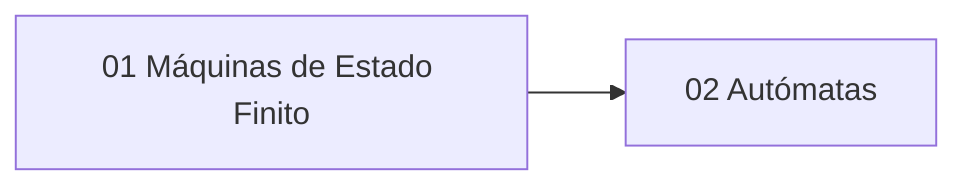

# 🗺️ Unidad 6 — Lenguajes y Autómatas — Índice

> [!info] ℹ️ Índice manual
> Se actualiza a mano para que funcione igual en Obsidian y en Digital Garden.

## 📑 Notas de la Unidad

- [[01 - Máquinas de Estado Finito - Definición y Estructura]]
- [[02 - Autómatas de Estado Finito - Diseño y Aceptación de Cadenas]]
- [[Guía de Problemas 6 - Ejercicios Resueltos]]

## 📊 Mapa de conexiones

> [!quote] 🔗 Conexiones
> - Previo: [[05 - Árboles II - Árboles Binarios, Recorridos y Códigos Huffman]] (Unidad 5)
> - MOC general: [[Matemáticas Discretas]]

---
**Tags:** #MATG1051 #unidad6 #indice #discretas
