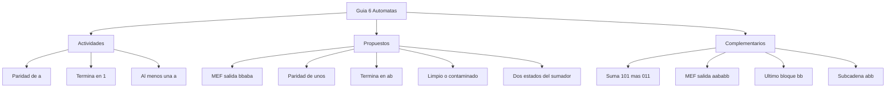

# 📘 Guía de Problemas 6 - Ejercicios Resueltos

> [!info] 📖 Sobre esta guía
>
> Ejercicios resueltos de la **Guía de Problemas 6** — Matemáticas Discretas (MATG 1051). Fuente: notas de clase MATG 1051, Ebner Pineda — Actividades en clase 1–3 + 5 Ejercicios propuestos + 4 Complementarios.
>
> |Sección|Tema|Ejercicios|
> |---|---|---|
> |6.1|Actividades en clase (notas MATG 1051)|1–3|
> |6.2|Ejercicios propuestos|4–8|
> |6.3|Complementarios|9–12|

---

![[notas_maquinas_automatas (1).pdf]]

## 📚 6.1 — Actividades en clase

> [!example]- ✏️ Ejercicio 1 - Autómata con número impar de a's y trazas
>
> **Origen:** Actividad en clase 1 (notas MATG 1051).
>
> **Enunciado:** Diseñar un autómata sobre $I = \{a, b\}$ que acepte exactamente las cadenas con un número **impar** de símbolos $a$. Trazar la trayectoria de: $\varepsilon$, $a$, $bba$, $abab$, $aaab$, $bbbabb$.
>
> **Paso 1 — Diseñar el autómata (2 estados: par / impar):**
>
> La única información relevante del pasado es la **paridad** del número de $a$'s leídas hasta ahora:
>
> - $s_0$ = se han leído un número **par** de $a$'s (incluye $0$). Estado inicial, **no** aceptante.
> - $s_1$ = se han leído un número **impar** de $a$'s. Estado **aceptante**.
>
> Leyenda: $s_0$ representa $\sigma_0$ (par), $s_1$ representa $\sigma_1$ (impar).
>
> | $S \backslash I$ | $a$ | $b$ |
> |---|---|---|
> | $s_0$ | $s_1$ | $s_0$ |
> | $s_1$ | $s_0$ | $s_1$ |
>
> Estado inicial: $s_0$. Conjunto de aceptación: $\mathcal{A} = \{s_1\}$.
>
> ```mermaid
> graph LR
>     start(( )) --> s0(("s0"))
>     s0 -->|"b"| s0
>     s0 -->|"a"| s1((("s1")))
>     s1 -->|"b"| s1
>     s1 -->|"a"| s0
> ```
>
> **Paso 2 — Pregunta guía:** ¿cuántas veces se cambia de estado al leer una $a$?
>
> Exactamente **1 vez**: leer $a$ siempre conmuta $s_0 \leftrightarrow s_1$, mientras que leer $b$ nunca cambia de estado (lazo). Por eso la paridad se alterna con cada $a$.
>
> **Paso 3 — Trazas símbolo por símbolo:**
>
> | Cadena | $a$'s contadas | Trayectoria | Estado final | Veredicto |
> |---|---|---|---|---|
> | $\varepsilon$ | 0 (par) | $s_0$ | $s_0 \notin \mathcal{A}$ | Rechazada |
> | $a$ | 1 (impar) | $s_0 \to s_1$ | $s_1 \in \mathcal{A}$ | Aceptada |
> | $bba$ | 1 (impar) | $s_0 \to s_0 \to s_0 \to s_1$ | $s_1 \in \mathcal{A}$ | Aceptada |
> | $abab$ | 2 (par) | $s_0 \to s_1 \to s_1 \to s_0 \to s_0$ | $s_0 \notin \mathcal{A}$ | Rechazada |
> | $aaab$ | 3 (impar) | $s_0 \to s_1 \to s_0 \to s_1 \to s_1$ | $s_1 \in \mathcal{A}$ | Aceptada |
> | $bbbabb$ | 1 (impar) | $s_0 \to s_0 \to s_0 \to s_0 \to s_1 \to s_1 \to s_1$ | $s_1 \in \mathcal{A}$ | Aceptada |
>
> $$\boxed{\varepsilon \text{ rechazada},\ a \text{ aceptada},\ bba \text{ aceptada},\ abab \text{ rechazada},\ aaab \text{ aceptada},\ bbbabb \text{ aceptada}}$$

> [!example]- ✏️ Ejercicio 2 - Autómata que acepta cadenas que terminan en 1
>
> **Origen:** Actividad en clase 2 (notas MATG 1051).
>
> **Enunciado:** Diseñar un autómata sobre $I = \{0, 1\}$ que acepte exactamente las cadenas que **terminan en $1$**.
>
> **Paso 1 — Estados (información relevante: ¿cuál fue el último símbolo?):**
>
> - $s_0$ = la cadena es vacía o el último símbolo leído fue $0$. Estado inicial, **no** aceptante.
> - $s_1$ = el último símbolo leído fue $1$. Estado **aceptante**.
>
> Leyenda: $s_0$ representa "termina en 0 o vacía", $s_1$ representa "termina en 1".
>
> | $S \backslash I$ | $0$ | $1$ |
> |---|---|---|
> | $s_0$ | $s_0$ | $s_1$ |
> | $s_1$ | $s_0$ | $s_1$ |
>
> Estado inicial: $s_0$. Conjunto de aceptación: $\mathcal{A} = \{s_1\}$.
>
> ```mermaid
> graph LR
>     start(( )) --> s0(("s0"))
>     s0 -->|"0"| s0
>     s0 -->|"1"| s1((("s1")))
>     s1 -->|"1"| s1
>     s1 -->|"0"| s0
> ```
>
> **Paso 2 — Trazas de prueba:**
>
> | Cadena | Trayectoria | Estado final | Veredicto |
> |---|---|---|---|
> | $1$ | $s_0 \to s_1$ | $s_1 \in \mathcal{A}$ | Aceptada |
> | $0$ | $s_0 \to s_0$ | $s_0 \notin \mathcal{A}$ | Rechazada |
> | $101$ | $s_0 \to s_1 \to s_0 \to s_1$ | $s_1 \in \mathcal{A}$ | Aceptada |
> | $100$ | $s_0 \to s_1 \to s_0 \to s_0$ | $s_0 \notin \mathcal{A}$ | Rechazada |
>
> La cadena vacía $\varepsilon$ se queda en $s_0$, luego es rechazada (correcto: no termina en $1$).
>
> $$\boxed{1 \text{ aceptada},\ 0 \text{ rechazada},\ 101 \text{ aceptada},\ 100 \text{ rechazada}}$$

> [!example]- ✏️ Ejercicio 3 - Autómata que acepta cadenas con al menos una a
>
> **Origen:** Actividad en clase 3 (notas MATG 1051).
>
> **Enunciado:** Diseñar un autómata sobre $I = \{a, b\}$ que acepte exactamente las cadenas que contienen **al menos una** $a$.
>
> **Paso 1 — Estados (información relevante: ¿ya apareció alguna $a$?):**
>
> - $s_0$ = aún **no** se ha leído ninguna $a$. Estado inicial, **no** aceptante.
> - $s_1$ = **ya** se leyó al menos una $a$. Estado **aceptante** (trampa: una vez aquí nunca se sale).
>
> Leyenda: $s_0$ representa "no-a", $s_1$ representa "sí-a".
>
> | $S \backslash I$ | $a$ | $b$ |
> |---|---|---|
> | $s_0$ | $s_1$ | $s_0$ |
> | $s_1$ | $s_1$ | $s_1$ |
>
> Estado inicial: $s_0$. Conjunto de aceptación: $\mathcal{A} = \{s_1\}$.
>
> ```mermaid
> graph LR
>     start(( )) --> s0(("s0"))
>     s0 -->|"b"| s0
>     s0 -->|"a"| s1((("s1")))
>     s1 -->|"a"| s1
>     s1 -->|"b"| s1
> ```
>
> **Paso 2 — Prueba de correctitud (acepta todas y sólo las pedidas):**
>
> - **(Sólo):** si $\alpha$ no contiene ninguna $a$, toda su lectura usa el lazo $f(s_0, b) = s_0$, así que termina en $s_0 \notin \mathcal{A}$: es rechazada. Ninguna cadena sin $a$ es aceptada. ✓
> - **(Todas):** si $\alpha$ contiene al menos una $a$, sea $k$ la posición de su **primera** $a$. Hasta $k-1$ el autómata sigue en $s_0$, en el paso $k$ pasa a $s_1$, y como $f(s_1, a) = f(s_1, b) = s_1$, permanece en $s_1$ hasta el final: es aceptada. ✓
>
> Ejemplo: $bbab \to s_0 \to s_0 \to s_0 \to s_1 \to s_1$: aceptada. $bbb$: aceptada es falso, termina en $s_0$: rechazada.
>
> $$\boxed{L = \{\alpha \in \{a,b\}^* \mid \alpha \text{ contiene al menos una } a\}}$$

## 📚 6.2 — Ejercicios propuestos

> [!example]- ✏️ Ejercicio 4 - Salida de la MEF del ejemplo para α = bbaba
>
> **Origen:** Ejercicio propuesto 1.
>
> **Enunciado:** Sea la MEF del ejemplo de clase: $I = \{a, b\}$, $O = \{0, 1\}$, $S = \{\sigma_0, \sigma_1\}$, con $f(\sigma_0, a) = \sigma_0$, $f(\sigma_0, b) = \sigma_1$, $f(\sigma_1, a) = \sigma_1$, $f(\sigma_1, b) = \sigma_1$, $g(\sigma_0, a) = 0$, $g(\sigma_0, b) = 1$, $g(\sigma_1, a) = 1$, $g(\sigma_1, b) = 0$, estado inicial $\sigma_0$. Calcular la salida de $\alpha = bbaba$.
>
> **Paso 1 — Tabla $S \backslash I$ (función de transición $f$ y salida $g$):**
>
> | $S \backslash I$ | $f(\cdot, a)$ | $f(\cdot, b)$ | $g(\cdot, a)$ | $g(\cdot, b)$ |
> |---|---|---|---|---|
> | $\sigma_0$ | $\sigma_0$ | $\sigma_1$ | 0 | 1 |
> | $\sigma_1$ | $\sigma_1$ | $\sigma_1$ | 1 | 0 |
>
> Leyenda del diagrama: $s_0$ representa $\sigma_0$, $s_1$ representa $\sigma_1$.
>
> ```mermaid
> graph LR
>     start(( )) --> s0(("s0"))
>     s0 -->|"a/0"| s0
>     s0 -->|"b/1"| s1(("s1"))
>     s1 -->|"a/1"| s1
>     s1 -->|"b/0"| s1
> ```
>
> **Paso 2 — Tabla paso a paso para $\alpha = bbaba$:**
>
> | Paso | Estado actual | Entrada | Salida $g$ / Nuevo estado $f$ |
> |---|---|---|---|
> | 1 | $\sigma_0$ | $b$ | $1 / \sigma_1$ |
> | 2 | $\sigma_1$ | $b$ | $0 / \sigma_1$ |
> | 3 | $\sigma_1$ | $a$ | $1 / \sigma_1$ |
> | 4 | $\sigma_1$ | $b$ | $0 / \sigma_1$ |
> | 5 | $\sigma_1$ | $a$ | $1 / \sigma_1$ |
>
> La cadena de salida es $10101$ (longitud $5$ = longitud de la entrada, como exige la teoría).
>
> $$\boxed{10101}$$

> [!example]- ✏️ Ejercicio 5 - Autómata con número par de unos
>
> **Origen:** Ejercicio propuesto 2.
>
> **Enunciado:** Diseñar un autómata sobre $I = \{0, 1\}$ que acepte exactamente las cadenas con un número **par** de unos.
>
> **Paso 1 — Estados (paridad de unos):**
>
> - $s_0$ = número **par** de unos leídos (incluye $0$). Estado inicial y **aceptante**.
> - $s_1$ = número **impar** de unos leídos. No aceptante.
>
> Leyenda: $s_0$ representa paridad par, $s_1$ representa paridad impar.
>
> | $S \backslash I$ | $0$ | $1$ |
> |---|---|---|
> | $s_0$ | $s_0$ | $s_1$ |
> | $s_1$ | $s_1$ | $s_0$ |
>
> Estado inicial: $s_0$. Conjunto de aceptación: $\mathcal{A} = \{s_0\}$.
>
> ```mermaid
> graph LR
>     start(( )) --> s0((("s0")))
>     s0 -->|"0"| s0
>     s0 -->|"1"| s1(("s1"))
>     s1 -->|"0"| s1
>     s1 -->|"1"| s0
> ```
>
> **Paso 2 — Trazas:**
>
> | Cadena | Unos contados | Trayectoria | Estado final | Veredicto |
> |---|---|---|---|---|
> | $\varepsilon$ | 0 (par) | $s_0$ | $s_0 \in \mathcal{A}$ | Aceptada |
> | $1$ | 1 (impar) | $s_0 \to s_1$ | $s_1 \notin \mathcal{A}$ | Rechazada |
> | $101$ | 2 (par) | $s_0 \to s_1 \to s_1 \to s_0$ | $s_0 \in \mathcal{A}$ | Aceptada |
> | $111$ | 3 (impar) | $s_0 \to s_1 \to s_0 \to s_1$ | $s_1 \notin \mathcal{A}$ | Rechazada |
>
> Nota: $110$ contiene dos unos (par): su trayectoria $s_0 \to s_1 \to s_0 \to s_0$ termina en $s_0$, luego es **aceptada** (se usa $111$ como ejemplo de rechazo con tres unos).
>
> $$\boxed{\varepsilon \text{ aceptada},\ 1 \text{ rechazada},\ 101 \text{ aceptada},\ 111 \text{ rechazada},\ 110 \text{ aceptada}}$$

> [!example]- ✏️ Ejercicio 6 - Autómata que acepta cadenas que terminan en ab
>
> **Origen:** Ejercicio propuesto 3.
>
> **Enunciado:** Diseñar un autómata sobre $I = \{a, b\}$ que acepte exactamente las cadenas que **terminan en $ab$**.
>
> **Paso 1 — Estados (¿cuánto del sufijo $ab$ llevo acumulado?):**
>
> - $q_0$ = el sufijo leído **no** termina en $a$ ni en $ab$ (incluye la cadena vacía). Estado inicial, no aceptante.
> - $q_1$ = el último símbolo fue $a$ (posible inicio de $ab$). No aceptante.
> - $q_2$ = los últimos dos símbolos fueron exactamente $ab$. **Aceptante**.
>
> Leyenda: $q_0$ representa "nada útil", $q_1$ representa "termina en a", $q_2$ representa "termina en ab".
>
> | $S \backslash I$ | $a$ | $b$ |
> |---|---|---|
> | $q_0$ | $q_1$ | $q_0$ |
> | $q_1$ | $q_1$ | $q_2$ |
> | $q_2$ | $q_1$ | $q_0$ |
>
> Estado inicial: $q_0$. Conjunto de aceptación: $\mathcal{A} = \{q_2\}$. Se necesitan **3 estados mínimos**: hay que distinguir "nada", "llevo una $a$ final pendiente" y "completé $ab$".
>
> ```mermaid
> graph LR
>     start(( )) --> q0(("q0"))
>     q0 -->|"a"| q1(("q1"))
>     q0 -->|"b"| q0
>     q1 -->|"a"| q1
>     q1 -->|"b"| q2((("q2")))
>     q2 -->|"a"| q1
>     q2 -->|"b"| q0
> ```
>
> **Paso 2 — Trazas:**
>
> | Cadena | Trayectoria | Estado final | Veredicto |
> |---|---|---|---|
> | $ab$ | $q_0 \to q_1 \to q_2$ | $q_2 \in \mathcal{A}$ | Aceptada |
> | $aab$ | $q_0 \to q_1 \to q_1 \to q_2$ | $q_2 \in \mathcal{A}$ | Aceptada |
> | $aba$ | $q_0 \to q_1 \to q_2 \to q_1$ | $q_1 \notin \mathcal{A}$ | Rechazada |
> | $abb$ | $q_0 \to q_1 \to q_2 \to q_0$ | $q_0 \notin \mathcal{A}$ | Rechazada |
> | $\varepsilon$ | $q_0$ | $q_0 \notin \mathcal{A}$ | Rechazada |
>
> $$\boxed{ab \text{ aceptada},\ aab \text{ aceptada},\ aba \text{ rechazada},\ abb \text{ rechazada}}$$

> [!example]- ✏️ Ejercicio 7 - Autómata que acepta cadenas sin símbolos a
>
> **Origen:** Ejercicio propuesto 4.
>
> **Enunciado:** Construir la tabla de transición del autómata sobre $I = \{a, b\}$ que acepta exactamente las cadenas **sin** símbolos $a$.
>
> **Paso 1 — Estados:**
>
> - $s_0$ = cadena **limpia** (ninguna $a$ vista). Estado inicial y **único aceptante**.
> - $s_1$ = cadena **contaminada** (ya apareció una $a$). Trampa no aceptante.
>
> Leyenda: $s_0$ representa "limpio", $s_1$ representa "contaminado".
>
> | $S \backslash I$ | $a$ | $b$ |
> |---|---|---|
> | $s_0$ | $s_1$ | $s_0$ |
> | $s_1$ | $s_1$ | $s_1$ |
>
> Estado inicial: $s_0$. Conjunto de aceptación: $\mathcal{A} = \{s_0\}$.
>
> ```mermaid
> graph LR
>     start(( )) --> s0((("s0")))
>     s0 -->|"b"| s0
>     s0 -->|"a"| s1(("s1"))
>     s1 -->|"a"| s1
>     s1 -->|"b"| s1
> ```
>
> **Paso 2 — Trazas y argumento:**
>
> | Cadena | Trayectoria | Estado final | Veredicto |
> |---|---|---|---|
> | $\varepsilon$ | $s_0$ | $s_0 \in \mathcal{A}$ | Aceptada |
> | $bbb$ | $s_0 \to s_0 \to s_0 \to s_0$ | $s_0 \in \mathcal{A}$ | Aceptada |
> | $bba$ | $s_0 \to s_0 \to s_0 \to s_1$ | $s_1 \notin \mathcal{A}$ | Rechazada |
> | $abab$ | $s_0 \to s_1 \to s_1 \to s_1 \to s_1$ | $s_1 \notin \mathcal{A}$ | Rechazada |
>
> Por inducción sobre $|\alpha|$: la primera $a$ (si existe) mueve a $s_1$ y de ahí nunca se sale, así que toda cadena con al menos una $a$ termina en $s_1$; las cadenas solo de $b$'s nunca salen de $s_0$.
>
> $$\boxed{\varepsilon \text{ aceptada},\ bbb \text{ aceptada},\ bba \text{ rechazada},\ abab \text{ rechazada}}$$

> [!example]- ✏️ Ejercicio 8 - Por qué el sumador en serie sólo necesita dos estados
>
> **Origen:** Ejercicio propuesto 5.
>
> **Enunciado:** Explicar por qué el sumador en serie sólo necesita dos estados.
>
> **Paso 1 — Qué debe recordar el sumador:**
>
> En el instante $t$ el sumador completo recibe $x_t$, $y_t$ y el acarreo anterior $c_{t-1}$, y produce $z_t$ y el acarreo nuevo $c_t$ con la regla:
>
> $$z_t = (x_t + y_t + c_{t-1}) \bmod 2, \qquad c_t = 1 \iff x_t + y_t + c_{t-1} \geq 2$$
>
> **Paso 2 — El acarreo sólo vale $0$ o $1$:**
>
> Como $x_t, y_t, c_{t-1} \in \{0, 1\}$, la suma $x_t + y_t + c_{t-1}$ vale como máximo $1 + 1 + 1 = 3 = 11_2$. Las 8 posibilidades son:
>
> | $x_t$ | $y_t$ | $c_{t-1}$ | Suma | $z_t$ | $c_t$ |
> |---|---|---|---|---|---|
> | 0 | 0 | 0 | 0 | 0 | 0 |
> | 0 | 0 | 1 | 1 | 1 | 0 |
> | 0 | 1 | 0 | 1 | 1 | 0 |
> | 0 | 1 | 1 | 2 | 0 | 1 |
> | 1 | 0 | 0 | 1 | 1 | 0 |
> | 1 | 0 | 1 | 2 | 0 | 1 |
> | 1 | 1 | 0 | 2 | 0 | 1 |
> | 1 | 1 | 1 | 3 | 1 | 1 |
>
> El acarreo siguiente $c_t$ siempre es $0$ o $1$: basta **un bit** de memoria, es decir, exactamente **dos estados** ($NC$ = sin acarreo, $C$ = con acarreo). Más estados serían redundantes porque ninguna otra información del pasado afecta la salida futura.
>
> $$\boxed{\text{El acarreo } c_{t-1} \in \{0,1\} \text{ es toda la memoria necesaria: 2 estados}}$$

## 📚 6.3 — Ejercicios complementarios

> [!example]- ✏️ Ejercicio 9 - Sumador en serie: x = 101, y = 011
>
> **Origen:** Complementario — derivado del ejemplo del sumador en serie.
>
> **Enunciado:** Con el sumador en serie, sumar $x = 101$ y $y = 011$. Dar la traza completa $t, x_t, y_t, c_{t-1}, z_t, c_t$.
>
> **Paso 1 — Leer los bits de derecha a izquierda (LSB primero):**
>
> $x = 101$: $x_0 = 1$, $x_1 = 0$, $x_2 = 1$. $y = 011$: $y_0 = 1$, $y_1 = 1$, $y_2 = 0$. Acarreo inicial $c_{-1} = 0$. Se agrega un paso extra $t = 3$ con $(x_3, y_3) = (0, 0)$ para drenar el acarreo final.
>
> **Paso 2 — Traza completa:**
>
> | $t$ | $x_t$ | $y_t$ | $c_{t-1}$ | Suma $x_t + y_t + c_{t-1}$ | $z_t$ | $c_t$ |
> |---|---|---|---|---|---|---|
> | 0 | 1 | 1 | 0 | 2 | 0 | 1 |
> | 1 | 0 | 1 | 1 | 2 | 0 | 1 |
> | 2 | 1 | 0 | 1 | 2 | 0 | 1 |
> | 3 | 0 | 0 | 1 | 1 | 1 | 0 |
>
> La salida (del bit más significativo al menos) es $z_3 z_2 z_1 z_0 = 1000$.
>
> **Paso 3 — Comprobación en decimal:** $x = 101_2 = 5$, $y = 011_2 = 3$, $5 + 3 = 8 = 1000_2$. ✓
>
> $$\boxed{1000}$$

> [!example]- ✏️ Ejercicio 10 - Salida de la MEF del ejemplo para α = aababb
>
> **Origen:** Complementario — derivado del ejemplo de la MEF de dos estados (Ej. 4).
>
> **Enunciado:** Con la misma MEF del Ejercicio 4 ($I = \{a,b\}$, $O = \{0,1\}$, $S = \{\sigma_0, \sigma_1\}$, estado inicial $\sigma_0$), calcular la salida de $\alpha = aababb$.
>
> **Paso 1 — Recordar la tabla:**
>
> | $S \backslash I$ | $f(\cdot, a)$ | $f(\cdot, b)$ | $g(\cdot, a)$ | $g(\cdot, b)$ |
> |---|---|---|---|---|
> | $\sigma_0$ | $\sigma_0$ | $\sigma_1$ | 0 | 1 |
> | $\sigma_1$ | $\sigma_1$ | $\sigma_1$ | 1 | 0 |
>
> **Paso 2 — Tabla paso a paso:**
>
> | Paso | Estado actual | Entrada | Salida $g$ / Nuevo estado $f$ |
> |---|---|---|---|
> | 1 | $\sigma_0$ | $a$ | $0 / \sigma_0$ |
> | 2 | $\sigma_0$ | $a$ | $0 / \sigma_0$ |
> | 3 | $\sigma_0$ | $b$ | $1 / \sigma_1$ |
> | 4 | $\sigma_1$ | $a$ | $1 / \sigma_1$ |
> | 5 | $\sigma_1$ | $b$ | $0 / \sigma_1$ |
> | 6 | $\sigma_1$ | $b$ | $0 / \sigma_1$ |
>
> La cadena de salida es $001100$.
>
> $$\boxed{001100}$$

> [!example]- ✏️ Ejercicio 11 - Autómata de tres estados: análisis del lenguaje
>
> **Origen:** Complementario — derivado del ejemplo del autómata con $\mathcal{A} = \{\sigma_1, \sigma_2\}$.
>
> **Enunciado:** Sea el autómata $I = \{a, b\}$, $S = \{\sigma_0, \sigma_1, \sigma_2\}$, $\mathcal{A} = \{\sigma_2\}$, $\sigma = \sigma_0$, con $f$: $\sigma_0 / a \to \sigma_0$, $b \to \sigma_1$; $\sigma_1 / a \to \sigma_0$, $b \to \sigma_2$; $\sigma_2 / a \to \sigma_0$, $b \to \sigma_2$. Trazar: ¿acepta $abb$? ¿$ab$? ¿$babb$? Describir el lenguaje aceptado.
>
> **Paso 1 — Tabla y diagrama:**
>
> | $S \backslash I$ | $a$ | $b$ |
> |---|---|---|
> | $\sigma_0$ | $\sigma_0$ | $\sigma_1$ |
> | $\sigma_1$ | $\sigma_0$ | $\sigma_2$ |
> | $\sigma_2$ | $\sigma_0$ | $\sigma_2$ |
>
> Leyenda: $s_0$ representa $\sigma_0$, $s_1$ representa $\sigma_1$, $s_2$ representa $\sigma_2$.
>
> ```mermaid
> graph LR
>     start(( )) --> s0(("s0"))
>     s0 -->|"a"| s0
>     s0 -->|"b"| s1(("s1"))
>     s1 -->|"a"| s0
>     s1 -->|"b"| s2((("s2")))
>     s2 -->|"b"| s2
>     s2 -->|"a"| s0
> ```
>
> **Paso 2 — Trazas pedidas:**
>
> | Cadena | Trayectoria | Estado final | Veredicto |
> |---|---|---|---|
> | $abb$ | $\sigma_0 \xrightarrow{a} \sigma_0 \xrightarrow{b} \sigma_1 \xrightarrow{b} \sigma_2$ | $\sigma_2 \in \mathcal{A}$ | SÍ |
> | $ab$ | $\sigma_0 \xrightarrow{a} \sigma_0 \xrightarrow{b} \sigma_1$ | $\sigma_1 \notin \mathcal{A}$ | NO |
> | $babb$ | $\sigma_0 \xrightarrow{b} \sigma_1 \xrightarrow{a} \sigma_0 \xrightarrow{b} \sigma_1 \xrightarrow{b} \sigma_2$ | $\sigma_2 \in \mathcal{A}$ | SÍ |
>
> **Paso 3 — Descripción precisa del lenguaje:**
>
> Ojo: NO es "cadenas que contienen $bb$ como subcadena", porque $bba$ contiene $bb$ pero se rechaza ($\sigma_0 \xrightarrow{b} \sigma_1 \xrightarrow{b} \sigma_2 \xrightarrow{a} \sigma_0$). Como $\sigma_2$ con $a$ regresa a $\sigma_0$, una $a$ posterior "borra" el $bb$ alcanzado.
>
> El estado $\sigma_2$ se alcanza exactamente cuando el bloque actual de $b$'s (contado desde la última $a$, o desde el inicio) tiene longitud $\geq 2$. Por tanto:
>
> $$\boxed{L = \{\alpha \mid \text{el último bloque de } b\text{'s de } \alpha \text{ (tras la última } a) \text{ tiene longitud } \geq 2\}}$$
>
> Equivalentemente: $\alpha$ termina en $bb$, $bbb$, …, posiblemente sin ninguna $a$ al final que lo interrumpa. Contraejemplo testigo: $$\boxed{abb \text{ SÍ},\ ab \text{ NO},\ babb \text{ SÍ},\ bba \text{ NO}}$$

> [!example]- ✏️ Ejercicio 12 - Mini-reto: autómata que contiene la subcadena abb
>
> **Origen:** Complementario — derivado del ejemplo del Ejercicio 11 (modificación con trampa).
>
> **Enunciado:** Modificar el autómata del Ejercicio 11 para que acepte exactamente las cadenas que **contienen la subcadena $abb$** (3 estados de progreso + trampa aceptante).
>
> **Paso 1 — Estados (¿cuánto del prefijo $abb$ llevo como sufijo?):**
>
> - $q_0$ = el sufijo leído no es prefijo útil de $abb$ (inicio). Inicial, no aceptante.
> - $q_1$ = el sufijo termina en $a$ (llevo "a"). No aceptante.
> - $q_2$ = el sufijo termina en $ab$ (llevo "ab"). No aceptante.
> - $q_3$ = ya apareció $abb$ (trampa **aceptante**: nunca se sale).
>
> Leyenda: $q_0$ representa "nada", $q_1$ representa "llevo a", $q_2$ representa "llevo ab", $q_3$ representa "visto abb".
>
> | $S \backslash I$ | $a$ | $b$ |
> |---|---|---|
> | $q_0$ | $q_1$ | $q_0$ |
> | $q_1$ | $q_1$ | $q_2$ |
> | $q_2$ | $q_1$ | $q_3$ |
> | $q_3$ | $q_3$ | $q_3$ |
>
> Detalle clave: en $q_2$ con $a$ se va a $q_1$ (esa $a$ puede iniciar un nuevo $abb$), no a $q_0$.
>
> ```mermaid
> graph LR
>     start(( )) --> q0(("q0"))
>     q0 -->|"a"| q1(("q1"))
>     q0 -->|"b"| q0
>     q1 -->|"a"| q1
>     q1 -->|"b"| q2(("q2"))
>     q2 -->|"a"| q1
>     q2 -->|"b"| q3((("q3")))
>     q3 -->|"a"| q3
>     q3 -->|"b"| q3
> ```
>
> **Paso 2 — Dos trazas de verificación:**
>
> | Cadena | Trayectoria | Estado final | Veredicto |
> |---|---|---|---|
> | $aabb$ | $q_0 \xrightarrow{a} q_1 \xrightarrow{a} q_1 \xrightarrow{b} q_2 \xrightarrow{b} q_3$ | $q_3 \in \mathcal{A}$ | Aceptada |
> | $abab$ | $q_0 \xrightarrow{a} q_1 \xrightarrow{b} q_2 \xrightarrow{a} q_1 \xrightarrow{b} q_2$ | $q_2 \notin \mathcal{A}$ | Rechazada |
>
> Una vez en $q_3$ la cadena queda aceptada aunque después vengan más símbolos (p. ej. $abba \to q_3 \to q_3$: aceptada).
>
> $$\boxed{aabb \text{ aceptada},\ abab \text{ rechazada}}$$

---

> [!summary] 📋 Resumen
> - Paridad con 2 estados que conmutan: $a$ alterna par/impar (Ej. 1) y $1$ alterna la paridad de unos, con $\varepsilon$ aceptada en el caso par (Ej. 5).
> - Memoria del último símbolo o sufijo: terminar en $1$ (Ej. 2), terminar en $ab$ con 3 estados (Ej. 6), contener $abb$ con trampa aceptante (Ej. 12).
> - Estados trampa irreversibles: "ya vi una $a$" acepta todo lo posterior (Ej. 3) y "ya vi una $a$" en negativo rechaza todo lo posterior (Ej. 7).
> - MEF del ejemplo de clase: salida $bbaba \to 10101$ (Ej. 4) y $aababb \to 001100$ (Ej. 10), con longitud de salida igual a la de entrada.
> - Sumador en serie: basta 1 bit de acarreo, luego 2 estados (Ej. 8); traza $101 + 011 = 1000_2$ ($5 + 3 = 8$) con paso extra de drenado (Ej. 9).
> - Lectura fina de autómatas: el autómata del Ej. 11 acepta si el último bloque de $b$'s tiene longitud $\geq 2$ (testigo: $bba$ contiene $bb$ pero se rechaza).

## ✅ Metas de Aprendizaje

> [!note] 🎯 Nivel Básico
> - [ ] Distingo $f$ (siguiente estado) de $g$ (salida) y leo una tabla $S \backslash I$ fila por fila.
> - [ ] Trazo la trayectoria de una cadena corta y decido aceptación según el estado final.
> - [ ] Sé cuándo se acepta la cadena vacía $\varepsilon$ (sólo si el inicial es aceptante).

> [!note] 🎯 Nivel Intermedio
> - [ ] Diseño autómatas de 2–3 estados (paridad, terminar en un símbolo, contener un símbolo).
> - [ ] Calculo la salida de una MEF para una cadena dada con tabla paso a paso.
> - [ ] Trazo sumas en serie con acarreo, incluyendo el paso extra de drenado.

> [!note] 🎯 Nivel Avanzado
> - [ ] Diseño autómatas de sufijo y subcadena ($ab$, $abb$) con el número mínimo de estados.
> - [ ] Describo con precisión el lenguaje de un autómata dado, con contraejemplos testigo.
> - [ ] Justifico cuántos estados mínimos necesita un sistema (acarreo, paridad, residuos).

## 📊 Resumen Visual



> [!quote] 🔗 Conexiones
> - MEF, tabla $S \backslash I$ y sumador en serie: [[01 - Máquinas de Estado Finito - Definición y Estructura]] — base de los Ej. 4, 8, 9 y 10.
> - Diseño de autómatas, trayectorias y aceptación: [[02 - Autómatas de Estado Finito - Diseño y Aceptación de Cadenas]] — base de los Ej. 1, 2, 3, 5, 6, 7, 11 y 12.
> - Índice y mapa de la unidad: [[Universidad/3er Semestre/Matemáticas Discretas/Unidad 6 - Lenguajes y Autómatas/00 - Índice Unidad 6]] — panorama de la Unidad 6.

**Tags:** #discretas #unidad6 #guia-problemas
