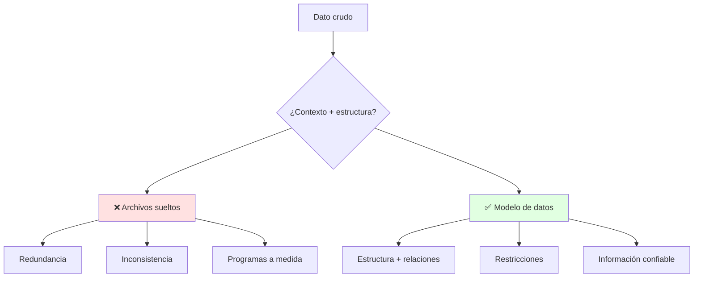
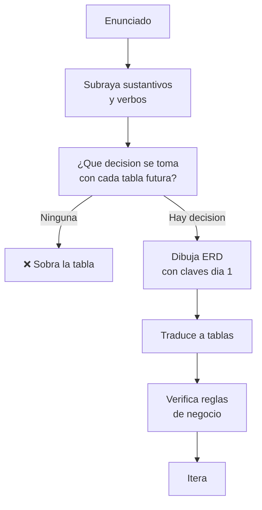

# 💾 Dato, Información y Modelos de Datos

## 🎯 Introducción

> [!info] 💡 ¿Por Qué Modelar Antes de Guardar?
>
> Todo sistema que uses — Aula Virtual, banca móvil, el inventario de una tienda — vive sobre un modelo decidido antes de escribir código. Equivocarse ahí cuesta reescrituras (los egipcios en papiros del 2000 a.C. ya registraban; el medio cambió, el costo de no modelar no). Esta nota responde qué se guarda, cómo se organiza y cómo evolucionó esa respuesta en 60 años.
>
> **¿Dónde se usa?**
> - **Diseño de BD:** todo sistema (notas 02-03, proyecto del curso).
> - **Migraciones:** pasar de Excel/archivos a tablas sin perder nada.
> - **Lección 1 (13-oct):** dato vs información + archivos vs BD, seguro evaluado.



---

## 📋 Definiciones Formales

> [!info] ℹ️ Cómo leer esta sección
> Una definición por bloque, cada una con su ejemplo y su figura.

### 1️⃣ Dato — el valor crudo

> [!note] 📋 Definición — Dato
>
> Valor crudo sin contexto. Por sí solo no dice nada ni permite decidir.
>
>
> ```mermaid
> graph LR
>     D["Dato: 19"]
>     style D fill:#fff4e1
> ```
>
>
> **Ejemplos:** `"19"`, `"Irene"`, `"2026-10-13"`. ¿19 qué? Sin contexto es solo un símbolo guardado.

### 2️⃣ Información — el dato con contexto

> [!note] 📋 Definición — Información
>
> Dato interpretado en un contexto que permite decidir o actuar.
>
>
> ```mermaid
> graph LR
>     D["Dato: 19"] --> C["Contexto:<br/>aprobados SBD"] --> I["Información:<br/>19 aprobaron"]
>     style I fill:#e1ffe1
> ```
>
>
> **Ejemplo:** *"19 estudiantes aprobaron SBD"* — ahora sí hay decisión posible (¿festejar? ¿reforzar?). El modelo de datos existe para producir información, no para acumular datos.

### 3️⃣ Modelo de datos — el plano antes de guardar

> [!note] 📋 Definición — Modelo de datos
>
> Representación lógica y estructurada que define estructura, relaciones, restricciones y transformaciones. Es iterativo y es el lenguaje común entre cliente, analista y dev.
>
>
> ```mermaid
> graph LR
>     R["Requerimiento"] --> M["Modelo ER"]
>     M --> T["Tablas"]
>     T --> I["Información confiable"]
>     style M fill:#e1f5ff
>     style I fill:#e1ffe1
> ```
>
>
> **Por qué importa (diapositivas):** cubre requerimientos desde el diseño; minimiza cambios continuos, redundancia y problemas de acceso; sin buen diseño no hay hardware ni UI que salve el desempeño.
>
> **Ejemplo:** tabla ESTUDIANTE con PK `carnet` — el modelo decidió qué se guarda y cómo se conecta antes de escribir una línea de código.

### 4️⃣ Archivos vs Base de datos — por qué modelar gana

> [!note] 📋 Definición — Sistema de archivos vs base de datos
>
> | Aspecto | Archivos Tradicionales | Base de Datos |
> |---|---|---|
> | **Redundancia** | Mismo dato en N archivos | Definido una vez |
> | **Consistencia** | Se desincroniza | Restricciones la garantizan |
> | **Acceso** | Programas a medida | Lenguaje común (SQL) |
> | **Escala** | Colapsa con usuarios | Concurrente y segura |
>
>
> ```mermaid
> graph TB
>     A["Mismo dato<br/>en 3 archivos"] --> D["Cambia en 1<br/>los otros mienten"]
>     B["Dato una vez<br/>+ restricción"] --> C["Cambia en 1<br/>todos ven lo mismo"]
>     style D fill:#ffe1e1
>     style C fill:#e1ffe1
> ```
>
>
> **Historia real:** egipcios en papiros (2000 a.C.) — el medio cambia, la necesidad de registrar no. Los archivos repiten el problema del papiro (copias que se desincronizan); la BD lo resuelve con unicidad + restricciones.

---
## 🧵 Evolución de los Modelos (Coronel cap. 2)

> [!note] 📋 Un Modelo por Época
>
> | Generación | Época | Modelo | Idea |
> |---|---|---|---|
> | Archivos | 1960s-70s | VSAM, planos | Registros, no relaciones |
> | Segunda | 1970s | **Jerárquico** (IMS, Apollo 1969) | Árbol invertido: un padre, N hijos |
> | Segunda | 1970s | **Red** (ADABAS, IDS-II) | Grafo multipadre + schema/subschema/DML/DDL |
> | Tercera | 1970s-hoy | **Relacional** (Codd 1970) | Tablas + SQL declarativo |
> | Tercera | 1976-hoy | **ER** (Chen) | El plano gráfico del relacional |
> | Cuarta | 1980s-hoy | **OO / Objeto-Relacional** | Objetos con métodos; tipos extensibles |
> | Siguiente | Hoy-futuro | **XML, híbridas, nube** | No estructurado + servicios |
>
### 🔍 Cada generación, dibujada

> [!example] 🧪 Ver los 4 modelos clave
>
> **Jerárquico (un padre, N hijos):** lo compartido se duplica.
>
> Historia: *Ana trabaja en las direcciones Norte y Sur. Como cada hijo tiene un solo padre, su ficha debe copiarse bajo cada dirección.*
>
> ```mermaid
> graph TB
>     D["DIRECCION Norte<br/>(original)"] --> C1["EMPLEADO Ana"]
>     D --> C2["EMPLEADO Luis"]
>     D2["DIRECCION Sur<br/>(copia)"] --> C3["EMPLEADO Ana<br/>(copia)"]
>     style D2 fill:#ffe1e1
>     style C3 fill:#ffe1e1
> ```
>
> **Se lee así:** `dup` = duplicado por obligación del modelo. Cambia el teléfono de Ana y debes cambiarlo en 2 fichas o mienten (redundancia + inconsistencia, los 2 males de archivos).
>
>
> **Red (multipadre):** grafo con schema/subschema; murió por falta de consultas ad hoc.
>
>
> ```mermaid
> graph TB
>     A["PROYECTO X"] --> E1["EMPLEADO Ana"]
>     B["PROYECTO Y"] --> E1
>     B --> E2["EMPLEADO Luis"]
>     style E1 fill:#e1f5ff
> ```
>
>
> **Relacional (Codd 1970):** tablas + SQL declarativo + independencia física.
>
>
> ```mermaid
> erDiagram
>     EMPLEADO ||--o{ PROYECTO : asignado
>     EMPLEADO {
>         int idEmp PK
>     }
>     PROYECTO {
>         int idProy PK
>         int idEmp FK
>     }
> ```
>
>
> **ER (Chen 1976):** el plano gráfico del relacional — rectángulos, rombos y óvalos antes de crear tablas.
>
> ```mermaid
> graph TB
>     E["EMPLEADO<br/><u>idEmp</u>"]
>     R{"trabaja"}
>     P["PROYECTO<br/><u>idProy</u>"]
>     A(["nombre"])
>     E --- R
>     R --- P
>     E --- A
> ```
>
> **Se lee así:** el mismo EMPLEADO–PROYECTO del relacional, pero en Chen puro: todavía no hay tablas ni FK, solo qué existe y cómo se conecta.
>
> 
> **Detalles que evalúan:** el jerárquico duplica lo compartido; la red murió por falta de consultas ad hoc; Codd publicó en CACM (junio 1970); M:N existe en conceptual pero no va al relacional.
>


---

## 🛠️ Método: Del Enunciado al Modelo

> [!note] 📋 Procedimiento General
>
> 1. Subraya sustantivos (candidatos a entidad) y verbos (candidatos a relación).
> 2. Pregunta por cada tabla futura: "¿qué decisión se toma con esto?" (sin pregunta, no hay tabla).
> 3. Dibuja ERD con claves desde el día 1.
> 4. Traduce a tablas y verifica con las reglas de negocio.
> 5. Itera: el modelo se refina, no nace perfecto.
>
> **Principio clave:** modela lo permanente (Estudiantes, Materias), no los formularios — las pantallas cambian, el negocio no.
>




---
## 🎨 Ejemplo Trabajado

> [!example] 🟢 Mini-caso SBD
>
> Enunciado: *"Irene dicta SBD1; cada estudiante toma varias materias."*
>
> | Paso | Resultado |
> |---|---|
> | Sustantivos | Irene→PROFESOR, SBD1→MATERIA, estudiante→ESTUDIANTE |
> | Verbos | *dicta*, *toma* |
> | Claves | carnet, código |
> | Clasificación | PROFESOR–MATERIA 1:M; ESTUDIANTE–MATERIA M:N (pide intermedia) |
>
>
> ```mermaid
> graph TB
>     P["PROFESOR<br/><u>idProf</u>"]
>     D{"dicta<br/>1:M"}
>     M["MATERIA<br/><u>codigo</u>"]
>     T{"toma<br/>M:N"}
>     E["ESTUDIANTE<br/><u>carnet</u>"]
>     A1(["nombre"])
>     P ---|"(1,1)"| D
>     D ---|"(0,N)"| M
>     E ---|"(0,N)"| T
>     T ---|"(0,N)"| M
>     E --- A1
> ```
>
>
> **Se lee así (Chen puro, sin tablas todavía):** Irene (PROFESOR) *dicta* SBD1; cada estudiante *toma* varias materias. La M:N *toma* pedirá una intermedia al traducir (Unidad 2), pero en el conceptual solo existe el rombo.

---
## 🗂️ ¿Cuándo Bastan Archivos?

> [!note] 📋 La excepción que confirma la regla
>
> Solo para datos de usar y tirar: logs simples de una app, cachés temporales, exportaciones de un solo uso. En cuanto haya 2 usuarios, reportes repetidos o decisiones encima → modela.
>
> | Señal | Archivos bastan | Pide BD |
> |---|---|---|
> | **Usuarios** | 1 | Varios concurrentes |
> | **Preguntas** | Siempre las mismas 2 | Nuevas cada semana |
> | **Vida del dato** | Horas/días | Meses/años |

---

## ⚠️ Errores Comunes y Principios Lógicos

> [!warning] ⚠️ Cómo leer esta sección
> Cada error trae su dibujo: lo ❌ que delata el problema y lo ✅ que lo evita.

### ❌ Error 1: Modelar pantallas, no el negocio

> [!danger] ❌ Viola: permanencia del modelo
>
>
> ```mermaid
> graph LR
>     P["❌ Pantalla<br/>Formulario"] --> T["Tabla FORMULARIO"]
>     N["✅ Negocio<br/>Estudiante-Materia"] --> T2["Tablas ESTUDIANTE<br/>MATERIA"]
>     style T fill:#ffe1e1
>     style T2 fill:#e1ffe1
> ```
>
>
> Al cambiar la UI muere la BD. Modela entidades permanentes: las pantallas cambian, el negocio no.

### ❌ Error 2: Tabla sin pregunta

> [!danger] ❌ Viola: toda tabla responde una decisión
>
> Si ningún reporte ni decisión usa la tabla, sobra (todavía). Pregunta por cada tabla futura: *"¿qué decisión se toma con esto?"*. Sin respuesta → no la crees.

### ❌ Error 3: Confundir dato con información

> [!danger] ❌ Viola: contexto antes que almacenamiento
>
> Guardar todo sin contexto es archivar, no diseñar. `19` solo es información cuando sabes que son *"19 estudiantes que aprobaron SBD"* — el modelo captura ese contexto en estructura + restricciones.

### ❌ Error 4: Saltarse el ERD

> [!danger] ❌ Viola: orden obligatorio ERD → tablas → SQL
>
>
> ```mermaid
> graph LR
>     A["❌ Tablas<br/>directo"] --> R["N:M olvidadas<br/>FKs inventadas"]
>     B["✅ ERD<br/>primero"] --> T["Tablas<br/>trazables"]
>     style R fill:#ffe1e1
>     style T fill:#e1ffe1
> ```
>
>
> Ir directo a tablas garantiza N:M olvidadas y FKs inventadas.

---
## 📝 Ejercicios Propuestos

> [!info] ℹ️ Cómo trabajarlos
> Tapa la solución, resuelve, compara. Respuestas colapsables abajo.

### ✏️ Ejercicio 1 — Dato, información o modelo

> [!example] 📋 Planteamiento
>
> Clasifica: 
> - (a) `"19"`, 
> - (b) *"19 estudiantes aprobaron SBD"*, 
> - (c) tabla ESTUDIANTE con PK `carnet`.
>
> > [!success]- ✅ Solución
> >
> > (a) Dato: sin contexto. (b) Información: dato + contexto que permite decidir. (c) Modelo: estructura que produce información de forma repetible.

### ✏️ Ejercicio 2 — ¿Archivos o BD?

> [!example] 📋 Planteamiento
>
> - Caso A: app de 1 usuario con 2 reportes fijos y datos de una semana. 
> - Caso B: matrícula multiusuario con reportes nuevos cada mes. ¿Qué pide cada uno y por qué?
>
> > [!success]- ✅ Solución
> >
> > A: archivos bastan (1 usuario, preguntas fijas, vida corta). B: BD modelada (concurrencia, preguntas cambiantes, decisiones encima). Regla: 2+ usuarios o reportes nuevos → modela.

### ✏️ Ejercicio 3 — Ordena las generaciones

> [!example] 📋 Planteamiento
>
> Ordena (jerárquico, red, relacional, archivos) y explica con 1 línea por qué la red murió aunque era más flexible que el jerárquico.
>
> - Pista 1: el orden es cronológico (60s → 70s).
> - Pista 2: la red pedía programas a medida para preguntar.
> - Pista 3: el relacional trajo SQL declarativo.
>
> > [!success]- ✅ Solución
> >
> > Archivos → jerárquico → red → relacional. La red murió por falta de consultas ad hoc: potente pero solo accesible con programas a medida; el SQL declarativo del relacional la volvió obsoleta.

---

## 🎯 Metas de Aprendizaje

> [!note] 📋 Nivel Básico
>
> - [ ] Defino dato, información y modelo sin mirar.
> - [ ] Explico archivos vs BD con 3 diferencias y 1 ejemplo propio.
> - [ ] Ubico los 6 modelos en su generación con un ejemplo cada uno.
>
> [!note] 📋 Nivel Intermedio
>
> - [ ] Aplico el método de 5 pasos a un enunciado nuevo.
> - [ ] Justifico por qué ganó el relacional (SQL + independencia).
> - [ ] Detecto qué modelo pide un caso dado.

---

## 📚 Referencias

> [!quote] 📖 Fuentes Consultadas
>
> - Diapositivas BD01 (Irene Cheung) + `BD01 Introducción_datamodel.pdf`.
> - C. Coronel, S. Morris, *Database Systems*, 9th ed., cap. 2 §§2.5.1–2.5.7.

---

## 🔁 Repaso SR (flashcards)

#flashcards/bd-u1

> [!note] 🧠 Repasa con el plugin Spaced Repetition
>
> - ¿Dato vs información?::Valor crudo sin contexto vs dato interpretado en contexto.
> - ¿Tres problemas de archivos tradicionales?::Redundancia, inconsistencia y programas a medida.
> - ¿Modelo jerárquico en 1 línea?::Árbol invertido: un padre, N hijos (solo un padre por hijo).
> - ¿Qué aportó la red y por qué murió?::Multipadre + schema/subschema/DML/DDL; murió por falta de consultas ad hoc.
> - ¿Codd, año y aporte?::1970: tablas + SQL declarativo e independencia física.

---

## 🔗 Conexiones

> [!quote] 🔗 Notas Relacionadas
>
> - [[02 - Entidades, atributos, claves y relaciones]] — el vocabulario para dibujar lo de aquí.
> - Ver también [[03 - Modelo relacional, ERM y casos Tiny College]] para la traducción a tablas.

---

**Tags:** #TICG1018 #unidad1 #datos #modelos #bd
