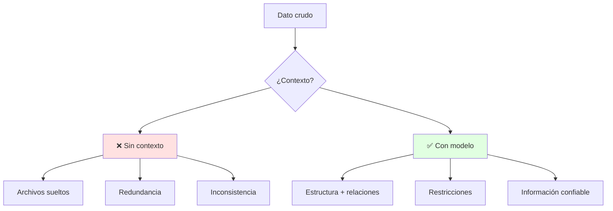
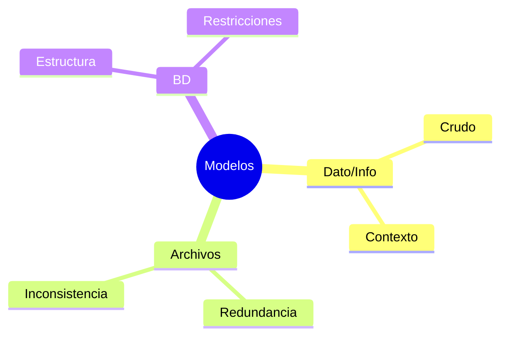

# 💾 Dato, Información y Modelos de Datos

## 🎯 Introducción

> [!info] 💡 ¿Por Qué no Guardar Todo en Archivos?
>
> Un **dato** es un valor crudo ("19"); la **información** es el dato con contexto ("19 estudiantes aprobaron"). Los **sistemas de archivos** guardan datos, pero las **bases de datos** administran información con estructura, relaciones y restricciones.
>
> **Analogía del mundo real:** Piensa en una tienda:
>
> - **Archivos sueltos** → Cuaderno por mes: para saber stock cruzas 12 cuadernos a mano (redundancia, inconsistencia)
> - **Base de datos** → Un sistema donde stock, ventas y clientes se conectan (1 cambio, todo coherente)
> - **Historia real** → Egipcios en papiros (2000 a.C.): el medio cambia, la necesidad de registrar no
> - **Tu proyecto** → Sin modelo, tu app es un cuaderno digital con los mismos vicios
>
> | Razón | Archivos Tradicionales | Base de Datos |
> |---|---|---|
> | **Redundancia** | Mismo dato en N archivos | Definido una vez |
> | **Consistencia** | Se desincroniza | Restricciones la garantizan |
> | **Acceso** | Programas a medida | Lenguaje común (SQL) |
> | **Escala** | Colapsa con usuarios | Concurrente y segura |



---

## 🧵 Modelar: del Mundo Real a la Estructura

### 🎭 Qué es un Modelo de Datos

> [!note] 🎨 Representación Gráfica del Problema
>
> Un **modelo de datos** organiza los datos de forma lógica y estructurada: define estructura, relaciones, restricciones y transformaciones. Es iterativo (se refina) y es el lenguaje común entre roles (cliente, analista, dev).
>
> **Por qué importa (diapositiva 3, unidad1.3-1.5):**
>
> - Cubre los requerimientos de la aplicación desde el diseño
> - Minimiza cambios continuos, redundancia y problemas de acceso
> - Sin buen diseño no hay hardware ni UI que salve el desempeño
>
> ```mermaid
> graph LR
>     U[Mundo real<br/>Estudiantes, Materias] --> M[Modelo<br/>entidades + relaciones]
>     M --> B[BD implementada]
>
>     style M fill:#e1f5ff
> ```

---

## ⚠️ Problemas Comunes y Soluciones

> [!danger] ❌ Error: Confundir Dato con Información
>
> **Síntomas:** diseñas tablas que guardan todo pero no responden ninguna pregunta del negocio.
>
> **Solución:**
>
> - Antes de cada tabla pregunta: "¿qué decisión se toma con esto?" (como en SBD: Irene dicta SBD1 — ¿quién toma qué?)
> - Si no hay pregunta, no hay tabla todavía

---

## 🎯 Mejores Prácticas

> [!tip] 🏆 Checklist de Modelado
>
> **1. Modela la empresa, no los formularios**
>
> - Estudiantes, Profesores, Materias existen aunque cambie la pantalla
>
> **2. Itera el modelo con las reglas de negocio**
>
> - Cada regla ("un estudiante toma N materias") debe verse en el diagrama
>
> **3. Lección 1 (13-oct): archivos vs BD + dato vs información**
>
> - Lleva 2 ejemplos propios de redundancia en archivos

---

## 📊 Resumen Visual



> [!success] 🔍 Comparación Final
>
> | Aspecto | Archivos | BD Modelada |
> |---|---|---|
> | **Preguntas** | ❌ A mano | ✅ SQL |
> | **Cambios** | Riesgo total | Controlados |
> | **Uso Recomendado** | Logs simples | ✅ **Todo sistema** |

---

## 🚀 Próximos Pasos

> [!quote] 🌟 Continuando
>
> **Has aprendido:**
>
> ✅ Dato vs información con historia real
> ✅ Archivos vs BD y el costo de no modelar
> ✅ Modelo como lenguaje común e iterativo
>
> **Próximo tema:**
>
> | Tema | Qué verás | Por qué importa |
> |---|---|---|
> | **Entidades, atributos y relaciones** | ER + reglas de negocio | El vocabulario del diagrama |

---

## 🔗 Seguir estudiando

> [!info] 📚 Seguir estudiando
>
> - Mapa de contenido: [[Sistema de Bases de Datos]]
> - Índice Unidad 1: [[00 - Índice Unidad 1]]
> - Siguiente: [[02 - Entidades, atributos, relaciones y reglas de negocio]]
> - Syllabus: [[Bienvenida y Syllabus Sistema de Bases de Datos]]

## 📚 Referencias

> [!quote] 📖 Fuentes
>
> - Diapositivas BD01 (Irene Cheung, PAO 2026-2): dato, información, archivos vs BD.
> - `BD01 Introducción_datamodel.pdf` + `BD01 Introducción-1.pdf`.

---

**Tags:** #TICG1018 #unidad1 #datos #modelos #bd
