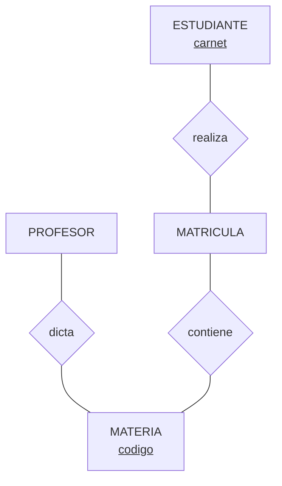

# 🧩 Entidades, Atributos, Claves y Relaciones

## 🎯 Introducción

> [!info] 💡 ¿Por Qué Todo Diagrama Empieza con Sustantivos y Verbos?
>
> Un ERD mal leído aprueba diagramas imposibles: relaciones sin verbo, tablas sin clave, cardinalidades adivinadas. Este vocabulario (5 piezas) es el filtro con el que validarás cada diagrama del curso, del proyecto y de la Lección 1 — leerlo en voz alta detecta relaciones falsas en segundos.
>
> **Aplicaciones:**
> - **Diseño de BD:** cada diagrama del curso y del proyecto usa estas piezas.
> - **Validación:** leer un ER en voz alta detecta relaciones falsas en segundos.
> - **Lección 1 (13-oct):** definir cada pieza con ejemplo propio es pregunta segura.



---

## 📋 Definiciones Formales

> [!info] ℹ️ Cómo leer esta sección
> Una definición por bloque, cada una con su ejemplo y su figura. Todo en Chen: rectángulo = entidad, rombo = relación, óvalo = atributo, subrayado = clave.

### 1️⃣ Entidad — lo que existe por sí mismo

> [!note] 📋 Definición — Entidad
>
> Objeto distinguible del mundo real; cada instancia es única y se identifica por clave. Dibuja rectángulo.
>
> ```mermaid
> graph TB
>     E["ESTUDIANTE<br/><u>carnet</u>"]
>     A1(["nombre"])
>     A2(["carrera"])
>     E --- A1
>     E --- A2
> ```
>
> **Ejemplo:** ESTUDIANTE existe aunque nadie lo mencione; `nombre` y `carrera` lo describen pero no son entidades.

### 2️⃣ Atributo — lo que describe

> [!note] 📋 Definición — Atributo
>
> Propiedad que describe a una entidad (óvalo) o a una relación. La **clave** identifica; el resto describe.
>
> ```mermaid
> graph TB
>     E["CLIENTE<br/><u>cedula</u>"]
>     A1(["nombre"])
>     A2(["direccion"])
>     E --- A1
>     E --- A2
> ```
>
> **Ejemplo:** `cedula` identifica (clave, subrayada); `nombre` y `direccion` describen. Si un dato describe a otro dato, es atributo, no entidad.

### 3️⃣ Relación — el verbo que conecta

> [!note] 📋 Definición — Relación
>
> Asociación con significado entre entidades (rombo con verbo). Se lee en voz alta: *"¿quién toma qué?"*.
>
>
> ```mermaid
> graph TB
>     E1["ESTUDIANTE"]
>     R{"toma"}
>     E2["MATERIA"]
>     E1 --- R
>     R --- E2
> ```
>
>
> **Ejemplo:** *toma* conecta ESTUDIANTE con MATERIA. Sin verbo no hay relación (ver Error 1: línea muda).

### 4️⃣ Claves — PK, FK, candidata y compuesta

> [!note] 📋 Definición — Claves
>
> - **Primaria (PK):** única + no nula + estable + mínima. Identifica cada instancia.
> - **Foránea (FK):** copia de una PK ajena que conecta tablas (vive en el lógico, se dibuja como óvalo marcado).
> - **Candidata:** podría ser PK pero no fue elegida (queda como reserva única).
> - **Compuesta:** PK de 2+ atributos que solo juntos identifican.
>
>
> ```mermaid
> graph TB
>     E["MATRICULA"]
>     K1(["<u>carnet</u><br/>PK+FK"])
>     K2(["<u>codigo</u><br/>PK+FK"])
>     E --- K1
>     E --- K2
> ```
>
>
> **Ejemplo:** en MATRÍCULA ni `carnet` ni `codigo` identifican solos; juntos sí → PK compuesta donde cada parte es FK a su tabla.

### 5️⃣ Restricción — lo que el negocio manda

> [!note] 📋 Definición — Restricción y reglas de negocio
>
> Límite que el diagrama debe cumplir: cardinalidad, cupos, prerrequisitos. Las **reglas de negocio** mandan sobre el dibujo: si el negocio dice "máximo 4 materias", el ER lo refleja.
>
> ```mermaid
> graph LR
>     R["Regla de negocio"] --> D["¿Dónde vive en el ER?"]
>     D --> C1["Cardinalidad (x,y)"]
>     D --> C2["FK obligatoria"]
>     D --> C3["Entidad débil"]
>     style R fill:#fff4e1
> ```
>
> **Se lee así:** cada regla cae en un elemento del dibujo. *"Sin cupo no hay matrícula"* → FK obligatoria no nula. *"Máximo 4 materias"* → (1,4).
>
> **Ejemplo:** *"Cada profesor dicta de 1 a 4 clases"* → cardinalidad (1,4) junto a CLASS. *"Sin cupo no hay matrícula"* → FK obligatoria no nula.

### 6️⃣ Conectividad — la clasificación en ambas direcciones

> [!note] 📋 Definición — Conectividad (Coronel 4.1.4)
>
> Clasificación 1:1, 1:M, M:N — siempre en **ambas direcciones**: *"un CLIENTE genera muchas FACTURAS"* + *"cada FACTURA es de un CLIENTE"* → 1:M.
>
>
> ```mermaid
> graph LR
>     P["PROFESOR"]
>     C["CLASE"]
>     P ---|"(1,1)<br/>cada clase, un profesor"| D{"dicta"}
>     D ---|"(1,4)<br/>cada profesor, 1 a 4"| C
> ```
>
>
> **Ejemplo:** lee el dibujo en voz alta en los dos sentidos antes de clasificar.
>
>
> ```mermaid
> erDiagram
>     A ||--|| B : "1:1"
>     C ||--o{ D : "1:M"
>     E }o--o{ F : "M:N"
> ```
>
>
> **Leyenda pata de gallo → (x,y):**
>
> - Barra `||` = exactamente 1 → (1,1).
> - Círculo `o` = cero opcional → (0,x).
> - Pata `}o` / `o{` = muchos → (x,N).
> - `||--||` = (1,1)-(1,1).
> - `||--o{` = (1,1)-(0,N).
> - `}o--o{` = (0,N)-(0,N).
>
> Lee el símbolo y ya no memorizas números.

### 7️⃣ Cardinalidad — el (x,y) de cada lado

> [!note] 📋 Definición — Cardinalidad (x,y)
>
> Dos números por lado: **mínimo** (¿puede ser cero?) y **máximo** (¿cuántos a lo más?).
>
> - `(1,1)` = exactamente 1: mínimo 1 y máximo 1. Cada clase tiene un y solo un profesor.
> - `(1,4)` = de 1 a 4: mínimo 1 (todo profesor dicta al menos una) y máximo 4 (a lo más cuatro).
> - `(0,N)` = opcionales muchos: mínimo 0 (puede no tener) y máximo sin tope.
>
> ```mermaid
> graph LR
>     P["PROFESOR"] ---|"(1,1)<br/>exactamente 1"| D{"dicta"}
>     D ---|"(1,4)<br/>de 1 a 4"| C["CLASE"]
> ```
>
> **Cómo colocarlo:** Chen lo escribe del lado de la entidad **relacionada**; Crow's Foot/UML junto a la entidad a la que aplica. Y ojo: el DBMS **no** implementa cardinalidad en tablas — vive en la app o en triggers.
>
> **El cero importa:** `ALUMNO (0,n)` en *matricula* = un recién ingresado aún no se matriculó en nada. Lee siempre el mínimo: el 0 cuenta historias.
>
>
>
> **Se lee en patas:** del lado PROFESOR la barra `||` = cada clase tiene exactamente 1 profesor (1,1); del lado CLASE la pata `o{` = cada profesor dicta 0 a N clases (0,N). El (1,4) del ejemplo es una pata con tope: de 1 a 4.

### 8️⃣ Dependencia — existir gracias a otro

> [!note] 📋 Definición — Dependencia de existencia (Coronel 4.1.5)
>
> - **Dependiente:** solo existe asociada a otra (FK obligatoria no nula). Ej.: DEPENDENT sin EMPLOYEE no existe.
> - **Fuerte (regular):** existe sola. Ej.: PART existe sin VENDOR si algunas partes son propias.
>
>
> ```mermaid
> graph TB
>     E["EMPLEADO<br/>fuerte"]
>     D["DEPENDIENTE<br/>débil"]
>     E --- D
>     style D fill:#ffe1e1
> ```
>
>
> **Ejemplo:** borra al empleado y sus dependientes pierden sentido; borra un proveedor y tus partes propias siguen existiendo.

---
## 🛠️ Método para Construir el Vocabulario ER

> [!note] 📋 Procedimiento General
>
> 1. Subraya sustantivos (entidades) y verbos (relaciones) del enunciado.
> 2. Asigna PK a cada entidad (sin clave no hay entidad).
> 3. Nombra cada relación con verbo + lectura en ambos sentidos.
> 4. Escribe la clasificación en ambas direcciones (pregunta de vuelta si falta una).
> 5. Anota cardinalidades (x,y) y lista las reglas de negocio 1:1 con el dibujo.
> 6. Verifica: ¿todo se lee en voz alta? ¿toda tabla futura tiene PK?
>
> **Principio clave:** lo que no está dibujado no existe; lo que no tiene clave no es entidad.
>
> ```mermaid
> flowchart TD
>     A["Subraya sustantivos<br/>y verbos"] --> B["Asigna PK<br/>a cada entidad"]
>     B --> C["Nombra relaciones<br/>con verbo"]
>     C --> D["Clasifica en<br/>ambas direcciones"]
>     D --> E["Anota (x,y)<br/>y reglas"]
>     E --> F{"¿Se lee en voz alta<br/>y todo tiene PK?"}
>     F -->|"No"| C
>     F -->|"Si"| G["ERD valido"]
>     style G fill:#e1ffe1
> ```

---

## 🎨 Ejemplos Trabajados

> [!info] ℹ️ Cómo trabajarlos
> Cada ejemplo trae su dibujo: tapa la solución, clasifica tú, compara.

### ✏️ Ejemplo 1 — Clasificar DIVISION–EMPLOYEE

> [!example] 🟢 La pregunta de vuelta decide
>
> Solo sabes: *"Una DIVISIÓN es manejada por un EMPLEADO"* — insuficiente (¿1:1 o 1:M?).
>
>
> ```mermaid
> flowchart TD
>     A["Una DIVISION es<br/>manejada por un EMPLEADO"] --> B{"Puede un empleado<br/>manejar varias?"}
>     B -->|"Si"| C["1:M<br/>Un EMPLEADO maneja<br/>muchas DIVISIONes"]
>     B -->|"No"| D["1:1<br/>Un EMPLEADO maneja<br/>una sola DIVISION"]
>     style C fill:#e1ffe1
>     style D fill:#fff4e1
> ```
>
>
> **Moraleja:** sin la segunda frase, clasificar es adivinar. Escribe siempre ambas direcciones.

### ✏️ Ejemplo 2 — Claves de ESTUDIANTE–MATERIA

> [!example] 🟢 Elegir PK como profesional
>
>
> ```mermaid
> graph TB
>     E["ESTUDIANTE<br/><u>carnet</u>"]
>     R{"matriculado"}
>     M["MATERIA<br/><u>codigo</u>"]
>     A1(["email<br/>cambia: no es PK"])
>     E ---|"(0,N)"| R
>     R ---|"(0,N)"| M
>     E --- A1
> ```
>
>
> **Se lee así (Chen puro):** el estudiante *se matricula* en materias; `carnet` (estable) identifica, `email` (cambia) solo describe. Al traducir nacerá MATRÍCULA con clave compuesta (Unidad 2).
>
> | Decisión | Elección | Por Qué |
> |---|---|---|
> | PK ESTUDIANTE | `carnet` | Único, no nulo, estable (el email cambia) |
> | PK MATERIA | `codigo` | Identifica sin dudar |
> | FKs en MATRÍCULA | `carnet + codigo` (compuesta) | Conecta ambas + identifica la matrícula |
> | Nombres | `STU_LNAME`, `CRS_CODE` | Prefijo de entidad: autodocumenta (Coronel 2.4.3) |
>
>
> ```mermaid
> erDiagram
>     ESTUDIANTE ||--o{ MATRICULA : tiene
>     ESTUDIANTE {
>         int carnet PK
>         string email UK
>         string nombre
>     }
>     MATRICULA {
>         int carnet PK, FK
>         string codigo PK, FK
>     }
> ```
>
>
> **Anatomía de llaves:** `PK` = identifica la fila; `FK` = apunta a otra tabla; `UK` (candidata) = única pero no elegida; `PK, FK` juntas = compuesta que además referencia. Toda entidad nace con PK.

---
### ✏️ Ejemplo 3 — La trampa CALIFICACIÓN (atributo que parecía entidad)

> [!example] 🟢 ¿Existe una nota por sí sola?
>
> Caso control académico: ALUMNO–ASIGNATURA con *matricula(nota, fecha, intento)*. Casi todos crean la entidad CALIFICACION — **error**.
>
> ```mermaid
> graph TB
>     E1["ALUMNO"]
>     R{"matricula"}
>     E2["ASIGNATURA"]
>     A(["nota*<br/>de la relación"])
>     E1 --- R
>     R --- E2
>     R --- A
> ```
>
> **Regla:** ¿existe por sí sola? Una nota solo existe con un alumno Y una asignatura a la vez → es **atributo de la relación**, no entidad. Trampa inversa a la del taller (allí sobraba un atributo que debía ser entidad).
>
> > [!quote] 📖 C. Zavaleta, *MER: guía completa con ejemplos*, caso control académico (2026)

## 📋 Tablas Comparativas

> [!note] 📋 Fuerte vs Dependiente · Simple vs Compuesta
>
> | Entidad | ¿Existe Sola? | Tipo |
> |---|---|---|
> | EMPLOYEE | Sí | Fuerte |
> | DEPENDENT | No, exige EMPLOYEE | Dependiente |
> | PART (propias + compradas) | Sí | Fuerte |
>
> | PK | Cuándo | Ejemplo |
> |---|---|---|
> | **Simple** | Una columna identifica | `CLASS_CODE` |
> | **Compuesta** | Solo combinadas identifican | `CRS_CODE + CLASS_SECTION` |
> | **Candidata no elegida** | Reserva única | `CLASS_CODE` si se elige la compuesta |

---

## ⚠️ Errores Comunes y Principios Lógicos

> [!warning] ⚠️ Cómo leer esta sección
> Cada error trae su dibujo: lo ❌ que delata el problema y lo ✅ que lo evita.

### ❌ Error 1: Relación sin verbo ("línea muda")

> [!danger] ❌ Viola: toda relación se lee en voz alta
>
>
> ```mermaid
> graph LR
>     A["❌ ESTUDIANTE —— MATERIA<br/>¿quien hace que?"] --> B["nadie lo sabe"]
>     C["✅ ESTUDIANTE --toma--> MATERIA"] --> D["se lee en voz alta"]
>     style B fill:#ffe1e1
>     style D fill:#e1ffe1
> ```
>
>
> Dos rectángulos unidos que nadie sabe leer: nómbrala con verbo o bórrala.

### ❌ Error 2: Clasificar con una sola dirección

> [!danger] ❌ Viola: conectividad siempre en ambas direcciones
>
> Sin la frase de vuelta es adivinanza (ver Ejemplo 1: DIVISION–EMPLOYEE puede ser 1:1 o 1:M). Escribe las dos frases antes de dibujar cardinalidades.

### ❌ Error 3: PK significativa que cambia

> [!danger] ❌ Viola: la PK debe ser estable
>
>
> ```mermaid
> graph TB
>     E["ESTUDIANTE"]
>     A(["<u>email</u><br/>❌ cambia"])
>     B(["<u>carnet</u><br/>✅ estable"])
>     E --- A
>     E --- B
> ```
>
>
> Email o nombre como PK → cascada de updates cuando cambian. Usa código estable (`carnet`, `codigo`): lo significativo describe, no identifica.

### ❌ Error 4: Todo es entidad / todo es atributo

> [!danger] ❌ Viola: existe por sí mismo vs describe
>
> Pregunta por cada sustantivo: ¿existe por sí mismo (entidad) o solo describe a otro (atributo)? `Dirección` describe a CLIENTE → atributo. `MATERIA` existe sola → entidad.

### ❌ Error 5: FK que apunta a nada

> [!danger] ❌ Viola: integridad referencial (carga el 1 primero)
>
>
> ```mermaid
> flowchart TD
>     A["❌ Cargar MATRICULA<br/>antes que ESTUDIANTE"] --> B["FK apunta a nada<br/>insercion rechazada"]
>     C["✅ Orden: 1 primero<br/>ESTUDIANTE, MATERIA"] --> D["Despues el N<br/>MATRICULA"]
>     style B fill:#ffe1e1
>     style D fill:#e1ffe1
> ```
>
>
> Carga el lado 1 primero o violas integridad referencial.

---
## 📝 Ejercicios Propuestos

> [!info] ℹ️ Cómo trabajarlos
> Tapa la solución, resuelve, compara. Respuestas colapsables abajo.

### ✏️ Ejercicio 1 — Clasifica en ambas direcciones

> [!example] 📋 Planteamiento
>
> *"Un PROFESOR dicta CLASES."* Escribe las dos frases y clasifica. Luego cambia el negocio a *"cada clase la dicta un solo profesor pero cada profesor dicta máximo 1 clase"* y reclasifica.
>
> > [!success]- ✅ Solución
> >
> > Versión 1: "un profesor dicta muchas clases" + "cada clase la dicta un profesor" → 1:M. Versión 2: ambas frases en singular → 1:1. Sin la frase de vuelta era adivinanza.

### ✏️ Ejercicio 2 — Elige las claves

> [!example] 📋 Planteamiento
>
> ESTUDIANTE tiene `carnet, email, nombre`. MATERIA tiene `codigo, nombre`. Diseña MATRÍCULA con sus PK/FK justificando cada elección.
>
> > [!success]- ✅ Solución
> >
> > PK ESTUDIANTE = `carnet` (estable; email cambia). PK MATERIA = `codigo`. MATRÍCULA(`carnet` PK,FK + `codigo` PK,FK): compuesta porque ninguno identifica solo y cada parte referencia a su tabla.

### ✏️ Ejercicio 3 — Detecta la línea muda

> [!example] 📋 Planteamiento
>
> Un diagrama une CLIENTE con FACTURA sin verbo ni cardinalidad. Lista todo lo que falta y escribe las 2 frases que lo completarían (supón 1:M).
>
> > [!success]- ✅ Solución
> >
> > Falta: verbo (*genera*), clasificación en ambas direcciones y cardinalidad (x,y). Frases: "un cliente genera muchas facturas" + "cada factura es de un cliente" → 1:M con (1,N)-(1,1).

---

## 🎯 Metas de Aprendizaje

> [!note] 📋 Nivel Básico
>
> - [ ] Defino entidad, atributo, relación, PK, FK y candidata sin mirar.
> - [ ] Leo un ERD en voz alta en ambas direcciones.
> - [ ] Elijo la PK correcta justificando unicidad, nulidad y estabilidad.
>
> [!note] 📋 Nivel Intermedio
>
> - [ ] Clasifico 1:1/1:M/M:N escribiendo ambas frases.
> - [ ] Escribo cardinalidades (x,y) del lado correcto según notación.
> - [ ] Distingo entidad fuerte de dependiente con ejemplo propio.
>
> [!note] 📋 Nivel Avanzado
>
> - [ ] Aplico el método de 6 pasos a un enunciado nuevo sin ayuda.
> - [ ] Detecto relaciones mudas y PKs cambiantes en diagramas ajenos.

---

## 📚 Referencias

> [!quote] 📖 Fuentes Consultadas
>
> - Diapositivas BD01 (Irene Cheung) + `unidad1.3-1.5.pdf`.
> - C. Coronel, S. Morris, *Database Systems*, 9th ed., cap. 4 §§4.1.3–4.1.5 y cap. 2 §2.4.3.
> - C. Zavaleta, *Modelo entidad-relación (MER): guía completa con ejemplos* (casos taller, universidad, empleados, banco), 2026 — https://cesarzavaleta.dev/modelo-entidad-relacion-mer/

---

## 🔁 Repaso SR (flashcards)

#flashcards/bd-u1

> [!note] 🧠 Repasa con el plugin Spaced Repetition
>
> - ¿Entidad vs atributo vs relación?::Sustantivo que existe / propiedad que describe / verbo que conecta.
> - ¿Reglas de una buena PK?::Única + no nula + estable + mínima.
> - ¿Conectividad vs cardinalidad?::Clasificación 1:1/1:M/M:N vs mínimo-máximo (x,y).
> - ¿Entidad débil (2 condiciones)?::Existencia-dependiente + PK derivada del padre.
> - ¿Cómo sé si una relación es 1:M y no 1:1?::Escribiendo ambas direcciones (pregunta de vuelta).
- ¿Trampa CALIFICACIÓN?::La nota no existe sola (alumno + asignatura a la vez): atributo de la relación, no entidad.

---

## 🔗 Conexiones

> [!quote] 🔗 Notas Relacionadas
>
> - [[01 - Dato, información y modelos de datos]] — el problema que este vocabulario resuelve.
> - [[03 - Modelo relacional, ERM y casos Tiny College]] — donde estas piezas se vuelven tablas.
> - Ver también la nota de **Claves** integrada arriba si vienes de un link viejo: ahora vive aquí.

---

**Tags:** #TICG1018 #unidad1 #er #claves #relaciones #bd
