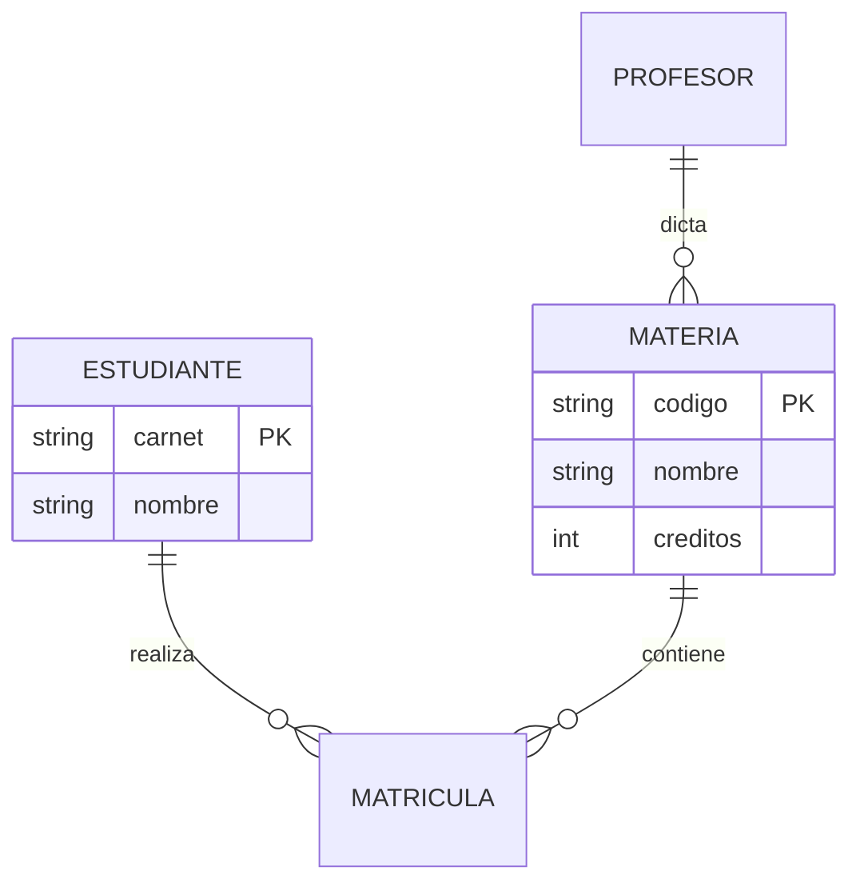
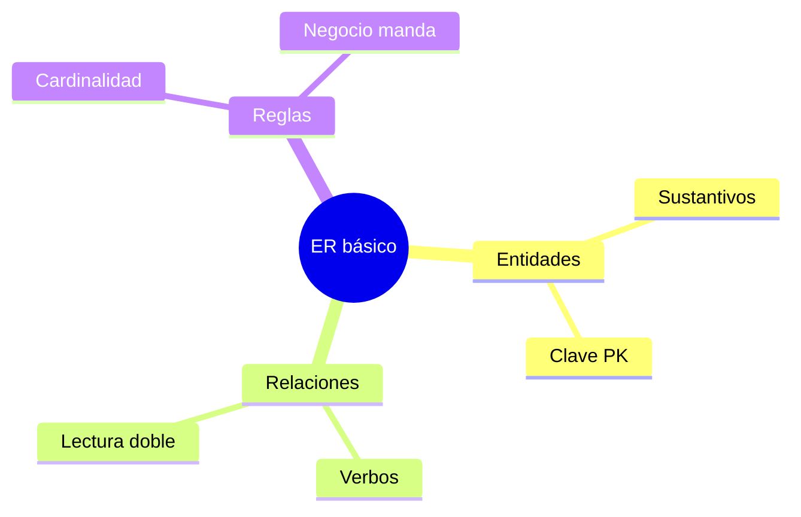

# 🧩 Entidades, Atributos, Relaciones y Reglas de Negocio

## 🎯 Introducción

> [!info] 💡 ¿Por Qué Todo Diagrama Empieza con Sustantivos y Verbos?
>
> Las **entidades** son los sustantivos del negocio (Estudiante, Materia); las **relaciones** son los verbos (toma, dicta); los **atributos** describen (nombre, código); las **restricciones** ponen límites. Las **reglas de negocio** mandan sobre todo: el diagrama las obedece.
>
> **Analogía del mundo real:** Piensa en armar un equipo de fútbol:
>
> - **Entidades** → Jugadores, Equipos, Partidos (existen solos)
> - **Atributos** → Dorsal, posición, fecha (los describen)
> - **Relaciones** → "Juega en", "dirige" (los conectan)
> - **Regla de negocio** → "Un jugador, un equipo por torneo" (el diagrama debe impedir lo contrario)
>
> | Pieza | Pregunta | Ejemplo SBD |
> |---|---|---|
> | **Entidad** | ¿Qué existe? | Estudiante, Profesor, Materia |
> | **Atributo** | ¿Qué lo describe? | Nombre, código, créditos |
> | **Relación** | ¿Quién hace qué? | Irene *dicta* SBD1 |
> | **Restricción** | ¿Qué no se permite? | Cupo máximo, prerrequisito |

---

## 🧵 Leer y Escribir ER (diapositivas BD01)

### 🎭 Vocabulario Mínimo del Diagrama

> [!note] 🎨 Sustantivos, Verbos y Límites
>
> - **Entidad** (rectángulo): objeto distinguible del mundo real; cada instancia es única (se identifica por clave).
> - **Atributo** (óvalo/columna): propiedad; clave (PK) identifica, resto describe.
> - **Relación** (rombo/verbo): conexión con significado — se lee en voz alta: "¿quién toma qué? ¿quién dicta qué?".
> - **Restricción**: cardinalidad y reglas ("un estudiante toma N materias; una materia tiene 1 profesor").
>
> | Si tu diagrama... | Entonces... |
> |---|---|
> | No se lee en voz alta | La relación no tiene verbo real |
> | Todo es atributo | Te faltan entidades (revisa sustantivos) |
> | Todo es entidad | Te sobran tablas (revisa qué describe a qué) |
> | Ignora una regla de negocio | El diseño ya nació roto |

---

## ⚠️ Problemas Comunes y Soluciones

> [!danger] ❌ Error: Relaciones sin Verbo ("líneas mudas")
>
> **Síntomas:** dos rectángulos unidos por una línea que nadie sabe leer; cada quien la interpreta distinto.
>
> **Solución:**
>
> - Nombra TODA relación con verbo + lectura en ambos sentidos ("dicta / es dictada por")
> - Si no puedes leerla en voz alta, bórrala y repiensa

---

## 🎯 Mejores Prácticas

> [!tip] 🏆 Checklist ER
>
> **1. Sustantivos primero, del enunciado**
>
> - Subraya sustantivos (candidatos a entidad) y verbos (candidatos a relación) del problema
>
> **2. Clave siempre**
>
> - Toda entidad nace con su identificador (carnet, código); sin clave no hay tabla futura
>
> **3. Reglas de negocio al lado del diagrama**
>
> - Lista numerada 1:1 con lo dibujado; lo que no está dibujado no existe

---

## 📊 Resumen Visual

> [!success] 🔍 Comparación Final
>
> | Aspecto | Líneas Mudas | ER con Verbos |
> |---|---|---|
> | **Lectura** | ❌ Ambigua | ✅ En voz alta |
> | **Reglas** | Implícitas | Dibujadas |
> | **Uso Recomendado** | Nunca entregar | ✅ **Base de toda BD** |

---

## 🚀 Próximos Pasos

> [!quote] 🌟 Continuando
>
> **Has aprendido:**
>
> ✅ Entidades, atributos, relaciones y restricciones
> ✅ Lectura en voz alta y test de sustantivos
> ✅ Reglas de negocio como jefas del diagrama
>
> **Próximo tema:**
>
> | Tema | Qué verás | Por qué importa |
> |---|---|---|
> | **Modelo relacional y ERM** | Codd, tablas, Chen 1976, notaciones | Del dibujo a la BD real |

---

## 🔗 Seguir estudiando

> [!info] 📚 Seguir estudiando
>
> - Mapa de contenido: [[Sistema de Bases de Datos]]
> - Índice Unidad 1: [[00 - Índice Unidad 1]]
> - Anterior: [[01 - Dato, información y modelos de datos]]
> - Siguiente: [[03 - Modelo relacional y modelo entidad-relación]]
> - Syllabus: [[Bienvenida y Syllabus Sistema de Bases de Datos]]

## 📚 Referencias

> [!quote] 📖 Fuentes
>
> - Diapositivas BD01 (Irene Cheung): entidades, relaciones, reglas de negocio.
> - `unidad1.3-1.5.pdf` (modelo conceptual).

---

**Tags:** #TICG1018 #unidad1 #er #entidades #relaciones
