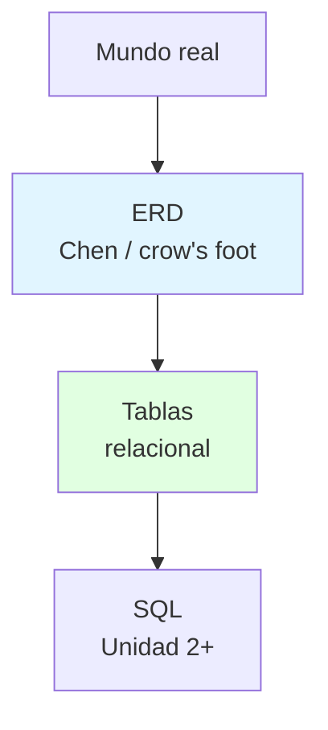
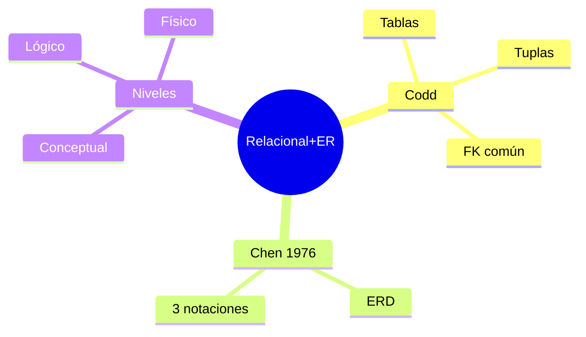

# 🗃️ Modelo Relacional y Modelo Entidad-Relación

## 🎯 Introducción

> [!info] 💡 ¿Por Qué las Tablas Ganaron?
>
> El **modelo relacional** (E. F. Codd) guarda todo en tablas conectadas por columnas comunes, con base matemática. El **ERM** (Peter Chen, 1976) nació para modelar estructuras más avanzadas con mejor graficación (ERD). Uno implementa, el otro diseña.
>
> **Analogía del mundo real:** Piensa en una biblioteca:
>
> - **Relacional** → Fichero con tarjetas uniformes (filas) y casillas fijas (columnas); dos ficheros se conectan por el carnet común
> - **ERM/ERD** → El plano del fichero: qué tarjetas existen y cómo se relacionan, antes de comprar un mueble
> - **Tupla/fila** → Una tarjeta llena (un estudiante concreto)
> - **Atributo/columna** → Una casilla (nombre, código)
>
> | Concepto | Relacional (implementa) | ERM (diseña) |
> |---|---|---|
> | **Autor/año** | Codd | Chen 1976 |
> | **Pieza base** | Relación = tabla (filas × columnas) | Entidad + relación graficadas |
> | **Conexión** | Columna en común | Rombo/verbo + cardinalidad |
> | **Notaciones ERD** | — | Chen, pata de gallo (crow's foot), clases |

---

## 🧵 Niveles de Abstracción y Notaciones (unidad1.3-1.5)

### 🎭 Del Boceto a las Tablas sin Perder Nada

> [!note] 🎨 Tres Niveles, Un Hilo
>
> 1. **Conceptual** (ERD): qué existe y cómo se relaciona — sin pensar en motor.
> 2. **Lógico** (relacional): tablas, claves primarias/foráneas, tipos.
> 3. **Físico** (motor real): índices, almacenamiento, permisos.
>
> **Notaciones ERD que verás:**
>
> | Notación | Marca | Cuándo la ves |
> |---|---|---|
> | **Chen** | Rectángulos + rombos + óvalos | Libros y parciales teóricos |
> | **Pata de gallo** | Símbolos de cardinalidad en la línea | Herramientas y pizarrón ágil |
> | **Clases (UML)** | Cajas UML | Cuando el equipo viene de POO/Diseño |
>
> **Regla de traducción ER→tablas:**
>
> - Entidad → tabla; atributo → columna; clave → PK
> - Relación N:M → tabla intermedia con las 2 FK
> - Relación 1:N → FK del lado N

---

## ⚠️ Problemas Comunes y Soluciones

> [!danger] ❌ Error: Diseñar Tablas sin Pasar por el ER
>
> **Síntomas:** columnas repetidas en varias tablas, FKs inventadas sobre la marcha, N:M sin intermedia.
>
> **Solución:**
>
> - Orden obligatorio: ERD → tablas → SQL (cada salto verificable)
> - N:M siempre crea intermedia; si no la ves, el modelo está incompleto

---

## 🎯 Mejores Prácticas

> [!tip] 🏆 Checklist Relacional
>
> **1. Toda tabla con PK desde el día 1**
>
> - Sin identificador no hay fila distinguible ni FK posible
>
> **2. Nombres de columnas compartidas idénticos**
>
> - La conexión relacional vive de la columna en común
>
> **3. Lección 1 (13-oct): Codd + Chen en 2 frases**
>
> - "Codd: todo en tablas conectadas. Chen 1976: dibújalo primero."

---

## 📊 Resumen Visual

> [!success] 🔍 Comparación Final
>
> | Aspecto | Tablas Directo | ER → Tablas |
> |---|---|---|
> | **N:M** | ❌ Olvidada | Intermedia natural |
> | **Reglas** | En la cabeza | En el diagrama |
> | **Uso Recomendado** | Tablita auxiliar | ✅ **Todo modelo serio** |

---

## 🚀 Próximos Pasos

> [!quote] 🌟 Continuando
>
> **Has aprendido:**
>
> ✅ Relacional (Codd) vs ERM (Chen 1976)
> ✅ 3 notaciones y 3 niveles de abstracción
> ✅ Traducción ER→tablas con intermedias
>
> **Próximo tema (cuando avance la docente):**
>
> | Tema | Qué verás | Por qué importa |
> |---|---|---|
> | **SQL** | DDL/DML sobre estas tablas | Del modelo a datos reales |

---

## 🔗 Seguir estudiando

> [!info] 📚 Seguir estudiando
>
> - Mapa de contenido: [[Sistema de Bases de Datos]]
> - Índice Unidad 1: [[00 - Índice Unidad 1]]
> - Anterior: [[02 - Entidades, atributos, relaciones y reglas de negocio]]
> - Syllabus: [[Bienvenida y Syllabus Sistema de Bases de Datos]]

## 📚 Referencias

> [!quote] 📖 Fuentes
>
> - `unidad1.3-1.5.pdf` (Irene Cheung): relacional, ERM, notaciones, niveles.
> - Codd (relacional) · Chen 1976 (ERM).

---

**Tags:** #TICG1018 #unidad1 #relacional #erm #chen
