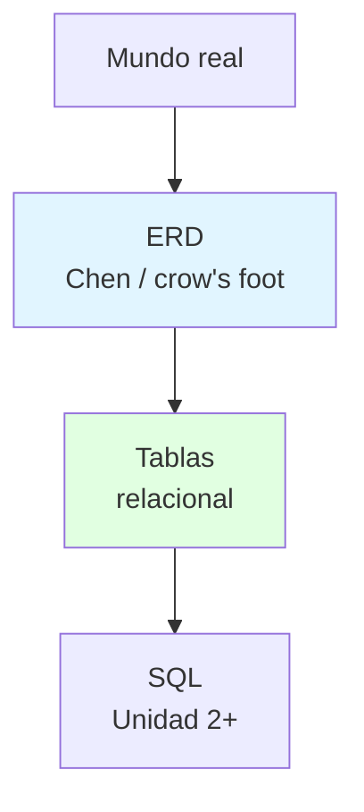
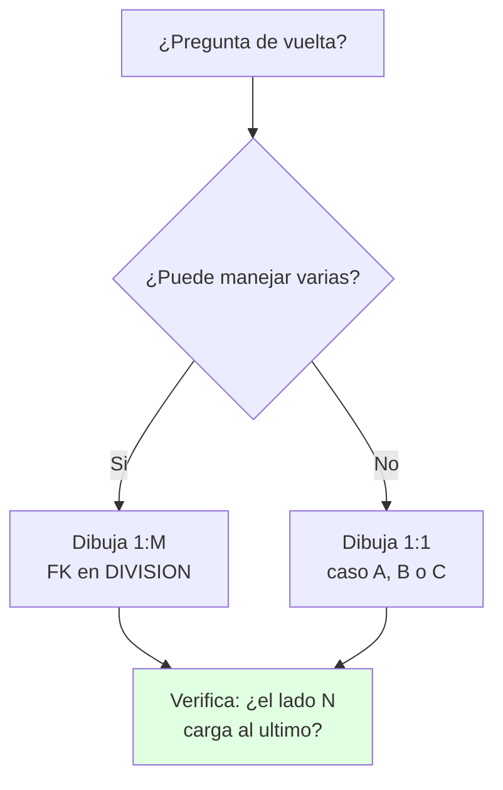

# 🗃️ Modelo Relacional, ERM y Casos Tiny College

## 🎯 Introducción
	
> [!info] 💡 ¿Por Qué las Tablas Ganaron y el Dibujo Manda?
>
> Desde 1970 casi todo lo que consultas vive en tablas, y desde 1976 casi todo lo que se diseña se dibuja primero. Entender por qué ganó cada uno —y qué resuelve cada notación— es lo que separa traducir un ER mecánicamente de diseñar uno que no se rompa al implementar.
>
> **Aplicaciones:**
> - **Implementación:** toda tabla del proyecto y del SQL futuro sale de aquí.
> - **Diseño gráfico:** el ERD es el plano que cliente y dev entienden sin código.
> - **Lección 1 (13-oct):** Codd en 1 frase + Chen en 1 frase + traducir 1 ER a tablas.
>
> | Concepto | Relacional (implementa) | ERM (diseña) |
> |---|---|---|
> | **Autor/año** | Codd | Chen 1976 |
> | **Pieza base** | Relación = tabla (filas × columnas) | Entidad + relación graficadas |
> | **Conexión** | Columna en común | Rombo/verbo + cardinalidad |
> | **Notaciones ERD** | — (no se dibuja: se escribe en tablas) | Chen, pata de gallo, clases |



---

## 📋 Definiciones Formales

> [!info] ℹ️ Cómo leer esta sección
> Una definición por bloque, cada una con su ejemplo y su figura. Nivel lógico: aquí las tablas sí son las protagonistas.

### 1️⃣ Relación, tupla y atributo — el vocabulario de tabla

> [!note] 📋 Definición — Relación, tupla, atributo
>
> - **Relación (tabla):** intersección de filas y columnas.
> - **Tupla/fila:** una ocurrencia (un estudiante concreto).
> - **Atributo/columna:** una casilla (nombre, código).
>
>
> ```mermaid
> erDiagram
>     ESTUDIANTE {
>         int carnet PK
>         string nombre
>     }
> ```
>
>
> **Ejemplo:** la tabla es la relación; cada fila una tupla (`0876, Jorge`); cada columna un atributo (`nombre`). Sí: **relacional = tablas** — Codd propuso guardar todo en tablas relacionadas por columnas comunes, con base matemática.
>
> **Por qué "relacional" (campusMVP):** no es porque las tablas *se relacionen* con FK — es porque los datos se guardan como **relaciones** (listas = tablas). Tabla = Relación, literal.
>
> **Northwind (ejemplo clásico):** pedidos con Proveedores, Productos, Empleados, Clientes, Transportistas + `Order Details` como intermedia. Si la nombran en clase, ya sabes qué es.
>
> **Las 6 cualidades de un buen diseño (T. Grayson, vía campusMVP):** refleja el mundo real; representa todos los datos esperados en el tiempo; evita redundancia; acceso eficaz; mantiene integridad; claro y comprensible.
>
> > [!quote] 📖 campusMVP, "Diseñando una base de datos en el modelo relacional" (2014) — https://www.campusmvp.es/recursos/post/Disenando-una-base-de-datos-en-el-modelo-relacional.aspx

### 2️⃣ Tres niveles — del dibujo al disco

> [!note] 📋 Definición — Niveles conceptual, lógico y físico
>
>
> ```mermaid
> graph TB
>     C["1. Conceptual<br/>ERD sin motor"] --> L["2. Logico<br/>tablas, PK/FK, tipos"]
>     L --> F["3. Fisico<br/>indices, almacenamiento"]
>     style C fill:#e1f5ff
>     style L fill:#fff4e1
>     style F fill:#e1ffe1
> ```
>
>
> **Ejemplo:** el rombo *toma* (conceptual) → tabla MATRÍCULA con (PK,FK) (lógico) → índice sobre `carnet` (físico). Cada nivel decide cosas distintas.

### 3️⃣ Regla de traducción ER→tablas — el puente

> [!note] 📋 Definición — Traducción
>
> Entidad → tabla; atributo → columna; clave → PK; N:M → intermedia con 2 FK; 1:N → FK del lado N.
>
> ```mermaid
> graph LR
>     E["Rectángulo<br/>entidad"] --> T["Tabla"]
>     A["Óvalo<br/>atributo"] --> C["Columna"]
>     K["Subrayado<br/>clave"] --> P["PK"]
>     R["Rombo M:N<br/>relación"] --> I["Intermedia<br/>2 FK"]
>     style T fill:#e1ffe1
>     style P fill:#e1ffe1
>     style I fill:#e1ffe1
> ```
>
> **Ejemplo:** ESTUDIANTE(entidad) → tabla; `carnet`(clave) → PK; *toma*(N:M) → MATRÍCULA con 2 FK. El detalle completo vive en la Unidad 2.

### 4️⃣ Entidad débil — doble condición

> [!note] 📋 Definición — Entidad débil (Coronel 4.1.6)
>
> Cumple AMBAS: existencia-dependiente + PK derivada del padre. Chen: rectángulo **doble**.
>
>
> ```mermaid
> graph TB
>     E["EMPLEADO"]
>     W[["DEPENDIENTE<br/>EMP_NUM + DEP_NUM"]]
>     E --- W
> ```
>
>
> **Ejemplo:** DEPENDENT se identifica con `EMP_NUM + DEP_NUM` juntos: `EMP_NUM` dice *de qué empleado es* (heredado del padre) y `DEP_NUM` lo distingue *entre los dependientes de ese empleado* (1º, 2º...). Ni uno solo identifica: el mismo `DEP_NUM = 1` existe en mil empleados. Sin el empleado no existe ni se identifica.
>
> **Pista del enunciado (caso banco):** *"se numera desde 1 dentro de cada cuenta"* = el número se repite entre cuentas → TRANSACCION es débil; en Chen su identificador va subrayado discontinuo y su clave real es `num_cuenta + num_transaccion`.
>
> > [!quote] 📖 C. Zavaleta, *MER: guía completa*, caso entidad bancaria (2026)
>
> ```mermaid
> graph TB
>     E["EMPLOYEE<br/>fuerte, existe solo"]
>     W[["DEPENDENT<br/>débil, doble rectángulo"]]
>     P["PART<br/>fuerte si hay partes propias"]
>     E --- W
> ```
>
> **Se lee así:** rectángulo doble = débil (DEPENDENT cuelga de EMPLOYEE); rectángulo simple que existe solo = fuerte (PART con partes propias no necesita a VENDOR).

### 5️⃣ Fuerza de relación — punteada vs sólida

> [!note] 📋 Definición — Fuerza (Coronel 4.1.7)
>
> - **Débil (non-identifying):** la PK hija NO hereda del padre (solo FK); línea **punteada**. Ej.: CLASS con `CLASS_CODE` propia.
> - **Fuerte (identifying):** la PK hija hereda del padre (PK compuesta); línea **sólida**. Ej.: CLASS con `CRS_CODE + CLASS_SECTION`.
> - Chen no distingue fuerza (es conceptual); Crow's Foot sí (afecta implementación). La fuerza la decide el diseñador según transacciones y eficiencia.
>
> **Figuras:** ver los dos diagramas de CLASS en Ejemplos Trabajados (versión débil y versión fuerte).
>
>
> ```mermaid
> erDiagram
>     CURSO ||..o{ CLASE_DEBIL : "débil, punteada"
>     CURSO ||--o{ CLASE_FUERTE : "fuerte, sólida"
>     CLASE_DEBIL {
>         string CLASS_CODE PK
>     }
>     CLASE_FUERTE {
>         string CRS_CODE PK, FK
>         string CLASS_SECTION PK
>     }
> ```
>
>
> **Se lee en patas:** la línea **punteada** = no identifica (la hija tiene PK propia); la **sólida** = identifica (la PK hija hereda la del padre).

---
## 🧵 Notación de Chen a Fondo

### 🎭 Cada Símbolo Tiene un Trabajo

> [!example] 🧪 Leer Chen como Profesional
>
> | Símbolo | Significado | Ejemplo |
> |---|---|---|
> | **Rectángulo simple** | Entidad fuerte | ESTUDIANTE |
> | **Rectángulo doble** | Entidad débil | DEPENDENT |
> | **Rombo** | Relación con verbo | *dicta*, *toma* |
> | **Óvalo** | Atributo | Nombre, código |
> | **Óvalo + línea punteada** | Atributo derivado (calculado) | Edad desde fecha |
> | **Subrayado** | Clave (PK) | `carnet` |
> | **Cardinalidad** | Del lado de la entidad **relacionada** | (1,4) junto a CLASS |
>
> Solo Chen marca derivados con punteada (Crow's Foot no tiene cómo). M:N existe en conceptual pero no va al relacional.
>
> *(Leyenda Chen: ver el diagrama dibujable de abajo — rectángulo, rombo, óvalo, punteada y subrayado.)*
>
>
> ```mermaid
> graph TB
>     E1["ESTUDIANTE<br/><u>carnet</u>"]
>     R{"toma"}
>     E2["MATERIA<br/><u>codigo</u>"]
>     W[["DEPENDIENTE<br/>carnet+dep"]]
>     R2{"tiene"}
>     A1(["nombre"])
>     A2(["edad*<br/>derivada"])
>     E1 --- R
>     R --- E2
>     E1 --- A1
>     E1 -.- A2
>     E2 --- R2
>     R2 --- W
> ```
>
>
> **Cómo leerlo:** rectángulo = entidad (`[[ ]]` = débil) · rombo `{ }` = relación · óvalo `([ ])` = atributo · punteada `-.-` = derivado · subrayado = PK. Compáralo con la tabla de arriba: es el mismo Chen, dibujable en cualquier nota.

---

## 🛠️ Método para Pasar del ERD a Tablas

> [!note] 📋 Procedimiento General
>
> 1. Verifica el ERD: toda entidad con PK, toda relación con verbo y cardinalidad.
> 2. Crea una tabla por entidad con sus columnas y PK.
> 3. Resuelve cada N:M con tabla intermedia (las 2 FK, PK compuesta).
> 4. Coloca cada FK del lado N con su contraparte PK.
> 5. Decide fuerza: ¿hereda la PK o no? Dibuja punteada/sólida en consecuencia.
> 6. Ordena creación y carga: lado 1 primero (padres antes que hijas).
>
> **Principio clave:** el orden de carga no es decorativo — violarlo rompe integridad referencial.
>
> ```mermaid
> flowchart TD
>     A["Verifica ERD<br/>PK + verbo + (x,y)"] --> B["Una tabla<br/>por entidad"]
>     B --> C["N:M → intermedia"]
>     C --> D["FK del lado N"]
>     D --> E["¿Hereda PK?<br/>punteada/sólida"]
>     E --> F["Carga: 1 primero"]
>     style F fill:#e1ffe1
> ```

---

## 🎨 Ejemplos Trabajados: Tiny College

> [!example] 🟢 Ejemplo — CLASS Débil vs Fuerte
>
> Misma realidad, dos decisiones de clave:
>
> | Versión | Definición CLASS | Línea | Cuándo |
> |---|---|---|---|
> | **Débil** | `CLASS(CLASS_CODE, CRS_CODE, ...)` — PK propia | Punteada | Identidad independiente |
> | **Fuerte** | `CLASS(CRS_CODE, CLASS_SECTION, ...)` — PK heredada | Sólida | Identidad ligada al padre |
>
>
> ```mermaid
> erDiagram
>     CURSO ||--o{ CLASE : genera
>     CURSO {
>         string CRS_CODE PK
>     }
>     CLASE {
>         string CLASS_CODE PK
>         string CRS_CODE FK
>     }
> ```
>
>
> **Versión débil (punteada):** CLASS tiene PK propia; solo referencia al padre con FK.
>
>
> ```mermaid
> erDiagram
>     CURSO ||--o{ CLASE : genera
>     CURSO {
>         string CRS_CODE PK
>     }
>     CLASE {
>         string CRS_CODE PK, FK
>         string CLASS_SECTION PK
>     }
> ```
>
>
> **Versión fuerte (sólida):** la PK de CLASS hereda `CRS_CODE` — sin el curso, la clase no se identifica.
>

> [!example] 🟢 Ejemplo — Clasificar DIVISION–EMPLOYEE
>
> Solo sabes *"Una DIVISIÓN es manejada por un EMPLEADO"* — insuficiente:
>
> | Paso | Acción |
> |---|---|
> | Pregunta de vuelta | ¿Puede uno manejar varias? |
> | Si sí | 1:M: "Un EMPLEADO maneja muchas DIVISIONes" |
> | Si no | 1:1: "Un EMPLEADO maneja una sola DIVISIÓN" |
>




---

## 📋 Tablas Comparativas

> [!note] 📋 Chen vs Crow's Foot · Débil vs Fuerte
>
> | Aspecto | Chen | Crow's Foot |
> |---|---|---|
> | **Uso** | Teoría y parciales | Herramientas y pizarrón |
> | **Cardinalidad** | Lado de la relacionada | Junto a la entidad que aplica |
> | **Derivados** | Línea punteada ✅ | Sin marca ❌ |
> | **Fuerza** | No distingue | Punteada/sólida por PK |
>
> | Versión CLASS | PK | Línea | Cuándo |
> |---|---|---|---|
> | **Débil** | Propia | Punteada | Identidad independiente |
> | **Fuerte** | Heredada | Sólida | Identidad ligada al padre |

---

## ⚠️ Errores Comunes y Principios Lógicos

> [!warning] ⚠️ Cómo leer esta sección
> Cada error trae su dibujo: lo ❌ que delata el problema y lo ✅ que lo evita.

### ❌ Error 1: Tablas sin pasar por el ER

> [!danger] ❌ Viola: orden obligatorio ERD → tablas → SQL
>
>
> ```mermaid
> graph LR
>     A["❌ Tablas directo"] --> R["Columnas repetidas<br/>FKs inventadas<br/>N:M sin intermedia"]
>     B["✅ ERD → tablas → SQL"] --> T["Modelo trazable"]
>     style R fill:#ffe1e1
>     style T fill:#e1ffe1
> ```


### ❌ Error 2: Herencia de PK indecisa

> [!danger] ❌ Viola: decide fuerza antes de dibujar
>
> PK compuesta en el diagrama pero FK simple en tablas (o al revés): decide si hereda primero, verifica después.
>
>
> ```mermaid
> erDiagram
>     CURSO ||--o{ CLASE : "❌ MAL: dice fuerte<br/>pero no hereda"
>     CLASE {
>         string CLASS_CODE PK
>     }
> ```
>
>
> Si la línea es sólida, la PK hija **debe** contener la del padre. Si es punteada, la hija tiene PK propia.

### ❌ Error 3: Cargar el lado N primero

> [!danger] ❌ Viola: padres antes que hijas
>
>
> ```mermaid
> flowchart TD
>     A["❌ MATRICULA primero"] --> B["FK a ESTUDIANTE<br/>que no existe"]
>     C["✅ ESTUDIANTE + MATERIA"] --> D["✅ MATRICULA al final"]
>     style B fill:#ffe1e1
>     style D fill:#e1ffe1
> ```


### ❌ Error 4: M:N directo al relacional

> [!danger] ❌ Viola: M:N existe en conceptual, no en tablas
>
> Sin intermedia no hay modelo que funcione: toda M:N produce tabla con las 2 FK (ver Regla 2 de la Unidad 2).

---
## 📝 Ejercicios Propuestos

> [!info] ℹ️ Cómo trabajarlos
> Tapa la solución, resuelve, compara. Respuestas colapsables abajo.

### ✏️ Ejercicio 1 — ¿Débil o fuerte?

> [!example] 📋 Planteamiento
>
> CLASS con `CLASS_CODE` propia vs CLASS con `CRS_CODE + CLASS_SECTION`. ¿Cuál es débil, cuál fuerte, qué línea lleva cada una y cuándo elegirías cada versión?
>
> > [!success]- ✅ Solución
> >
> > Propia = débil (punteada): identidad independiente. Heredada = fuerte (sólida): identidad ligada al padre. Elige fuerte cuando la clase no se identifica sin el curso y las transacciones las piden juntas; débil cuando la clase tiene vida propia.

### ✏️ Ejercicio 2 — Los 7 símbolos Chen

> [!example] 📋 Planteamiento
>
> Nombra los 7 símbolos Chen con su significado y un ejemplo de Tiny College para cada uno.
>
> > [!success]- ✅ Solución
> >
> > Rectángulo simple (fuerte: ESTUDIANTE), doble (débil: DEPENDENT), rombo (relación: *toma*), óvalo (atributo: nombre), óvalo punteado (derivado: edad), subrayado (PK: carnet), cardinalidad del lado de la relacionada ((1,4) junto a CLASS).

### ✏️ Ejercicio 3 — Resuelve la N:M

> [!example] 📋 Planteamiento
>
> ESTUDIANTE–MATERIA M:N con *toma*. Escribe las 3 tablas con PK/FK y el orden de carga.
>
> > [!success]- ✅ Solución
> >
> > `ESTUDIANTE(carnet PK)`, `MATERIA(codigo PK)`, `MATRICULA(carnet PK,FK, codigo PK,FK)`. Carga: padres primero (las 2 entidades), intermedia al final. Sin intermedia no hay modelo que funcione.

---

## 🎯 Metas de Aprendizaje

> [!note] 📋 Nivel Básico
>
> - [ ] Defino relación, tupla, niveles conceptual/lógico/físico sin mirar.
> - [ ] Dibujo los 7 símbolos Chen con su significado.
> - [ ] Traduzco un ER simple a tablas con PKs y FKs.
>
> [!note] 📋 Nivel Intermedio
>
> - [ ] Decido débil vs fuerte por la PK y dibujo su línea.
> - [ ] Resuelvo N:M con intermedia correcta.
> - [ ] Ordeno creación y carga sin romper integridad.
>
> [!note] 📋 Nivel Avanzado
>
> - [ ] Comparo CLASS débil vs fuerte justificando por transacciones.
> - [ ] Detecto en diagramas ajenos N:M olvidadas y fuerzas invertidas.

---

## 📚 Referencias

> [!quote] 📖 Fuentes Consultadas
>
> - `unidad1.3-1.5.pdf` (Irene Cheung) + Codd (relacional) · Chen 1976 (ERM).
> - C. Coronel, S. Morris, *Database Systems*, 9th ed., cap. 4 §§4.1.6–4.1.7 y cap. 2 (Chen vs Crow's Foot).
> - C. Zavaleta, *MER: guía completa con ejemplos*, 2026 (casos prácticos citados arriba).

---

## 🔁 Repaso SR (flashcards)

#flashcards/bd-u1

> [!note] 🧠 Repasa con el plugin Spaced Repetition
>
> - ¿Relacional en 1 frase (Codd)?::Todo en tablas unidas por columna común, con base matemática.
> - ¿Chen 1976 aportó qué?::El ERD gráfico que complementa al relacional para diseñar.
> - ¿Débil vs fuerte (línea y PK)?::Débil: solo FK, punteada. Fuerte: PK heredada compuesta, sólida.
> - ¿N:M al relacional?::Tabla intermedia con las 2 FK.
> - ¿Símbolo Chen de entidad débil y de derivado?::Rectángulo doble; óvalo con línea punteada.
- ¿Por qué "relacional" se llama así?::Porque guarda datos como relaciones (= tablas), no por las FK.

---

## 🔗 Conexiones

> [!quote] 🔗 Notas Relacionadas
>
> - [[02 - Entidades, atributos, claves y relaciones]] — el vocabulario que aquí se vuelve tablas.
> - [[01 - Dato, información y modelos de datos]] — el problema original.
> - Ver también la nota de **Claves** integrada en 02 si vienes de un link viejo: ahora vive ahí.

---

**Tags:** #TICG1018 #unidad1 #relacional #erm #chen #casos #bd
