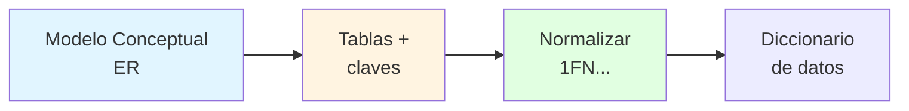
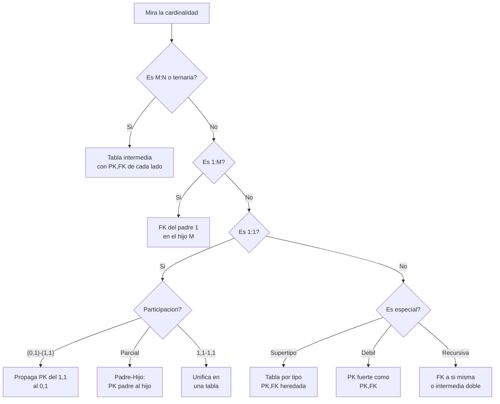

# 🔄 Conversión del Modelo Conceptual al Modelo Lógico

## 🎯 Introducción

> [!info] 💡 ¿Por Qué Convertir?
>
> El modelo conceptual (ER) dice **qué existe**; el modelo lógico dice **cómo se guarda en tablas**. Convertir es traducir cada entidad, relación y restricción a tablas + claves sin perder información. Es el corazón de la Lección 1.
>
> **Dónde estamos en el diseño (3 pasos):**
>
> 1. **Análisis de requerimientos** → qué necesita el usuario.
> 2. **Diseño conceptual** → se identifican datos y restricciones (ER).
> 3. **Diseño lógico y físico** → se crean tablas, relaciones, restricciones; luego procedimientos y triggers.
>
> **Analogía del mundo real:** el ER es el plano arquitectónico; el ML es la lista de materiales con medidas exactas. El plano sin lista no se construye.
>
> | Concepto | Modelo Conceptual | Modelo Lógico |
> |---|---|---|
> | **Entidad** | Rectángulo Chen | Tabla |
> | **Atributo** | Óvalo | Columna |
> | **Instancia** | — | Fila (tupla) |
> | **Relación** | Rombo | FK o tabla intermedia |
> | **Regla de oro** | Qué existe | Cómo se guarda |



---

## 📋 Definiciones Formales

> [!info] ℹ️ Cómo leer esta sección
> Una definición por bloque con su figura. Cada figura anticipa la regla donde se usa.

### 1️⃣ Tabla, columna, fila — el vocabulario lógico

> [!note] 📋 Definición — Tabla, columna, fila, campo
>
> Tabla = relación; columna = atributo con dominio; fila = tupla; campo = intersección fila-columna.
> Equivalencia: tabla/fila/columna = archivo/registro/campo = relación/tupla/atributo.
>
> | Tabla EMPLEADO | idEmpleado (PK) | nombre |
> |---|---|---|
> | Fila 1 (tupla) | 101 | Ana |
> | Fila 2 (tupla) | 102 | Luis |
>
> **Ejemplo:** la columna `nombre` tiene dominio texto; el campo (102, nombre) vale `Luis`.
>
> ```mermaid
> graph TB
>     T["TABLA<br/>relación"]
>     T --> F["FILA<br/>tupla: un empleado"]
>     T --> C["COLUMNA<br/>atributo + dominio"]
>     F --> K["CAMPO<br/>intersección: un valor"]
>     C --> K
> ```
>
> **Se lee así:** la tabla contiene filas y columnas; donde se cruzan hay un campo con exactamente un valor.

### 2️⃣ Claves — PK, candidatas y compuestas

> [!note] 📋 Definición — Claves
>
> Una o más columnas que identifican filas. **Única** = una fila; **compuesta** = 2+ atributos; **primaria (PK)** = única por tabla (representa la tabla en relaciones, organiza almacenamiento, genera índices); **candidatas** = únicas adicionales no elegidas.
>
> **Ejemplo:** en REGISTRO ninguna columna sola identifica (un profesor dicta varias materias); `idProf + matricula + idMateria` sí → PK compuesta de 3.
>
> ```mermaid
> erDiagram
>     CURSO ||--o{ MATRICULA : tiene
>     CURSO {
>         string codigo PK
>         string nombre UK
>     }
>     MATRICULA {
>         string codigo PK, FK
>         int carnet PK, FK
>     }
> ```
>
> **Se lee así:** `PK` identifica, `FK` referencia, `UK` es candidata no elegida (`nombre` único pero no PK), `PK, FK` es compuesta que además referencia.

### 3️⃣ Integridad de entidad y referencial — lo que nunca se rompe

> [!note] 📋 Definición — Integridad
>
> - **De entidad:** la PK nunca es nula ni se repite.
> - **Referencial:** toda FK apunta a una PK que existe (la FK no necesita ser única donde está, pero sí donde apunta).
>
>
> ```mermaid
> flowchart TD
>     A["Insertar MATRICULA<br/>carnet=999"] --> B{"¿Existe 999<br/>en ESTUDIANTE?"}
>     B -->|"No"| R["❌ Rechazado<br/>integridad referencial"]
>     B -->|"Si"| O["✅ Aceptado"]
>     style R fill:#ffe1e1
>     style O fill:#e1ffe1
> ```
>
>
> **Ejemplo:** matricular el carnet 999 inexistente se rechaza; la BD protege sola lo que en archivos había que programar.

### 4️⃣ Padre e hijo — quién recibe la FK

> [!note] 📋 Definición — Padre / Hijo (en 1:M)
>
> El lado `1` es **padre**; el lado `M` es **hijo** y recibe la FK.
>
>
> ```mermaid
> erDiagram
>     DEPARTAMENTO ||--o{ EMPLEADO : "padre 1 → hijo M"
>     DEPARTAMENTO {
>         int idDepartamento PK
>     }
>     EMPLEADO {
>         int idEmpleado PK
>         int idDepartamento FK
>     }
> ```
>
>
> **Ejemplo:** rotula el `1` primero y la dirección sale sola (ver Regla 3).

### 5️⃣ Fusión de tablas — el ML mínimo

> [!note] 📋 Definición — Fusión
>
> El ML debe tener el **mínimo de tablas posible**: las de un solo atributo se eliminan y las 1:1 total-total se fusionan.
>
>
> ```mermaid
> graph LR
>     A["EQUIPO +<br/>PRESIDENTE"] --> B["EQUIPO<br/>unificada"]
>     style B fill:#e1ffe1
> ```
>
>
> **Ejemplo:** EQUIPO–PRESIDENTE (1,1)-(1,1) → una sola tabla con `cedula_presi` dentro (ver Regla 4, caso C).

### 6️⃣ Modelo lógico — el refinamiento

> [!note] 📋 Definición — Modelo lógico
>
> Refinamiento del conceptual donde se reducen/aumentan entidades y solo quedan las que serán tablas; después **se normaliza**.
>
> ```mermaid
> graph LR
>     R["Rombo toma<br/>conceptual"] --> T["Tabla MATRICULA<br/>lógico"]
>     T --> N["1FN: sin grupos<br/>repetitivos"]
>     style T fill:#fff4e1
>     style N fill:#e1ffe1
> ```
>
> **Ejemplo:** el rombo *toma* (conceptual) se vuelve tabla MATRÍCULA (lógico); luego 1FN verifica que no tenga grupos repetitivos.

---
## 🛠️ Método: Convertir Paso a Paso

> [!success] 🏆 Protocolo de conversión (úsalo en la Lección 1)
>
> 1. **Entidades → tablas directas:** cada entidad es una tabla; sus atributos, columnas; su PK se mantiene.
> 2. **M:N → tabla intermedia:** con las PK de ambos lados (PK,FK) + atributos propios de la relación.
> 3. **1:M → FK al hijo:** copia la PK del padre (lado 1) como FK en el hijo (lado M); los atributos de la relación viajan al hijo.
> 4. **1:1 → según participación** (ver tabla de 3 casos abajo).
> 5. **Especiales:** supertipo/subtipo, dependencia, recursiva (ver sección).
> 6. **Normaliza** el esquema resultante (mínimo [[02 - Primera forma normal y diccionario de datos|1FN]]).

### 🔍 Regla 1 — Entidades → tablas directas

> [!note] 📋 Cada entidad, una tabla
>
> Cada entidad del modelo conceptual se transforma directamente en una tabla: los atributos pasan a ser columnas y la clave primaria se mantiene.
>
>
> ```mermaid
> erDiagram
>     CLIENTE {
>         int idCliente PK
>         string nombre
>         string direccion
>         int telefono
>     }
> ```
>
>
> **Se lee así:** la entidad CLIENTE con 4 atributos produce una tabla de 4 columnas donde `idCliente` identifica cada fila.

---

### 🔍 Regla 2 — M:N → tabla intermedia siempre

> [!example] 🧪 Rentar (CLIENTE–PROPIEDAD)
>
> La relación se convierte en tabla con las claves primarias de **ambas** entidades (cada una PK y FK a la vez), más los atributos propios de la relación.
>
>
> ```mermaid
> erDiagram
>     CLIENTE ||--o{ RENTAR : realiza
>     PROPIEDAD ||--o{ RENTAR : incluye
>     CLIENTE {
>         int idCliente PK
>         string nombre
>     }
>     RENTAR {
>         int idRenta PK
>         int idCliente PK, FK
>         int idPropiedad PK, FK
>         date fechaInicioRenta
>         date fechaFinRenta
>     }
>     PROPIEDAD {
>         int idPropiedad PK
>         string direccion
>     }
> ```
>
>
> **Se lee así:** `RENTAR` no existía como entidad, nace de la relación; sus dos claves apuntan a cada lado y las fechas viven con ella.
>
> **Mismo patrón — Venta:** `DETALLE(idProd PK, FK, codigo PK, FK, cantidad)` entre PRODUCTO y VENTA; los `=` del diagrama de clase confirman qué columna referencia a qué PK.

---

### 🔍 Regla 3 — 1:M → la FK vive en el hijo

> [!example] 🧪 Trabaja (EMPLEADO–DEPARTAMENTO)
>
> El lado `1` es el **padre** y el lado `M` es el **hijo**: se copia la PK del padre como FK en la tabla del hijo. Si la relación tiene atributos propios, también bajan al hijo.
>
>
> ```mermaid
> erDiagram
>     DEPARTAMENTO ||--o{ EMPLEADO : trabaja
>     DEPARTAMENTO {
>         int idDepartamento PK
>         string nombre
>     }
>     EMPLEADO {
>         int idEmpleado PK
>         string nombre
>         int idDepartamento FK
>         date fechaTrabaja
>     }
> ```
>
>
> **Se lee así:** un departamento tiene muchos empleados; cada empleado guarda `idDepartamento` diciendo a cuál pertenece. `fechaTrabaja` (atributo del rombo) baja con él.
>
> **Mismo patrón — Registra:** `RESERVACION(idReservacion PK, fechaLlegada, horaLlegada, diasPermanencia, FK idUsuario)` recibe además `fechaReservacion, horaReservacion` de la relación; `USUARIO` no recibe nada.

---

### 🔍 Regla 4 — 1:1 → tres casos por participación

> [!note] 📋 Memoriza cada caso con su ejemplo
>
> **Caso A — (0,1) vs (1,1): propaga del (1,1) al (0,1).** Ejemplo CLIENTE–PREFERENCIA (`establece`):
>
>
> ```mermaid
> erDiagram
>     CLIENTE ||--o| PREFERENCIA : establece
>     CLIENTE {
>         int idCliente PK
>         string nombre
>     }
>     PREFERENCIA {
>         int id_pref PK
>         string tipoPref
>         int maxRent
>         int idCliente FK
>     }
> ```
>
>
> **Se lee así:** no todo cliente fija preferencia (0,1), pero toda preferencia es de un cliente (1,1); la PK viaja al lado opcional.
>
> **Caso B — participación parcial: decide PADRE e HIJO.** Ejemplo PERSONA–LICENCIA (`posee`): no toda persona tiene licencia (parcial), pero toda licencia es de una persona. La persona es padre, la licencia hija:
>
> ```mermaid
> erDiagram
>     PERSONA ||--o| LICENCIA : posee
>     PERSONA {
>         string cedula PK
>         string nombre
>     }
>     LICENCIA {
>         string numero PK
>         string categoria
>         string cedula FK
>     }
> ```
>
> **Se lee así:** la PK del padre (`cedula`) se copia al hijo como FK. `PERSONA` no recibe nada. Sin persona no hay licencia (pero sí hay personas sin licencia).
>
> **Caso C — (1,1) vs (1,1): unifica en una sola tabla.** Ejemplo EQUIPO–PRESIDENTE (`tiene`):
>
> ```mermaid
> erDiagram
>     EQUIPO {
>         int codigo PK
>         string nombre
>         int anoFundacion
>         int cedula_presi
>         string nombre_presi
>         string apellido_presi
>     }
> ```
>
> **Se lee así:** una sola tabla con la PK de cualquiera de las dos; los datos del presidente viven como columnas (`cedula_presi, nombre_presi...`).

---

### 🔍 Regla 5 — Ternaria → una tabla con las 3 claves

> [!example] 🧪 Registro (PROFESOR–MATERIA–ESTUDIANTE)
>
>
> ```mermaid
> erDiagram
>     PROFESOR ||--o{ REGISTRO : dicta
>     MATERIA ||--o{ REGISTRO : contiene
>     ESTUDIANTE ||--o{ REGISTRO : cursa
>     REGISTRO {
>         int idProf PK, FK
>         int idMateria PK, FK
>         int matricula PK, FK
>         float calificacion
>         time hora
>     }
> ```
>
>
> **Se lee así:** `REGISTRO` combina las 3 PK como clave compuesta (las 3 son FK a la vez) y cuelga `calificacion, hora` de la combinación completa.

---

### 🔍 Regla 6 — Supertipo–subtipo → una tabla por tipo

> [!note] 📋 Cada subtipo hereda la PK del supertipo
>
>
> ```mermaid
> erDiagram
>     EMPLEADO ||--o| VENDEDOR : es
>     EMPLEADO ||--o| TECNICO : es
>     EMPLEADO {
>         int idEmp PK
>         string nombre
>         string direccion
>     }
>     VENDEDOR {
>         int idEmp PK, FK
>         int numVentas
>     }
>     TECNICO {
>         int idEmp PK, FK
>         string licencia
>     }
> ```
>
>
> **Se lee así:** el supertipo guarda lo común; cada subtipo solo lo suyo, identificado por la misma PK (que además referencia al supertipo).
>
> **Las 4 combinaciones del diagrama de clase:** (a) {obligatorio, sobrelapado}: tablas tal cual, con banderas `esVendedor, esTecnico`; (b) {obligatorio, disjunto}: se agrega discriminante `tipo`; (c) {opcional, disjunto}: `Tipo` admite nulo; (d) {opcional, sobrelapado}: banderas en el supertipo, subtipos solo si aplican.
>
> **Cómo detectar la jerarquía (caso empleados):** caza 2 frases — *"hay personal que no encaja"* = parcial; *"nadie desempeña dos perfiles"* = exclusiva. Si el enunciado calla, **pregunta al cliente**: no se adivina.
>
> **Regla de oro:** las relaciones salen de los **subtipos**, no del supertipo — *atiende* cuelga de VENDEDOR (un desarrollador no atiende clientes). Colgarla de EMPLEADO afirma que cualquiera puede tener clientes: error de modelado.
>
> > [!quote] 📖 C. Zavaleta, *MER: guía completa*, caso empleados con generalización (2026)

---

### 🔍 Regla 7 — Dependencia → la débil hereda la PK fuerte

> [!example] 🧪 Edificio–Departamento
>
>
> ```mermaid
> erDiagram
>     EDIFICIO ||--o{ DEPARTAMENTO : contiene
>     EDIFICIO {
>         int idEdificio PK
>         string nombre
>         string direccion
>     }
>     DEPARTAMENTO {
>         int idEdificio PK, FK
>         int hab_num PK
>         int piso
>     }
> ```
>
>
> **Se lee así:** el departamento débil no se identifica solo (`hab_num` se repite entre edificios); su PK es compuesta: la del fuerte heredada + su número.

---

### 🔍 Regla 8 — Recursiva → FK a sí misma o intermedia doble

> [!example] 🧪 Supervisión y grupos de empleados
>
> **Recursiva 1:M** (un jefe supervisa empleados):
>
>
> ```mermaid
> erDiagram
>     EMPLEADO ||--o{ EMPLEADO : supervisa
>     EMPLEADO {
>         int idEmpleado PK
>         string nombre
>         int idSupervisor FK
>     }
> ```
>
>
> **Se lee así:** `idSupervisor` es FK que apunta a `idEmpleado` de la **misma** tabla (`idEmpleado = idSupervisor`).
>
> **Roles obligatorios (caso banco):** en reflexivas etiqueta cada rama (*principal* / *dependiente*) o el diagrama es ilegible. *Depende* (SUCURSAL–SUCURSAL): principal (0,n) vs dependiente (0,1) — hay oficinas que no dependen de ninguna.
>
> > [!quote] 📖 C. Zavaleta, *MER: guía completa*, caso entidad bancaria (2026)
>
> **Recursiva M:N** (grupos donde ambos roles son empleados): tabla intermedia con doble FK → `EMPLEADO_GRUPOS(idEmpSupervisor PK, FK, idEmpSupervisado PK, FK)`.

---

## 🎨 Ejemplo Trabajado Completo

> [!example] 💡 De ER a tablas: trabaja (EMPLEADO–DEPARTAMENTO)
>
> **ER de partida:** `EMPLEADO(idEmpleado, nombre, dirección, teléfono)` —(trabaja, fechaTrabaja)→ `DEPARTAMENTO(idDepartamento, nombre)`, cardinalidad M:1.
>
> ```mermaid
> graph TB
>     E["EMPLEADO<br/><u>idEmpleado</u>"]
>     R{"trabaja<br/>M:1"}
>     D["DEPARTAMENTO<br/><u>idDepartamento</u>"]
>     A(["fechaTrabaja"])
>     E --- R
>     R --- D
>     R --- A
> ```
>
> **Conversión:**
>
> 1. Entidades → tablas (PK se mantienen).
> 2. Relación 1:M → FK al hijo + atributo `fechaTrabaja` al hijo.
>
> **Tablas resultantes:**
>
> | Tabla | Columnas (PK/FK marcadas) |
> |---|---|
> | **EMPLEADO** | idEmpleado PK int, nombre char(30), dirección char(50), teléfono int, **FK** idDepartamento int, fechaTrabaja date |
> | **DEPARTAMENTO** | idDepartamento PK int, nombre char(30) |
>
> ```mermaid
> erDiagram
>     DEPARTAMENTO ||--o{ EMPLEADO : trabaja
>     DEPARTAMENTO {
>         int idDepartamento PK
>         string nombre
>     }
>     EMPLEADO {
>         int idEmpleado PK
>         string nombre
>         string direccion
>         int telefono
>         int idDepartamento FK
>         date fechaTrabaja
>     }
> ```
>
> **Se lee así:** el Chen de arriba convertido: el rombo desaparece, nace la FK en el hijo y `fechaTrabaja` baja con ella. Compara ambos dibujos línea por línea.
>
> **Verificación:** ¿puedo despedir un departamento con empleados? No — la FK lo impide (integridad referencial). ¿Dos empleados con mismo id? No — PK única.

---

## 🗺️ Diagrama de Decisión: ¿Cómo Convierto Esta Relación?



---

## ⚠️ Errores Comunes y Principios Lógicos

> [!warning] ⚠️ Cómo leer esta sección
> Cada error trae su diagrama: primero lo **malo** (❌) y luego lo **correcto** (✅). Si tu conversión se parece al primero, ya sabes qué regla aplicar.

### ❌ Error 1: FK al revés en 1:M

> [!danger] ❌ Viola: dirección padre→hijo
>
> Poner la FK en el padre (lado 1) es absurdo: un departamento tendría que apuntar a **uno** de sus 50 empleados.
>
>
> ```mermaid
> erDiagram
>     DEPARTAMENTO ||--o{ EMPLEADO : "❌ MAL: FK aqui"
>     DEPARTAMENTO {
>         int idDepartamento PK
>         int idEmpleado FK
>     }
> ```
>
>
>
> ```mermaid
> erDiagram
>     DEPARTAMENTO ||--o{ EMPLEADO : "✅ BIEN: FK aqui"
>     EMPLEADO {
>         int idEmpleado PK
>         int idDepartamento FK
>     }
> ```
>
>
> **Regla que lo evita:** en 1:M el hijo (M) recibe; el padre (1) no apunta a nadie.

---

### ❌ Error 2: M:N sin tabla intermedia

> [!danger] ❌ Viola: primera forma normal (grupos repetitivos)
>
> Aplanar la relación en columnas numeradas crea un grupo repetitivo: ¿y si una venta lleva 4 productos?
>
>
> ```mermaid
> erDiagram
>     VENTA {
>         int codigo PK
>         int idProd1
>         int idProd2
>         int idProd3
>     }
> ```
>
>
>
> ```mermaid
> erDiagram
>     PRODUCTO ||--o{ DETALLE : "✅ BIEN: intermedia"
>     VENTA ||--o{ DETALLE : "✅ BIEN: intermedia"
>     DETALLE {
>         int idProd PK, FK
>         int codigo PK, FK
>         int cantidad
>     }
> ```
>
>
> **Regla que lo evita:** toda M:N produce tabla intermedia con las PK de ambos lados.

---

### ❌ Error 3: 1:1 total-total en dos tablas

> [!danger] ❌ Viola: fusión mínima de tablas
>
> Si cada equipo tiene exactamente un presidente y viceversa, dos tablas solo generan un JOIN obligatorio en cada consulta.
>
>
> ```mermaid
> erDiagram
>     EQUIPO ||--|| PRESIDENTE : "❌ MAL: dos tablas"
>     EQUIPO {
>         int codigo PK
>         int cedula_presi FK
>     }
>     PRESIDENTE {
>         int cedula PK
>         int codigo FK
>     }
> ```
>
>
>
> ```mermaid
> erDiagram
>     EQUIPO {
>         int codigo PK
>         string nombre
>         int anoFundacion
>         int cedula_presi
>         string nombre_presi
>     }
> ```
>
>
> **Regla que lo evita:** caso C (1,1)-(1,1) se unifica en una sola tabla.

---

### ❌ Error 4: Atributos de la relación olvidados

> [!danger] ❌ Viola: preservación de información
>
> Convertir `Registra` bajando solo la FK pero perdiendo `fechaReservacion, horaReservacion` destruye datos del conceptual.
>
>
> ```mermaid
> erDiagram
>     USUARIO ||--o{ RESERVACION : registra
>     RESERVACION {
>         int idReservacion PK
>         int idUsuario FK
>         date fechaLlegada
>     }
> ```
>
>
>
> ```mermaid
> erDiagram
>     USUARIO ||--o{ RESERVACION : "✅ BIEN: con atributos"
>     RESERVACION {
>         int idReservacion PK
>         int idUsuario FK
>         date fechaReservacion
>         time horaReservacion
>         date fechaLlegada
>     }
> ```
>
>
> **Regla que lo evita:** todo atributo del rombo viaja a la tabla que absorbe la relación.

---

### ❌ Error 5: Subtipo sin PK heredada

> [!danger] ❌ Viola: identidad del supertipo
>
> Darle al subtipo una PK propia rompe el vínculo: ya no se sabe qué empleado es ese vendedor.
>
>
> ```mermaid
> erDiagram
>     EMPLEADO ||--o| VENDEDOR : "❌ MAL: PK propia"
>     VENDEDOR {
>         int idVendedor PK
>         int numVentas
>     }
> ```
>
>
>
> ```mermaid
> erDiagram
>     EMPLEADO ||--o| VENDEDOR : "✅ BIEN: PK heredada"
>     EMPLEADO {
>         int idEmp PK
>     }
>     VENDEDOR {
>         int idEmp PK, FK
>         int numVentas
>     }
> ```
>
>
> **Regla que lo evita:** cada subtipo lleva la PK del supertipo como (PK,FK).

---

## 🎯 Mejores Prácticas

> [!tip] 🏆 Checklist de conversión
>
> **1. Marca padre e hijo antes de escribir** — en 1:M no hay ambigüedad si rotulas el `1`.
>
> **2. Dibuja los `=` de referencia** — como en el diagrama de clase: cada FK anota a qué PK apunta.
>
> **3. Cuenta tablas al final** — ¿alguna tiene un solo atributo? Elimínala. ¿Alguna 1:1 total-total? Fusiónala.
>
> **4. Lee la relación en voz alta** — "un empleado trabaja en un departamento" te dice dónde va la FK.
>
> **5. Normaliza después** — la conversión produce el esquema; [[02 - Primera forma normal y diccionario de datos|1FN]] lo valida.

---

## 📝 Ejercicios Propuestos

> [!info] ℹ️ Cómo trabajarlos
> Cada ejercicio trae su **planteamiento visual** (lo que te dan) y la **solución guiada** (cómo se llega). Tapa la solución, resuelve, compara.

### ✏️ Ejercicio 1 — Ternaria con atributos

> [!example] 📋 Planteamiento
>
> Convierte esta relación ternaria: `ESTUDIANTE(Matrícula PK, nombre, apellido)` —registra(calificación, hora)→ `MATERIA(idMateria PK, nombre, descripción)`, con `PROFESOR(idProf PK, ...)` como tercer participante.
>
>
> ```mermaid
> erDiagram
>     PROFESOR ||--o{ REGISTRO : dicta
>     MATERIA ||--o{ REGISTRO : contiene
>     ESTUDIANTE ||--o{ REGISTRO : cursa
>     ESTUDIANTE {
>         int matricula PK
>     }
>     MATERIA {
>         int idMateria PK
>     }
>     PROFESOR {
>         int idProf PK
>     }
> ```
>
>
> > [!success]- ✅ Solución guiada
> >
> > 1. Las 3 entidades dan 3 tablas con sus PK intactas.
> > 2. La ternaria produce `REGISTRO` con las 3 PK como (PK,FK) cada una.
> > 3. `calificacion, hora` cuelgan de la combinación completa.
> >
> > | Tabla | Claves |
> > |---|---|
> > | ESTUDIANTE | Matricula PK, nombre, apellido |
> > | MATERIA | idMateria PK, nombre, descripción |
> > | PROFESOR | idProf PK, ... |
> > | REGISTRO | idProf PK,FK + Matricula PK,FK + idMateria PK,FK + calificacion + hora |

---

### ✏️ Ejercicio 2 — Supertipo con pregunta trampa

> [!example] 📋 Planteamiento
>
> `PRODUCT` supertipo con subtipos `CD` y `BOOK`. ¿Es obligatorio que toda instancia de PRODUCT esté asociada a un CD? ¿Puede un BOOK no aparecer en PRODUCT? Dibuja la implementación según tu respuesta.
>
>
> ```mermaid
> erDiagram
>     PRODUCT ||--o| CD : es
>     PRODUCT ||--o| BOOK : es
>     PRODUCT {
>         int idProd PK
>         string tipo
>     }
> ```
>
>
> > [!success]- ✅ Solución guiada
> >
> > 1. La respuesta depende de la restricción: si es {obligatorio, disjunto}, todo PRODUCT es CD o BOOK y ningún BOOK vive fuera de PRODUCT.
> > 2. Si es {opcional,...}, sí puede haber PRODUCT sin subtipo.
> > 3. Implementación: `CD(idProd PK,FK, ...)` y `BOOK(idProd PK,FK, ...)`; discriminante `tipo` si es disjunto.
> >
> > **Trampa del ejercicio:** sin la restricción {obligatorio/opcional, disjunto/sobrelapado} no hay respuesta única — en la lección, exige el dato antes de convertir.

---

### ✏️ Ejercicio 3 — Taller pata de gallo

> [!example] 📋 Planteamiento
>
> Convierte a lógico el diagrama del taller en notación pata de gallo (ejercicio de clase).
>
>
> ```mermaid
> flowchart TD
>     A["Lee el diagrama"] --> B{"Simbolo en la pata?"}
>     B -->|"Muchos palitos<br/>los dos lados"| C["Es M:N → intermedia"]
>     B -->|"Palito + pata"| D["Es 1:M → FK al lado pata"]
>     B -->|"Palito + palito"| E["Es 1:1 → mira el circulo"]
>     E -->|"Hay circulo<br/>un lado"| F["Caso A: propaga al opcional"]
>     E -->|"Sin circulo"| G["Caso C: unifica"]
> ```
>
>
> > [!success]- ✅ Solución guiada
> >
> > 1. Traduce cada pata a cardinalidad con el diagrama de decisión de esta nota.
> > 2. Aplica el protocolo en orden: entidades → M:N → 1:M → 1:1 → especiales.
> > 3. Verifica con el checklist de Mejores Prácticas antes de entregar.

---

### ✏️ Ejercicio 4 — 1:1 con participación mixta

> [!example] 📋 Planteamiento
>
> `CLIENTE(cédula PK, nombre, dirección, teléfono)` + `PREFERENCIA(id_pref PK, tipoPref, maxRent)`, relación `establece` con (0,1) del lado cliente y (1,1) del lado preferencia. ¿Qué caso 1:1 es y dónde va la FK?
>
>
> ```mermaid
> erDiagram
>     CLIENTE ||--o| PREFERENCIA : establece
>     CLIENTE {
>         int cedula PK
>     }
>     PREFERENCIA {
>         int id_pref PK
>     }
> ```
>
>
> > [!success]- ✅ Solución guiada
> >
> > 1. Participaciones (0,1) vs (1,1) → **caso A**.
> > 2. La PK del lado (1,1) se propaga a la tabla del lado (0,1).
> > 3. Resultado: `PREFERENCIA(id_pref PK, tipoPref, maxRent, FK cedula)`; `CLIENTE` no recibe nada.

---

## 🔁 Repaso SR (flashcards)

#flashcards/bd-u2

> [!note] 🧠 Repasa con el plugin Spaced Repetition (Lección 1: 13-oct)
>
> - ¿3 pasos del diseño de BD?::Requerimientos → conceptual (ER) → lógico/físico (tablas + triggers).
> - ¿Equivalencias tabla/fila/columna?::Archivo/registro/campo = relación/tupla/atributo.
> - ¿M:N al lógico?::Tabla intermedia con las PK de ambos lados como (PK,FK) + atributos de la relación.
> - ¿1:M dónde va la FK?::En el hijo (lado M); el padre (lado 1) no recibe nada.
> - ¿1:1 caso A, B y C?::A: (0,1)-(1,1) propaga PK del 1,1 al 0,1. B: parcial, PK del padre al hijo. C: (1,1)-(1,1) unifica en una tabla.
> - ¿Supertipo-subtipo al lógico?::Una tabla por tipo; cada subtipo lleva la PK del supertipo como (PK,FK).
> - ¿Débil y recursiva?::Débil: PK del fuerte como (PK,FK). Recursiva 1:M: FK a sí misma; M:N: intermedia con doble FK.
> - ¿Fusión de tablas en 1 línea?::Mínimo de tablas: elimina las de 1 atributo y fusiona 1:1 total-total.
- ¿Cómo detecto jerarquía parcial/exclusiva?::"No encaja en ninguno" = parcial; "nadie dos perfiles" = exclusiva; si calla, pregunto.
- ¿Reflexiva bien dibujada?::Etiqueto roles (principal/dependiente) en cada rama.

## 🚀 Próximos Pasos

> [!quote] 🌟 Continuando
>
> **Has aprendido:**
>
> ✅ Protocolo de conversión MC→ML por cardinalidad
> ✅ Los 3 casos 1:1 + especiales (supertipo, débil, recursiva)
> ✅ Fusión mínima de tablas
>
> **Siguiente:**
>
> | Tema | Qué verás | Por qué importa |
> |---|---|---|
> | **1FN y diccionario** | 5 condiciones + documento por tabla | Valida tu conversión (Lección 1) |

---

## 🔗 Seguir estudiando

> [!info] 📚 Seguir estudiando
>
> - Mapa de contenido: [[Sistema de Bases de Datos]]
> - Índice Unidad 2: [[00 - Índice Unidad 2]]
> - Siguiente: [[02 - Primera forma normal y diccionario de datos]]
> - Base: [[01 - Dato, información y modelos de datos]] · [[02 - Entidades, atributos, claves y relaciones]] · [[03 - Modelo relacional, ERM y casos Tiny College]]

## 📚 Referencias

> [!quote] 📖 Fuentes
>
> - Diapositivas BD 02 MC_a_ML (Irene Cheung): diseño en 3 pasos, conversión por cardinalidad, supertipo-subtipo, dependencia, recursiva, 1FN, diccionario.
> - C. Coronel, S. Morris, *Database Systems*, 9th ed., cap. 4 (claves) y cap. 6 (normalización).

---

**Tags:** #TICG1018 #unidad2 #ml #conversion #bd
