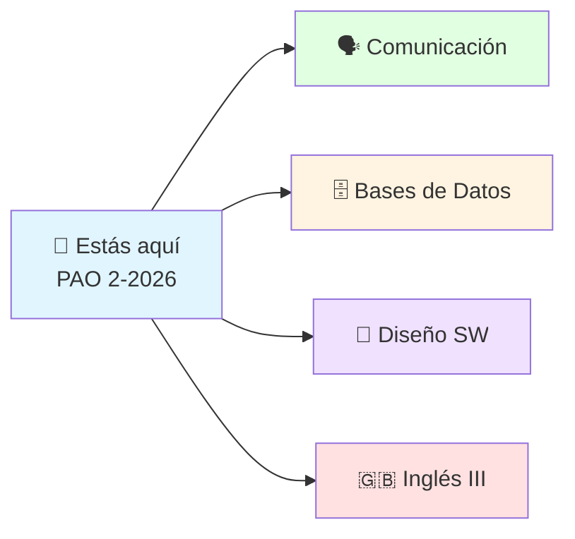

---

dg-publish: true
dg-home: true

---
# 🎓 FS — Notas ESPOL

> [!quote] 💡 *"Lo que no se escribe, se olvida. Lo que se comparte, se multiplica."*
>
> Bienvenido a mi jardín digital: apuntes vivos de **Ingeniería Computacional en ESPOL**, organizados por semestres y publicados automáticamente desde Obsidian.

> [!success] 📊 El jardín en números
>
> | 🌱 Notas | 📚 Materias | 📎 PDFs de apoyo | 🎯 Semestre actual |
> |---|---|---|---|
> | **700+** | **18** | **50+** | **PAO 2-2026** |

---

## 📌 Semestre actual — PAO 2-2026

> [!info] 🎓 Materias que curso ahora — empieza por aquí
>
> - [[Comunicación]] (2do · IDIG2012) `Activo`
> - [[Sistema de Bases de Datos]] (3ro) `Activo`
> - [[Diseño de Software]] (3ro) `Activo`
> - [[Ingles III]] (3ro) `Activo`
> - [[Matemáticas Discretas]] (3ro · repitiendo, notas ya completas) `Activo`

---

## 🗺️ Explorar por semestre

> [!tip] 🧭 ¿Cómo navegar?
>
> Usa el **árbol de archivos** (lateral), el **buscador** 🔍 o entra por tu semestre. Cada materia tiene su **mapa de contenido** con todas sus notas.

## Preuniversitario

- [[Preuniversitario/MOOC de Comunicación/Comunicación Efectiva|MOOC de Comunicación]]
- [[Preuniversitario/MOOC - Ingles (A1 - A2)/Inglés (A1-A2)|MOOC - Ingles (A1 - A2)]]
- [[Matemáticas]]

---

## 1er Semestre

- [[Cálculo de una Variable]]
- [[Física Mecánica]]
- [[Fundamentos de Programación]]
- [[Inglés I (B1-B2)]]

---

## 2do Semestre

- [[Álgebra Lineal]]
- [[Cálculo Vectorial]]
- [[Comunicación]] `Activo`
- [[Computación y Sociedad]]
- [[Inglés II (C1-C2)]]
- [[Programación Orientada a Objetos]]

---

## 3er Semestre

- [[Fundamentos de Electricidad y Sistemas Digitales]]
- [[Matemáticas Discretas]] `Activo`
- [[Sistema de Bases de Datos]] `Activo`
- [[Diseño de Software]] `Activo`
- [[Ingles III]] `Activo`

---

> [!example] 🌟 Sobre este jardín
>
> - 📝 Notas en Markdown, publicadas con [Digital Garden](https://github.com/oleeskild/Obsidian-Digital-Garden).
> - 🔄 Se actualiza solo cada vez que publico desde Obsidian.
> - 💖 *Espero que te sirva y te deseo suerte en tu paso por la universidad.*
