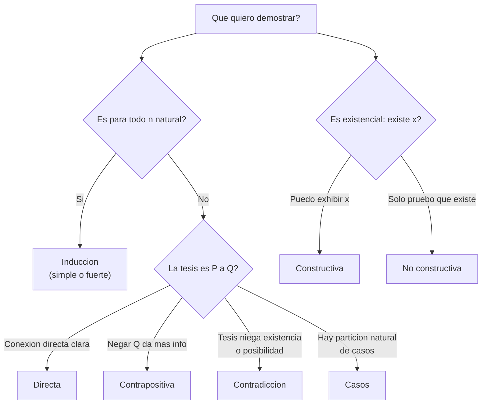
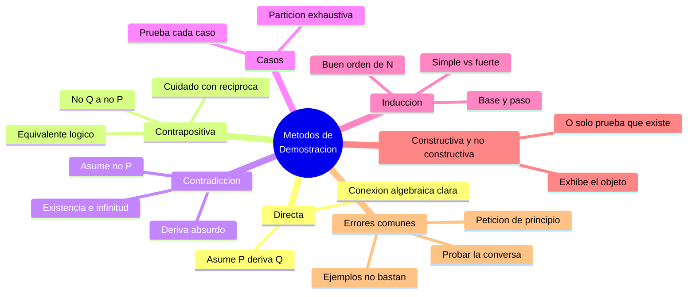

# 🎓 Métodos de Demostración

## 🎯 Introducción

> [!info] 💡 ¿Qué es demostrar y por qué importa?
>
> Demostrar es construir una cadena finita de pasos —cada uno justificado por un axioma, una definición o una regla de inferencia válida— que conecta lo que ya sabemos con lo que queremos probar. A diferencia de la evidencia empírica (que acumula casos a favor), una demostración da **certeza absoluta**: si la cadena es correcta, el resultado es verdadero sin excepción.
>
> **Importancia histórica:** Euclides formalizó este método hace más de 2000 años en *Los Elementos*, partiendo de 5 postulados para derivar toda la geometría plana. Ese mismo esquema —axiomas + reglas válidas + pasos finitos— sigue siendo la base de toda la matemática moderna.
>
> **Aplicaciones actuales:**
> - **Verificación de software:** probar que un algoritmo termina y produce el resultado correcto (ej. corrección de búsqueda binaria).
> - **Criptografía:** la seguridad de RSA depende de teoremas demostrados sobre factorización de primos.
> - **Compiladores:** demuestran que una optimización no cambia el comportamiento del programa.
> - **Bases de datos:** las consultas SQL con `JOIN` correctos dependen de propiedades algebraicas demostradas.
>
> ```mermaid
> graph LR
>     A["Axiomas y<br/>definiciones"] --> B["Reglas validas<br/>MP, MT, SH"]
>     B --> C["Cadena finita<br/>de pasos"]
>     C --> D["Teorema<br/>certeza total"]
>     style A fill:#fff4e1
>     style B fill:#e1ffe1
>     style C fill:#e1f5ff
>     style D fill:#f5e1ff
> ```

---

## 📐 Fundamentos: la estructura de una demostración

> [!note] 📋 Componentes obligatorios
>
> Toda demostración formal necesita:
>
> 1. **Hipótesis clara:** qué se asume (puede ser vacío, si se prueba un hecho absoluto).
> 2. **Tesis clara:** qué se quiere concluir.
> 3. **Justificación en cada paso:** axioma, definición, teorema previo o regla de inferencia (ver [[06 - Razonamientos]]).
> 4. **Cierre explícito:** el símbolo $\blacksquare$ o "Q.E.D." marca que la cadena llegó a la tesis.
>
> **Diferencia clave con un cálculo:** un cálculo transforma números; una demostración transforma **proposiciones** usando lógica ([[03 - Clases de Proposiciones]]).

> [!warning] ⚠️ Lo que NO es una demostración
>
> - Verificar unos pocos casos y generalizar ("funciona para $n=1,2,3$, entonces siempre").
> - Un dibujo o intuición sin cadena lógica explícita.
> - Asumir la conclusión de forma disfrazada (petición de principio).
> - Repetir la afirmación con otras palabras sin usar reglas válidas.

---

## 🎯 Demostración Directa

> [!success] 📋 Idea y por qué funciona
>
> Para probar $P \to Q$: **asumes $P$** como hipótesis y, aplicando definiciones y reglas válidas, **derivas $Q$**. Funciona porque el condicional solo es falso cuando $P$ es $V$ y $Q$ es $F$ ([[02 - Operadores Lógicos]]) — si logras llegar de $P$ a $Q$ con pasos válidos, ese caso queda descartado y $P\to Q$ es verdadero.
>
> **Esquema:** $P,\; P\to Q_1,\; Q_1\to Q_2,\;\dots,\;Q_{n-1}\to Q \;\therefore\; Q$ (silogismo hipotético encadenado).

> [!example] 🟢 Ejemplo 1 — Si $n$ es par, $n^2$ es par
>
> **Hipótesis:** $n$ es par. **Tesis:** $n^2$ es par.
>
> 1. $n$ par $\Rightarrow$ por definición, $n = 2k$ para algún $k \in \mathbb{Z}$.
> 2. Sustituyendo: $n^2 = (2k)^2 = 4k^2 = 2(2k^2)$.
> 3. Como $2k^2 \in \mathbb{Z}$, $n^2$ tiene la forma $2m$ con $m=2k^2$.
> 4. Por definición, $n^2$ es par. $\blacksquare$

> [!example] 🟢 Ejemplo 2 — La suma de dos impares es par
>
> **Hipótesis:** $a$ y $b$ son impares. **Tesis:** $a+b$ es par.
>
> 1. $a$ impar $\Rightarrow a = 2j+1$; $b$ impar $\Rightarrow b = 2k+1$, con $j,k\in\mathbb{Z}$.
> 2. $a+b = (2j+1)+(2k+1) = 2j+2k+2 = 2(j+k+1)$.
> 3. Como $j+k+1 \in \mathbb{Z}$, $a+b$ tiene la forma $2m$.
> 4. Por definición, $a+b$ es par. $\blacksquare$

> [!warning] ⚠️ Error común
>
> Empezar asumiendo la **tesis** en vez de la hipótesis ("supongamos que $n^2$ es par...") — eso es petición de principio, no demostración directa.

---

## 🔄 Demostración por Contradicción (Reducción al Absurdo)

> [!warning] 📋 Idea y por qué funciona
>
> Para probar $P$ (o $P\to Q$): **asumes la negación** ($\lnot P$, o $P\land\lnot Q$) y derivas una contradicción $R\land\lnot R$. Funciona porque $\lnot P \to (R\land\lnot R)$ es equivalente a $\lnot P \to \bot$, que a su vez equivale a $P$ ([[05 - Propiedades de los operadores lógicos]]: si negar algo lleva al absurdo, ese algo debe ser verdadero).
>
> **Cuándo conviene:** cuando la tesis afirma una **no existencia** o una **imposibilidad** (irracionalidad, infinitud, "no hay mayor elemento"), donde una prueba directa no tiene un punto de partida claro.

> [!example] 🟢 Ejemplo 1 — $\sqrt{2}$ es irracional (clásico)
>
> **Tesis:** $\sqrt{2} \notin \mathbb{Q}$.
>
> 1. **Supongamos lo contrario:** $\sqrt{2} = \dfrac{p}{q}$ con $p,q \in \mathbb{Z}$, $q\neq 0$, y $\dfrac{p}{q}$ **irreducible** (mcd$(p,q)=1$).
> 2. Elevando al cuadrado: $2 = \dfrac{p^2}{q^2} \Rightarrow p^2 = 2q^2$.
> 3. Entonces $p^2$ es par $\Rightarrow$ $p$ es par (por el Ejemplo 1 de contrapositiva, más abajo) $\Rightarrow p = 2m$.
> 4. Sustituyendo: $(2m)^2 = 2q^2 \Rightarrow 4m^2 = 2q^2 \Rightarrow q^2 = 2m^2$.
> 5. Entonces $q^2$ es par $\Rightarrow$ $q$ es par.
> 6. **Contradicción:** $p$ y $q$ son ambos pares, pero asumimos mcd$(p,q)=1$ (irreducible). $R\land\lnot R$.
> 7. Como suponer $\sqrt{2}\in\mathbb{Q}$ lleva al absurdo, $\sqrt{2}$ es irracional. $\blacksquare$

> [!example] 🟢 Ejemplo 2 — Hay infinitos números primos (Euclides)
>
> **Tesis:** El conjunto de primos es infinito.
>
> 8. **Supongamos lo contrario:** hay finitos primos $p_1, p_2, \dots, p_n$ (una lista completa).
> 9. Construimos $N = (p_1 \cdot p_2 \cdots p_n) + 1$.
> 10. $N$ no es divisible por ningún $p_i$ de la lista (siempre deja residuo $1$).
> 11. Pero todo entero $>1$ tiene al menos un factor primo (teorema previo) — ese factor primo de $N$ no está en la lista.
> 12. **Contradicción:** asumimos que la lista era completa, pero encontramos un primo fuera de ella.
> 13. Por lo tanto, no puede existir una lista finita de todos los primos. $\blacksquare$

> [!tip] 🎯 Reconocimiento rápido
>
> Si la tesis usa palabras como "no existe", "infinitos", "irracional", "imposible" — piensa primero en contradicción.

---

## 🔀 Demostración por Contrapositiva

> [!success] 📋 Idea y por qué funciona
>
> Para probar $P \to Q$, en su lugar pruebas $\lnot Q \to \lnot P$ (directamente). Funciona porque $P\to Q \equiv \lnot Q \to \lnot P$ es una equivalencia lógica ([[03 - Clases de Proposiciones]]), verificable por tabla de verdad — ambas fórmulas tienen exactamente el mismo patrón V/F.
>
> **Cuándo conviene:** cuando negar la conclusión te da más información manejable que asumir la hipótesis directamente.

> [!example] 🟢 Ejemplo 1 — Si $n^2$ es par, entonces $n$ es par
>
> Probar esto directamente es incómodo (no hay una forma clara de "extraer" $n$ de $n^2=2k$). Usamos la **contrapositiva**: $n$ impar $\to$ $n^2$ impar.
>
> 1. Supongamos $n$ impar $\Rightarrow n = 2k+1$.
> 2. $n^2 = (2k+1)^2 = 4k^2+4k+1 = 2(2k^2+2k)+1$.
> 3. Como $2k^2+2k \in \mathbb{Z}$, $n^2$ tiene la forma $2m+1$: es impar.
> 4. Como probamos $\lnot Q \to \lnot P$, concluimos $P \to Q$: si $n^2$ es par, $n$ es par. $\blacksquare$

> [!example] 🟢 Ejemplo 2 — Si $ab$ no es divisible por $3$, entonces $a$ no es divisible por $3$ y $b$ no es divisible por $3$... (contraejemplo intencional)
>
> Aquí conviene mostrar la versión correcta con un primo: **Si $p \mid ab$ ($p$ primo), entonces $p\mid a$ o $p\mid b$.** Contrapositiva: si $p\nmid a$ y $p\nmid b$, entonces $p \nmid ab$.
>
> 1. Supongamos $p \nmid a$ y $p \nmid b$.
> 2. Como $p$ es primo y no divide a $a$ ni a $b$, mcd$(p,a)=1$ y mcd$(p,b)=1$.
> 3. Por propiedades de mcd, mcd$(p, ab) = 1$, así que $p \nmid ab$.
> 4. Se probó $\lnot Q \to \lnot P$, luego $P \to Q$. $\blacksquare$

> [!warning] ⚠️ Contrapositiva ≠ Recíproca ≠ Contraria — no las confundas
>
> | Nombre | Fórmula | ¿Equivalente a $p\to q$? |
> |---|---|---|
> | Original | $p \to q$ | — |
> | **Recíproca** | $q \to p$ | ❌ No |
> | **Contraria** (inversa) | $\lnot p \to \lnot q$ | ❌ No |
> | **Contrapositiva** | $\lnot q \to \lnot p$ | ✅ Sí |
>
> Verifícalo con tabla: recíproca y contraria comparten tabla entre sí, pero difieren de la original en las filas $p=F,q=V$ y $p=V,q=F$.

---

## 📊 Demostración por Casos

> [!note] 📋 Idea y por qué funciona
>
> Divides la hipótesis en subcasos $A_1 \lor A_2 \lor \dots \lor A_n$ que cubren **todas** las posibilidades (exhaustivos), y demuestras la tesis en cada uno por separado. Funciona por la regla del **dilema constructivo**: si $(A_1\to Q)\land(A_2\to Q)\land\dots\land(A_1\lor\dots\lor A_n)$, entonces $Q$ ([[06 - Razonamientos]]).
>
> **Requisito crítico:** los casos deben cubrir el 100% de las posibilidades — si te falta un caso, la demostración queda incompleta.

> [!example] 🟢 Ejemplo 1 — $n(n+1)$ es siempre par
>
> **Casos exhaustivos:** $n$ es par o $n$ es impar.
>
> - **Caso 1 ($n$ par):** $n=2k \Rightarrow n(n+1) = 2k(n+1) = 2\underbrace{[k(n+1)]}_{\in\mathbb{Z}}$, que es par.
> - **Caso 2 ($n$ impar):** $n=2k+1 \Rightarrow n+1 = 2k+2 = 2(k+1) \Rightarrow n(n+1) = n\cdot 2(k+1) = 2\underbrace{[n(k+1)]}_{\in\mathbb{Z}}$, que es par.
>
> Como ambos casos cubren todo $n\in\mathbb{Z}$ y en ambos $n(n+1)$ es par, la tesis queda probada. $\blacksquare$

> [!example] 🟢 Ejemplo 2 — $|x+y| \le |x|+|y|$ (desigualdad triangular, caso simple)
>
> **Casos exhaustivos según signos:** ambos no-negativos, ambos negativos, o signos mixtos.
>
> - **Caso 1 ($x,y \ge 0$):** $|x+y| = x+y = |x|+|y|$. Se cumple con igualdad.
> - **Caso 2 ($x,y < 0$):** $x+y<0 \Rightarrow |x+y| = -(x+y) = (-x)+(-y) = |x|+|y|$. Igualdad.
> - **Caso 3 (signos mixtos, ej. $x\ge0, y<0$):** $|x+y| \le \max(|x|,|y|) \le |x|+|y|$ (la suma cancela parcialmente, nunca supera la suma de magnitudes).
>
> Los tres casos cubren todo $(x,y)\in\mathbb{R}^2$. $\blacksquare$

> [!tip] 🎯 Cómo verificar exhaustividad
>
> Pregúntate: "¿existe algún valor que no caiga en ninguno de mis casos?" Para enteros, par/impar siempre cubre todo. Para signos, ten cuidado con el cero (¿es positivo, negativo, o caso aparte?).

---

## 🔢 Inducción Matemática

> [!success] 📋 Idea y por qué funciona
>
> Para probar $P(n)$ para todo $n \ge n_0$: pruebas la **base** $P(n_0)$ y el **paso inductivo** $P(k) \to P(k+1)$ para $k$ arbitrario. Funciona por el **principio de buen orden** de $\mathbb{N}$: si el conjunto de contraejemplos no fuera vacío, tendría un mínimo $m$; pero $m$ no puede ser $n_0$ (falla la base) ni $m>n_0$ (falla el paso, porque $P(m-1)$ sí se cumple por minimalidad) — contradicción, así que no hay contraejemplos.

> [!note] 📋 Inducción simple vs. fuerte
>
> | | Simple | Fuerte |
> |---|---|---|
> | **Hipótesis inductiva** | Solo $P(k)$ | $P(n_0), P(n_0+1), \dots, P(k)$ (todos los anteriores) |
> | **Cuándo usar** | El paso $k\to k+1$ solo necesita el término inmediato anterior | El paso necesita términos no consecutivos (ej. Fibonacci, factorización) |
> | **Ejemplo típico** | Sumas, potencias | Todo entero $>1$ tiene factorización prima |

> [!example] 🟢 Ejemplo 1 — Inducción simple: $1+2+\dots+n = \dfrac{n(n+1)}{2}$
>
> **Base ($n=1$):** $1 = \dfrac{1\cdot 2}{2} = 1$ ✓
>
> **Hipótesis inductiva (HI):** asumimos que vale para $n=k$: $1+\dots+k = \dfrac{k(k+1)}{2}$.
>
> **Paso inductivo:** queremos probar para $n=k+1$:
> $$1+\dots+k+(k+1) = \underbrace{\frac{k(k+1)}{2}}_{\text{por HI}}+(k+1) = \frac{k(k+1)+2(k+1)}{2} = \frac{(k+1)(k+2)}{2}$$
>
> Esto coincide exactamente con la fórmula evaluada en $n=k+1$. $\blacksquare$

> [!example] 🟢 Ejemplo 2 — Inducción fuerte: todo entero $n>1$ tiene un factor primo
>
> **Base ($n=2$):** $2$ es primo, se divide a sí mismo. ✓
>
> **HI fuerte:** asumimos que todo entero entre $2$ y $k$ tiene un factor primo.
>
> **Paso inductivo:** para $n=k+1$:
> - Si $k+1$ es primo, es su propio factor primo. Listo.
> - Si $k+1$ no es primo, es compuesto: $k+1 = a\cdot b$ con $1<a,b<k+1$. Por HI fuerte (aplicada a $a$, que está entre $2$ y $k$), $a$ tiene un factor primo $p$. Como $p\mid a$ y $a \mid (k+1)$, entonces $p \mid (k+1)$.
>
> En ambos casos $k+1$ tiene un factor primo. $\blacksquare$ — nótese que aquí **sí** necesitamos inducción fuerte: $a$ no es necesariamente $k$, puede ser cualquier valor menor.

![[07-induccion.png]]

> [!tip] 💡 Visual — inducción como dominó
>
> Si cae la primera ficha (base) y cada ficha garantiza que la siguiente caiga (paso inductivo), caen todas sin excepción. La inducción fuerte es como si cada ficha pudiera ser derribada por *cualquiera* de las fichas anteriores, no solo la inmediata.

> [!warning] ⚠️ Errores comunes en inducción
>
> - **Olvidar la base:** sin ella, el paso inductivo no "arranca" — puedes "demostrar" $P(k)\to P(k+1)$ para algo falso si nunca hay un $P(n_0)$ real.
> - **HI mal aplicada:** usar $P(k+1)$ para probar $P(k+1)$ (circular) en vez de partir de $P(k)$.
> - **Salto no justificado:** pasar de $P(k)$ a $P(k+2)$ sin cubrir $P(k+1)$.
> - **Usar inducción simple donde se necesita fuerte:** como en el Ejemplo 2 de factorización.

---

## 🔨 Constructiva vs. No Constructiva

> [!note] 📋 Dos formas de probar $\exists x: P(x)$
>
> - **Constructiva:** exhibes un $x$ concreto que cumple $P(x)$. Ejemplo: para probar $\exists x \in \mathbb{Q}: x^2 < 2 < (x+0.01)^2$, das $x=1.41$ y verificas.
> - **No constructiva:** pruebas que $x$ debe existir (a menudo por contradicción o casos) sin señalar cuál es.
>
> **Ejemplo clásico no constructivo:** existen irracionales $a,b$ tales que $a^b$ es racional.
>
> 1. Considera $\sqrt{2}^{\sqrt{2}}$. O es racional o es irracional (caso exhaustivo, no sabemos cuál).
> 2. **Caso A:** si $\sqrt{2}^{\sqrt{2}}$ es racional, ya encontramos $a=b=\sqrt{2}$ (ambos irracionales) con $a^b$ racional.
> 3. **Caso B:** si $\sqrt{2}^{\sqrt{2}}$ es irracional, toma $a=\sqrt{2}^{\sqrt{2}}$ y $b=\sqrt{2}$: $a^b = \left(\sqrt{2}^{\sqrt{2}}\right)^{\sqrt{2}} = \sqrt{2}^{2} = 2$, que es racional.
> 4. En ambos casos existen tales $a,b$ — pero **no sabemos cuál caso es el real**, solo que uno de los dos funciona. $\blacksquare$

---

## 📋 Tabla Comparativa de Métodos

> [!note] 📊 Resumen de estrategia
>
> | Método | Qué asumes | Qué derivas | Úsalo cuando... | Riesgo típico |
> |---|---|---|---|---|
> | **Directa** | $P$ | $Q$ paso a paso | La conexión $P\to Q$ es algebraicamente clara | Asumir la tesis por error |
> | **Contradicción** | $\lnot P$ (o $P\land\lnot Q$) | $R\land\lnot R$ | La tesis niega existencia/posibilidad | No identificar la contradicción real |
> | **Contrapositiva** | $\lnot Q$ | $\lnot P$ | Negar la conclusión da más información que $P$ | Confundir con recíproca |
> | **Casos** | $A_1\lor\dots\lor A_n$ | $Q$ en cada caso | Hay una partición natural (par/impar, signos) | Casos no exhaustivos |
> | **Inducción** | $P(k)$ (o $P(n_0..k)$) | $P(k+1)$ | La tesis es $\forall n\ge n_0$ | Olvidar la base o usar HI mal |

---

## 🗺️ Cómo Elegir el Método



---

## ⚠️ Errores Comunes en Demostraciones

> [!warning] ⚠️ Evita estos fallos
>
> - **Petición de principio:** asumir (de forma disfrazada) lo que quieres probar.
> - **Probar la conversa en vez del enunciado:** demostrar "$n$ par $\to n^2$ par" no prueba "$n^2$ par $\to n$ par" (son proposiciones distintas, ver [[05 - Propiedades de los operadores lógicos]]).
> - **Generalizar desde ejemplos:** $n^2+n+41$ es primo para $n=0,1,2,\dots,39$, pero falla en $n=40$ ($40^2+40+41 = 41^2$). Verificar casos nunca reemplaza una demostración.
> - **Confundir contrapositiva con recíproca o contraria** (ver tabla más arriba).
> - **Inducción sin base, o con HI aplicada incorrectamente.**
> - **Casos no exhaustivos:** dejar un valor sin cubrir (ej. olvidar $n=0$ al dividir en positivos/negativos).

---
## 📝 Ejercicios Propuestos

> [!example] 📋 Nivel 1 — Básico
>
> **1.** Prueba (directa): si $n$ es impar, $n^2$ es impar.
>
> **2.** Prueba (directa): $\forall x \in \mathbb{R}, \; x^2-4x+5>0$.
>
> **3.** Prueba (directa): si $a\mid b$ y $a\mid c$, entonces $a\mid(b+c)$.
>
> **4.** Prueba (directa) que $n$ par $\to n^2$ par, y explica por qué esto **no** prueba la conversa.
>
> **5.** Prueba (casos) que $x^2 \ge 0$ para todo $x\in\mathbb{R}$, dividiendo en $x\ge0$ y $x<0$.
>
> > [!success]- ✅ Respuestas — Nivel 1
> >
> > - **1.** $n=2k+1 \to n^2=4k^2+4k+1=2(2k^2+2k)+1$, impar.
> > - **2.** $x^2-4x+5=(x-2)^2+1 \ge 1 > 0$.
> > - **3.** $b=k_1a,\;c=k_2a \Rightarrow b+c=(k_1+k_2)a$, divisible por $a$.
> > - **4.** Directa prueba $P\to Q$; la conversa $Q\to P$ requiere su propia demostración (de hecho, se prueba por contrapositiva — ver ejemplo del tema).
> > - **5.** $x\ge0 \Rightarrow x\cdot x\ge0$; $x<0 \Rightarrow (-x)>0 \Rightarrow (-x)^2=x^2\ge0$.

> [!example] 📋 Nivel 2 — Intermedio
>
> **6.** Prueba (contradicción): no existe el mayor entero.
>
> **7.** Prueba (contrapositiva): si $n^2$ no es divisible por $3$, entonces $n$ no es divisible por $3$.
>
> **8.** Prueba (contradicción): $\sqrt{3}$ es irracional.
>
> **9.** Prueba (casos): $n^2+n$ es par para todo $n\in\mathbb{Z}$.
>
> **10.** Prueba (contradicción): $\sqrt{2}+\sqrt{3}$ es irracional.
>
> > [!success]- ✅ Respuestas — Nivel 2
> >
> > - **6.** Si $M$ es el mayor entero, $M+1>M$ también es entero — contradicción.
> > - **7.** Contrapositiva: $n=3k \Rightarrow n^2=9k^2=3(3k^2)$, divisible por $3$.
> > - **8.** Análogo a $\sqrt{2}$: si $\sqrt3=p/q$ irreducible, $p^2=3q^2 \Rightarrow p,q$ múltiplos de $3$, contradice irreducibilidad.
> > - **9.** $n$ par $\to n(n+1)$ par (ejemplo del tema); $n$ impar $\to n+1$ par $\to$ producto par.
> > - **10.** Si $r=\sqrt2+\sqrt3\in\mathbb{Q}$, entonces $r^2=5+2\sqrt6\in\mathbb{Q}$, forzando $\sqrt6\in\mathbb{Q}$ — falso (mismo argumento que $\sqrt2$).

> [!example] 📋 Nivel 3 — Avanzado
>
> **11.** Prueba por inducción: $1^2+2^2+\dots+n^2 = \dfrac{n(n+1)(2n+1)}{6}$.
>
> **12.** Prueba por inducción: $4^n-1$ es divisible por $3$ para todo $n\ge1$.
>
> **13.** Demuestra (no constructiva) que existen $a,b$ irracionales con $a^b$ racional (repite el argumento del tema con tus propias palabras).
>
> **14.** Prueba por inducción: $\forall n\ge4, \; 2^n < n!$.
>
> **15.** Prueba por inducción fuerte: todo entero $\ge 2$ puede escribirse como producto de primos (existencia de factorización).
>
> > [!success]- ✅ Respuestas — Nivel 3
> >
> > - **11.** Base $n=1$: $1=1$. Paso: $\dfrac{k(k+1)(2k+1)}{6}+(k+1)^2 = \dfrac{(k+1)(k+2)(2k+3)}{6}$.
> > - **12.** Base $n=1$: $3$ divisible por $3$. Paso: $4^{k+1}-1 = 4(4^k-1)+3$, ambos términos divisibles por $3$.
> > - **13.** Ver desarrollo completo en la sección "Constructiva vs. No Constructiva".
> > - **14.** Base $n=4$: $16<24$. Paso: $2^{k+1}=2\cdot2^k < 2\cdot k! < (k+1)\cdot k! = (k+1)!$ si $k\ge4$ (ya que $k+1>2$).
> > - **15.** Base $n=2$ (primo). Paso fuerte: si $k+1$ es primo, listo; si es compuesto, $k+1=ab$ con $a,b<k+1$, ambos factorizables por HI fuerte, entonces $k+1$ también.

---

## 📋 Resumen Ejecutivo

> [!summary] 📋 Lo Esencial
>
> - Una demostración es una cadena finita de pasos justificados por axiomas, definiciones y reglas válidas — da certeza, no solo evidencia.
> - **Directa:** asume $P$, deriva $Q$. **Contrapositiva:** prueba $\lnot Q\to\lnot P$ (equivalente a $P\to Q$). **Contradicción:** asume $\lnot P$, deriva un absurdo.
> - **Casos:** divide en subcasos exhaustivos y prueba cada uno. **Inducción:** base + paso $P(k)\to P(k+1)$, válida por el buen orden de $\mathbb{N}$.
> - Contrapositiva ≠ recíproca ≠ contraria: solo la contrapositiva es lógicamente equivalente al original.
> - Ningún número finito de ejemplos reemplaza una demostración — siempre existe el riesgo de un contraejemplo más adelante (ej. $n^2+n+41$).

---

## ✅ Metas de Aprendizaje

> [!note] 🎯 Nivel Básico
> - [ ] Distingo directa, contrapositiva, contradicción, casos e inducción, y explico la idea de cada una con mis palabras.
> - [ ] Aplico demostración directa a afirmaciones simples de paridad y divisibilidad.
> - [ ] Identifico base y paso inductivo en una suma simple.

> [!note] 🎯 Nivel Intermedio
> - [ ] Elijo el método correcto según la forma de la tesis (existencia, universalidad, negación).
> - [ ] Pruebo irracionalidad y no-existencia por contradicción.
> - [ ] Distingo contrapositiva de recíproca y contraria con una tabla de verdad.

> [!note] 🎯 Nivel Avanzado
> - [ ] Combino inducción fuerte con casos para problemas de factorización o algoritmos recursivos.
> - [ ] Construyo una demostración no constructiva y explico por qué no señala el objeto exacto.
> - [ ] Relaciono invariantes de bucle y corrección de recursión con el principio de inducción.

---

## 📊 Resumen Visual



---

> [!quote] 📖 Fuentes consultadas
>
> [1] K. Rosen, *Discrete Mathematics and Its Applications*, 8th ed., McGraw-Hill, 2019 — cap. 1 (métodos de demostración).
>
> [2] S. Epp, *Discrete Mathematics with Applications*, 5th ed., Cengage, 2020 — cap. 4 (inducción y recursión).
>
> [3] Euclides, *Elementos*, Libro IX, Proposición 20 (infinitud de los primos).

> [!quote] 🔗 Conexiones
>
> - [[01 - Proposiciones]] — base del razonamiento formal.
> - [[02 - Operadores Lógicos]] — condicional y bicondicional usados en cada método.
> - [[05 - Propiedades de los operadores lógicos]] — equivalencias que justifican contrapositiva y contradicción.
> - [[06 - Razonamientos]] — reglas de inferencia (MP, MT, SH) usadas dentro de cada demostración.
> - [[02 - Cuantificadores]] — el $\forall$ detrás de "para todo $n$" en inducción.

---

**Tags:** #demostraciones #demostracion-directa #contradiccion #contrapositiva #induccion-matematica #casos #matematica-discreta #unidad1