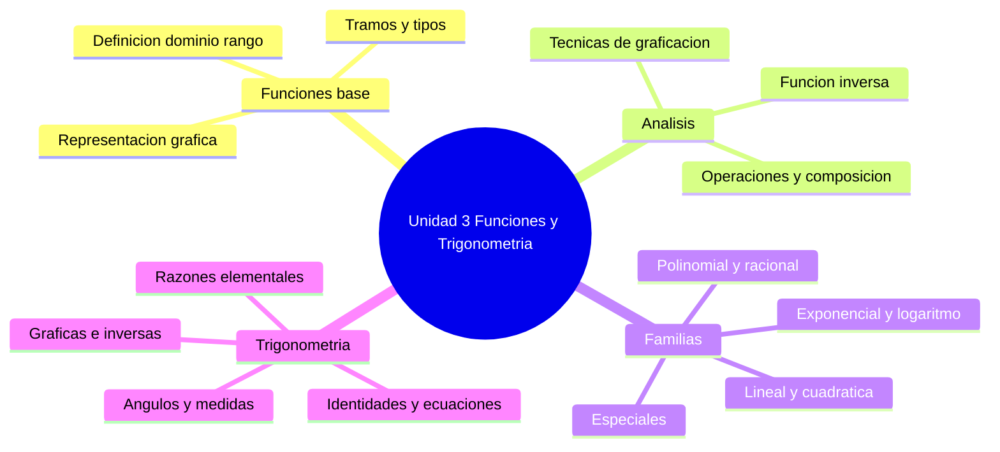

# 🗺️ Índice Unidad 3 — Funciones y Trigonometría

## 🎯 Introducción

> [!info] 💡 ¿Qué cubre esta unidad?
>
> Esta unidad estudia las **funciones de variable real** (definición, gráficas, operaciones y familias elementales) y la **trigonometría** (ángulos, razones, gráficas, identidades y ecuaciones). Es la base del cálculo: límites, derivadas e integrales operan sobre las funciones que aquí se aprenden a analizar y graficar.
>
> ```mermaid
> graph TD
>     U[Unidad 3 - Funciones y Trigonometria] --> F[Funciones de Variable Real]
>     U --> T[Trigonometria]
>     F --> F1[Base: definicion dominio rango]
>     F --> F2[Analisis: graficas y operaciones]
>     F --> F3[Familias: lineal a logaritmica]
>     T --> T1[Angulos y razones]
>     T --> T2[Graficas e inversas]
>     T --> T3[Identidades y ecuaciones]
> ```

---

## 📑 Mapa de la unidad

> [!note] 🗂️ Las 20 notas con enlaces cortos intra-unidad
>
> | # | Nota | Tema |
> |---|---|---|
> | I-01 | [[01 - Definición, dominio y rango]] | Concepto de función, dominio, rango, composición |
> | I-02 | [[02 - Representación gráfica]] | Gráficas, checklist, transformaciones, huecos |
> | I-03 | [[03 - Funciones definidas por tramos]] | Tramos, continuidad en fronteras, aplicaciones |
> | I-04 | [[04 - Tipos de funciones]] | Algebraicas, trascendentes, paridad, inyectividad |
> | I-05 | [[05 - Función lineal]] | Pendiente, rectas, sistemas, regresión |
> | I-06 | [[06 - Funciones Especiales]] | Valor absoluto, escalón, gaussiana, sigmoide |
> | I-07 | [[07 - Función cuadrática]] | Parábola, vértice, discriminante, optimización |
> | I-09 | [[09 - Operaciones con funciones de variable real]] | Álgebra de funciones y composición |
> | I-10 | [[10 - Función inversa de una función biyectiva]] | Biyectividad, cálculo y gráfica de $f^{-1}$ |
> | I-11 | [[11 - Funciones polinomiales]] | Grado, raíces, Ruffini, Taylor |
> | I-12 | [[12 - Funciones racionales]] | Asíntotas, simplificación, fracciones parciales |
> | I-13 | [[13 - Funciones exponenciales]] | Exponencial y logaritmo, leyes, escalas |
> | II-01 | [[01 - Ángulos y sus medidas]] | Grados, radianes, arco, sector |
> | II-02 | [[02 - Funciones trigonométricas elementales]] | Seno, coseno, tangente, círculo unitario |
> | II-03 | [[03 - Gráficas de funciones trigonométricas]] | Amplitud, período, fase, modelos |
> | II-04 | [[04 - Funciones trigonométricas inversas]] | Arcoseno, arcocoseno, arcotangente |
> | II-05 | [[05 - Identidades trigonométricas]] | Pitagóricas, suma, doble, demostración |
> | II-06 | [[06 - Ecuaciones e inecuaciones trigonométricas]] | Familias de soluciones, verificación |

---

## ✅ Avance por nota

> [!note] 🎯 Marca cada nota al dominar sus metas de aprendizaje
>
> - [ ] I-01 Definición, dominio y rango
> - [ ] I-02 Representación gráfica
> - [ ] I-03 Funciones definidas por tramos
> - [ ] I-04 Tipos de funciones
> - [ ] I-05 Función lineal
> - [ ] I-06 Funciones Especiales
> - [ ] I-07 Función cuadrática
> - [ ] I-09 Operaciones con funciones de variable real
> - [ ] I-10 Función inversa de una función biyectiva
> - [ ] I-11 Funciones polinomiales
> - [ ] I-12 Funciones racionales
> - [ ] I-13 Exponenciales y logaritmos
> - [ ] II-01 Ángulos y sus medidas
> - [ ] II-02 Funciones trigonométricas elementales
> - [ ] II-03 Gráficas de funciones trigonométricas
> - [ ] II-04 Funciones trigonométricas inversas
> - [ ] II-05 Identidades trigonométricas
> - [ ] II-06 Ecuaciones e inecuaciones trigonométricas

---

## 📊 Resumen Visual



---

> [!quote] 🔗 Conexiones
>
> - Base previa: [[Universidad/Preuniversitario/Matemáticas/Unidad 2 - Números Reales/I - Números Reales/01 - Conjuntos Numéricos]] (los reales como dominio y rango) y [[Universidad/Preuniversitario/Matemáticas/Unidad 2 - Números Reales/I - Números Reales/11 - Inecuaciones]] (desigualdades para dominios).
> - Lenguaje de correspondencias: [[Universidad/Preuniversitario/Matemáticas/Unidad 1 - Lógica y Conjuntos/II - Conjuntos/10 - Funciones en Conjuntos]].
> - Ruta sugerida: I-01 → I-02 → I-03 → I-04 → I-05 → I-07 → I-11 → I-12 → I-13 → I-14 → I-06 → I-08 → I-09 → I-10, luego II-01 → II-02 → II-03 → II-04 → II-05 → II-06.

---

**Tags:** #matematicas #preuniversitario #unidad3

---
