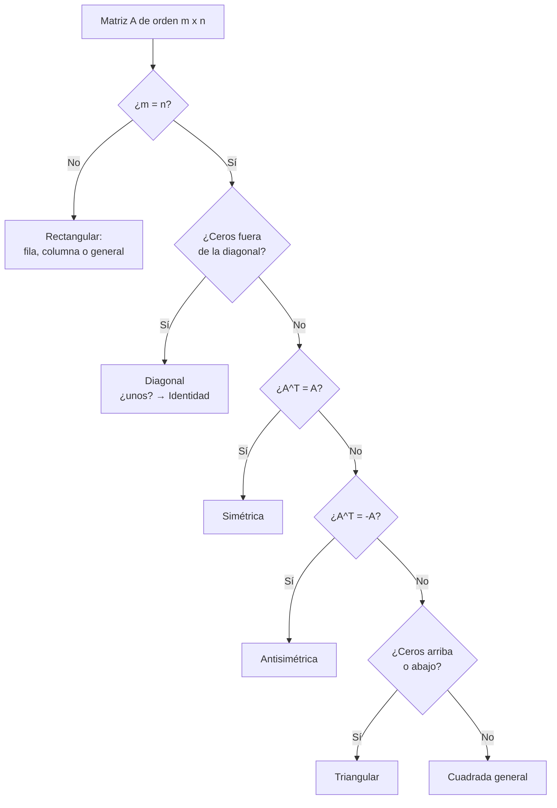

# 🧮 Definición y Clases de Matrices

## 🎯 Introducción

> [!info] 💡 ¿Qué es una matriz?
>
> Una **matriz** $A=(a_{ij})$ de orden $m\times n$ es un arreglo rectangular de $m$ filas y $n$ columnas. Su **clase** (cuadrada, diagonal, identidad, simétrica, triangular) determina qué operaciones admite: solo las cuadradas tienen determinante e inversa.
>
> ```mermaid
> graph LR
>     A["Datos<br/>tabla m x n"] --> B["Matriz<br/>A = (a_ij)"]
>     B --> C{"¿Cuadrada?"}
>     C -->|"Sí"| D["Diagonal / Id / Sim<br/>det e inversa"]
>     C -->|No| E["Rectangular<br/>solo + y por escalar"]
> ```

---

## 📋 Definición Formal

> [!note] 📋 Definición — Matriz de orden $m\times n$
>
> Una **matriz** sobre $\mathbb{R}$ es una función $A:\{1,\dots,m\}\times\{1,\dots,n\}\to\mathbb{R}$. Se escribe
>
> $$A = \begin{pmatrix}a_{11}&\cdots&a_{1n}\\\vdots&&\vdots\\a_{m1}&\cdots&a_{mn}\end{pmatrix}$$
>
> donde $a_{ij}$ es el elemento de la fila $i$, columna $j$. El par $m\times n$ es el **orden**; si $m=n$ la matriz es **cuadrada**.

> [!note] 📋 Definición alternativa — Por filas y columnas
>
> También se puede ver $A$ como lista de $m$ vectores fila de longitud $n$ (o $n$ vectores columna de longitud $m$). La fila $i$ es $(a_{i1},\dots,a_{in})$ y la columna $j$ es $(a_{1j},\dots,a_{mj})^T$.

> [!tip] 💡 Cómo leer una matriz sin perderse
>
> Lee siempre **fila primero, columna después**: $a_{23}$ es "fila 2, columna 3". Un truco visual es tapar con un dedo todas las filas menos la $i$, y luego todas las columnas menos la $j$ — el elemento que queda descubierto es $a_{ij}$. Con práctica, la notación $(a_{ij})$ se lee tan natural como coordenadas $(x,y)$.

> [!example] 🟢 Ejemplo — Lectura de elementos
>
> Sea $A=\begin{pmatrix}1&2&3\\4&5&6\end{pmatrix}$ (orden $2\times3$, no cuadrada):
>
> | Elemento | Valor |
> |---|---|
> | $a_{12}$ | $2$ |
> | $a_{21}$ | $4$ |
> | $a_{23}$ | $6$ |

---

## 📋 Tabla Comparativa: Clases de Matrices

> [!note] 📋 Clases principales
>
> | Clase | Definición | Ejemplo |
> |---|---|---|
> | **Fila / Columna** | $1\times n$ / $m\times1$ | $(1,2,3)$, $\binom{1}{2}$ |
> | **Cuadrada** | $n\times n$ | $2\times2$ |
> | **Diagonal** | $a_{ij}=0$ si $i\neq j$ | $\text{diag}(2,3)$ |
> | **Identidad** $I_n$ | diagonal con $1$ | $\begin{pmatrix}1&0\\0&1\end{pmatrix}$ |
> | **Cero** $O$ | todo $0$ | neutro de $+$ |
> | **Triangular superior** | ceros bajo la diagonal | $\begin{pmatrix}1&2\\0&3\end{pmatrix}$ |
> | **Simétrica** | $A^T=A$ | $\begin{pmatrix}1&2\\2&3\end{pmatrix}$ |
> | **Antisimétrica** | $A^T=-A$ (diagonal $0$) | $\begin{pmatrix}0&2\\-2&0\end{pmatrix}$ |

---

### 🔀 Diagrama de decisión: ¿qué clase es?



---

## ⚠️ Errores Comunes

> [!warning] ⚠️ Errores frecuentes
>
> - **Confundir $a_{12}$ con $a_{21}$:** el primer subíndice es la **fila**, el segundo la **columna** — $a_{12}$ está en fila 1, columna 2.
> - **Creer que toda matriz tiene determinante:** solo las **cuadradas** lo tienen; pedir $\det$ de una $2\times3$ no tiene sentido.
> - **Llamar "simétrica" a cualquier matriz con números repetidos:** simetría exige $a_{ij}=a_{ji}$ para **todo** par $i,j$, no solo algún par coincidente.
> - **Olvidar que la diagonal de una antisimétrica es cero:** $a_{ii}=-a_{ii}$ fuerza $a_{ii}=0$.

---

## 📝 Ejercicios Progresivos

### 🟢 Nivel 1 — Básico

> [!question] 📋 Ejercicios Nivel 1
>
> 1. Indica el orden y los elementos $a_{12},a_{21}$ de $\begin{pmatrix}1&2\\3&4\end{pmatrix}$ y de $\begin{pmatrix}1&2&3\end{pmatrix}$.
> 2. Clasifica: $I_3$, $O_{2}$, $\begin{pmatrix}1&2\\0&3\end{pmatrix}$, $\begin{pmatrix}0&2\\-2&0\end{pmatrix}$.
> 3. Escribe $\text{diag}(4,-1)$ y la matriz cero $O_{2\times3}$.

> [!success]- ✅ Respuestas Nivel 1
>
> **1.** $2\times2$ ($a_{12}=2$, $a_{21}=3$); $1\times3$ (no tiene $a_{21}$).
>
> **2.** Identidad, cero, triangular superior, antisimétrica.
>
> **3.** $\begin{pmatrix}4&0\\0&-1\end{pmatrix}$; matriz $2\times3$ de ceros.

### 🟡 Nivel 2 — Intermedio

> [!question] 📋 Ejercicios Nivel 2
>
> 4. Prueba que el producto de dos matrices diagonales es diagonal.
> 5. ¿Es simétrica la suma de dos simétricas? Justifica con $(A+B)^T$.
> 6. Halla la traza de $\begin{pmatrix}1&2\\3&4\end{pmatrix}$ y escribe la forma general de una antisimétrica $3\times3$.

> [!success]- ✅ Respuestas Nivel 2
>
> **4.** $(AB)_{ii}=a_{ii}b_{ii}$ y $(AB)_{ij}=0$ si $i\neq j$, pues cada fila/columna solo tiene el elemento diagonal no nulo.
>
> **5.** Sí: $(A+B)^T=A^T+B^T=A+B$.
>
> **6.** Traza $1+4=5$; $\begin{pmatrix}0&a&b\\-a&0&c\\-b&-c&0\end{pmatrix}$.

### 🔴 Nivel 3 — Avanzado

> [!question] 📋 Ejercicios Nivel 3
>
> 7. Prueba $(A^T)^T=A$ y $(A+B)^T=A^T+B^T$ elemento a elemento.
> 8. Descompón cualquier cuadrada $A$ en suma de simétrica y antisimétrica.
> 9. Verifica que $Q=\begin{pmatrix}0&-1\\1&0\end{pmatrix}$ cumple $Q^TQ=I$ (rotación de $90°$) y explica qué significa.

> [!success]- ✅ Respuestas Nivel 3
>
> **7.** $((A^T)^T)_{ij}=(A^T)_{ji}=a_{ij}$; $((A+B)^T)_{ij}=(A+B)_{ji}=a_{ji}+b_{ji}$.
>
> **8.** $A=\frac{A+A^T}{2}+\frac{A-A^T}{2}$: la primera es simétrica, la segunda antisimétrica, y suman $A$.
>
> **9.** $Q^TQ=\begin{pmatrix}0&1\\-1&0\end{pmatrix}\begin{pmatrix}0&-1\\1&0\end{pmatrix}=I$; $Q$ es **ortogonal** ($Q^T=Q^{-1}$): representa una rotación, que preserva longitudes.

---

## 🎯 Metas de Aprendizaje

> [!note] 📋 Nivel Básico
>
> - [ ] Leo $a_{ij}$ indicando fila y columna sin confundir el orden.
> - [ ] Determino el orden $m\times n$ de cualquier matriz dada.
> - [ ] Clasifico matrices en identidad, cero, diagonal, triangular, simétrica y antisimétrica.
> - [ ] Distingo matrices cuadradas de rectangulares y sé qué operaciones admite cada tipo.

> [!note] 📋 Nivel Intermedio
>
> - [ ] Pruebo propiedades de transpuestas ($(A+B)^T$, $(A^T)^T$) elemento a elemento.
> - [ ] Hallo la traza y construyo matrices antisimétricas generales.
> - [ ] Uso el diagrama de decisión para clasificar cualquier matriz $2\times2$ o $3\times3$.
> - [ ] Explico por qué solo las cuadradas tienen determinante e inversa.

> [!note] 📋 Nivel Avanzado
>
> - [ ] Descompongo cualquier cuadrada en parte simétrica y antisimétrica.
> - [ ] Reconozco matrices idempotentes, nilpotentes y ortogonales con ejemplos.
> - [ ] Relaciono ortogonalidad ($Q^TQ=I$) con rotaciones que preservan longitudes.
> - [ ] Conecto las clases de matrices con las estructuras que veré en sistemas e inversas.

---

## 📚 Referencias

> [!quote] 📖 Fuentes consultadas
>
> [1] S. Lipschutz, *Álgebra Lineal (Schaum)*, 4ta ed., McGraw-Hill — cap. 1 (definición y clases).
>
> [2] K. Rosen, *Discrete Mathematics and Its Applications*, 8th ed., McGraw-Hill, 2019 — §2.6 (matrices).

---

## 🔗 Conexiones

> [!quote] 🔗 Notas relacionadas
>
> - [[02 - Operaciones con matrices]] — suma, producto y transpuesta operan sobre estas clases; la identidad y la cero son sus neutros.
> - [[04 - Determinantes]] — el determinante solo existe para matrices cuadradas clasificadas aquí.
> - [[06 - Matriz Inversa]] — solo algunas cuadradas (las invertibles) tienen inversa.
> - [[01 - Tipos y cardinalidad]] — una matriz $m\times n$ es una función $\{1,\dots,m\}\times\{1,\dots,n\}\to\mathbb{R}$.

---

**Tags:** #matrices #clases-de-matrices #algebra-lineal #unidad4
