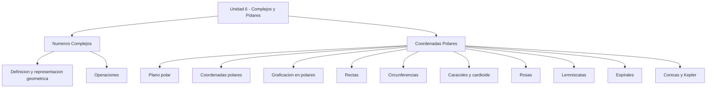
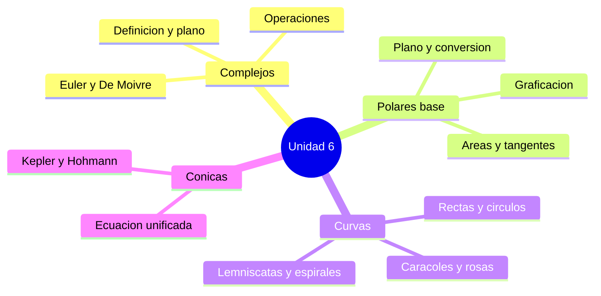

# 🗺️ Índice Unidad 6 - Complejos y Polares

## 🎯 Introducción

> [!info] 💡 ¿Qué cubre esta unidad?
>
> La **Unidad 6** cierra el precálculo con dos bloques: los **números complejos** (extensión de ℝ con la unidad imaginaria $i$, plano de Argand, forma polar y Euler) y las **coordenadas polares** (polo, ángulo, conversión con cartesianas y las familias clásicas de curvas: rectas, circunferencias, caracoles, rosas, lemniscatas, espirales y cónicas).
>
> Los complejos en forma polar $z = r(\cos\theta + i\,\mathrm{sen}\,\theta) = re^{i\theta}$ son el puente natural entre ambos bloques: el módulo y el argumento **son** coordenadas polares.

---

## 🗂️ Mapa de la unidad

> [!note] 🗂️ Las 12 notas y su orden de estudio
>
> |Bloque|Nota|Contenido|
> |---|---|---|
> |I - Números Complejos|[[01 - Definición y representación geométrica]]|Forma $a+bi$, plano de Argand, conjugado, módulo, argumento y Euler|
> |I - Números Complejos|[[02 - Operaciones]]|Rectangular vs polar, De Moivre, forma exponencial y estrategia|
> |II - Coordenadas Polares|[[01 - Plano polar]]|Polo, eje polar, representaciones múltiples, conversión y distancia|
> |II - Coordenadas Polares|[[02 - Coordenadas polares]]|Sistema, curvas clásicas, área, longitud, tangentes y 3D|
> |II - Coordenadas Polares|[[03 - Graficación en coordenadas polares]]|Tablas, simetría, familias e intersecciones|
> |II - Coordenadas Polares|[[04 - Rectas en coordenadas polares]]|Rectas, forma normal, círculos y diámetro polar|
> |II - Coordenadas Polares|[[06 - Caracoles en coordenadas polares]]|Caracoles, rosas, lemniscatas y áreas|
> |II - Coordenadas Polares|[[09 - Espirales en coordenadas polares]]|Arquímedes, logarítmica, hiperbólica, Fermat y usos|
> |II - Coordenadas Polares|[[10 - Secciones cónicas en coordenadas polares]]|Ecuación unificada, Kepler y Hohmann|

---

## ✅ Lista de avance

> [!example]- 📝 Checklist por nota
>
> - [ ] [[01 - Definición y representación geométrica]] — defino, represento y convierto a polar
> - [ ] [[02 - Operaciones]] — opero en rectangular, polar y exponencial
> - [ ] [[01 - Plano polar]] — ubico puntos y convierto sistemas
> - [ ] [[02 - Coordenadas polares]] — clasifico curvas y calculo áreas
> - [ ] [[03 - Graficación en coordenadas polares]] — grafico cualquier $r = f(\theta)$
> - [ ] [[04 - Rectas en coordenadas polares]] — rectas, círculos y forma normal
> - [ ] [[06 - Caracoles en coordenadas polares]] — caracoles, rosas y lemniscatas
> - [ ] [[09 - Espirales en coordenadas polares]] — distingo las cinco familias
> - [ ] [[10 - Secciones cónicas en coordenadas polares]] — clasifico por excentricidad

---

## ✅ Metas de Aprendizaje

> [!note] 🎯 Nivel Básico
>
> - [ ] Explico qué es un número complejo y qué es un punto polar $(r, \theta)$.
> - [ ] Represento $z = a + bi$ en el plano de Argand y ubico $(r, \theta)$ en papel polar.
> - [ ] Convierto entre forma binómica, forma polar y coordenadas cartesianas.
>
> [!note] 🎯 Nivel Intermedio
>
> - [ ] Opero complejos en la forma adecuada (rectangular para sumas, polar para productos y potencias).
> - [ ] Grafico curvas polares con tabla, simetría y dominio, e identifico su familia.
> - [ ] Calculo áreas polares con $A = \frac{1}{2}\int r^2\,d\theta$ y clasifico cónicas por $e$.
>
> [!note] 🎯 Nivel Avanzado
>
> - [ ] Demuestro identidades con conjugado, módulo y De Moivre.
> - [ ] Resuelvo intersecciones, tangentes y lugares geométricos en ambos sistemas.
> - [ ] Aplico cónicas polares a órbitas (Kepler) y transferencias (Hohmann).

---

> [!summary] 📋 Resumen ejecutivo
>
> - La unidad une **álgebra** (complejos) con **geometría** (polares) mediante el par módulo-argumento.
> - Todo complejo admite tres formas: **binómica**, **polar** y **exponencial**; cada operación tiene su forma ideal.
> - Todo punto polar admite infinitas representaciones; la conversión con cartesianas exige cuidar el **cuadrante**.
> - Cada familia polar se reconoce por su ecuación: $r = a$, $\theta = \alpha$, $r = 2a\cos\theta$, $r = a \pm b\cos\theta$, $r = a\cos(n\theta)$, $r^2 = a^2\cos(2\theta)$, $r = a\theta$, $r = ae^{b\theta}$, $r = \ell/(1 \pm e\cos\theta)$.
> - El área polar y De Moivre son las dos herramientas de cálculo de la unidad.

---

## 📊 Resumen Visual

---

> [!quote] 🔗 Conexiones
>
> - [[Universidad/Preuniversitario/Matemáticas/Unidad 2 - Números Reales/I - Números Reales/01 - Conjuntos Numéricos]] — los reales como base que ℂ extiende.
> - [[Universidad/Preuniversitario/Matemáticas/Unidad 3 - Funciones y Trigonometría/II - Trigonometría/02 - Funciones trigonométricas elementales]] — seno y coseno de la forma polar y las conversiones.
> - [[Universidad/Preuniversitario/Matemáticas/Unidad 4 - Matrices y Sistemas/I - Matrices y Sistemas de Ecuaciones/02 - Operaciones con matrices]] — rotaciones y transformaciones emparentadas.
> - [[Universidad/Preuniversitario/Matemáticas/Unidad 5 - Geometría/III - Geometría Analítica/01 - Puntos y rectas]] — distancia cartesiana y rectas que reaparecen en polar.
> - [[Universidad/Preuniversitario/Matemáticas/Unidad 5 - Geometría/III - Geometría Analítica/02 - Circunferencia]] — el caso cartesiano $e = 0$ de las cónicas.
> - [[Universidad/Preuniversitario/Matemáticas/Unidad 5 - Geometría/III - Geometría Analítica/03 - Parábola]] — caso $e = 1$.
> - [[Universidad/Preuniversitario/Matemáticas/Unidad 5 - Geometría/III - Geometría Analítica/04 - Elipse]] — caso $0 < e < 1$ y órbitas de Kepler.
> - [[Universidad/Preuniversitario/Matemáticas/Unidad 5 - Geometría/III - Geometría Analítica/05 - Hipérbola]] — caso $e > 1$ y trayectorias de escape.

---

**Tags:** #matematicas #preuniversitario #unidad6
